<!--
author:   Neenu Gupta; Rajeev Kumar Jha

email:    LiaScript@web.de

version:  0.0.1

language: en

narrator: US English Female

comment:  This maths text was created using CK-12 resources to be seed content for a complete Maths Class 11 course for CBSE students.

logo:     ../cover.jpg

tags:       mathematics, algebra, geometry, math

-->

# CK-12 CBSE Maths Class 11

> This document was automatically translated to LiaScript from
>
> https://www.ck12.org/book/cbse_maths_book_class_11/

## 1.0 Sets

<article>

</article>

### 1.1 Introduction

<article>

If you read word SET, which all things come to your mind? The word SET may remind you telephone set, jewellery set, television set etc. But if you use the word SET in context of academics then which things are reminded by it? These may include Alphabet set of English or Hindi language, set of numbers etc

In Mathematics, the term “Set” is used as the well defined collection of objects. e.g. set of natural numbers, set of integers etc.

The concept of set serves a basis of higher order concepts.

The “Set Theory” was developed by famous mathematician Georg Cantor.  More information about Cantor can be collected by using following link: http://en.wikipedia.org/wiki/Georg_Cantor

In this chapter, we will study some basic concepts of set theory.

</article>

### 1.2 Sets and Their Representations

<article>

In our day to day life, we come across many collections like flock of birds, herds of cattle, crowd of people etc. In mathematics also, we use many collections, like collection of numbers, points, triangles, circles etc.

Now consider two examples: collection of five best singers of India and collection of first five novels written by Munshi Premchand. Which of the collection will have same constituents, universally? Obviously, the second collection will have fixed answer. Why? It is because the second set is well defined collection of objects. In first collection, the term “best” has different interpretations by different people.

So we define a set as follows:

A **set** is a well defined collection of objects. The constituents of set are called its **elements**. Set is denoted by capital letter and its elements are denoted by small letters. The Greek letter, $\in$, is used to denote the phrase **“belongs to”**. E.g. Let $A$ be the set of vowels of English alphabets then we can say that $A$ is well- defined collection of objects and hence a set.

Also, $A = \left\{a, e, i, o, u\right\}$.

We will write $a \in A$ and $b \notin A$, i.e., “$a$” belongs to $A$ but “$b$” does not belong to $A$. It means that “$a$” is an element of $A$ but “$b$” is not an element of $A$. Also, it should be noted that no element of the set will be repeated. E.g. Let $X$ be the set of letters of the word MATHEMATICS then we write as $X=\left\{M, A, T, H, E, I, C, S\right\}$ and we will not repeat $M, A, T$ as they have already been listed in the set.

Also, $n(A)$ = number of elements in set $A$

We will denote number sets by following notations:

$N$: Set of Natural Numbers

$W$: Set of Whole Numbers

$Z$: Set of Integers

$Q$: Set of Rational Numbers

$T$: Set of Irrational Numbers

$R$: Set of Real Numbers

$Z^+$: Set of Positive Integers

$Q^+$: Set of Positive Rational Numbers

$R^+$: Set of Positive Real Numbers

**Representation of Set**

Let $A$ be the set of first five prime numbers and set $B = \left\{ 2, 3, 5, 7, 11 \right\}$ then are $A$ and $B$ same or different? These two sets are same and these are two different ways to represent the same set.

There are two different methods to represent a set:

(i) Set-Builder form

(ii) Roster form / Tabular form

---

**Check out this video:**

https://www.youtube.com/watch?v=Ksu1lo312BM

!?[0](https://www.youtube.com/watch?v=Ksu1lo312BM)

</article>

### 1.3 Types of Sets

<article>

|     |     |     |
| --- | --- | --- |
| **Set** | **Definition** | **Example** |
| 1. Empty Set/Null Set/Void  set Notaions: $\{ \}, \phi$ | A set having no element | $A=\{x:x \ \text{is negative root of}$  $\ x^2-5x+6=0 \}=\{ \}$ |
| 2. Singleton Set | A set having single  element only | $B=\{x:x \ \text{is even prime number} \}=\{2 \}$ |
| 3. Finite Set | If $n(A)=\text{finite number}$, i.e.,   no, of elements are countable | $C=\{x:x \ \text{is a consonant}$  $\text{of English alphabet} \}$ |
| 4. Infinite Set | If $n(A)$ is infinite | $D=\text{Set of Natural Numbers}$ |
| 5. Equal Sets | Two sets $A$ and $B$ are equal  if they have same elements. | $\text{e.g. A}=\{x : x \ \text{is a vowel}$  $\text{of English alphabet} \}$  $B=\{a, e, i, o, u \}$ |

</article>

### 1.4 Subsets and Power Set

<article>

**Subset**

Abhay is captain of senior football team of ABC Public School, which has players from classes IX – XII. Can we find any correlation between football team and all the students studying in classes IX – XII? Let’s review the situation and reframe it in the terminology of Set Theory.

Let

$$
\begin{align*}
\begin{array}{rcl}
\text{Set} \ A &=& \{x:x \ \text{is a player of senior football team of ABC Public School} \} \\
\text{Set} \ B &=& \{x:x \ \text{is a student studying in classes IX - XII of ABC Public School} \}
\end{array}
\end{align*}
$$

Then we can see that set $A$ is a part of set $B$. Mathematically, we can say that set $A$ is subset of set $B$, and we denote it as $A \subset B$.

Now let $\text{set } C = \left\{ x : x \ \text{is a student studying in classes VI - XII in ABC Public School}\right\}$

Then we can say that $C$ is not a subset of $A$, i.e., $C  \not \subset A$.

We can define a subset as follows:

$A$ is a **subset** of $B$ if all the elements of set $A$ are also elements of set $B$. i.e., $A \subset B$ if $a \in A \Rightarrow a \in B$. We can also say that B is a super-set of A

If $A \subset B$ and $A=B$ then we can say that $A$ is **improper subset** of $B$.

Also, since null set is a subset of every set and every set is a subset of itself; the null set and set itself are called **trivial subsets** of any set.

Can we rearrange the number sets, viz., $N, R, W, Z, Q, T$ in terms of subsets?

$N \subset W \subset Z \subset Q \subset R$

Also, $T \subset R$ but $N \not \subset T$

**Example:** Write subsets of $A = \left\{1, 2\right\}$

**Solution:** Subsets of $A$ are $\phi$, $\left\{ 1 \right\}, \left\{ 2 \right\}, \left\{ 1, 2\right\}$

**Number of Subsets**

Number of subsets of any set $A=2^{n(A)}$

In the above example, since $n(A) = 2$, Number of subsets of $A = 2^2 = 4$

**Universal Set**

Re-consider the example posed in the beginning.

Let $\text{set } U = \left\{ x : x \text{ is a student of ABC Public School} \right \}$

How can we relate sets $A, B$ and $C$ with set $U$?

Is not set $\cup$ the biggest of all?

Also, $A \subset U, B \subset U, C \subset U$

So set $U$ is called universal set in this case.

The term universal set is always contextual.

e.g. if  $\text{ set } A = \left\{ 1, 4, 9, 16, 25, .... \right\}$ then universal set can be set $N$ or $Z$ or $R$.

**Power Set**

Set of all subsets is called power set. $P(A)$ denotes power set of set $A$.

e.g. If $A = \left\{ 1, 2 \right\}$ then $P(A) = \left\{ \phi, \left\{ 1 \right\}, \left\{ 2 \right\}, \left\{ 1, 2 \right\}\right\}$

Also, $n(P(A)) = \text{ Number of subsets of } A=2^{n(A)}$

Here, since $n(A)=2$, therefore, $n(P(A)) = 2^2 = 4$

**Intervals of Real set as subsets**

Let $a, b \in R$ and $a < b$ then we can have following intervals of set of real numbers $R$.

**Multimedia links:**

!?[0](https://www.youtube.com/watch?v=1wsF9GpGd00)

Watch the video at: http://www.ck12.org/flx/render/embeddedobject/135639

!?[0](https://www.youtube.com/watch?v=GVZUpOm3XUg)

Watch the video at: http://www.youtube.com/watch?v=GVZUpOm3XUg

</article>

### 1.5 Venn Diagrams and Operations on Sets

<article>

### Venn Diagrams

Have you ever tried to adjust measurements? Take a look at this dilemma.

**Half Pipe**

42 8’ 2 $\times$ 6’s

5 8’ 2 $\times$ 4’s

4 8’ 2 $\times$ 8’s

12 8’ 1 $\times$ 6’s

4 8’ 4 $\times$ 4’s

2 $\frac{3}{4}''$ sheets of plywood

12 $\frac{3}{8}''$ sheets of plywood

**Quarter Pipe**

13 8’ 2 $\times$ 4’s

4 8’ 2 $\times$ 6’s

1 8’ 4 $\times$ 4’s

2 $\frac{3}{4}''$ sheets of plywood

4 $\frac{3}{8}''$ sheets of plywood

The team needs to organize the materials to figure out what materials both ramps have in common, and then which materials are unique to each ramp. By doing this, they can provide the lumber company with a list of materials needed for both ramps.

Ishita thinks that it would be a good idea to design a Venn diagram, but Mayank and Ishaan aren’t sure how to do it. Ishita thinks that she knows, but she isn’t sure.

**In this Concept, you will learn how to draw a Venn diagram to organize these materials. Pay close attention and you will have a chance to complete this diagram at the end of the Concept.**

#### Guidance

Previously we used patterns to solve a word problem where common elements are featured.

**What about Venn Diagrams? What is a Venn Diagram?**

Venn Diagram is named after the mathematician John Venn. A Venn Diagram shows the common numbers in two sets of objects or numbers by using overlapping circles surrounded by a rectangle showing Universal set. A Venn Diagram helps you to organize data in a visual way to notice patterns and solve for the answer.

25 are dumb so $15 + 10 = 25$ is to be written in the circle representing dumb people.

40 are deaf so $25 + 15 = 40$ is to be written in the circle representing deaf people.

Now it's time for you to try a few on your own.

#### Example A

True or false. A Venn Diagram is used when comparing two topics.

**Solution: True**

#### Example B

True or false. A Venn Diagram is best used for a survey.

**Solution: False**

#### Example C

True or False. A Venn Diagram will show you what two or three different topics have in common.

**Solution: True**

Ishita, Ishaan and Mayank are very excited that their plans were accepted! The skate park builders are about to begin construction. The local lumber store has agreed to donate all of the wood that the team needs. To figure out what to ask for, the trio has collected a list of materials needed for the half pipe and the quarter pipe. Here is the list.

**Half Pipe**

42 8’ 2 $\times$ 6’s

5 8’ 2 $\times$ 4’s

4 8’ 2 $\times$ 8’s

12 8’ 1 $\times$ 6’s

4 8’ 4 $\times$ 4’s

2 $\frac{3}{4}''$ sheets of plywood

12 $\frac{3}{8}''$ sheets of plywood

**Quarter Pipe**

13 8’ 2 $\times$ 4’s

4 8’ 2 $\times$ 6’s

1 8’ 4 $\times$ 4’s

2 $\frac{3}{4}''$ sheets of plywood

4 $\frac{3}{8}''$ sheets of plywood

The team needs to organize the materials to figure out what materials both ramps have in common, and then which materials are unique to each ramp. By doing this, they can provide the lumber company with a list of materials needed for both ramps.

Ishita thinks that it would be a good idea to design a Venn diagram, but Mayank and Ishaan aren’t sure how to do it. Ishita thinks that she knows, but she isn’t sure.

**If Ishita draws a Venn diagram, what would it look like?** A Venn diagram shows the common elements of two different things. In this case, the Venn diagram would have two circles. One circle would be for the half pipe and one for the quarter pipe. We can begin by listing all of the needed materials in each circle.

_Information in this problem is courtesy of_ http://www.xtremeskater.com/ _and their free skateboard ramp plans!!_

_The relationship between these number sets can be shown with the help of this Venn diagram._

| **Real Numbers** | **Any number that can be plotted on a number line. Symbol: $\mathbb{R}$** | **Examples: $8, 4.67, - \frac{1}{3}, \pi$** |
| --- | --- | --- |
| **Rational Numbers** | Any number that can be written as a fraction, including repeating decimals. _Symbol:_$\mathbb{Q}$ | Examples:  $-\frac{5}{9},\frac{1}{8},1.\overline{3},\frac{16}{4}$ |
| **Irrational Numbers** | Real numbers that are not rational. When written as a decimal, these numbers do not end nor repeat. | Example:  $e, \pi, -\sqrt{2},\sqrt[3]{5}$ |
| **Integers** | All positive and negative “counting” numbers and zero. _Symbol:_ $\mathbb{Z}$ | Example: -4, 6, 23, -10 |
| **Whole Numbers** | All positive “counting” numbers and zero. | Example: 0, 1, 2, 3, ... |
| **Natural Numbers** | All positive “counting” numbers. _Symbol:_ $\mathbb{N}$ | Example: 1, 2, 3, ... |

!?[0](https://www.youtube.com/watch?v=Hek8Y3FlAm0)

Watch the video at: https://www.youtube.com/watch?v=Hek8Y3FlAm0

!?[0](https://www.youtube.com/watch?v=aPxx9_sqAL8)

Watch the video at: https://www.youtube.com/watch?v=aPxx9_sqAL8

!?[0](https://www.youtube.com/watch?v=MassxXy8iko)

Watch the video at: https://www.youtube.com/watch?v=MassxXy8iko

**Let's learn operations on sets.**

### Operations on Sets

Let $A$ and $B$ be any two non-empty sets. Then following operations on $A$ and $B$ are defined.

|     |     |     |     |     |     |
| --- | --- | --- | --- | --- | --- |
| **Operation** | **General Name** | **Definition** | **Example** | **Venn Diagram** | **Properties** |
| **Union** | $A$ or $B$ | $A \cup B = \{ x : x \in$  $A \ \text{or } x \in B \}$ | $A = \left[ 1, 2 \right\}$  $B = \left\{ 3, 4 \right\}$  $A \cup B = \left\{ 1, 2, 3, 4 \right\}$ |  | $\S \ A \cup A = A$  $\S \ U \cup A = U$  $\S \ A \cup \phi = A$  $\S \ A \cup B = B \cup A$  $\S \ (A \cup B) \cup C = A \cup (B \cup C)$ |
| **Intersection** | $A$ and $B$ | $A \cap B =\{ x : x \ \in$  $A \ \text {and} \ x \ \in \ B \}$ | $A = \left\{1, 2 \right\}$  $B = \left\{ 2, 3, 5\right\}$  $A \cap B = \left\{ 2 \right\}$ |  | $\S  \ A \cap B = B \cap A$  $\S \ (A \cap B) \cap C = A \cap (B \cap C)$  $\S \ A \cap \phi = \phi, A \cap U = A,$  $\S \ A \cap A = A$  $\S \ A \cap (B \cup C) = (A \cap B) \cup (A \cap C)$ |
| **Difference** | Only $A$ | $A - B =\{ x : x \in$  $A \text{ but } x \notin B \}$ | $A =\left\{ 1, 2\right\}$  $B = \left\{ 1, 3, 5\right\}$  $A -B = \left\{ 2 \right\}$ |  | $\S \ A-B \neq B-A$  $\S A-B=A \cap B^{\prime}$ |
| **Complement** | Not $A$ | $A^{\prime} =\{ x : x \notin A$  $\text{ but } x \in U \}$ | $A = \left\{ 1, 3, 5, 7,...\right\}$  $U=N$  $A^{\prime} = \text{ Set of even}$  $\text{natural numbers}$ |  | $\S \ \phi^{\prime} = U, U^{\prime} = \phi$  $\S (A^{\prime})^{\prime} = A$  $\S \ A \cup A ^ {\prime} = U$  $\S A \cup A^{\prime} = \phi$  $\S \text { De Morgan's}$  $\text{Laws:}$  $(A \cup B)^{\prime} = A^{\prime} \cap B^{\prime}$  $(A \cup B)^{\prime} = A^{\prime} \cup B^{\prime}$ |

Shaded areas in the above figures are representing the respective operations on sets.

Also, if we consider the following figure, then we can easily infer that: $A \cup B = (A-B) \cup (A \cap B) \cup (B-A)$

### Sets: Union and Intersection

Learn about the basic idea of the union and intersection of two sets.

!?[0](https://www.youtube.com/watch?v=En8fI2ixepo)

Watch the Video at: https://www.youtube.com/watch?v=En8fI2ixepo

!?[0](https://www.youtube.com/watch?v=jAfNg3ylZAI)

Watch the Video at: https://www.youtube.com/watch?v=jAfNg3ylZAI

!?[0](https://www.youtube.com/watch?v=2B4EBvVvf9w)

Watch the video at: https://www.youtube.com/watch?v=2B4EBvVvf9w

!?[0](https://www.youtube.com/watch?v=GVZUpOm3XUg)

Watch the video at: https://www.youtube.com/watch?v=GVZUpOm3XUg

### Real World Example - Venn Diagrams

#### Student Exploration

How do you and your friends get connected with social media? And how could you represent their social media “likes” in a Venn diagram?

Today there are so many ways to connect and communicate with your friends online. You can comment on your friend’s most recent post on facebook, you can “like” a friend’s picture on instagram, you can retweet your friend’s post on twitter. How do you and your friends connect online? Survey ten of your friends or classmates on all the forms of social media that they use, record all the types. According to Wikipedia, Social media is web-based technologies that “turn communication into interactive dialogue among organization, communities, and individuals,” from http://en.wikipedia.org/wiki/Social_media. Below are some examples of popular forms of social media:

* Facebook
* Google+
* Linkedin
* Twitter
* hi5
* Friendster
* XING
* Plaxo
* Pinterest
* Instagram

After completing your survey of ten friends, examine the results of your survey and determine the **three** most popular forms of social media amongst your friends. Next, create a Venn diagram to represent the three forms of social that are most popular amongst your friends and who uses which type. You can make your Venn Diagram online at: http://www.creately.com/Draw-Venn-Diagrams-Online

#### Analyze your results

1. Take a picture of your Venn diagram, or scan it. Then upload it and share it with other CK-12 users! You can also use [educreations.com](https://www.educreations.com/) to record your discussion of your Venn Diagram and then upload your video to the CK-12’s website!

</article>

### 1.6 Real Life Problems on Sets

<article>

### Union and Intersection of Sets

Mother Dairy polls its customers on their favorite flavor: chocolate or vanilla? 103 customers said they liked chocolate, 98 customer said they like vanilla, while 27 customers said they liked both chocolate and vanilla. How many customers said they like only chocolate?

Let's derive some important formulae which will be very helpful in solving real life problems based on set theory.

I. Let $A$ and $B$ be any two finite sets.

$$
\begin{align*}
\begin{array}{rcl}
n(A \cup B) &=& n(A - B)+n(A \cap B)+n(B - A) \\
&=& n(A - B)+n(A \cap B)+n(B - A)+n(A \cap B)-n(A \cap B)
\end{array}
\end{align*}
$$

\[adding and subtracting $n(A \cap B)$ in RHS\]

$$
n(A \cup B)=n(A)+n(B)-n(A \cap B)
$$

II. Let $A$ and $B$ be any two finite sets such that $A \cap B =\phi$ then

$n(A \cup B)=n(A)+n(B) \quad \quad \ \text{as} \ n(A \cap B)=0$

III. Let $A$, $B$, $C$ be any three finite sets then

$$
\begin{align*}
\begin{array}{rcl}
n(A \cup B \cup C)&=& n[A \cup (B \cup C)] \\
&=& n(A)+n(B \cup C)-n[A \cap(B \cup C)] \\
&=& n(A)+n(B)+n(C)-n(B \cap C) - n \left[(A \cap B) \cup (A \cap C) \right] \\
&=& n(A)+n(B)+n(C)-n(B \cap C) - \left[n(A \cap B)+n(A \cap C) - n[(A \cap B) (A \cap C)] \right] \\
&=& n(A)+n(B)+n(C) - n(B \cap C) - n(A \cap B) - n(C \cap A)+ n(A \cap B \cap C)
\end{array}
\end{align*}
$$

Thus

$n(A \cup B \cup C)=n(A)+n(B)+n(C)-n(A \cap B)-n(B \cap C)-n(C \cap A)+n(A \cap B \cap C)$

#### Guidance

A Venn diagram is shown below.

#### Example A

At a school of 500 students, there are 125 students enrolled in Algebra, 257 students who play sports and 52 students that are enrolled in Algebra and play sports. Create a Venn diagram to illustrate this information.

**Solution:** First, let’s say set $A$ represent the students enrolled in Algebra and set $B$ represent the students who play sports. Generally speaking, it is easiest to start in the center or “intersection” of the Venn diagram. Once we place 52 in the intersection, then we can subtract it from the total number of students who play sports and the total number of student who take Algebra to determine how many just do one or the other. Finally, we can subtract this total from 500 to figure out how many are outside the circles altogether.

| **Symbol** | **Description** | **Value for this Problem** |
| --- | --- | --- |
| $n(A)$ | The number of elements in set $A$ | 125 |
| $n(A \cap B)$ | The number of elements in the intersection of sets $A$ and $B$ (all the elements that are in both sets-the overlap) | 52  |
| $n(A \cup B)$ | The number of elements in the union of sets $A$ and $B$ (all the elements that are in one or both of the sets) | 330 |
| $n(A ^\prime)$ | The number of elements in the compliment of $A$ (the number of elements outside set $A$) | 375 |
| $n((A \cup B)^\prime)$ | The number of elements in the compliment of $A \cup B$ (everything outside the union of $A$ and $B$) | 170 |
| $n((A \cap B)^\prime)$ | The number of elements in the compliment of $A \cap B$ (everything outside the intersection of $A$ and $B$) | 448 |
| $n(A \cap B^\prime)$ | The number of elements in the intersection of $A$ and $B$'s compliment (the number of elements in $A$ but not in $B$) | 73  |

#### Example B

Create a Venn diagram to illustrate the following information regarding the subsets $M$ and $N$ in universal set $U$:

$$
n(M)=89; \ n(N)=103; \ n(M \cup N)=130; \ n(U)=178
$$

**Solution:** Again, we will start in the middle or intersection. We must determine how many elements are in the intersection. Let’s consider that when we add the elements in $M$ to the elements in $N$, we are adding the elements in the intersection twice. This happens because they are counted in set $M$ and counted again in set $N$. Did you notice that $n(M)+n(N)=89+103=192$ while the $n(M \cup N)=130$? We have double counted the 62 (192-130) elements in $M \cap N$. Now we can put this number in the Venn diagram and work our way out as we did in the previous example.

+n(N)-n(M \cap N)=n(M \cup N)$ to represent the relationship between the regions in the Venn diagram and to solve problems. In this case, substituting in the given information we can determine the $n(M \cap N)$ as shown below:")

$$
\begin{align*}
89+103-n(M \cap N)&=130 \\
192-n(M \cap N)&=130 \\
-n(M \cap N)&=-62 \\
n(M \cap N)&=62
\end{align*}
$$

#### Example C

In a survey of 150 high school students it was found that:

80 students have laptops

110 students have cell phones

125 students have iPods

62 students have both a laptop and a cell phone

58 students have both a laptop and iPod

98 students have both a cell phone and an iPod

50 students have all three items

a) How many students have just a cell phone?

b) How many students have none of the mentioned items?

c) How many students have an iPod and laptop but not a cellphone?

**Solution:** First we will use the given information to construct the Venn diagram as shown.

 = {\color{green}0}$. Finally we can add up all the values in the circles and subtract this from 150, the total number of students surveyed to determine that 3 students have none of the items.")

Now that the Venn diagram is complete, we can use it to answer the questions.

a) There are 0 students that just have a cell phone.

b) There are 3 students with none of the mentioned technology.

c) There are 8 students with an iPod and laptop but no cell phone.

**Intro Problem Revisit** The number of customers who said they liked both chocolate and vanilla is the intersection of the two circles in the Venn diagram that represents this situation. Since a total of 103 people said they liked chocolate, we must subtract the number who like both chocolate **and** vanilla to find the number who like only chocolate.

$103-27= 76$

Therefore, 76 of Mother Dairy's customers said they only like chocolate ice cream.

#### Guided Practice

Use the Venn diagram to determine the number of elements in each set described in the problems.

$")

2. $n(C)$

3. $n(A^\prime)$

4. $n(A \cap B)$

5. $n(A \cup B \cup C)$

6. $n(A \cap C^\prime)$

7. $n(A \cap B \cap C)$

8. $n(A^\prime \cap B^\prime \cap C^\prime)$

#### Answers

1. $3 + 7 + 8 + 8 =26$

2. $8 + 8 + 4 + 12 = 32$

3. $8 + 4 + 12 + 6 = 30$

4. $7 + 8 = 15$

5. $3 + 7 + 8 + 8 + 8 + 4 + 12 = 50$

6. $3 + 7 =10$.

7. 8

8. 6

#### Explore More

Use the information below for problems 1-5.

In a survey of 80 households, it was found that:

30 had at least one dog

42 had at least one cat

21 had at least one “other” pet (fish, turtle, reptile, hamster, etc.)

20 had dog(s) and cat(s)

10 had cat(s) and “other” pet(s)

8 had dog(s) and “other” pet(s)

5 had all three types of pets

1. Make a Venn diagram to illustrate the results of the survey.

2. How many have dog(s) and cat(s) but no “other” pet(s)?

3. How many have only dog(s)?

4. How many have no pets at all?

5. How many “other” pet(s) owners also have dog(s) or cat(s) but not both?

Use the letters in the Venn diagram below to describe the region for each of the sets.

7. $A$

8. $A \cup B$

9. $A \cap B^\prime$

10. $(A \cap B)^\prime$

11. $(A \cup B)^\prime$

12. $A^\prime$

13. $B^\prime \cup A$

**Multimedia links:**

Overview

!?[0](https://www.youtube.com/watch?v=HhNTZzQ0zrI)

Watch the video at: https://www.youtube.com/watch?v=HhNTZzQ0zrI

</article>

### 1.7 Summary

<article>

**Students can refer following links for a quick revision of the chapter:**

http://popplet.com/app/#/1988825

http://www.amsi.org.au/teacher_modules/Sets_and_venn_diagrams.html#Describing_and_naming_sets

</article>

### 1.8 Self Assessments

<article>

#### Assessment 1

**1. Venn Diagrams and Operations on Sets**

http://www.ck12.org/probability/Venn-Diagrams/asmtpractice/Venn-Diagrams-Practice/?referrer=concept_details

http://www.ck12.org/probability/Venn-Diagrams/quiz/Venn-Diagrams-Quiz/

#### Assessment 2

1. Write the following sets in set-builter form:

i) $\{1, 3, 7, 15, 31, 63\}$

ii) $\{2, 3, 5, 7, 11, 13, \ldots \ldots \ldots 97 \}$

iii) $\{5, 10, 15, 25, \ldots \ldots \ldots 500 \}$

iv) $\left \{\frac{1}{2}, \frac{2}{3}, \frac{3}{4}, \ldots \ldots \ldots \frac{19}{20} \right \}$

2. Write the following sets in roster form:

i) $\{x:x \ \text{is letter of word BISLERI} \}$

ii) $\{x:x = \frac{n^2}{n+1}, \ \ n \in N, \ \ 1 \le n \le 10 \}$

iii) $\{x:x =3^n, \ \ n \in N, \ \ -2 \le n \le 2 \}$

iv) $\{x:x=a+d; \ \  a, d \in N, \ \ 1 \le a \le 3, \ \ 2 \le d \le 3 \}$

3. Which of these sets are equal?

i) $A= \{x:x \ \text{is letter of word MISSISSIPPI} \}, \ \ B= \{M, I, S, P \}$

ii) $C = \{x:x \ \text{is root of polynomial} \ x^2-5x+6 \}, \ \  D= \{2, 3\}$

4. Write power set of the following sets:

i) $A= \{a, b, c \}$

ii) $B = \{5, 10, 15, 20 \}$

iii) $C = \phi$

5. What will be $n(P(A))$ if $n(A)=6$?

6. Write the following in interval form:

i) $\{x:x \in R, \ \ -4 < x \le 6 \}$

ii) $\{x:x \in R, \ \ 5x+7 > 3x+15 \}$

7. Find $A \cup B$, $A \cap B$, $A - B$, $A^{\prime}$, $B^{\prime}$, $B-A$ for the following sets and also show them in Venn diagram for the sets $A=\{2, 4, 6, 8, 10 \}$, $B= \{5, 10, 15, 20 \}$, $\cup = \{1, 2, 3, \ldots \ldots \ldots 20 \}$.

8. Show the following sets in Venn Diagram:

i) $(A \cup B) \cap C$

ii) $(A-B) \cup (B-A)$

iii) $A \cap (B \cup C)^{\prime}$

9. Verify De Morgan's laws for the following sets:

$A= \{2n:n \in N\}$ $B=\{7n:n \in N\}$

10. Illustrate the given information in the form of a Venn Diagram: $U=N$, $A = \{5x:x \in N \}$, $B= \{10x:x \in N \}$, $C= \{15x:x \in N\}$.

11. Find the following for the sets given in question no.10.

i) $A \cup B \cup C$

ii) $A \cap B \cap C$

iii) $A - (B \cup C)$

iv) $C^{\prime}$

v) $(A \cap B) \cup (B \cap C) \cup (C \cap A)$

12. If $A$ and $B$ be any two sets such that $n(A)=5$ and $n(B)=10$, then find minimum and maximum value of $n(A \cup B)$.

13. Let $aN = \{ax: a \in N, x \in N, a \ \text{is constant} \}$ Determine

i) $7 N \cup 14 N$ and

ii) $7 N \cap 14 N$

14. Let $A$ and $B$ be any two sets such that $n(A-B)=4-x, \ \ n(B-A)=5+2x,$ $n(A \cup B)=9+2x,$$n(A \cap B)=x$

Illustrate the above information in Venn diagram and find value of $x$, if $n(A \cup B)=41$.

15. If number of subsets of set $A$ is 480 more than that of set $B$, then find number of elements of $A$ and number of elements of $B$.

16. Prove that, for any sets $A$ and $B$; $A-B=(A \cup B)-B$.

17. A survey shows that 59% of students studying in class XI study only in night while 45% of students study during day-time. Find the percentage of students who study during day and night.

18. In a survey conducted over 1000 people, it was found that 449 use Whatsapp, 773 use Facebook and 121 use none of these two. Find the number of people who use both of these.

19. It was found that in a corporate company, 300 people are subscribers of Airtel; 250 of Vodafone; 250 of Idea; 100 of Airtel and Vodafone; 80 of Vodafone and Idea; 90 of Idea and Airtel while 50 people are subscribers of all the three. Find the numbers of people who are subscribers of

i) Airtel only

ii) Vodafone and Airtel but not Idea

iii) Atleast one of the three

20. A statistical data is to be analysed. The information is as follows. In a group of grey-hair people, 40% use Henna only; 32% use Dye only and 18% use none of these two things. Find people who use

i) Atleast one of two

ii) Dye and Henna

iii) Henna

21. Out of 700 students of class XII, 200 want to pursue MBA; 200 want to pursue Engineering; 300 want to be IAS; 10 want to do MBA and Engineering; 20 want to be Engineering and IAS; 50 want to pursue MBA and IAS and 80 do not want to pursue any of these three career options. Find number of students who want to pursue

i) MBA, Engineering and IAS.

ii) Exactly two careers out of three.

iii) IAS and MBA but not Engineering.

22. To improve its services, a restaurant got a feedback form filled by its regular customers. The data is as follows: 600 people like South-Indian cuisine; 700 people like Chinese cuisine; 550 people like North-Indian cuisine; 100 people like all the three types of cuisine. The number of customers who like South-Indian & Chinese, Chinese and North Indian, North Indian and South Indian cuisine and equal. If the feedback from was filled by 1500 customers and each one of them likes at least one of the cuisine then find the number of customers who like

i) Chinese and South-Indian cuisine but not North-Indian.

ii) North-Indian cuisine only.

iii) Only one type of cuisine out of three.

23. In the cultural club of ABC Public School; it was found that 50 students are good singers, 54 are good dancers, 35 are good at painting, 18 are good at dance and singing, 13 are good singers & painters while 11 are good at dance and painting. If cultural club has total 100 members and each one is good at atleast one of the hobbies then find the number of students who are good at

i) Dance and Singing.

ii) All the three (of dance, singing and painting)

iii) Painting and singing but not dance.

24. Out of 150 regular customers of a Fast food outlet, 110 like to order burger, 115 order cold-drink, 110 order french-fries, 80 order burger & french fries, 95 order cold-drink and french-fries, 85 order burger and cold-drink and 75 order all the three eatables at the same time. Find the number of customers who order

i) Exactly two out of three eatables.

ii) Exactly one out of three eatables.

25. Out of 100 people, 25 like Blue Color only, 35 like Pink Color only and 20 like neither of these two colours. Find the number of people who like

i) Blue Colour

ii) Only Pink Color or neither of two colours.

</article>

### 1.9 Home Assignments

<article>

#### Assignment 1

**1. Sets and Their Representation**

NCERT Exercise No. 1.1

Q. No. 5, 6

#### Assignment 2

**2. Types of Sets**

NCERT Exercise No. 1.2

Q. No. 3, 4, 6

#### Assignment 3

**3. Subsets and Power Set**

NCERT Exercise No. 1.3

Q. No. 2, 3, 5, 7, 8

#### Assignment 4

**4. Venn Diagrams and Operations on Sets**

NCERT Exercise No. 1.4

Q. No. 2, 6, 7, 9, 11, 12

#### Assignment 5

**5. Complement of Set**

NCERT Exercise No. 1.5

Q. No. 2, 3, 6

#### Assignment 6

**6. Real World Problems on Sets**

NCERT Exercise No. 1. 6

Q. No. 2, 4, 5, 7

#### Assignment 7

**7. Miscellaneous Problems**

NCERT Miscellaneous Exercise on Chapter 1

Q. No. 1, 2, 4, 13, 14

</article>

### 1.10 Class Activities

<article>

#### Activity 1

**1. Class Activity on Sets**

Take out list of all the contacts stored in your or your parents' mobile phone. Create some groups like family, friends, relatives, colleagues, etc.

1. Consider all groups as different sets and name them.

2. Determine ($A$ or $B$), ($A$ and $B$), ($A-B$), $A^{\prime}$and more such sets (depending on your different sets).

3. Make Venn Diagrams to represent operations on sets.

4. What should be chosen as Universal set for all sets?

5. Make Power set for all sets. Cross-check $n(P(A))$ by formula and by determining all the subsets.

6. Determine subsets and supersets also from the sets framed above in 1.

#### Activity 2

**2. Answer Key on Real World Example**

http://www.ck12.org/probability/Venn-Diagrams/rwa/Venn-Diagrams-Answer-Key/

</article>

### 1.11 References for Basic Understanding

<article>

#### Real Numbers

**Students may use the following link for real numbers and their set - representation:**

http://www.ck12.org/algebra/Sets-and-Symbols/lesson/Subsets-of-Real-Numbers/

#### Resources Cited

* http://en.wikipedia.org/wiki/Social_media
* http://creately.com/Draw-Venn-Diagrams-Online

</article>

## 2.0 Relations and Functions

<article>

</article>

### 2.1 Introduction

<article>

What does the word “Relation” has significance in our life? We come across many relations in our life, since our births to our deaths. We have relations such as mother, father, brother, sister, friend, relatives, teacher, etc.

So can we have relations in Mathematics also? Yes. We have many mathematical relations like $3 < 5$, Line 1 is parallel to line 2, $\sin x$ is less than or equal to 1, etc.

In this chapter, we will study about fundamentals of relation and functions.

Before starting these concepts, we will first study about cartesian product of sets.

</article>

### 2.2 Cartesian Product of Sets

<article>

For a rally, there are four cars (Swift, Indica, Santro, Alto) along with other vehicles. These cars need to be coded. How many different pairs of codes can be generated by using three codes $H$, $M$ and $T$?

To answer this question, you need to know the concept of “Cartesian product of Sets”.

#### Guidance

Let $A$ and $B$ be any two non-empty sets then **Cartesian Product of $A$ and $B$ is a set of ordered pairs** such that 

$$
A \times B = \left\{ (a, b) : a \in A, b 
\in B \right\}
$$

#### Example A

Let $A = \left\{ 1, 2 \right\}$ and $B = \left\{ x, y \right\}$ then write $A \times B$.

$A \times B = \left\{ (1, x), (1, y), (2, x), (2, y) \right\}$

Also, we can observe that $n(A \times B) = n(A) \times n(B)$

In above example, $n(A \times B) = n(A) \times n(B) = 2 \times 2 = 4$

If either or both of sets $A$ and $B$ are null sets then $A \times B$ is also a null set.

If either or both of $A$ and $B$ are infinite then $A \times B$ is also infinite.

In general, $A \times B \neq B \times A$. Why?

#### Example B

Let $A = \left\{ 1, 2 \right\}$ and $B = \left\{3\right\}$ then verify that $A \times B \neq B \times A$.

$A \times B = \left\{ (1, 3), (2, 3) \right\}$ and $B \times A = \left\{ (3 ,1), (3, 2) \right\}$

Since $(1, 3) \neq (3, 1)$, therefore, $A \times B \neq B \times A$

Also, $A \times A \times A = \left\{ (a, b, c) : a, b, c \in A \right\}$

Here, $(a, b, c)$ is called **ordered triplet**.

#### Example C

If $A = \left\{ 1, 3 \right\}$ then find $A \times A \times A$.

We know, $A \times A = \left\{ (1, 1), (1, 3), (3, 1), (3, 3) \right\}$

$A \times A \times A = \left\{ (1, 1, 1), (1, 1, 3), (1, 3, 1), (1, 3, 3), (3, 1, 1), (3, 1, 3), (3, 3, 1), (3, 3, 3) \right\}$

Also, $n (A \times A \times A) = n(A) \times n(A) \times n(A) = 2 \times 2 \times 2 = 8$

**Equality of Ordered Pairs**

Two ordered pairs $(a, b)$ and $(x, y)$ are equal if $a = x$ and $b = y$

#### Example D

Find values of $x$ and $y$ if $(x+\frac{1}{2}, y-3) = (\frac{5}{2}, 7)$

Here, $x + \frac{1}{2} = \frac{5}{2} \Longrightarrow x =2$ and $y - 3 = 7 \Longrightarrow y =10$

**Intro Problem Revisit**

For a rally, there are four cars (Swift, Indica, Santro, Alto) along with other vehicles. These cars need to be coded. How many different pairs of codes can be generated by using three codes $H$, $M$ and $T$?

Suppose $A$ is a set of three codes and $B$ is a set of four cars, i.e.,

$A = \left\{ H, M, T \right\}$

$B = \left\{\text{Swift, Indica, Santro, Alto}\right\}$

Different codes can be generated in the following way:

$$
\text{(H, Swift), (H, Indica), (H, Santro), (H, Alto), (M, Swift) } \ldots \text{ (M, Alto), (T, Swift) } \ldots , \text{ (T, Alto) }
$$

 

We can also observe that the above ordered pairs can be written in the form of set which is nothing but, $A \times B$, i.e.,

$$
A \times B = \left\{\text{(H, Swift), (H, Indica), (H, Santro), (H, Alto), (M, Swift)} \ldots, \text{(M, Alto), (T, Swift) } \ldots , \text{(T, Alto)}\right\}
$$

Also, $n(A \times B) = n(A) \times n(B) = 3 \times 4 = 12$

</article>

### 2.3 Relations

<article>

Remember the problem of coding cars in the previous section.

For a rally, there are four cars (Swift, Indica, Santro, Alto) along with other vehicles. These cars need to be coded. How many different pairs of codes can be generated by using three codes $H, M$ and $T$?

Suppose $A$ is a set of three codes and $B$ is a set of four cars, i.e.,

$A = \left\{ H, M, T \right\}$

$B = \left\{\text{Swift, Indica, Santro, Alto}\right\}$

$$
A \times B = \left\{\text{(H, Swift), (H, Indica), (H, Santro), (H, Alto), (M, Swift)} \ldots, \text{(M, Alto), (T, Swift)} \ldots,\text{(T, Alto)}\right \}
$$

Now consider set $A$ again as $A = \left\{\text{Hyundai, Maruti, Tata}\right\}$  then we can rewrite $A \times B$  as

$$
A \times B = \left\{\text{(Hyundai, Swift), (Hyundai, Indica), (Hyundai, Santro), (Hyundai, Alto)}, \text{(Maruti, Swift)} \ldots  , \\
\text{(Maruti, Alto), (Tata, Swift)} \ldots,\text{(Tata, Alto)}\right\}
$$

Can you write set $R$ where $R = \left\{ (a, b) : “a” \ \text{is manufacturer of} \ “b” \right\}$?

Then

$$
R = \left\{\text{(Hyundai, Santro), (Maruti, Swift), (Maruti, Alto), (Tata, Indica)}\right\}
$$

Is there any relationship between sets $A \times B$ and $R$?

$$
R \subset (A \times B)
$$

Basically, in set $R$, a relationship between first element “$a$” and second element “$b$” of ordered pair $(a, b)$ has been introduced which makes set $R$ to be a subset of set $A \times B$ and we can write as “$aRb$”.

Now we can define relation $R$ as follows:

A **relation** $R$ from a non-empty set $A$ to a non-empty set $B$ is a subset of the Cartesian product $A \times B$ and we write as $R : A \rightarrow B$ such that $R \subseteq (A \times B)$

Here, **Domain** of $R = \text{set of first components of } (a, b) = \left\{ a \right\}$

**Range** of $R = \text{set of second components of } (a, b) = \left\{b\right\}$

**Co-domain** of $R = \text{set } B$

Also, $\text{Range} \subseteq \text{Co-domain}$

---

Any relation can be represented in the following three ways:

* Arrow diagram
* Set-builder Method
* Roster Method

$$
\begin{align*}
\begin{array}{rcl}
\text{Total number of relations from } A \text{ to } B &=& \text{Number of possible subsets of } A \times B \\
&=& 2^{n (A \times B)} = 2^{n(A) \times n(B)}
\end{array}
\end{align*}
$$

#### Guided Practice

Let $R : A \rightarrow B$ be a relation from set $A$ to set $B$ defined as

$a R b = a$ divides $b$, where $A = \left\{ 1, 2\right\}$ and $B = \left\{10, 13\right\}$

Then

i) Write $R$ in arrow diagram, set-builder form, roster form.

ii) Find domain, range and co-domain of $R$

iii) How many total relations are possible from $A$ to $B$?

**Solution:** Arrow-diagram

Set-builder form: $R = \left\{(a, b) : a \text{ divides } b\right\}$

Roster Form: $R = \left\{(1, 10), (1, 13), (2 ,10)\right\}$

$\text{Domain} = \left\{1, 2 \right\}$

$\text{Range} = \left\{ 10, 13\right\}$

$\text{Co-Domain} = B$

Total number of relations possible from $A \ \text{to} \ B= 2^4 = 16$

</article>

### 2.4 Functions

<article>

Instead of purchasing a one-day ticket to the theme park, Jatin decided to pay by ride. Each ride costs Rs.20. To describe the amount of money Jatin will spend, several mathematical concepts can be used.

#### Example 1

Using Jatin's situation, write the following:

a) An expression representing his total amount spent

b) An equation representing his total amount spent

c) An equation that shows Jatin wants to spend exactly Rs.220 on rides

d) An inequality that describes the fact that Jatin will not spend more than Rs.260 on rides

**Solution:**

The variable in this situation is the number of rides Jatin will pay for. Call this $r$.

a) $20(r)$

b) $20(r) = m$

c) $20(r) = 220$

d) $20(r) \le 260$

In addition to an expression, equation, or inequality, Jatin's situation can be expressed in the form of a function or a table.

**Definition:**

A **function** is a relationship between two variables such that the input value has ONLY one output value.

A function is a set of ordered pairs in which the first coordinate, usually $x$, matches with exactly one second coordinate, $y$. The $y$ coordinate represents the **dependent variable**, meaning the values of this variable depend upon what is substituted for the other variable.

Consider Jatin's equation $m = 20r$. Using function notation, the value of the equation (the money spent $m$) is replaced with $f(r)$. $f$ represents the function name and $(r)$ represents the variable. In this case the parentheses do not mean multiplication; rather, they separate the function name from the **independent variable.**

$$
\begin{align*}
& \quad \ input\\
& \quad \ \ \ \downarrow\\
& \quad \underbrace{f(x)}= y \leftarrow output\\
& \ function\\
& \quad \ \ box
\end{align*}
$$

#### Example 2

Rewrite the following equations in function notation.

a) $y=7x-3$

b) $d=65t$

c) $F=1.8C+32$

**Solution:**

a) According to the definition of a function, $y=f(x)$, so $f(x)=7x-3$.

b) This time the dependent variable is $d$. Function notation replaces the dependent variable, so $d = f(t) = 65t$.

c) $F = f(C) = 1.8C + 32$

**Why Use Function Notation?**

Why is it necessary to use function notation? The necessity stems from using multiple equations. Function notation allows one to easily decipher between the equations. Suppose Jatin, Lata, Ketan and Arun all went to the theme park together and chose to pay Rs.20 for each ride. Each person would have the same equation $m=2r$. Without asking each friend, we could not tell which equation belonged to whom. By substituting function notation for the dependent variable, it is easy to tell which function belongs to whom. By using function notation, it will be much easier to graph multiple lines.

#### Example 3

Write functions to represent the total each friend spent at the park.

**Solution:**

$J(r)= 2r$ represents Jatin’s total,

$L(r)= 2r$ represents Lata's total,

$K(r)= 2r$ represents Ketan's total, and

$A(r)= 2r$ represents Arun’s total.

---

#### Video Review

!?[undefined](media/56127.mp4 "video")

Watch the video at: http://www.ck12.org/flx/render/embeddedobject/56127

!?[undefined](media/79601.mp4 "video")

Watch the video at: http://www.ck12.org/flx/render/embeddedobject/79601

#### Guided Practice

A student organization sells shirts to raise money. The cost of printing the shirts is expressed as $100+7x$ and for the revenue, we have the expression $15x$, where $x$ is the number of shirts.

a) Write two functions, one for the cost and one for revenue.

b) Express that the cost must be less than or equal to Rs.800.

c) Express that the revenue must be equal to Rs.1500.

d) How many shirts must the students sell in order to make Rs.1500?

**Solution:**

a) The cost function we will write as $C(x)=100+7x$ and the revenue function we will write as $R(x)=15x$.

b) Since $C(x)$ represents the costs, we substitute in Rs.800 for $C(x)$ and replace the equation with the appropriate inequality symbol

$$
100+7x \le 800
$$

This reads that $100+7x$ is less than or equal to Rs.800, so we have written the inequality correctly.

c) We substitute in Rs.1500 for $R(x)$, getting

$1500=15x.$

d) We want to find the value of $x$ that will make this equation true. It looks like 100 is the answer. Checking this we see that 100 does satisfy the equation. The students must sell 100 shirts in order to have a revenue of Rs.1500.

$1500=15(100)$

$1500=1500$

This question can be posed at this point. Suppose the value $V$ of a digital camera $t$ years after it was bought is represented by the function $V(t) = 875 - 50t$.

---

* Can you determine the value of $V(4)$ and explain what the solution means in the context of this problem?
* Can you determine the value of $t$ then $V(t) = 525$ and explain what this represents?
* What was the original cost of the digital camera?

To answer this, let's study more about functions.

#### Watch This

Watch the video at: http://www.ck12.org/flx/render/embeddedobject/8

#### Guidance

A function machine shows how a function responds to an input. If I triple the input and subtract one, the machine will convert $x$ into $3x - 1$. So, for example, if the function is named $f$, and 3 is fed into the machine, $3(3) - 1 = 8$ comes out.

")

\[Figure 3\]

When naming a function the symbol $f(x)$ is often used. The symbol $f(x)$ is pronounced as “$f$ of $x$.” This means that the equation is a function that is written in terms of the variable $x$. An example of such a function is $f(x) = 3x+4$. Functions can also be written using a letter other than $f$ and a variable other than $x$. For example, $v(t) = 2t^2 - 5$ and $d(h) = 4h-3$. In addition to representing a function as an equation, you can also represent a function:

* As a graph
* As ordered pairs
* As a table of values
* As an arrow or mapping diagram
* As mapping notation

When a function is represented as an equation, an ordered pair can be determined by evaluating various values of the assigned variable. Suppose $f(x)=3x-4$, then to calculate $f(4),$ substitute:

$$
\begin{align*}
f(4) & = 3(4) - 4\\
f(4) & = 12-4\\
f(4) & = 8
\end{align*}
$$

Graphically, if $f(4) = 8$, this means that the point (4, 8) is a point on the graph of the line.

If $f(x) = x^2 + 2x +5$ find.

a) $f(2)$

b) $f(-7)$

c) $f(1.4)$

**Solution:**

To determine the value of the function for the assigned values of the variable, substitute the values into the function.

$$
\begin{align*}
& f(x) = x^2 + 2x+5 && \quad f(x) = x^2+2x+5 && \quad f(x)=x^2+2x+5\\
& {\color{red}\downarrow} \qquad \ \ {\color{red}\downarrow} \qquad {\color{red}\searrow} && \quad \ {\color{red}\downarrow} \qquad \ \ {\color{red}\downarrow} \qquad \ {\color{red}\searrow} && \quad \ \ {\color{red}\downarrow} \qquad \ {\color{red}\downarrow} \qquad \ {\color{red}\searrow}\\
& f(2) =(2)^2 +2(2) + 5 && \ f(-7) = (-7)^2+2(-7)+5 && \ f(1.4) = (1.4)^2+2(1.4) + 5\\
& f(2) = 4 + 4 + 5 && \ f(-7) = 49 - 14 +5 && \ f(1.4)=1.96 +2.8+5\\
& \boxed{f(2)=13} && \boxed{f(-7)=40} && \boxed{f(1.4) = 9.76}
\end{align*}
$$

#### Example 5

Functions can also be represented as mapping rules. If $g(x): R \rightarrow R \ \text{is defined as} \ g(x)=5-2x$ then find the following in simplest form:

a) $g(y)$

b) $g(y-3)$

c) $g(2y)$

**Solution:**

$$
\begin{align*}
& \ g(x) \rightarrow 5 -2x && \qquad g(x) \rightarrow 5-2x \\
& \ {\color{red}\downarrow} \qquad \qquad \quad {\color{red}\downarrow} && \qquad \ \ {\color{red}\downarrow} \qquad \qquad \ {\color{red}\downarrow}\\
& \ g(y) \rightarrow 5 - 2(y) && \ g(y-3) \rightarrow 5-2 (y-3) && \text{Apply the distributive property}\\
& \boxed{g(y) \rightarrow 5 - 2y} && \ g(y-3) \rightarrow 5-2y+6 && \text{Combine like terms}\\
& && \boxed{g(y-3) \rightarrow 11-2y}\\
\\
& \ \ g(x) \rightarrow 5-2x\\
& \ g(2y) \rightarrow 5-2(2y)\\
& \boxed{g(2y) \rightarrow 5-4y}
\end{align*}
$$

#### Example 6

If $P(a)=\frac{2a-3}{a+2}$:

a) Evaluate

i) $P(0)$

ii) $P(1)$

iii) $P \left ( -\frac{1}{2} \right )$

b) Find a value of “$a$” where $P(a)$ does not exist.

c) Find $P(a-2)$ in simplest form

d) Find “$a$ if $P(a)=-5$

**Solution:**

a)

$$
\begin{align*}
& \ P(a) = \frac{2a-3}{a+2} && \ P(a) =\frac{2a-3}{a+2} && \qquad \ P(a)=\frac{2a-3}{a+2}\\
& \ P(0) =\frac{2(0)-3}{(0)+2} && \ P(1) = \frac{2(1)-3}{(1)+2} && \ P\left ( -\frac{1}{2} \right ) = \frac{2\left( -\frac{1}{2} \right )-3}{\left ( -\frac{1}{2} \right ) + 2}\\
& \boxed{P(0) = \frac{-3}{+2}} && \ P(1) = \frac{2-3}{1+2} && \ P \left ( -\frac{1}{2} \right )  = \frac{^1\cancel{2}\left ( -\frac{1}{\cancel{2}} \right )-3}{-\frac{1}{2} + \frac{4}{2}}\\
& && \boxed{P(1)=\frac{-1}{3}} && \ \ P \left ( -\frac{1}{2} \right ) = \frac{-1-3}{\frac{3}{2}}\\
& && && \ P\left ( -\frac{1}{2} \right ) = -4 \div \frac{3}{2}\\
& && && \ P \left ( -\frac{1}{2} \right ) = -4\left ( \frac{2}{3} \right )\\
& && && \boxed{P\left ( -\frac{1}{2} \right )} = \frac{-8}{3}
\end{align*}
$$

b) $P(a) = \frac{2a-3}{a+2}$ The function will not exist if the denominator equals zero.

 

$$
\begin{align*}
& \quad \ \ a+ 2 = 0\\
& a+2-2=0-2\\
& \qquad \quad \ \boxed{a=-2}
\end{align*}
$$

$$
\begin{align*}
& P(a) = \frac{2a-3}{(-2)+2}\\
& P(a) = \frac{2a-3}{0} && \text{Division by zero is undefined.}
\end{align*}
$$

Therefore, if $a=-2$, then $P(a)=\frac{2a-3}{a+2}$ does not exist.

c)

$$
\begin{align*}
& \qquad P(a) = \frac{2a-3}{a+2}\\
& \ P(a-2) = \frac{2(a-2)-3}{(a-2)+2} && \text{Substitue } `a-2' \text{ for } `a'\\
& \ P(a-2) = \frac{2a-4-3}{a-2+2} && \text{Remove brackets}\\
& \ P(a-2) = \frac{2a-7}{a} && \text{Combine like terms}\\
& \ P(a-2) = \frac{2\cancel{a}}{\cancel{a}} - \frac{7}{a} && \text{Express the fraction as two separate fractions and reduce.}\\
& \boxed{P(a-2) = 2-\frac{7}{a}}
\end{align*}
$$

d)

$$
\begin{align*}
& \qquad \qquad \quad P(a) = \frac{2a-3}{a+2}\\
& \qquad \qquad \quad \ -5 = \frac{2a-3}{a+2} && \text{Let } P(a) = -5\\
& \qquad \ -5(a+2) = \left ( \frac{2a-3}{a+2} \right )(a+2) && \text{Multiply both sides by } (a+2)\\
& \qquad \ -5a -10 = \left ( \frac{2a-3}{\cancel{a+2}} \right ) (\cancel{a+2}) && \text{Simplify}\\
& \qquad \ -5a -10 = 2a-3 && \text{Solve the linear equation}\\
& -5a -10 -2a = 2a-2a-3 && \text{Move } 2a \text{ to the left by subtracting}\\
& \qquad \ -7a-10 = -3 && \text{Simplify}\\
& -7a-10+10 = -3+10 && \text{Move 10 to the right side by addition}\\
& \qquad \qquad \ -7a = 7 && \text{Simplify}\\
& \qquad \qquad \ \ \frac{-7a}{-7} = \frac{7}{-7} && \text{Divide both sides by -7 to solve for } `a'.\\
& \qquad \qquad \qquad \boxed{a=-1}
\end{align*}
$$

#### Concept Problem Revisited

The value $V$ of a digital camera $t$ years after it was bought is represented by the function $V(t) = 875 - 50t$

* Determine the value of $V(4)$ and explain what the solution mean to this problem.
* Determine the value of $t$ then $V(t) = 525$ and explain what this represents.
* What was the original cost of the digital camera?

**Solution:**

* The camera is valued at Rs.675, 4 years after it was purchased.

$$
\begin{align*}
\begin{array}{rcl}
V(t) &=& 875 - 50t\\
V(4) &=& 875 - 50(4)\\
V(4) &=& 875-200\\
V(4) &=& Rs. 675
\end{array}
\end{align*}
$$

* The digital camera has a value of Rs.525, 7 years after it was purchased.

$$
\begin{align*}
\begin{array}{rcl}
\qquad \ V(t) &=& 875 - 50t  \qquad \text{Let } V(t) = 525\\
\qquad \ \ 525 &=& 875-50t  \qquad \text{Solve the equation}\\
525 -875 &=& 875 - 875 - 50t\\
\quad \ -350 &=& - 50t\\
\quad \ \ \frac{-350}{-50} &=& \frac{-50t}{-50}\\
\qquad \quad \ 7 &=& t
\end{array}
\end{align*}
$$

* The original cost of the camera was Rs.875.

$$
\begin{align*}
\begin{array}{rcl}
 \ V(t) &=& 875 - 50t \qquad \text{Let } t = 0.\\
 \ V(0) &=& 875 - 50(0)\\
 \ V(0) &=& 875 -0\\
V(0) &=& Rs.875
\end{array}
\end{align*}
$$

#### Guided Practice

1. If $f(x)=3x^2-4x+6$ 

find:

__i) $f(-3)$__

ii) $f(a-2)$

2. If $f(m)=\frac{m+3}{2m-5}$ find “$m$” if $f(m) = \frac{12}{13}$

3. The emergency brake cable in a truck parked on a steep hill breaks and the truck rolls down the hill. The distance in metres, $d$, which the truck rolls, is represented by the function $d = f(t)=0.5t^2$.

i) How far will the truck roll after 9 seconds?

ii) How long will it take the truck to hit a tree which is at the bottom of the hill 600 metres away? Round your answer to the nearest second.

**Answers:**

1. $f(x) = 3x^2 - 4x + 6$

i)

$$
\begin{align*}
& \quad f(x) = 3x^2-4x+6 && \text{Substitute }(-3) \text{ for } `x' \text{ in the function.}\\
& \ f({\color{red}-3}) = 3({\color{red} -3})^2 -4({\color{red}-3})+6 && \text{Perform the indicated operations.}\\
& \ f(-3) = 3({\color{red}9}) + 12 + 6 && \text{Simplify}\\
& \ f(-3) = 27 + 12 + 6\\
& \ f(-3) = {\color{red}45}\\
& \boxed{f(-3) = 45}
\end{align*}
$$

ii)

$$
\begin{align*}
& \qquad f(x) = 3x^2 - 4x +6\\
& \ f({\color{red}a-2}) = 3({\color{red}a-2})^2  -4 ({\color{red}a-2}) + 6 && \text{Write } (a-2)^2 \text{ in expanded form.}\\
& \ f({\color{red}a-2}) = 3({\color{red}a-2})({\color{red}a-2}) - 4({\color{red}a-2})+6 && \text{Perform the indicated operations.}\\
& \ f({\color{red}a-2}) = ({\color{red}3a-6})({\color{red}a-2}) - 4({\color{red}a-2})+6\\
& \ f(a-2) = {\color{red}3a^2-6a-6a+12-4a+8}+6 && \text{Simplify}\\
& \ f(a-2) = {\color{red}3a^2-16a+26}\\
& \boxed{f(a-2) = 3a^2-16a+26}
\end{align*}
$$

---

2.

__  

$$
\begin{align*}
& \qquad \qquad \ \ f(m) = \frac{m+3}{2m-5}\\
& \qquad \qquad \quad \ \ {\color{red}\frac{12}{13}} = \frac{m+3}{2m-5} && \text{Solve the equation for } `m'.\\
& {\color{red}(13)(2m-5)} \frac{12}{13} = {\color{red}(13)(2m-5)} \frac{m+3}{2m-5}\\
& {\color{red}\cancel{(13)} (2m-5)} \frac{12}{\cancel{13}} = {\color{red}(13)\cancel{(2m-5)}} \frac{m+3}{\cancel{2m-5}}\\
& \qquad {\color{red}(2m-5)} 12 = {\color{red}(13)} m+3\\
& \qquad \ \ 24m-60 = 13m+39\\
& \ \ 24m-60 {\color{red}+60} = 13m + 39 {\color{red}+60}\\
& \qquad \qquad \ \ 24m = 13m+99\\
& \quad \quad 24m {\color{red}-13m} = 13m {\color{red}-13m} + 99\\
& \qquad \qquad \ \ 11m = 99\\
& \qquad \qquad \ \frac{11m}{{\color{red}11}} = \frac{99}{{\color{red}11}}\\
& \qquad \qquad \ \frac{\cancel{11}m}{{\color{red}\cancel{11}}} = \frac{\overset{9}{\cancel{99}}}{{\color{red}\cancel{11}}}\\
& \qquad \qquad \quad \boxed{m=9}
\end{align*}
$$__

  

$$
\begin{align*}
& \qquad \qquad \ \ f(m) = \frac{m+3}{2m-5}\\
& \qquad \qquad \quad \ \ {\color{red}\frac{12}{13}} = \frac{m+3}{2m-5} && \text{Solve the equation for } `m'.\\
& {\color{red}(13)(2m-5)} \frac{12}{13} = {\color{red}(13)(2m-5)} \frac{m+3}{2m-5}\\
& {\color{red}\cancel{(13)} (2m-5)} \frac{12}{\cancel{13}} = {\color{red}(13)\cancel{(2m-5)}} \frac{m+3}{\cancel{2m-5}}\\
& \qquad {\color{red}(2m-5)} 12 = {\color{red}(13)} m+3\\
& \qquad \ \ 24m-60 = 13m+39\\
& \ \ 24m-60 {\color{red}+60} = 13m + 39 {\color{red}+60}\\
& \qquad \qquad \ \ 24m = 13m+99\\
& \quad \quad 24m {\color{red}-13m} = 13m {\color{red}-13m} + 99\\
& \qquad \qquad \ \ 11m = 99\\
& \qquad \qquad \ \frac{11m}{{\color{red}11}} = \frac{99}{{\color{red}11}}\\
& \qquad \qquad \ \frac{\cancel{11}m}{{\color{red}\cancel{11}}} = \frac{\overset{9}{\cancel{99}}}{{\color{red}\cancel{11}}}\\
& \qquad \qquad \quad \boxed{m=9}
\end{align*}
$$

3. $d=f(t)=0.5^2$

i)

 

$$
\begin{align*}
& \quad \ \ d =f(t)=0.5^2 && \text{Substitute 9 for } `t'.\\
& \ f({\color{red}9}) = 0.5 ({\color{red}9})^2 && \text{Perform the indicated operations.}\\
& \ f(9) = 0.5 ({\color{red}81})\\
& \boxed{f(9)=40.5 \ feet}
\end{align*}
$$

After 9 seconds, the truck will roll 40.5 m.

ii)

$$
\begin{align*}
& d= f(t) = 0.5t^2 && \text{Substitute 600 for } `d'.\\
& \qquad {\color{red}600} = 0.5t^2 && \text{Solve for } `t'.\\
& \quad \ \ \frac{600}{{\color{red}0.5}} = \frac{0.5t^2}{{\color{red}0.5}}\\
& \quad \ \ \frac{\overset{{\color{red}1200}}{\cancel{600}}}{{\color{red}\cancel{0.5}}} = \frac{\cancel{0.5}t^2}{{\color{red}\cancel{0.5}}}\\
& \quad \ 1200 = t^2\\
& \ \sqrt{{\color{red}1200}} = \sqrt{{\color{red}t^2}}\\
& \boxed{34.64 \ seconds \approx t}
\end{align*}
$$

The truck will hit the tree in approximately 35 seconds.

### Algebra of Functions:

Just as numbers can be added, subtracted, multiplied, and divided, so too can functions. Combining functions in this way can often have surprising results, as the resultant function may not have a graph that appears similar to that of either input function's graph.

#### Example 7

If $f(x) = {x^3} + 2{x^2}$ and $g(x) = {x^2} - 5$, what is $f - g$? What does the graph look like?

**Solution:**

The difference is:

$f - g = {x^3} + 2{x^2} - ({x^2} - 5) = {x^3} + 2{x^2} - {x^2} + 5 = {x^3} + {x^2} + 5$.

The graph of the new function, along with $f(x)$, is shown here:

$ and the new function $y = {x^3} + {x^2} + 5$ are both members of the cubic family, they have similar shapes.")

To recap: When we add or subtract functions, the resulting sum or difference function may be in the same family as one or both of the original functions, or it may be a different type of function. The resultant function is more likely to be in the same family if both of the initial functions are in the same family as each other.

#### Example 8

Given $f(x) = 2x^2$ and $g(x) = x + 1$, find $r(x) = \frac{f(x)}{g(x)}$ and $t(x) = \frac{g(x)}{f(x)}$.

**Solution:**

$r(x) = \frac{f(x)}{g(x)} = \frac{2x^2}{(x + 1)}$. This is a rational function, and does not have a horizontal asymptote. It does have a vertical asymptote at $x = -1$, as the domain excludes $x = -1$.

 = \frac{g(x)}{f(x)}=\frac{(x + 1)}{2x^2}$. This is also a rational function. This function has a horizontal asymptote at $y = 0$ (the $x$\-axis), and a vertical asymptote at $x=0$ (the $y$\-axis).")

, but then as $x$ approaches $-\infty$, the function values approach 0.")

In general, if we multiply linear and polynomial functions (quadratics, cubics, and other such functions with higher exponents, such as $y = x^4+3x^2+2$), we will obtain other polynomial functions. If we divide these kinds of functions, we will obtain other polynomial functions, or rational functions.

Multiplying and dividing other types of functions may result in more complicated graphs.

#### Example 9

Consider the functions $f(x) = |x|$ and $g(x) = x^2 - 4$.

Identify the graphs of $\frac{f(x)}{g(x)} = \frac{|x|}{(x^2 - 4)}$ and $\frac{g(x)}{f(x)} = \frac{(x^2 - 4)}{|x|}$.

---

**Solution:**

****

**\[Figure 8\]**

The graphs of these two functions are not unlike the rational functions discussed in a later lesson.

#### Guided Practice

1. Given $f(x)=4x^2-7$ and $g(x)=3x^2-2x+8$:

Find and graph (use technology): $(f+g)(x)$

2. Multiply the function by the scalar value

If $f(x)=3x+10$ find $3\cdot f(x)$

3. Given $f(x)=3x-7$ and $g(x)=4x+6$:

Find and graph $(f\cdot g)(x)$

**Solutions:**

1. _Step 1:_ Recall that $(f+g)(x)=f(x)+g(x)$

_Step 2:_ Substitute $f(x)+g(x)=(4x^2-7)+(3x^2-2x+8)$

_Step 3:_ Combine like terms $(f+g)(x)=7x^2-2x+1$

So our answer is: $(f+g)(x)=7x^2-2x+1$ and the graph looks like:

\[Figure 9\]---

2. To multiply a function by a scalar, multiply each term of the function by the scalar:

_Step 1:_ Substitute: $3f(x)=3(3x+10)$

_Step 2:_ Distribute: $3f(x)=9x+30$

So our answer is: $3f(x)=9x+30$

3. _Step 1:_ Recall that $(f\cdot g)(x)=f(x)\cdot g(x)$

_Step 2:_ Substitute: $f(x)\cdot g(x)=(3x-7)(4x+6)$

_Step 3:_ Distribute (FOIL): $(f\cdot g)(x)=12x^2+18x-28x-42$

_Step 4:_ Combine like terms: $(f\cdot g)(x)=12x^2-10x-42$

So our answer is: $(f\cdot g)(x)=12x^2-10x-42$

The graph of $(f\cdot g)(x)=12x^2-10x-42$ looks like this:

#### Combinations of Functions - Overview

!?[undefined](media/138452.mp4 "video")

Watch the video at: http://www.ck12.org/flx/render/embeddedobject/138452

---

#### Combinations of Functions - Example 1

Find the sum and difference of two functions

!?[undefined](media/138453.mp4 "video")

Watch the video at: http://www.ck12.org/flx/render/embeddedobject/138453

#### Combinations of Functions - Example 2

Find the product of two functions

!?[undefined](media/138454.mp4 "video")

Watch the video at: http://www.ck12.org/flx/render/embeddedobject/138454

#### Combinations of Functions - Example 3

Find the quotient of two functions

!?[undefined](media/138455.mp4 "video")

Watch the video at: http://www.ck12.org/flx/render/embeddedobject/138455

### Domain and Range of Functions:

#### Guidance

**_Independent variable, domain_**

The **domain** of a function is defined as the set of all _$x$_ values for which the function is defined. For example, the domain of the function $y=3x$ is the set of all real numbers, often written as $\mathbb R$. This means that _$x$_ can be any real number. Other functions have restricted domains. For example, the domain of the function $y = \sqrt{x}$ is the set of all real numbers greater than or equal to zero. The domain of this function is restricted in this way because the square root of a negative number is not a real number. Therefore, the domain is restricted to non-negative values of $x$ so that the function values will be defined.

The variable $x$ is often referred to as the **independent** variable, while the variable $y$ is referred to as the **dependent** variable. We talk about $x$ and $y$ this way because the $y$ values of a function depend on what the $x$ values are. That is why we also say that “$y$ is a function of .” For example, the value of $y$ in the function _$y = 3x$_ depends on what $x$ value we are considering. If $x=4$, we can easily determine that $y=3(4)=12$.

**_Dependent Variable, Range_**

The **range** of a function is defined as the set of all $y$ values for which a function is defined. Just as we did with domain, we can examine a function and determine its range. Again, it is often helpful to think about what restrictions there might be, and what the graph of the function looks like. Consider for example the function $y=x^{2}$. The domain of this function is $\mathbb R$, all real numbers, but what about the range?

The range of the function is the set of all real numbers greater than or equal to zero. This is the case because every $y$ value is the square of an $x$ value. If we square positive and negative numbers, the result will always be positive. If $x=0$, then $y=0$. We can also see the range if we look at a graph of $y=x^{2}$. Notice below that the _$y$_ values are all greater than or equal to zero.

#### Watch This

!?[0](https://www.youtube.com/watch?v=nnU1KRvde_M)

Watch the video at: http://www.ck12.org/flx/render/embeddedobject/60088

---

#### Example 10

Determine if {(9, 2), (7, -3), (4, -6), (-10, 4), (-2, -7)} is a function. If so, find the domain and range.

**Solution:**

First, this is a function because the $x-$values do not repeat. To find the domain, we need to list all the $x-$values. The range is all the $y-$values. Typically, you would list the values in the order they appear. Notice the notation.

$$
\begin{align*}
& x \in \{9, 7, 4, -10, -2\}\\
& y \in \{2, -3, -6, 4, -7\}
\end{align*}
$$

The $\in$ symbol means “an element of/in.” The braces, { }, around the $x$ and $y-$values, indicate that each is a set. In words, you would say, “$x$ is an element in the set 9, 7, 4, -10, and 2.” Depending on the text, you may see “:” (colon) interchanged with the “$\in$” symbol and sets without { } around them.

#### Example 11

Find the domain and range of $y = x - 3$.

**Solution:**

Because this is a linear equation we also know that it is a linear function, from the previous concept. All lines continue forever in both directions, as indicated by the arrows.

Domain: $x \in \mathbb{R}$, $x \in (-\infty, \infty)$, $x$ is all reals

In words, $x$ is an element in the set of real numbers.

The second option, $(-\infty, \infty)$, is an interval, not a point. The parenthesis indicate that infinity, $\infty$, and negative infinity, $-\infty$, are not included in the interval, but every number between them is. To include an endpoint in the interval, use \[ or \] brackets. This is called **interval notation.**

The range of this function is also continuous. Therefore, the range is also the set of all real numbers. We can write the range in the same ways we wrote the domain, but with $y$ instead of $x$.

Range: $y \in \mathbb{R}$ or $y \in (-\infty, \infty)$

#### Example 12

Find the domain and range of the graphed function below.

This is a function, even though it might not look like it. This type of function is called a **piecewise function** because it pieces together two or more parts of other functions.

To find the domain, look at the possible $x-$values. Notice that when $x$ is between -2 and -1 it is not defined, or there are no $x-$values.

$. The $\cup$ symbol means “union.” In words, the domain is “all real numbers except those between -2 and -1.” Notice that -2 is included in the domain because the dot at -2 is closed. To find the range, we need to look at the possible $y-$values. Changing our viewpoint to look at the $y-$axis, at first glance, it looks like the function is not defined from 1 to -3.")

However, upon further investigation, the branch on the left does pass through the yellow region, where we though the function was not defined. This means that the function is defined between 1 and -3 and thus for all real numbers. However, below -3, there are no $y-$values. The range is $y \in [-3, \infty)$.

$$
250 = 150 + 5x\\
100 = 5x\\
x = 20
$$

Therefore, the domain of the function is $0 \le x \le 20$.

To find the range, plug the two extremes of the domain into the equation. When $x$ equals 0, $y$ equals 150, and when $x$ equals 20, _$y$_ equals 250.

Therefore the range of the function is $150 \le y \le 250$.

#### Guided Practice

Find the domain and range of the following functions.

1. {(8, 3), (-4, 2), (-6, 1), (5, 7)}

2. $y = -\frac{1}{2}x + 4$

---

3. 

1. Domain: $x \in \{8,-4,-6,5\}$ Range: $y \in \{3,2,1,7\}$

2. Domain: $x \in \mathbb{R}$ Range: $y \in \mathbb{R}$

3. This is a piecewise function. The $x-$values are not defined from -2 to 1. The range looks like it is not defined from 1 to 7, but the lines continue on, filling in that space as $x$ gets larger, both negatively and positively.

Domain: $x \in (-\infty,-2)\cup (1,\infty)$ Range: $y \in \mathbb{R}$

4. This is a parabola, the graph of a quadratic equation. Even though it might not look like it, the ends of the graph continue up, infinitely, and $x$ keeps growing. In other words, $x$ is not limited to be between -9 and 5. It is all real numbers. The range, however, seems to start at -6 and is all real numbers above that value.

Domain: $x \in \mathbb{R}$ Range: $y \in [-6,\infty)$

#### Example 13

Consider the function represented by the ordered pairs $(x, y):\{(-3, 1), (0, 4), (3, 8), (6, 13), (9, 19)\}$.

What is the domain of the function and what is the range?

**Solution:**

The function maps each value of $x$, the independent variable, to a value of $y$, the dependent variable.

The domain consists of the group of values (-3, 0, 3, 6, 9). Normally these are arranged from least to greatest value.

The range consists of the group of values (1, 4, 8, 13, 19). Normally these are arranged from least to greatest value.

#### Example 14

Find the domain and range for each of these functions:

a) $y=x^2$

b) $y = \sqrt x$

**Solution:  
**

a) $y=x^2$

The domain of this function is the set of all real numbers. The range of the function is the set of all real numbers greater than or equal to zero. This is the case because every $y$ value is the square of an $x$ value, which is always positive. The range could be written as $y \ge 0$.

b) $y = \sqrt x$

Because the function takes the square root of every $x$, values of $x$ must be restricted to values greater than or equal to 0. This means the domain is the set of all non-negative real numbers. Another way to indicate this is to say the domain is all $x \ge 0$. The range is therefore all non-negative real numbers, i.e., the range is all $y \ge 0$.

#### Example 15

State the domain and range of the function $y = \frac{2}{x}$.

**Solution:**

For this function, we can choose any $x$ value except $x=0$, since we cannot divide a number by zero. Therefore the domain of the function is the set of all real numbers except $x=0$, or the domain is $x \ne 0$.

The range is also restricted to the non-zero real numbers because the fraction can never equal zero. The range is $y \ne 0$.

### Real World Example 1 – Algebra I

#### Topic

How much profit does Nike make off their shoes?

#### Student Exploration

It’s rumored that it costs Nike about Rupees 2000 to make each pair of shoes they make.

1. How can we interpret this sentence as a function, $f(x)$? Let’s assume the input is the number of shoes Nike makes and the output is the total cost.

2. What’s the domain of this function? What’s the range? How do you know?

3. How would you graph this relationship? What are realistic values for the $x$? What are realistic values for $y$?

4. How many pairs of shoes did Nike sell in order for their net income to be Rupees 5490 lakhs?

5. What is $f(100)$? Interpret this into words.

6. What is $f(x) = 256,000$? Interpret this into words.

7. Why is it important to be able to represent this relationship using functions?

The people who make Nike shoes in Agra make about Rupees 2500 for one week of work.

8. How can you interpret this sentence as a function, $g(x)$? What would be the input, and why? What would the output, and why?

9. Graph this relationship on a set of axes. What are realistic values for $x$? What are realistic values for $y$? How are they different from your domain and range from the previous graph?

10. What is $g(20)$? Interpret this into words.

11. What is $g(x) = 100$? Interpret this into words.

12. Compare your functions, graphs and calculations from both relationships. What conclusions can you draw about the company?

### Real World Example 2 - Functions that Describe Situations

What if you were given a table of $x$ and $y$ values? How could you write a rule to describe the relationship between the two variables? After completing this Concept, you'll be able to write a function rule for tables like this.

#### Watch This

!?[0](https://www.youtube.com/watch?v=b_Lb8ZO3iUI)

Watch the video at: http://www.ck12.org/flx/render/embeddedobject/133262

Let's look at some of the real life situations that can be expressed in the form of functions.

#### Example 16

_Write a function rule for the following table:_

$$
\text{Number of Rasgullas} \quad 2 \qquad 4 \qquad 6 \qquad 8 \qquad 10\\
 \text{Cost in Rupees} \quad  \ \qquad  24 \quad \ \ 48 \quad \ \ 72 \quad \ 96 \quad \ \ 120
$$

**Solution:**

You pay Rupees 24 for 2 Rasgullas, Rupees 48 for 4 Rasgullas, Rupees 120 for 10 Rasgullas. That means that each Rasgulla costs Rupees 12.

We can write a function rule:

$\text{Cost}= \text { Rupees } 12 \ \times (\text{number of Rasgullas})$  or $f(x) = 12x$

#### Example 17

_Write a function rule for the following table:_

$$
\begin{align*}
& x \quad -3 \quad -2 \quad -1 \quad 0 \quad 1 \quad 2 \quad 3\\
& y \qquad 3 \ \qquad 2 \qquad  \ 1 \quad 0 \quad 1 \quad 2 \quad 3
\end{align*}
$$

**Solution:**

You can see that a negative number turns into the same number, only positive, while a non-negative number stays the same. This means that the function being used here is the absolute value function: $f(x) = \mid x \mid$.

#### Example 18

_Maya has an internet service that currently has a monthly access fee of Rupees 250 and a connection fee of Rupees 5 per hour. Represent her monthly cost as a function of connection time._

**Solution:**

**_Define_**

Let $x =$ the number of hours Maya spends on the internet in one month

Let $y =$ Maya’s monthly cost

_**Translate**_

The cost has two parts: the one-time fee of Rupees 250 and the per-hour charge of Rupees 5. So the total cost is the flat fee $+$ the charge per hour $\times$ the number of hours.

**Answer:**

The function is $y = f(x) = 250 + 5x$.

#### Example 19

_Akash wants a deck build around his pool. The dimensions of the pool are $12 \ m \times 24 \ m$ and the decking costs Rupees 200 being formed by several rectangles per square metre. Write the cost of the deck as a function of the width of the deck._

**Solution:**

_**Define**_

Let $x =$ width of the deck

Let $y =$ cost of the deck

_**Make a sketch and label it**_

You can look at the decking as being formed by several rectangles and squares. We can find the areas of all the separate pieces and add them together:

$$
\begin{align*}
\text{Area} &= 12x + 12x + 24x + 24x + x^2 + x^2 + x^2 + x^2 \\ &= 72x + 4x^2
\end{align*}
$$

To find the total cost, we then multiply the area by the cost per square metre (Rupees 200).

**Answer:**

$$
f(x) = 200(72x + 4x^2) = 14400x + 800x^2
$$

Watch this video for help with the Examples above.

!?[0](https://www.youtube.com/watch?v=ALMqupruwH8)

Watch the video at: http://www.ck12.org/flx/render/embeddedobject/133263

#### Guided Practice

A cell phone company sells two lakh phones in their first year of business. The number of phones they sell doubles each year. Write a function that gives the number of phones that are sold per year as a function of how old the company is.

**Solution:**

_**Define**_

Let $x =$ age of company in years

Let $y =$ number of phones that are sold per year

_**Make a table**_

$$
\text{Age (years)} \qquad \qquad 1 \quad 2 \quad 3 \quad 4 \quad \ 5 \quad \ \ 6 \quad \ \ 7\\
 \text{Lakhs of phones} \quad 2 \quad 4 \quad 8 \quad 16 \quad 32 \quad 64 \quad 128
$$

_**Write a function rule**_

The number of phones sold per year doubles every year, so the first year the company sells 2 lakh phones, the next year it sells $2 \times 2$ lakh, the next year it sells $2 \times 2 \times 2$ lakh, and so on. You might remember that when we multiply a number by itself several times we can use exponential notation: $2 = 2^1, \ 2 \times 2 = 2^2, \ 2 \times 2 \times 2 = 2^3,$ and so on. In this problem, the exponent just happens to match the company’s age in years, which makes our function easy to describe.

**Answer:**

$y = f(x) = 2^x$ which is called “Exponential Function”.

#### Explore More

1. Rewrite using function notation: $y= \frac{5}{6} x-2$.

2. Rewrite using function notation: $m=n^2+2n-3$.

3. What is one benefit of using function notation?

4. Write a function that expresses the money earned after working some number of hours for Rs.250 an hour.

5. Write a function that represents the number of cuts you need to cut a ribbon in $x$ number of pieces.

6. Jatin and Meera each will collect a Rs.2 pledge for every basket they make during a game. Write two functions, one for each girl, expressing how much money she will collect.

If $g(x)=4x^2-3x+2$, find expressions for the following:

7. $g(a)$

8. $g(a-1)$

9. $g(a+2)$

10. $g(2a)$

11. $g(-a)$

If $f(y) = 5y-3$, determine the value of “$y$” when:

12. $f(y) = 7$

13. $f(y) = -1$

14. $f(y) = -3$

15. $f(y) = 6$

16. $f(y) = -8$

The value of a car $n$ years after its purchase is $V(n)=520+28n$.

17. Determine the value of $V(6)$ and explain what the solution means.

18. Determine the value of $n$ when $V(n)=744$ and explain what this represents.

19. Determine the original price of the car.

Given $f(x)=\frac{x^3}{x+1}$ and $g(x)=x(x+1)$ find each of the following:

20. $(fg)(x)=$

21. $(fg)(-1)=$

22. $\left(\frac{f}{g}\right)(x)=$

**Simplify the following:**

23. If $f(x)=2x+4$ and $g(x)=3x-7$, find $(f+g(x))$.

24. If $g(x)=\frac{2}{3}x+12$ and $h(x)=\frac{1}{4}x+7$, find $(g+h)(x)$.

25. If $f(x)=-4x^2-10$ and $g(x)=5x^2-2x-3$, find $(f+g)(x)$.

26. If $f(x)=6x^2-3x+5$ and $g(x)=4x^2+5x-8$, find $(g-f)(x)$.

27. If $g(x)=6x-8$, find $-\frac{3}{2}g(x)$.

28. If $g(x)=2x^2+3$ and $h(x)=-3x-6$, find $(g\cdot h)(x)$.

Determine if the following sets of points are functions. If so, state the domain and range.

29. {(5, 6), (-1, 5), (7, -3), (0, 9)}

30. {(9, 8), (-7, 8), (-7, 9), (8, 8)}

31. {(6, 2), (-5, 6), (-5, 2)}

32. {(-1, 2), (-6, 3), (10, 7), (8, 11)}

33. {(5, 7), (3, 7), (5, 8), (8, 1)}

34. {(-3, -4), (-5, -6), (1, 2), (2, -6)}

Find the domain and range of the following functions.

35. $y = 3x - 7$

36. $6x -2y = 10$

37. 

\[Figure 19\]---

38. ")

\[Figure 21\]

40. 

\[Figure 22\]---

41. ")

\[Figure 24\]

  

43. Write a function rule for the following table:

$$
\begin{align*}
& x \quad 3 \quad 4 \quad \ \ 5 \quad \ 6\\
& y \quad 9 \quad 16 \quad 15 \quad 36
\end{align*}
$$

44. Write a function rule for the following table:

$$
\begin{align*}
& \text{Hours} \quad 0 \quad \ 1 \quad \ 2 \quad \ \ 3\\
& \text{Cost} \quad \ 15 \quad 20 \quad 25 \quad 30
\end{align*}
$$

45. Write a function rule for the following table:

$$
\begin{align*}
& x \quad 0 \quad \ \ 1 \quad \ 2 \quad 3\\
& y \quad 24 \quad 12 \quad 6 \quad 3
\end{align*}
$$

46. Write a function that represents the number of cuts you need to cut a ribbon into $x$ pieces.

47. Write a function that represents the number of cuts you need to divide a pizza into $x$ slices.

For 48-50, suppose Sanjay charges a Rupees 40 flat rate plus Rupees 100 per hour to repair a leaky pipe.

48. Write a function that represents the total fee charged as a function of hours worked.

49. How much does Sanjay earn for a 3-hour job?

50. How much does he earn for three separate 1-hour jobs?

For 51-54, suppose Ruby has invested Rupees 2500 in a jewelry toy making kit. She makes bracelets that she can sell for Rupees 12.50 each.

51. Write a function that shows how much money Ruby makes from selling $b$ bracelets.

52. Write a function that shows how much money Ruby has after selling $b$ bracelets, minus her investment in the kit.

53. How many bracelets does Ruby need to make before she breaks even?

54. If she buys a Rupees 50 display case for her bracelets, how many bracelets does she now need to sell to break even?

</article>

### 2.5 Difference between Relations and Functions

<article>

Suppose you wanted to predict the cost of going to see a movie at the theater, you text a number of your friends who have seen movies recently to ask how much it cost them, here are the responses:

“Rs.250 :-(”

“Rs.180 + Rs.100 for popcorn”

“hundred rupees theater”

“Rs.400 :'-( broke now”

“Rs.350 loved the 3D!”

Can you accurately predict the cost of going to a movie from these responses? Why or why not?

#### Watch This

!?[0](https://www.youtube.com/watch?v=Uz0MtFlLD-k)

Watch the video at: http://www.ck12.org/flx/render/embeddedobject/21599

#### Guidance

Consider two situations shown in the boxes below:

| Situation 1: You are selling home made cakes at a school carnival. Each cake costs Rs.300 | Situation 2: You collect data from several students in your class on their ages and their heights: (18,65"), (17,64"), (18,67"), (18,68"), (17,66") |
| --- | --- |

In the first situation, let the variable $x$ represent the number of cakes that you sell, and let $y$ represent the amount of money you make. If you sell $x$ cakes, you will make $y = 300x$ rupees. For example, if you sell 25 cakes, you will make $300 \times (25) = Rs.7500$. Notice that you can use the number of cakes you sell to predict how much money you will make.

Now consider the second situation. Can you similarly use the data to predict specific height, based on age?

No, this is not the case in the second situation. For example, if a student is 18 years old, there are several heights that the student could be.

The first situation is an example of a _function,_ and the second example is _not_ a function.

A _function_ is a relationship where each _input_ number corresponds to one **and only one** _output_ number.

In the first situation, for each different number of candy bar sales you _input_, there is one and only one _output_ number representing your profit.

In the second situation, if you _input_ “18 years”, there are multiple _outputs_, so you can't identify a specific relationship between age and height.

See the difference?

It is important to note that both situations above are relations. A **relation** is simply a relationship between two sets of numbers or data. For example, in the second situation, we created a relationship between students’ ages and heights, just by writing each student’s information as an ordered pair. In the first situation, there is a relationship between the number of cakes you sell and the amount of money you make. The first example is different from the second because it represents a **function**: _every $x$ is paired with only one_ $y$.

Functions may be presented in many ways. Some of the most common ways to represent functions include: sets of ordered pairs, equations, and graphs. The figure below shows the same function depicted in three different ways.

#### Example A

__Determine if each relation is a function:__

Determine if each relation is a function:

| **Representation** | **Example** |
| --- | --- |
| Set of ordered pairs | (1,3), (2,6), (3,9), (4,12) (a subset of the ordered pairs for this function) |
| Equation | $y=3x$ |
| Graph | 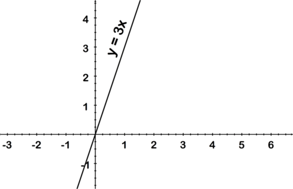\[Figure 1.     |

**Solution:**

In the first representation above, we are given a set of ordered pairs. To verify that this is a function, we must ensure that each $x$\-value is associated with a single $y$\-value. In this example, the first number in each pair (the $x$\-value) is different, so we can be certain that there are no cases where a particular $x$ is associated with more than one $y$.

In the second representation, the equation of a line, it is apparent that any number put in place of $x$ will result in a different $y$, since the $x$ number is simply being multiplied by $3$.

The third representation above is a graph. A good way to determine whether a relation is a function when looking at a graph is by doing a “vertical line test”. If a vertical line can be drawn anywhere on the graph such that the line crosses the relation in two places, then the relation is not a function. If all possible vertical lines will only cross the relation in one place, then the relation is a function. This works because if a vertical line crosses a relation in more than one place it means that there must be two _y_ values corresponding to one _x_ value in that relation. For example, the graph above of $y = 3x$ shows it is a function because any vertical line that is drawn only crosses the relation in one place.

Conversely, the graph below of $x$ \= $y$_2_ shows it is not a function because a vertical line can be drawn that crosses the relation in two places.

__Determine if each relation is a function__

Determine if each relation is a function

|     |     |     |
| --- | --- | --- |
| **a) (2, 4), (3, 9), (5, 11), (5, 12)** | **b) Function defined as:** | 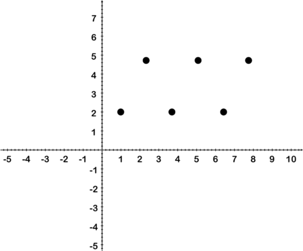\[Figure 3. |

**Solution:**

a) (2, 4), (3, 9), (5, 11), (5, 12)

__This relation is not a function because 5 is paired with 11 and with 12.__

This relation is not a function because 5 is paired with 11 and with 12.

b) (referring to image) This relation is a function because every $x$ is paired with only one $y$. A vertical line through the graph will always only encounter a single point.

#### Example C

Remember the question about movie tickets at the beginning of the lesson?

Does the data you received from your friends represent a function? Can you use the data to predict the cost of going to a movie yourself?

**Solution:**

If we were to organize the information we received into ordered pairs, it might look something like: (1,250) (1,180) (1,100) (1,400) (1, 350) where each $x$ value represents the number of tickets bought, and each $y$ value represents the price.

Since there are many different $y$ values for the only $x$ value, it is definitely not a function.

It should be clear now that the information received from friends' text messages **cannot** really be used to accurately predict the cost of a movie.

#### Guided Practice

Determine if each relation is a function:

1. $(-1,4) (0, 3) (1, 5) (1, 7) (2, 15)$

2. $y = x$

3. $(2, 0)  (4, -1) (2.1, 4) (1, 4) (4, -1)$

4. $y = 4x$

5. $x = |y|$

**Solutions**

1. There are two different “outputs” or $y$\-values for the “input” or $x$\-value of 1. Because we cannot know whether 1 should go with 5 or 7 at any given time, this relation is **not** a function.

2. Since $y = x$, any time a number is chosen to represent $x$, that, and only that, number becomes $y$. From this it is apparent that each input has one and only one output: This relation **is** a function.

3. Don't be fooled! This is a function, there is only one unique output for each input. The fact that both $x$ values 2.1 and 1 are associated with _$y$_ value 4 does not mean that 2.1 and 1 don't have a specific associated value. Also, not matter how close two $x$'s (2 and 2.1, for instance) may be, if they are not _exactly_ the same, they don't affect the definition of a function.

4. This is a function, very similar to #2. Any value chosen for $x$ has one and only one associated value for $y$ (4 times as big).

5. This is _not_ a function. This graph looks like a “<”, with the point on the origin. Any value chosen for $x$ will have 2 associated $y$ values. For instance: 4 = |-4| _and_ 4 = |4|.

#### Explore More

1. What is the definition of a function?

2. Can a function definition be written in the form $x = 3y$ instead of $y = 3x$?

3. Is it mandatory for a function to have both an input and an output?

4. Can a statement be a function if there is only one input and output?

5. Give an example of a relation that is not a function, and explain why it is not a function.

**For Questions 6 - 12, identify each relation as either a function, or not a function:**

6. (2, 4) (4, 6) (6, 8) (3, 4) (5, 7) (8, 2)

7. (-1, 6) (0, 4) (-4, 0) (-1, -6) (-3, -8)

---

8.  

\[Figure 4\]

9.  

\[Figure 5\]

10. 

\[Figure 6\]---

11. ")

\[Figure 8\]

</article>

### 2.6 Graphing Functions

<article>

Functions are a way of relating one variable to another variable in order to find solutions for both variables. Graphs are a great way to visually represent functions and can often help the solution finding process.

#### Key Terms

**Coordinate Plane:** Used to represent sets of numbers. Has two axes and an origin.

**Origin:** The point where two axes intersect.

**Quadrant:** Any one of four sections of the coordinate plane created by the two axes.

**Coordinate:** A pair of numbers that describe how far along the $x$\-axis and $y$\-axis a point is.

**Function:** A relationship between two variables (an input and an output) where there is exactly one output for each input.

**Independent Variable:** The input variable - a variable whose value does not depend on the value of another variable.

**Dependent Variable:** The output variable - a variable whose value depends on the value of an input variable.

**Domain:** The set of values for the input variable of a function.

**Range:** The set of values for the output variable of a function

#### Coordinate Plane

The **coordinate plane** can be used to represent pairs of numbers.

* Looks like two number lines that meet at right angles. These “number lines” are called axes (singular, axis).
    * The horizontal line is called the $x$\-axis. The positive $x$\-direction points to the right.
    * The vertical line is called the $y$\-axis. The positive $y$\-direction points upward.
* The **origin** is where the two axes intersect.
* The axes split the coordinate plane into 4 **quadrants**.
    * Moving counter-clockwise starting from the upper right quadrant, the quadrants are numbered I, II, III, and IV

#### Coordinates

A point on the coordinate plane is determined by its **coordinates** (x, y).

* The order that the coordinates are written in matters! Coordinates are always written with the $x$\-coordinate first.
* The coordinates of the origin are (0, 0).

The $x$\-coordinate is also called the abscissa. The $y$\-coordinate is also called the ordinate.

In the graph below, the coordinates of the point are (5, 4).

---

* To reach the point from the origin, move 5 units to the right and 4 units upward.
* A negative -coordinate means moving to the left, and a negative -coordinate means moving downward.

")

\[Figure 2\]

#### Functions

Graphs are useful for showing relations and functions.

* A relation relates two or more variables (such as $x$ and $y$).
    * An equation with two variables is an example of a relation. The two variables are related by performing the operations of the equation (multiplication, addition, etc.).
* A **function** is a type of relationship that relates one variable called an input to another variable called an output. The relation is such that there is exactly 1 output for every input.
* Typically $x$ represents the input variable and $y$represents the output variable.
    * The input variable $(x)$ is also called the **independent variable** because its value is not controlled by another variable.
    * The output variable $(x)$ is the **dependent variable** because the output depends on the input variable.
* A function is often written as $f(x)$, which stands for function of $x$.
    * **Examples:** $f(x)=2x-5, f(x)=x^3$
* Sometimes $f(x)$ is replaced with $y$.

#### Domain and Range

The **domain** and **range** describe the values that would make the function true.

* The domain is all the possible $x$\-values (input values) of a function.
    * If the domain is all real numbers, the function is continuous. If the domain is a particular set of numbers (such as whole numbers only), the function is discrete.
* The range is all the possible $y$\-values (output values) of a function.
    * The range of the function depends on the domain. 

To find the domain of a function, determine which input values would make sense. Usually this means the input should produce a real number as the output. For example, if an $x$\-value would make the denominator equal to 0, the output wouldn’t be a real number.

* **Example:** $f(x)=\frac{1}{x-2}$ Domain: $[x\neq2]$

This means all real numbers except $x=2$ are a part of the domain. If $x=2$, the denominator would equal 0.

The easiest way to find the range of a function is to look at the graph and find where on the $y$\-axis there are no $x$\-values.

* **Example:** $f(x) = x^2$ Range: $[y \ge 0]$

This means all real numbers greater than or equal to 0 are a part of the range. $x^2$ is always positive, so it is not possible for the $y$\-value to be less than 0.

#### Graphing Functions

A function can be graphed once the relation is known. The relation could be a rule or a table of values.

**Example:**

Graph the function that has the following table of values.

|     |     |     |     |     |     |
| --- | --- | --- | --- | --- | --- |
| Side of a square | 0   | 1   | 2   | 3   | 4   |
| Area of a square | 0   | 1   | 4   | 9   | 16  |

The graphs (to the right) only show quadrant I. It does not make sense to have a negative side or negative area, so they are not included in the domain and range.

When graphing functions, make sure to label the axes.

* Usually picking integer values is best because it makes calculations easier.
* Connect the points if the graph is continuous.

#### Vertical Line Test

When graphing a relation, the vertical line test can be used to see if the relation is a function.

If you can draw a vertical line that crosses the graph in more than one place, the relation is not a function.

Now let us sketch the graphs of some of the standard functions along with their names, definitions, domain and range.

### 1. Identity Function

**The Identity Function: $f(x)=x$**

### 2. Constant Function

The position of line will change above or below the $x$\-axis according to the value of the constant being positive or negative.

$\text{Domain}=R$

$\text{Range}=\{k \}$

### 3. Polynomial Function

i) $y = x^2$

The domain of this function is $\mathbb R$, all real numbers, but what about the range?

The range of the function is the set of all real numbers greater than or equal to zero. This is the case because every $y$ value is the square of an $x$ value. If we square positive and negative numbers, the result will always be positive. If $x = 0$, then $y = 0$. We can also see the range if we look at a graph of $y=x^{2}$. Notice below that the $y$ values are all greater than or equal to zero.

\[Figure 7\]---

ii) $y = x^3$

### 4. Rational Function

Any function that has the form

$$
f(x)=\frac{P(x)}{Q(x)}
$$

where $P(x)$ and $Q(x)$ are polynomials and $Q(x)\ne0$, is called a _rational function_. The _domain_ of any rational function includes all real numbers $x$ that do not make the denominator zero.

What is the domain of $f(x)=\frac{1}{x}$?

Notice that the only input that can make the denominator equal to zero is $x=0$. Thus we say that the domain of $f(x)$ is all real numbers except $x=0$. When looking at the graph of $f(x)=\frac{1}{x}$, you will notice that as $x$ approaches 0 from the left, $f(x)$ decreases. But when $x$ approaches 0 from the right, $f(x)$ increases. Because of this behavior, the $x-$axis and $y-$axis play the role of _horizontal_ and _vertical asymptotes_, respectively.

Now, let's Graph the function $f(x)=\frac{1}{x}$.

We know that the domain of $f(x)$ is all real numbers excluding $x=0$. The vertical line $x=0$ is called a vertical asymptote. For $x<0, f(x)<0,$ and for $x>0, f(x)>0$. Plotting a few sample points should indicate the shape of $f(x)$.

$$
\begin{align*}
& x && 1 && 2 && 10 && \frac{1}{5} && \frac{1}{10} && -1 && -\frac{1}{2} && -\frac{1}{10} && -2 && -10\\
& f(x)=\frac{1}{x} && 1 && \frac{1}{2} && \frac{1}{10} && 5 && 10 && -1 && -2 && -10 && -\frac{1}{2} && -\frac{1}{10}
\end{align*}
$$

While on vacation, you go scuba diving. You start at an unknown sea level of zero metre or higher. You then dive to a depth of 25 metre below sea level. What is the vertex of the absolute value function that represents your possible distance from sea level after diving?

#### Watch This

!?[0](https://www.youtube.com/watch?v=PJt5dSj7PN4)

Watch the video at: http://www.ck12.org/flx/render/embeddedobject/60091

1. We are going to graph $y = |x|$. Draw a table for $x$ and $y$, with the $x-$values ranging from -3 to 3.

| $x$ | $\|x\|$ | $y$ |
| --- | --- | --- |
| $-3$ | $\|-3\|$ | $3$ |
| $-2$ | $\|-2\|$ | $2$ |
| $-1$ | $\|-1\|$ | $1$ |
| $0$ | $\|0\|$ | $0$ |
| $1$ | $\|1\|$ | $1$ |
| $2$ | $\|2\|$ | $2$ |
| $3$ | $\|3\|$ | $3$ |

---

2. Recall that the absolute value of a number is always positive. Now that you have 7 sets of points, plot each one and graph the function.

4. Now, fold your graph on the $x-$axis. What do you notice?

In the investigation, you should discover that when you fold your graph on the $x-$axis, the line $y = x$ becomes the absolute value equation, $y = |x|$. That is because the absolute value of a number can never be zero; therefore, the range will always be positive. We call $y = |x|$ the **parent graph** because it is the most basic of all the absolute value functions. We will also compare other absolute value functions to this graph. All linear absolute value functions have this “V” shape.

In general, we can define the graph of $y = |x|$ as 

$$
\begin{align*}
y= \begin{cases} x; & x \ge 0\\-x; & x < 0\end{cases}
\end{align*}
$$

. From this, we see that each side, is the mirror image of the other over a vertical line, through the vertex. Also, $\text{Domain}=R$ and $\text{Range}=[0, \infty)$

#### Example A

Use a table to graph $y = |x-3|$. Determine the domain and range.

**Solution:**

In general, when you use a table to graph a function, pick some positive and negative numbers, as well as zero. Use the equation to help you determine which $x-$values to pick. Setting what is inside the absolute value equal to zero, we get that $x = 3$. Pick three values on either side of $x = 3$ and then graph.

| $x$ | $\|x-3\|$ | $y$ |
| --- | --- | --- |
| 0   | $\|-3\|$ | 3   |
| 1   | $\|-2\|$ | 2   |
| 2   | $\|-1\|$ | 1   |
| 3   | $\|0\|$ | 0   |
| 4   | $\|1\|$ | 1   |
| 5   | $\|2\|$ | 2   |
| 6   | $\|3\|$ | 3   |

$.")

#### Example B

Use a table to graph $y = |x|-5$. Determine the domain and range.

**Solution:**

Be careful! Here, the minus 5 is not inside the absolute value. So, first take the absolute value of the $x-$value and then subtract 5. In cases like these, the range can include negative numbers.

| $x$ | $\|x\|-5$ | $y$ |
| --- | --- | --- |
| $-3$ | $\|-3. - 5$ | $-2$ |
| $-2$ | $\|-2. - 5$ | $-3$ |
| $-1$ | $\|-1. - 5$ | $-4$ |
| $0$ | $\|0. - 5$ | $-5$ |
| $1$ | $\|1. - 5$ | $-4$ |
| $2$ | $\|2. - 5$ | $-3$ |
| $3$ | $\|3. - 5$ | $-2$ |

$.")

In these three absolute value graphs, you may have noticed that there is a **minimum** point. This point is called the **vertex.** For example, in Example B, the vertex is (0, -5). The vertex can also be a **maximum.** See the next example.

#### Example C

Use a table to graph $y = -|x-1|+2$. Determine the vertex, domain, and range.

**Solution:**

Determine what makes the inside of the absolute value equation zero, $x =1$. Then, to make your table of values, pick a couple values on either side of $x = 1$.

| $x$ | $-\|x-1\|+2$ | $y$ |
| --- | --- | --- |
| \-2 | $-\|-2 - 1. + 2$ | \-1 |
| \-1 | $-\|-1 - 1. + 2$ | 0   |
| 0   | $-\|0 - 1. + 2$ | 1   |
| 1   | $-\|1 - 1. + 2$ | 2   |
| 2   | $-\|2 - 1. + 2$ | 1   |
| 3   | $-\|3 - 1. + 2$ | 0   |
| 4   | $-\|4 - 1. + 2$ | \-1 |

 and in this case, it is the maximum value. The domain is $x \in \mathbb{R}$, and the range is $y \in (-\infty, 2]$.")

**Intro Problem Revisit** The absolute value function that represents this situation is $y = |x-25|$, where _$x$_ is your sea level before diving. By graphing this function, you can see that the vertex occurs at the point (25, 0)

#### Guided Practice

Graph the following functions using a table. Determine the vertex, domain, and range of each function.

1. $y = -|x-5|$

2. $y = |x+4|-2$

#### Answers:

1. Determine what makes the inside of the absolute value equation zero, $x =5$. Then, to make your table of values, pick a couple values on either side of $x = 5$.

| $x$ | $-\|x-5\|$ | $y$ |
| --- | --- | --- |
| 2   | $-\|2 - 5\|$ | \-3 |
| 3   | $-\|3 - 5\|$ | \-2 |
| \-4 | $-\|4 - 5\|$ | \-1 |
| 5   | $-\|5 - 5\|$ | 0   |
| 6   | $-\|6 - 5\|$ | \-1 |
| 7   | $-\|7 - 5\|$ | \-2 |
| 8   | $-\|8 - 5\|$ | \-3 |

 and in this case, it is the maximum value. The domain is $x \in \mathbb{R}$, and the range is $y \in (-\infty, 0]$.")

2. Determine what makes the inside of the absolute value equation zero, $x =-4$. Then, to make your table of values, pick a couple values on either side of $x = -4$.

| $x$ | $\|x+4\|-2$ | $y$ |
| --- | --- | --- |
| $-1$ | $\|-1 + 4. - 2$ | 1   |
| \-2 | $\|-2 + 4. - 2$ | 0   |
| \-3 | $\|-3 + 4. - 2$ | \-1 |
| \-4 | $\|-4 + 4. - 2$ | \-2 |
| \-5 | $\|-5 + 4. - 2$ | \-1 |
| \-6 | $\|-6 + 4. - 2$ | 0   |
| \-7 | $\|-7 + 4. - 2$ | 1   |

 and in this case, it is the minimum value. The domain is $x \in \mathbb{R}$, and the range is $y \in [-2, \infty)$.")

#### Explore More

Graph the following functions using a table. Determine the vertex, domain, and range of each function.

1. $y = |x+6|$

2. $y = |x-4|$

3. $y = -|x|+3$

4. $y = |x|-2$

5. $y = -|x+3|+7$

6. $y = |x-1|-6$

7. $y = 2|x|$

8. $y = -3|x|$

9. $y = \frac{1}{3}|x|$

### Real World Example 1 - Body Temperature

#### Student Exploration

It’s common knowledge that a person’s normal body temperature is supposed to be 98.6 degrees. We can figure out using absolute value equations how much a person’s body temperature deviates from the norm for it to be considered abnormal (and possibly sick). Physicians say that people’s body temperature shouldn’t exceed 0.5 degrees from the norm. How can we represent this relationship as an absolute value equation, and then solve to know what the minimum and maximum body temperatures are?

Let’s say that “$t$” represents a person’s normal body temperature.

$$
|t-98.6|=0.5
$$

This inequality means that the normal body temperature subtracted from the minimum and maximum body temperature should equal 0.5.

To solve this, we can break this up into two equations.

$$
\begin{align*}
t-98.6 &= 0.5 \ and \ t-98.6=-0.5\\
t &= 98.6+0.5 \ and \ t=98.6-0.5\\
t &= 99.1 \ and \ t = 98.1
\end{align*}
$$

This means that our normal body temperature should be between 98.1 and 99.1 degrees.

We can also graph this absolute value equation and see visually see what it means. Since we solved this equation, we can graph our solution set on a number line. We would also represent our solution space between the 98.1 and 99.1 tick marks on the number line. The solution space represents all of the different temperatures that are “normal” for humans.

We can also graph the solution space on an $xy$ coordinate graph, and interpret the solution. For this relationship, we’d have to graph two separate equations: $y=|x-98.6|$ and $y=0.5$ See below.

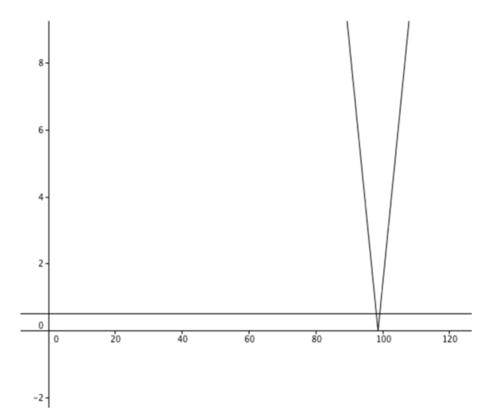

A few steps further: What does the point of the “$V$” graph represent on the graph? What do the $x$ values represent, in relation to body temperature? What do the $y$ values represent? If we were to shade the inside of the “$V$” below the horizontal line, what would the solution space represent?

Let’s explore a little bit more deeply into this body temperature relationship and integrate absolute value inequalities in the equations and graphs. If we first had to integrate the use of an inequality sign instead of the equation $|t-98.6|=0.5$, should we use a greater than sign, or a less than sign? Why?

Our inequality would be $|t-98.6| \le 0.5$ because the body temperature difference can’t be higher than 0.5 variance. If we were to represent this on a number line, we would have our solution space in between the endpoints at 98.1 and 99.1. This represents all of the temperatures that are considered “normal.”

#### Extension Investigation

How else can you represent the maximum and minimum of something as an absolute value equation?

### Real World Example 2 - Rectifiers

 and **alternating current** (AC)? You deal with them all the time. Batteries usually provide DC current, while all your electric wall outlets supply AC current. But many of your electronic devices use DC power. How do these DC devices work when the supply power is AC? There must be some conversion occurring, right? That's where **rectifiers** come in.")

#### Why They’re Important

AC-to-DC converters are either built inside devices or made part of the power cords. Check the adapters of your laptop, phone charger, or other appliances; most of them will show the input as AC and output as DC.

. What this curve shows is that the voltage alternates between positive and negative values over time—hence the name “alternating current.” If you build a circuit that only allows the positive values through but nullifies the negative values, you would obtain Graph 2. This is accomplished by a **half-wave rectifier**. If you have a circuit that outputs the absolute values of the inputs, then you'd arrive at Graph 3. This is accomplished by a **full-wave rectifier**.")

In addition to AC-to-DC transformations, rectifiers have many other uses as well. Take a look: http://en.wikipedia.org/wiki/Rectifier

#### Explore More

To learn more about rectifiers and what they do to electric currents or voltages, check out the following videos.

!?[0](https://www.youtube.com/watch?v=l5b0ZgErKto)

Watch the video at: http://www.youtube.com/watch?v=l5b0ZgErKto

!?[0](https://www.youtube.com/watch?v=4kMXulubQFU)

Watch the video at: http://www.youtube.com/watch?v=4kMXulubQFU

### 6. Greatest Integer Function

Greatest integer function is denoted by $[x]$ and is defined as follows:

$[x]$ = greatest integer less than or equal to $x$

This means, $[0]=0$, as 0 is an integer

$[1]=1$.

$[1.1]=1$, as 1.1 is not an integer and 1 is the greatest of all the integers less than or equal to 1.

$[-2.5] =-3$

Now we will graph the function.

Now, $\text{Domain}=R$

$\text{Range}=Z$, the set of all integers.

The other name for this function is step function.

### 7. Square-root Function

### 8. Signum Function

Signum function can be defined as follows:

$$
\begin{align*}
f(x) = 
\begin{cases}
 1, x > 0  & \\
  0, x=0 & \\
 -1, x < 0 
\end{cases} =
\begin{cases}
\frac{|x|}{x}, x  \ne  0  & \\
  0, x=0
\end{cases}
\end{align*}
$$

$\text{Domain}=R$

$\text{Range}=\{-1, 0, 1 \}$

</article>

### 2.7 Summary

<article>

* Let $A$ and $B$ be any two non-empty sets, then **Cartesian product** of $A$ and $B$ is $A \times B = \left\{ (a, b) : a \in A, b \in B\right\}$
* $A \times \phi =\{ \}$
* If $n(A)=m$ and $n(B)=n$ then $n(A \times B)=mn$
* Two ordered pairs $(a, b)$ and $(x, y)$ are equal means if $(a, b)=(x, y)$ then $a=x$ and $b=y$
* In general, $A \times B \neq B \times A$
* Let $A$ and $B$ be any two non-empty sets then a **relation** $R: A \rightarrow B$ be defined as $R=\left\{(a, b) : a \in A, b \in B \right\} \subseteq A \times B$
* Also, $a R b$ and “$b$” is called **image** of “$a$” under “$R$”.
* Domain of $R=\{x \}$, Range of $R=\{y \}$, Co-domain of $R = B$
* Let $A$ and $B$ be any two non-empty sets then a **function** $f: A \rightarrow B$ is defined as $f(x)=y$; is a special type of relation such that each “$x$” of set $A$ has a unique image “$y$” in set $B$ under “$f$”.
* Domain of $f=A$, Range of $f=\left\{ y\right\}$, Co-domain $f=B$
* $\text{Range} \subseteq \text{Co-domain}$
* A funciton $f$ is called a **real function** if its domain and range are set of real numbers or subsets or real numbers.
* **Algebra of functions:** For any two real functions $f$ and $g, \forall \ x \in R$;

$$
\begin{align*}
\begin{array}{rcl}
(f+g)(x) &=& f(x)+g(x) \\
(f-g)(x) &=& f(x)-g(x)\\
(f \cdot g)(x) &=& f(x) \cdot g(x)\\
(k \cdot f)(x) &=& k \cdot f(x); \quad \text{for any real number} \ k\\
\left(\frac{f}{g}\right)(x) &=& \frac{f(x)}{g(x)}; \text{if}  \ g(x) \neq 0
\end{array}
\end{align*}
$$

**Graphs of some Real Functions**

|     |     |     |     |     |     |
| --- | --- | --- | --- | --- | --- |
| **S.No** | **Function** | **Definition** | **Graph** | **Domain** | **Range** |
| 1   | Identify  Function | $f(x)=x$ | \[Figure 1. | $R = (-\infty, \infty)$ | $R = (-\infty, \infty)$ |
| 2   | Constant  Function | $f(x)=\text{constant}$ |  | $R = (-\infty, \infty)$ | $\left\{\text{constant}\right\}$ |
| 3   | Polynomial  Function | $f(x)=x^2$ | \[Figure 3. | $R = (-\infty, \infty)$ | $[0, \infty)$ |
| 4   | Polynomial  Function | $f(x)=x^3$ | \[Figure 4. | $R = (-\infty, \infty)$ | $R = (-\infty, \infty)$ |
| 5   | Reciprocal  Function | $f(x)=\frac{1}{x}$ | \[Figure 5. | $(-\infty, \infty)-\left\{0\right\}$ | $(-\infty, \infty)-\left\{0\right\}$ |
| 6   | Modulus  Function | $$ f(x) =  \begin{cases}  x, x \ge 0 \\ -x, x < 0 \end{cases} $$ | \[Figure 6. | $R = (-\infty, \infty)$ | $[0, \infty)$ |
| 7   | Signum  Function | $$ f(x) = \begin{cases}  1, x > 0 \\ 0, x = 0 \\ -1, x < 0 \end{cases} $$ | \[Figure 7. | $R = (-\infty, \infty)$ | $\left\{-1,0,1\right\}$ |
| 8   | Greatest  integer  Function | $f(x)=[x]=$  greatest integer  less than  or equal  to $x$ |  | $R = (-\infty, \infty)$ | $Z$(Set of Integers) |
| 9   | Square-root  Function | $f(x)=\sqrt{x}$ | \[Figure 9. | $[0, \infty)$ | $[0, \infty)$ |

**Students can refer to the following link to revise functions:**

* http://www.ck12.org/book/CK-12-Calculus/section/1.2/

</article>

### 2.8 Self Assessments

<article>

#### Assessment 1

**Cartesian Product of Sets**

1. Find $A \times B$ and $B \times A$ if $A = \left\{2,  4 \right\}$ and $B = \left\{1, 3, 5 \right\}$. Are $A \times B$ and $B \times A$ equal?

2. If $A =\left\{1, 2 \right\}, B=\left\{2, 3 \right\},  C =\left\{3, 4 \right\}$ then is $A \times (B \cap C) = (A \times B) \cap (A \times C)$ true?

3. If $n(A)=2$ and $n(B) = 4$ and $A \times B$ has some element as $(a, 1), (b, 2), (a, 3), (b ,4)$ then find $A$ and $B$.

4. If $A =\left\{ H, T \right\}$ then find $A \times A \times A$.

5. If $A=\left\{y, z\right\}, B=\left\{1, 2\right\}, C=\phi$ then find $A \times B \times C$.

#### Assessment 2

**Relations**

Write the following relations (from question no. 1 to 3) on Roster form. Also find their domain and range.

1. $R:N \rightarrow R$ defined as $R = \left\{(x, y): y=\sqrt{x}, x \le 10\right\}$

2. $R:Z \rightarrow Z$ defined as $R=\left\{(x, y): y=x^2+1, -4 \le x \le 4 \right\}$

3. $R:N \rightarrow N$ defined as $R=\left\{(x, y): |x-y| \ \text{is a multiple of} \ 3 \right\}$

4. If two sets $A$ and $B$ are related as shown in the following arrow-diagram then write $R$ in the set-builder form. Also find its domain and range.

5. Write possible number relations from set $A$ to set $B$ if $n(A)=3$ and $B = \left\{a, e, i, o, u \right\}$

#### Assessment 3

**Functions**

[http://www.ck12.org/algebra/Function-Notation/Function-Notation-Practice/?referrer=concept\_details](http://www.ck12.org/algebra/Function-Notation/asmtpractice/Function-Notation-Practice/?referrer=concept_details)

[http://www.ck12.org/algebra/Domain-and-Range-of-a-Function/Domain-and-Range-of-a-Function-Practice/](http://www.ck12.org/algebra/Domain-and-Range-of-a-Function/asmtpractice/Domain-and-Range-of-a-Function-Practice/?referrer=concept_details)

[http://www.ck12.org/algebra/Graphs-of-Absolute-Value-Equations/Graphs-of-Absolute-Value-Equations-Practice/](http://www.ck12.org/algebra/Graphs-of-Absolute-Value-Equations/asmtpractice/Graphs-of-Absolute-Value-Equations-Practice/?referrer=concept_details)

[http://www.ck12.org/analysis/Domain-and-Range/Domain-and-Range-Practice/?referrer=concept\_details](http://www.ck12.org/analysis/Domain-and-Range/asmtpractice/Domain-and-Range-Practice/?referrer=concept_details)

</article>

### 2.9 Home Assignments

<article>

#### Assignment 1

**Cartesian Product of Sets**

NCERT Exercise No. 2.1

Q. No. 2, 4, 6

#### Assignment 2

**Relations**

NCERT Exercise No. 2.2

Q. No. 2, 5, 7

#### Assignment 3

**Functions**

NCERT Exercise No. 2.3

Q. No. 2, 4, 5

#### Assignment 4

**Miscellaneous Questions**

NCERT Miscellaneous Exercise

Q. No. 3, 5, 10, 12

</article>

### 2.10 References for Basic Understanding

<article>

#### 1. Quadrants in Cartesian Plane

[http://www.ck12.org/algebra/Ordered-Pairs-in-Four-Quadrants/lesson/Ordered-Pairs-in-all-Four-Quadrants-C-1-C-2-C-3/](http://www.ck12.org/algebra/Ordered-Pairs-in-Four-Quadrants/lesson/user:amVzc2ljYS53aWxsaWFtc0BsZWFuZGVyaXNkLm9yZw../Ordered-Pairs-in-all-Four-Quadrants-C-1-C-2-C-3/)

#### 2. Intervals of Real Set

http://www.ck12.org/analysis/Intervals-and-Interval-Notation/lesson/Intervals-and-Interval-Notation/

#### 3. Difference between Solving and Evaluating

[http://www.ck12.org/algebra/Functions-that-Describe-Situations/lecture/Write-a-Function-Rule-An-Explanation-of-the-Concept/](http://www.ck12.org/algebra/Functions-that-Describe-Situations/lecture/Write-a-Function-Rule%3A-An-Explanation-of-the-Concept/)

</article>

### 2.11 References for Advanced Understanding

<article>

#### 1. Modulus Function

[http://www.ck12.org/algebra/Graphs-of-General-Absolute-Value-Equations-with-Technology/lesson/](http://www.ck12.org/algebra/Graphs-of-General-Absolute-Value-Equations-with-Technology/lesson/Using-the-General-Absolute-Value-Equation-and-the-Graphing-Calculator/)

#### 2. Domain and Range of Functions

http://www.ck12.org/analysis/Domain-and-Range/lesson/Domain-and-Range-Precalculus/

#### 3. Function Families

http://www.ck12.org/analysis/Function-Families/lesson/Function-Families/

#### 4. Even and Odd Functions

http://www.ck12.org/book/CK-12-Calculus-Concepts/section/1.4/

http://www.ck12.org/calculus/Even-and-Odd-Functions/studyguide/user:13IntW/Even-and-Odd-Functions/

#### Resources Cited

http://www-personal.umich.edu/~lormand/poli/nike/nike101-4.htm

</article>

## 3.0 Trigonometric Functions

<article>

</article>

### 3.1 Introduction

<article>

In class X, you have studied ratios of sides of a right triangle as six trigonometric ratios and also applications of trigonometry. In this chapter we will study trigonometric functions and unit circle and value of trigonometric function for any angle; So let's first start by learning one more unit of angles, that is, radian measure of an angle.

</article>

### 3.2 Angles and their Radian Measure

<article>

Let us revisit a little about angles:

#### Guidance

Angles of rotation are formed in the coordinate plane between the positive $x$\-axis **(initial side)** and a ray **(terminal side)**. Positive angle indicates a counterclockwise rotation while negative angle indicates a clockwise rotation.

Now let's extend our discussion to a new measurement unit of angle, which is radian. What is a radian? Before we study about radian, just think about this question.

You are hard at work in the school science lab when your teacher asks you to turn a knob on a detector you are using $75^\circ$. Unfortunately, you have been working in radians for a while, and so you're having trouble remembering how far to turn the knob. Is there a way to translate the instructions in degrees to radians?

Read this Concept, and at the conclusion you'll be able to accomplish this task and turn the knob the appropriate amount.

#### Guidance

The unit circle is the circle centered at the origin with radius equal to one unit. This means that the distance from the origin to any point on the circle is equal to one unit.

. So a full revolution, or $360^\circ$, is equal to $2 \pi$ radians. Half a rotation, or $180^\circ$ is equal to $\pi$ radians.")

One radian is equal to the measure of $\theta$, the rotation required for the arc length intercepted by the angle to be equal to the radius of the circle. In other words the arc length is 1 unit for $\theta=1$ radian.

We can use the equality, $\pi=180^\circ$ to convert from degrees to radians and vice versa.

Since degrees and radians are different ways of measuring the distance moved around the circumference of a circle, it is reasonable to suppose that there is a conversion formula between these two units. This formula works for all degrees and radians. Remember that: $\pi \ \text{radians} = 180^\circ$. If you divide both sides of this equation by $\pi$, you will have the conversion formula:

$$
\text{radians} \times \frac{180^\circ}{\pi}=\text{degrees}
$$

If we have a degree measure and wish to convert it to radians, then manipulating the equation above gives:

$$
\text{degrees} \times \frac{\pi}{180^\circ}=\text{radians}
$$

a) Convert $250^\circ$ to radians.

b) Convert $3 \pi$ to degrees.

**Solution:**

a) To convert from degrees to radians, multiply by $\frac{\pi}{180^\circ}$. So, $\frac{250 \pi}{180^\circ}=\frac{25 \pi}{18}$.

b) To convert from radians to degrees, multiply by $\frac{180^\circ}{\pi}$. So, $3 \pi \times \frac{180^\circ}{\pi}=3 \times 180^\circ=540^\circ$.

#### Example 2

Find two angles, one positive and one negative, coterminal to $\frac{5 \pi}{3}$ and find its reference angle, in radians.

**Solution:**

Since we are working in radians now we will add/subtract multiple of $2 \pi$ instead of $360^\circ$. Before we can add, we must get a common denominator of 3 as shown below.

$$
\frac{5 \pi}{3} + 2 \pi = \frac{5 \pi}{3} + \frac{6 \pi}{3} = \frac{11 \pi}{3} \quad and \quad \frac{5 \pi}{3} - 2 \pi = \frac{5 \pi}{3} - \frac{6 \pi}{3} =- \frac{\pi}{3}
$$

Now, to find the reference angle, first determine in which quadrant $\frac{5 \pi}{3}$ lies. If we think of the measures of the angles on the axes in terms of $\pi$ and more specifically, in terms of $\frac{\pi}{3}$, this task becomes a little easier.

Consider $\pi$ is equal to $\frac{3 \pi}{3}$ and $2 \pi$ is equal to $\frac{6 \pi}{3}$ as shown in the diagram. Now we can see that the terminal side of $\frac{5 \pi}{3}$ lies in the fourth quadrant and thus the reference angle will be:

$$
\frac{6 \pi}{3} - \frac{5 \pi}{3} = \frac{\pi}{3}
$$

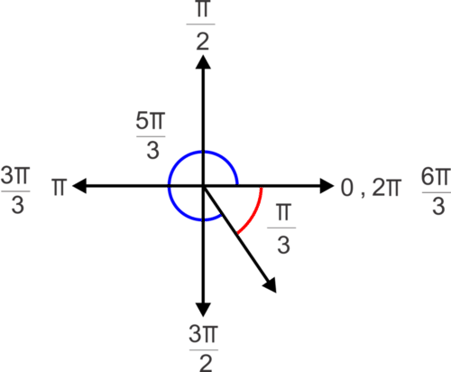

Find two angles coterminal to $\frac{7 \pi}{6}$, one positive and one negative, and find its reference angle, in radians.

**Solution:**

This time we will add multiples of $2 \pi$ with a common denominator of 6, or $\frac{2 \pi}{1} \times \frac{6}{6} = \frac{12 \pi}{6}$. For the positive angle, we add to get $\frac{7 \pi}{6} + \frac{12 \pi}{6} = \frac{19 \pi}{6}$. For the negative angle, we subtract to get $\frac{7 \pi}{6} - \frac{12 \pi}{6} = \frac{5 \pi}{6}$.

In this case $\pi$ is equal to $\frac{6 \pi}{6}$ and $2 \pi$ is equal to $\frac{12 \pi}{6}$ as shown in the diagram. Now we can see that the terminal side of $\frac{7 \pi}{6}$ lies in the third quadrant and thus the reference angle will be:

$$
\frac{7 \pi}{6} - \frac{6 \pi}{6} = \frac{\pi}{6}
$$

1. Convert the following angle measures from degrees to radians.

a) $-45^\circ$

b) $120^\circ$

c) $330^\circ$

2. Convert the following angle measures from radians to degrees.

a) $\frac{5 \pi}{6}$

b) $\frac{13 \pi}{4}$

c) $-\frac{5 \pi}{2}$

3. Find two coterminal angles to $\frac{11 \pi}{4}$, one positive and one negative, and its reference angle.

#### Answers:

1. a) $-45^\circ \times \frac{\pi}{180^\circ}=-\frac{\pi}{4}$

b) $120^\circ \times \frac{\pi}{180^\circ}=\frac{2 \pi}{3}$

c) $330^\circ \times \frac{\pi}{180^\circ}=\frac{11 \pi}{6}$

2. a) $\frac{5 \pi}{6} \times \frac{180^\circ}{\pi}=150^\circ$

b) $\frac{13 \pi}{4} \times \frac{180^\circ}{\pi}=585^\circ$

c) $-\frac{5 \pi}{2} \times \frac{180^\circ}{\pi}=-450^\circ$

3. There are many possible coterminal angles, here are some possibilities:

positive coterminal angle: $\frac{11 \pi}{4} + \frac{8 \pi}{4} = \frac{19 \pi}{4}$ or $\frac{11 \pi}{4} - \frac{8 \pi}{4} = \frac{3 \pi}{4}$,

negative coterminal angle: $\frac{11 \pi}{4} - \frac{16 \pi}{4} = -\frac{5 \pi}{4}$ or $\frac{11 \pi}{4} - \frac{24 \pi}{4} = -\frac{13 \pi}{4}$

Using the coterminal angle, $\frac{3 \pi}{4}$, which is $\frac{\pi}{4}$ from $\frac{4 \pi}{4}$. So the terminal side lies in the second quadrant and the reference angle is $\frac{\pi}{4}$.

#### Watch This

!?[0](https://www.youtube.com/watch?v=25NuDwXAja0)

Watch the video at:  http://www.ck12.org/flx/render/embeddedobject/70436

#### Example 4

Convert $\frac{11\pi}{3}$ to degree measure.

From the last section, you should recognize that this angle is a multiple of $\frac{\pi}{3}$ (or 60 degrees), so there are 11, $\frac{\pi}{3}$'s in this angle, $\frac{\pi}{3} \times 11 = 60^\circ \times 11 = 660^\circ$.

Here is what it would look like using the formula:

$$
\text{radians} \times \frac{180^\circ}{\pi} = \text{degrees}
$$

#### Example 5

Convert $-120^\circ$ to radian measure. Leave the answer in terms of $\pi$.

$$
\text{degrees} \times \frac{\pi}{180^\circ}=\text{radians}\\
-120^\circ \times \frac{\pi}{180^\circ}=\frac{-120^\circ \pi}{180^\circ}
$$

and reducing to lowest terms gives us $-\frac{2\pi}{3}$

You could also have noticed that 120 is $2 \times 60$. Since $60^\circ$ is $\frac{\pi}{3}$ radians, then 120 is 2, $\frac{\pi}{3}$’s, or $\frac{2\pi}{3}$. Make it negative and you have the answer, $-\frac{2\pi}{3}$.

#### Example 6

Express $\frac{11\pi}{12}$ radians terms of degrees.

$$
\text{radians} \times \frac{180^\circ}{\pi}=\text{degrees}
$$

Note: Sometimes students have trouble remembering if it is $\frac{180^\circ}{\pi}$ or $\frac{\pi}{180^\circ}$. It might be helpful to remember that radian measure is almost always expressed in terms of $\pi$. If you want to convert from radians to degrees, you want the $\pi$ to cancel out when you multiply, so it must be in the denominator.

#### Guided Practice

1. Convert the following degree measures to radians.

$240^\circ$, $270^\circ$, $315^\circ$, $-210^\circ$, $120^\circ$

2. Convert the following degree measures to radians.

$15^\circ$, $-450^\circ$, $72^\circ$, $720^\circ$, $330^\circ$

3. Convert the following radian measures to degrees.

$\frac{\pi}{2}$, $\frac{11\pi}{5}$, $\frac{2\pi}{3}$, $5\pi$, $\frac{7\pi}{2}$

**Solutions:**

1. $\frac{4\pi}{3}$, $\frac{3\pi}{2}$, $\frac{7\pi}{4}$, $-\frac{7\pi}{6}$, $\frac{2\pi}{3}$

2. $\frac{\pi}{12}$, $-\frac{5\pi}{2}$, $\frac{\pi}{5}$, $4 \pi$, $\frac{11\pi}{6}$

3. $90^\circ$, $396^\circ$, $120^\circ$, $540^\circ$, $630^\circ$

#### Concept Problem Solution

Since you now know that the conversion for a measurement in degrees to radians is

$$
\text{degrees} \times \frac{\pi}{180^\circ}=\text{radians}
$$

you can find the solution to convert $75^\circ$ to radians:

$$
75^\circ \times \frac{\pi}{180^\circ}= \frac{75\pi}{180^\circ} = \frac{5\pi}{12}
$$

#### Watch This

!?[0](https://www.youtube.com/watch?v=0yHDfG2m-44)

Watch the video at: http://www.ck12.org/flx/render/embeddedobject/143253

#### Example 7

The hands of a clock show 11:20. Express the obtuse angle formed by the hour and minute hands in radian measure.

**Solution:**

The following diagram shows the location of the hands at the specified time.

. So, the angle between the 12 and the 4 is $4 \times \frac{\pi}{6}=\frac{2\pi}{3}$ (or $120^\circ$). Because the rotation from 12 to 4 is one-third of a complete rotation, it seems reasonable to assume that the hour hand is moving continuously and has therefore moved one-third of the distance between the 11 and the 12. This means that the angle between the hour hand and the 12 is two-thirds of the distance between the 11 and the 12. So, $\frac{2}{3} \times \frac{\pi}{6}=\frac{2\pi}{18}=\frac{\pi}{9}$, and the total measure of the angle is therefore $\frac{\pi}{9}+\frac{2\pi}{3}=\frac{\pi}{9}+\frac{6\pi}{9}=\frac{7\pi}{9}$.")

#### Example 8

The hands of a clock show 4:15. Express the acute angle formed by the hour and minute hands in radian measure.

. So, the angle between the 3 (which is where the minute hand is located when it is 15 minutes after the hour) and the 4 is $\frac{\pi}{6}$ (or $30^\circ$). Further, since the minute hand has moved one quarter of the way around the hour, we can infer that the hour hand has moved one quarter of the way between four and five, which is $\frac{1}{4} \times \frac{\pi}{6} = \frac{\pi}{24}$. Adding these numbers gives: $\frac{\pi}{6} + \frac{\pi}{24} = \frac{4 \pi}{24} + \frac{\pi}{24} = \frac{5 \pi}{24}$.")

### Length of an Arc

You have taken your little cousin to the amusement park for the day. While there, she decides she would like a ride on the giant wheel. After the ride, she excitedly bounces over to you. She is amazed that she went around, but in a way “didn't go anywhere”, since she ended up where she started.

“How far did I go when I was halfway around the turn?”, she asks.

You know that the radius of the giant wheel is 7 metres. Can you tell your little cousin how far she went in one half of a turn around the ride?

At the end of this Concept, you'll be able to do just that.

!?[0](https://www.youtube.com/watch?v=qp0cATM2yys)

Watch the video at: http://www.ck12.org/flx/render/embeddedobject/143254

#### Guidance

The length of an arc on a circle depends on both the angle of rotation and the radius length of the circle. If you recall from the last section, the measure of an angle in radians is defined as the length of the arc cut off by one radius length. What if the radius is 4 cm? Then, the length of the half-circle arc would be $\pi$ multiplied by the radius length, or $4\pi$ cm in length.

$$
l = r \theta,
$$

where $l$ is the length of the arc, $r$ is the radius, and $\theta$ is the measure of the angle in radians.

#### Example 9

The free-throw line on an Indian basketball court is 12 ft wide. In international competition, it is only about 11.81 ft. How much longer is the half circle above the free-throw line on the Indian court?

Find both arc lengths.

$$
\begin{align*}
\begin{matrix}
\text{Indian} & \text{INTERNATIONAL}\\ \\
l_1=r \theta & l_2 =r \theta\\ \\
l_1=\frac{12}{2}(\pi) & l_2 \approx \frac{11.81}{2}(\pi) \\ \\
l_1=6\pi & l_2 \approx 5.905 \pi
\end{matrix}
\end{align*}
$$

So the answer is approximately $6 \pi - 5.905 \pi \approx 0.095\pi$

#### Example 10

Two connected gears are rotating. The smaller gear has a radius of 4 inches and the larger gear’s radius is 7 inches. What is the angle through which the larger gear has rotated when the smaller gear has made one complete rotation?

Because the blue gear performs one complete rotation, the length of the arc traveled is:

$$
\begin{align*}
\begin{array}{rcl}
l &=& r\theta\\
l &=& 4 \times 2 \pi
\end{array}
\end{align*}
$$

So, an $8\pi$ arc length on the larger circle would form an angle as follows:

$$
\begin{align*}
\begin{array}{rcl}
\theta &=& \frac{l}{r}\\
\theta &=& \frac{8\pi}{7}\\
\theta & \approx & 3.6
\end{array}
\end{align*}
$$

So the angle is approximately 3.6 radians. That is

$$
3.6 \times \frac{180}{\pi} \approx 206^\circ
$$

#### Example 11

The radius of a standard car tyre is 27.94 cm. How far does a car go in one revolution of the tyre?

Since the distance traveled by the tyre is equal to the distance around the tyre, we can use the circumference of the tyre to answer the question.

$$
\begin{align*}
\begin{array}{rcl}
l &=& r\theta\\
l &=& (27.94)(2\pi)\\
l &=& 175.46 \ cm
\end{array}
\end{align*}
$$

#### Guided Practice

1. You are trying to push your car after it has broken down. Unfortunately, you aren't very strong, and so the car is just rocking back and forth instead of rolling as you push. If the radius of your car's tyre is 14 inches, and the change in the tyre's angle is $\frac{\pi}{2}$ radians, how far did the tyre move?

2. If an object with a radius of 10 cm spins so that its arc covers 54 cm, what is the change in angle of the object?

3. If your DVD has a radius of 4.5 inches, how far does a point on the disk spin if the player turns it $\frac{\pi}{2}$ radians?

**Solutions:**

1. Since the distance the tyre moved is equal to the length of the arc the tyre rolled, you can use the equation $l = r\theta$ to determine how far the tyre went:

$$
\begin{align*}
\begin{array}{rcl}
l &=& r\theta\\
l &=& (14) \left(\frac{\pi}{2} \right)\\
l &=& 7\pi\\
l & \approx & 21.98 in
\end{array}
\end{align*}
$$

2. You can again use the equation $l = r\theta$ to solve this problem:

$$
\begin{align*}
\begin{array}{rcl}
l &=& r\theta\\
\theta &=& \frac{l}{r} = \frac{54}{10} = 5.4\\
\end{array}
\end{align*}
$$

The disk moves 5.4 radians, which is a little less than a complete rotation, since a complete rotation is approximately 6.28 radians.

3. Using $l = r\theta$,

$$
\begin{align*}
\begin{array}{rcl}
l &=& r\theta\\
l &=& (4.5)\left(\frac{\pi}{2} \right)\\
l &=& 2.25\pi \approx 7.065\\
\end{array}
\end{align*}
$$

A point on the disk turns 7.065 inches.

#### Concept Problem Solution

Since you now know that you can measure an arc length using $l = r\theta$, you can use this to find a solution to your cousin's question. Since your cousin wants to know how far she went around when she went $\frac{1}{2}$ of a rotation, and the radius of the ride is 7 metres, you can calculate her arc length:

$$
l = r\theta = 7\pi \approx 21.98 \ \text{metres}
$$

#### Explore More

For problems 1-5, convert the angle from degrees to radians.

1. $135^\circ$

2. $240^\circ$

3. $-330^\circ$

4. $450^\circ$

5. $-315^\circ$

For problems 6-10, convert the angle measure from radians to degrees.

6. $\frac{7 \pi}{3}$

7. $-\frac{13 \pi}{6}$

8. $\frac{9 \pi}{2}$

9. $-\frac{3 \pi}{4}$

10. $\frac{5 \pi}{6}$

For problems 11-15, find two coterminal angles (one positive, one negative) and the reference angle for each angle in radians.

11. $\frac{8 \pi}{3}$

12. $\frac{11 \pi}{4}$

13. $-\frac{\pi}{6}$

14. $\frac{4 \pi}{3}$

15. $-\frac{17 \pi}{6}$

Convert the following degree measures to radians.

16. $90^\circ$

17. $360^\circ$

18. $50^\circ$

19. $110^\circ$

20. $495^\circ$

21. $-85^\circ$

22. $-120^\circ$

Convert the following radian measures to degrees.

23. $\frac{5\pi}{12}$

24. $\frac{3\pi}{5}$

25. $\frac{8\pi}{15}$

26. $\frac{7\pi}{10}$

27. $\frac{5\pi}{2}$

28. $3\pi$

29. $\frac{7\pi}{2}$

A pizza has a radius of 10 cm. Use this information to answer questions 30-32.

30. A slice is removed. The length of the crust of the missing slice is 3 cm. What is the central angle of the missing slice?

31. You eat three pieces with a central angle of $\frac{4\pi}{5}$. What is the length of the crust you ate?

32. A large pizza has a radius of 12 cm. What is the length of the crust of half of the large pizza?

The diameter of a tyre is 35 cm. Use this information to answer questions 33-36.

33. What is the length around the whole tyre?

34. The tyre travels one kilometre. How many revolutions did the tyre make?

35. You roll the tyre so it rotates $7\pi$ radians. How far did it move?

36. The tyre travels half a kilometre. How many radians did the tyre rotate?

Consider a standard 12 hour clock like the one below with a radius of 10 cm. Use this to answer questions 37-41.

38. What is the length of the arc between the 3 and the 2?

39. It is 12:30. What is the length of the arc between the minute and hour hands?

40. It is 7:20. What is the length of the arc between the minute and hour hands?

41. It is 1:25. What is the length of the arc between the minute and hour hands?

</article>

### 3.3 Trigonometric Functions

<article>

You've been working hard in your math class, and are getting to be quite the expert on trigonometric functions. Then one day your friend, who is a year ahead of you in school, approaches you.

“So, you're doing pretty well in math? And you're good with trigonometric functions?” he asks with a smile.

“Yes,” you reply confidently. “I am.”

“Alright, then what's the sine of $150^\circ$?” he asks.

"What? That doesn't make sense. No right triangle has an angle like that, so there's no way to define that function!” you say.

Your friend laughs. “As it turns out, it is quite possible to have trigonometric functions of angles greater than $90^\circ$.”

Is your friend just playing a joke on you, or does he mean it? Can you actually calculate $\sin 150^\circ$?

At the conclusion of this Concept, you'll be able to answer this question.

#### Watch This

!?[0](https://www.youtube.com/watch?v=i56P6xzsB5Y)

Watch the video at: http://www.ck12.org/flx/render/embeddedobject/143255

#### Guidance

Just as it is possible to define the six trigonometric functions for angles in right triangles, we can also define the same functions in terms of angles of rotation. Consider an angle in standard position, whose terminal side intersects a circle of radius $r$. We can think of the radius as the hypotenuse of a right triangle:

$ where the terminal side of the angle intersects the circle tells us the lengths of the two legs of the triangle. Now, we can define the trigonometric functions in terms of $x, y$, and $r$:")

$$
\begin{align*}
\begin{matrix}
\cos \theta= \frac{x}{r} & \sec \theta = \frac{r}{x} \\ \\
\sin \theta = \frac{y}{r} & \text{cosec } \theta = \frac{r}{y}\\ \\
\tan \theta=\frac{y}{x} & \cot \theta = \frac{x}{y}
\end{matrix}
\end{align*}
$$

And, we can extend these functions to include non-acute angles.

Consider an angle in standard position, such that the point $(x, y)$ on the terminal side of the angle is a point on a circle with radius 1 unit.

$$
\begin{align*}
\begin{matrix}
\cos \theta  = \frac{x}{r} = \frac{x}{1} = x & \sec \theta = \frac{r}{x} = \frac{1}{x} \\ \\
\sin \theta  = \frac{y}{r} = \frac{y}{1} = y & \text{cosec } \theta = \frac{r}{y} = \frac{1}{y} \\ \\
\tan \theta  = \frac{y}{x} & \cot \theta = \frac{x}{y} \\
\end{matrix}
\end{align*}
$$

Notice that in the unit circle, the sine and cosine of an angle are the $y$ and $x$ coordinates of the point on the terminal side of the angle. Now we can find the values of the trigonometric functions of any angle of rotation, even the quadrantal angles, which are not angles in triangles.

#### Example 1

The point (-3, 4) is a point on the terminal side of an angle in standard position. Determine the values of the six trigonometric functions of the angle.

**Solution:**

Notice that the angle is more than 90 degrees, and that the terminal side of the angle lies in the second quadrant. This will influence the signs of the trigonometric functions.

\begin{align*}
\begin{matrix}
\cos \theta  = \frac{-3}{5} & \sec \theta = \frac{5}{-3} \\ \\
\sin \theta  = \frac{4}{5} & \text{cosec } \theta = \frac{5}{4} \\ \\
\tan \theta  = \frac{4}{-3} & \cot \theta = \frac{-3}{4} \\
\end{matrix}
\end{align*}
$$

Notice that the value of $r$ depends on the coordinates of the given point. You can always find the value of $r$ using the Pythagoras Theorem. However, often we look at angles in a circle with radius 1. As you can see, doing this allows us to simplify the definitions of the trigonometric functions.

#### Example 2

Use the unit circle above to find the value of $\cos 90^\circ$

**Solution:**

$\cos 90^\circ = 0$

The ordered pair for this angle is (0, 1). The cosine value is the $x$ coordinate, $0$.

#### Example 3

Use the unit circle above to find the value of $\cot 180^\circ$

**Solution:**

$\cot 180^\circ$ is undefined

The ordered pair for this angle is (-1, 0). The ratio $\frac{x}{y}$ is $\frac{-1}{0}$, which is undefined.

#### Guided Practice

Use this figure:

1. Find $\cos \theta$ on the circle above.

2. Find $\cot \theta$ on the circle above.

3. Find $\text{cosec } \theta$ on the circle above.

**Solutions:**

1. We can see from the “$x$” and “$y$” axes that the “$x$” coordinate is $\frac{-\sqrt{3}}{2}$, the “y” coordinate is $\frac{1}{2}$, and the hypotenuse has a length of 1. This means that the cosine function is:

$$
\cos \theta = \frac{base}{hypotenuse} = \frac{\frac{-\sqrt{3}}{2}}{1}=\frac{-\sqrt{3}}{2}
$$

2. We know that $\cot \theta= \frac{1}{\tan \theta} = \frac{1}{\frac{perpendicular}{base}} = \frac{base}{perpendicular}$. The adjacent side to $\theta$ in the circle is $\frac{-\sqrt{3}}{2}$ and the opposite side is $\frac{1}{2}$. Therefore,

$$
\cot \theta = \frac{\frac{-\sqrt{3}}{2}}{\frac{1}{2}} = -\sqrt{3}
$$

3. We know that $\text{cosec} \ \theta = \frac{1}{\sin \theta} = \frac{1}{\frac{perpendicular}{hypotenuse}} = \frac{hypotenuse}{perpendicular}$. The opposite side to $\theta$ in the circle is $\frac{1}{2}$ and the hypotenuse is 1. Therefore,

$$
\text{cosec }\theta= \frac{hypotenuse}{perpendicular}= \frac{{1}}{\frac{1}{2}}=2
$$

#### Concept Problem Solution

Since you now know that it is possible to apply trigonometric functions to angles greater than $90^\circ$, you can calculate the $\sin 150^\circ$. The easiest way to do this without difficulty is to consider that an angle of $150^\circ$ is in the same position as $30^\circ$, except it's in the second quadrant. This means that it has the same “$x$” and “$y$” values as $30^\circ$, except that the “$x$” value is negative.

Therefore,

$$
\sin 150^\circ = \frac{1}{2}
$$

Recall special right triangles from Geometry. In a $(30^\circ - 60^\circ - 90^\circ)$ triangle, the sides are in the ratio $1:\sqrt{3}:2$.

In an isosceles triangle $(45^\circ - 45^\circ - 90^\circ)$, the congruent sides and the hypotenuse are in the ratio $1:1:\sqrt{2}$.

$ triangle, the sides are in the ratio $1:\sqrt{3}:2$.")

")

\[Figure 9\]

Using these triangles, we can evaluate sine, cosine and tangent for each of the angle measures.

$$
\begin{align*}
& \sin 45^\circ = \frac{\sqrt{2}}{2} \qquad \quad \sin 60^\circ = \frac{\sqrt{3}}{2} \qquad \qquad \quad \ \ \sin 30^\circ = \frac{1}{2} \\
& \cos 45^\circ = \frac{\sqrt{2}}{2} \qquad \ \ \cos 60^\circ = \frac{1}{2} \qquad \qquad \qquad \ \ \cos 30^\circ = \frac{\sqrt{3}}{2} \\
& \tan 45^\circ = 1 \qquad \quad \ \ \tan 60^\circ = \frac{\frac{\sqrt{3}}{2}}{\frac{1}{2}}=\sqrt{3} \qquad \quad \tan 30^\circ = \frac{\frac{1}{2}}{\frac{\sqrt{3}}{2}} = \frac{\sqrt{3}}{2}
\end{align*}
$$

These triangles can now fit inside the unit circle.

$, we can see that each point is actually $(\cos \theta, \sin \theta)$, where $\theta$ is the reference angle. For example, $\sin 60^\circ=\frac{\sqrt{3}}{2}$ is the $y$ – coordinate of the point on the unit circle in the triangle with reference angle $60^\circ$. By reflecting these triangles across the axes and finding the points on the axes, we can find the trigonometric ratios of all multiples of $0^\circ, 30^\circ$ and $45^\circ$ (or $0, \frac{\pi}{6}, \frac{\pi}{4}$ radians).")

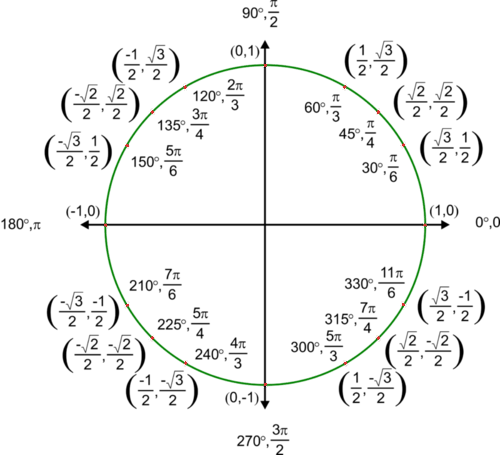

Find $\sin \frac{3 \pi}{2}$.

**Solution:**

Find $\frac{3 \pi}{2}$ on the unit circle and the corresponding point is $(0, -1)$. Since each point on the unit circle is $(\cos \theta, \sin \theta)$., $\sin \frac{3 \pi}{2}=-1$

#### Example 5

Find $\tan \frac{7 \pi}{6}$.

**Solution:**

This time we need to look at the ratio $\frac{\sin \theta}{\cos \theta}$. We can use the unit circle to find $\sin \frac{7 \pi}{6}=-\frac{1}{2}$ and $\cos \frac{7 \pi}{6}=-\frac{\sqrt{3}}{2}$. Now, $\tan \frac{7 \pi}{6}=\frac{-\frac{1}{2}}{-\frac{\sqrt{3}}{2}}=\frac{1}{\sqrt{3}}=\frac{\sqrt{3}}{3}$.

Another way to approach these exact value problems is to use the reference angles and the special right triangles. The benefit of this method is that there is no need to memorize the entire unit circle. If you memorize the special right triangles, can determine reference angles and know where the ratios are positive and negative you can put the pieces together to get the ratios. Looking at the unit circle above, we see that all of the ratios are positive in Quadrant I, sine is the only positive ratio in Quadrant II, tangent is the only positive ratio in Quadrant III and cosine is the only positive ratio in Quadrant IV.

Keeping this diagram in mind will help you remember where cosine, sine and tangent are positive and negative. You can also use the pneumonic device - **A**ll **S**tudents **T**ake **C**alculus, or **ASTC**, to recall which is positive (all the others would be negative) in which quadrant.

The coordinates on the vertices will help you determine the ratios for the multiples of $90^\circ$ or $\frac{\pi}{2}$.

Find the exact values for the following trigonometric functions.

a) $\cos 120^\circ$

b) $\sin \frac{5 \pi}{3}$

c) $\tan \frac{7 \pi}{2}$

**Solution:**

a) First, we need to determine in which quadrant the angles lies. Since $120^\circ$ is between $90^\circ$ and $180^\circ$ it will lie in Quadrant II. Next, find the reference angle. Since we are in QII, we will subtract from $180^\circ$ to get $60^\circ$. We can use the reference angle to find the ratio, $\cos 60^\circ=\frac{1}{2}$. Since we are in QII where only sine is positive, $\cos 120^\circ = \cos (180^\circ - 60^\circ)= -\cos 60^\circ = -\frac{1}{2}$.

b) This time we will need to work in terms of radians but the process is the same. The angle $\frac{5 \pi}{3}$ lies in QIV and the reference angle is $\frac{\pi}{3}$. This means that our ratio will be negative. Since $\sin \frac{\pi}{3}=\frac{\sqrt{3}}{2}, \sin \frac{5 \pi}{3}=-\frac{\sqrt{3}}{2}$.

c) The angle $\frac{7 \pi}{2}$ represents more than one entire revolution and it is equivalent to $2 \pi + \frac{3 \pi}{2}$. Since our angle is a multiple of $\frac{\pi}{2}$ we are looking at an angle on an axis. In this case, the point is $(0, -1)$. Because $\tan \theta=\frac{\sin \theta}{\cos \theta}, \tan \frac{7 \pi}{2}=\frac{-1}{0}$, which is undefined. Thus, $\tan \frac{7 \pi}{2}$ is undefined.

#### Guided Practice

Evaluate the following:

1. $\cos \frac{7 \pi}{3}$

2. $\tan \frac{9 \pi}{2}$

3. $\sin 405^\circ$

4. $\tan \frac{11 \pi}{6}$

5. $\cos \frac{2 \pi}{3}$

**Answers:**

1. $\frac{7 \pi}{3}$ has a reference angle of $\frac{\pi}{3}$ in QI. $\cos \frac{\pi}{3}=\frac{1}{2}$ and since cosine is positive in QI, $\cos \frac{7 \pi}{3}=\frac{1}{2}$.

2. $\frac{9 \pi}{2}$ is coterminal to $\frac{\pi}{2}$ which has coordinates (0, 1). So $\tan \frac{9 \pi}{2}=\frac{\sin \frac{9 \pi}{2}}{\cos \frac{9 \pi}{2}}=\frac{1}{0}$ which is undefined.

3. $405^\circ$ has a reference angle of $45^\circ$ in QI. $\sin 45^\circ=\frac{\sqrt{2}}{2}$ and since sine is positive in QI, $\sin 405^\circ=\frac{\sqrt{2}}{2}$.

4. $\frac{11 \pi}{6}$ is coterminal to $\frac{\pi}{6}$ in QIV. $\tan \frac{\pi}{6}=\frac{\sqrt{3}}{3}$ and since tangent is negative in QIV, $\tan \frac{11 \pi}{6}=-\frac{\sqrt{3}}{3}$.

5. $\frac{2 \pi}{3}$ is coterminal to $\frac{\pi}{3}$ in QII. $\cos \frac{\pi}{3}=\frac{1}{2}$ and since cosine is negative in QII, $\cos \frac{2 \pi}{3}=\frac{1}{2}$.

#### Explore More

Find the values of the six trigonometric functions for each angle below.

1. $0^\circ$

2. $90^\circ$

3. $180^\circ$

4. $270^\circ$

5. Find the sine of an angle that goes through the point $(\frac{\sqrt{2}}{2},\frac{\sqrt{2}}{2})$.

6. Find the cosine of an angle that goes through the point $(\frac{\sqrt{2}}{2},\frac{\sqrt{2}}{2})$.

7. Find the tangent of an angle that goes through the point $(\frac{\sqrt{2}}{2},\frac{\sqrt{2}}{2})$.

8. Find the secant of an angle that goes through the point $(-\frac{\sqrt{3}}{2},\frac{1}{2})$.

9. Find the cotangent of an angle that goes through the point $(-\frac{\sqrt{3}}{2},-\frac{1}{2})$.

10. Find the cosecant of an angle that goes through the point $(\frac{\sqrt{3}}{2},\frac{1}{2})$.

11. Find the sine of an angle that goes through the point $(\frac{1}{2},-\frac{\sqrt{3}}{2})$.

12. Find the cosine of an angle that goes through the point $(-\frac{\sqrt{3}}{2},\frac{1}{2})$.

13. The sine of an angle in the first quadrant is $0.25$. What is the cosine of this angle?

14. The cosine of an angle in the first quadrant is $0.8$. What is the sine of this angle?

15. The sine of an angle in the first quadrant is $0.15$. What is the cosine of this angle?

Find the exact values for the following trigonometric functions.

16. $\sin \frac{3 \pi}{4}$

17. $\cos \frac{3 \pi}{2}$

18. $\tan 300^\circ$

19. $\sin 150^\circ$

20. $\cos \frac{4 \pi}{3}$

21. $\tan \pi$

22. $\cos \left(-\frac{15 \pi}{4}\right)$

23. $\sin 225^\circ$

24. $\tan \frac{7 \pi}{6}$

25. $\sin 315^\circ$

26. $\cos 450^\circ$

27. $\sin \left(-\frac{7 \pi}{2}\right)$

28. $\cos \frac{17 \pi}{6}$

29. $\tan 270^\circ$

30. $\sin(-210^\circ)$

</article>

### 3.4 Trigonometric Functions of Negative Angles

<article>

You and your friend are in math class together. You enjoy talking a lot outside of class about all of the interesting topics you cover in class. Lately you've been covering trigonometric functions and the unit circle. As it turns out, trigonometric functions of certain angles are pretty easy to remember. However, you and your friend are wishing there was an easy way to “shortcut” calculations so that if you knew a trigonometric function for an angle you could relate it to the trigonometric function for another angle; in effect giving you more reward for knowing the first trigonometric function.

You're examining some notes and starting writing down trigonometric functions at random. You eventually write down:

$$
\cos \left( \frac{\pi}{18} \right)
$$

Is there any way that if you knew how to compute this, you'd automatically know the answer for a different angle?

As it turns out, there is. Read on, and by the time you've finished this Concept, you'll know what other angle's value of cosine you already know, just by knowing the answer above.

#### Watch This

!?[0](https://www.youtube.com/watch?v=YbU8Sq0quWE)

Watch the video at: http://www.ck12.org/flx/render/embeddedobject/143256

#### Guidance

An even function is a function where the value of the function acting on an argument is the same as the value of the function when acting on the negative of the argument. Or, in short:

$$
f(x) = f(-x)
$$

So, for example, if f(x) is some function that is even, then f(2) has the same answer as f(-2). f(5) has the same answer as f(-5), and so on.

In contrast, an odd function is a function where the negative of the function's answer is the same as the function acting on the negative argument. Mathematically,

$$
-f(x) = f(-x)
$$

If a function were negative, then f(-2) = -f(2), f(-5) = -f(5), and so on.

Functions are even or odd depending on how the end behavior of the graphical representation looks. For example, $y = x^2$ is considered an even function because the ends of the parabola both point in the same direction and the parabola is symmetric about the $y-$axis. $y = x^3$ is considered an odd function for the opposite reason. The ends of a cubic function point in opposite directions and therefore the parabola is not symmetric about the $y-$axis. What about the trigonometric functions? They do not have exponents to give us the even or odd clue (when the degree is even, a function is even, when the degree is odd, a function is odd).

$$
\begin{align*}
& \underline{\text{Even Function}} && \underline{\text{Odd Function}} \\
& y = (-x)^2 = x^2 && y = (-x)^3 = -x^3
\end{align*}
$$

Let’s consider sine. Start with $\sin(-x)$. Will it equal $\sin x$ or $-\sin x$? Plug in a couple of values to see.

$$
\begin{align*}
\sin(-30^\circ) & = \sin 330^\circ = - \frac{1}{2} = - \sin 30^\circ \\
\sin (-135^\circ) & = \sin 225^\circ = - \frac{\sqrt{2}}{2} = - \sin 135^\circ
\end{align*}
$$

From this we see that sine is **odd**. Therefore, $\sin(-x) = -\sin x$, for any value of $x$. For cosine, we will plug in a couple of values to determine if it’s even or odd.

$$
\begin{align*}
\cos(-30^\circ) & = \cos 330^\circ = \frac{\sqrt{3}}{2} = \cos 30^\circ \\
\cos (-135^\circ) & = \cos 225^\circ = - \frac{\sqrt{2}}{2} = \cos 135^\circ
\end{align*}
$$

This tells us that the cosine is **even**. Therefore, $\cos(-x) = \cos x$, for any value of $x$. The other four trigonometric functions are as follows:

$$
\begin{align*}
\begin{array}{rcl}
\tan(-x)  &=& - \tan x \\
\text{cosec} (-x)  &=& - \text{cosec } x \\
\sec(-x) &=&  \sec x \\
\cot (-x) &=& - \cot x
\end{array}
\end{align*}
$$

Notice that cosecant is odd like sine and secant is even like cosine.

#### Example 1

If $\cos (-x) = \frac{3}{4}$ and $\tan(-x) = - \frac{\sqrt{7}}{3}$, find $\sin x$.

**Solution:**

We know that sine is odd. Cosine is even, so $\cos x = \frac{3}{4}$. Tangent is odd, so $\tan x = \frac{\sqrt{7}}{3}$. Therefore, sine is positive and $\sin x = \frac{\sqrt{7}}{4}$.

#### Example 2

If $\sin(x) = .25$, find $\sin(-x)$

**Solution:**

Since sine is an odd function, $\sin(-\theta) = -\sin(\theta)$.

Therefore, $\sin(-x) = -\sin(x) = -.25$

#### Example 3

If $\cos(x) = .75$, find $\cos(-x)$

**Solution:**

Since cosine is an even function, $\cos(x)= \cos(-x)$.

Therefore, $\cos(-x) = .75$

#### Guided Practice

1. What two angles have a value for cosine of $\frac{\sqrt{3}}{2}$?

2. If $\cos \theta = \frac{\sqrt{3}}{2}$, find $\sec(-\theta)$

3. If $\cot \theta = -\sqrt{3}$ find $\cot -\theta$

**Solutions:**

1. On the unit circle, the angles $30^\circ$ and $330^\circ$ both have $\frac{\sqrt{3}}{2}$ as their value for cosine. $330^\circ$ can be rewritten as $-30^\circ$

2. There are 2 ways to think about this problem. Since $\cos \theta = \cos -\theta$, you could say $\sec \left(-\theta \right) = \frac{1}{\cos \left( -\theta \right)} = \frac{1}{\cos \left( \theta \right)}$ Or you could leave the cosine function the way it is and say that $\sec \left( -\theta \right) = \sec \left( \theta \right) = \frac{1}{\cos \theta}$. But either way, the answer is $\frac{2}{\sqrt{3}}$

3. Since $\cot(-\theta) = -\cot(\theta)$, if $\cot \theta = -\sqrt{3}$ then $-\cot(-\theta) = -\sqrt{3}$. Therefore, $\cot(-\theta) = \sqrt{3}$.

#### Concept Problem Solution

Since you now know that cosine is an even function, you get to know the cosine of the negative of an angle automatically if you know the cosine of the positive of the angle.

Therefore, since $\cos \left( \frac{\pi}{18} \right) = .9848$, you automatically know that $\cos \left( -\frac{\pi}{18} \right) = \cos \left( \frac{17\pi}{18} \right)= .9848$.

#### Watch This

!?[0](https://www.youtube.com/watch?v=SvTp3d-y57s)

Watch the video at: http://www.ck12.org/flx/render/embeddedobject/143257

Here is one more approach to find trigonometric values of negative values.

Recall that graphing a negative angle means rotating clockwise. The graph below shows $-30^\circ$.

$. We can use this ordered pair to find the values of any of the trigonometric functions of $-30^\circ$. For example, $\cos (-30^\circ) = x = \frac{\sqrt{3}}{2}$.")

In general, if a negative angle has a reference angle of $30^\circ$, $45^\circ$, or $60^\circ$, or if it is a quadrantal angle, we can find its ordered pair, and so we can determine the values of any of the trigonometric functions of the angle.

#### Example 4

Find the value of the expression: $\sin(-45^\circ)$

**Solution:**

$\sin (-45^\circ) = -\frac{\sqrt{2}}{2}$

$-45^\circ$ is in the $4^{th}$ quadrant, and has a reference angle of $45^\circ$. That is, this angle is coterminal with $315^\circ$. Therefore the ordered pair is $\left ( \frac{\sqrt{2}}{2}, -\frac{\sqrt{2}}{2} \right )$ and the sine value is $-\frac{\sqrt{2}}{2}$.

#### Example 5

Find the value of the expression: $\sec(-300^\circ)$

**Solution:**

$\sec(-300^\circ) = 2$

The angle $-300^\circ$ is in the $1^{st}$ quadrant and has a reference angle of $60^\circ$. That is, this angle is coterminal with $60^\circ$. Therefore the ordered pair is $\left ( \frac{1}{2}, \frac{\sqrt{3}}{2} \right )$ and the secant value is $\frac{1}{x} = \frac{1}{\frac{1}{2}} = 2$.

#### Example 6

Find the value of the expression: $\cos(-90^\circ)$

**Solution:**

$\cos(-90^\circ) = 0$

The angle $-90^\circ$ is coterminal with $270^\circ$. Therefore the ordered pair is (0, -1) and the cosine value is 0.

#### Guided Practice

1. Find the value of the expression: $\cos -180^\circ$

2. Find the value of the expression: $\sin -90^\circ$

3. Find the value of the expression: $\tan -270^\circ$

**Solutions:**

1. The angle $-180^\circ$ is coterminal with $180^\circ$. Therefore the ordered pair of points is (-1, 0). The cosine is the “$x$” coordinate, so here it is -1.

2. The angle $-90^\circ$ is coterminal with $270^\circ$. Therefore the ordered pair of points is (0, -1). The sine is the “$y$” coordinte, so here it is -1.

3. The angle $-270^\circ$ is coterminal with $90^\circ$. Therefore the ordered pair of points is (0, 1). The tangent is the “$y$” coordinate divided by the “$x$” coordinate. Since the “$x$” coordinate is 0, the tangent is undefined.

Now lets see how to find the value of the expression: $\cos(-45^\circ)$.

**Solution:**

$\cos (-45^\circ) = \frac{\sqrt{2}}{2}$

$-45^\circ$ is in the $4^{th}$ quadrant, and has a reference angle of $45^\circ$. That is, this angle is coterminal with $315^\circ$. Therefore the ordered pair is $\left ( \frac{\sqrt{2}}{2}, -\frac{\sqrt{2}}{2} \right )$ and the cosine value is $\frac{\sqrt{2}}{2}$.

#### Explore More

Identify whether each function is even or odd.

1. $y=\sin(x)$

2. $y=\cos(x)$

3. $y=\cot(x)$

4. $y=x^4$

5. $y=x$

6. If $\sin(x)=.3$, what is $\sin(-x)$?

7. If $\cos(x)=.5$, what is $\cos(-x)$?

8. If $\tan(x)=.1$, what is $\tan(-x)$?

9. If $\cot(x)=.3$, what is $\cot(-x)$?

10. If $\text{cosec}(x)=.3$, what is $\text{cosec}(-x)$?

11. If $\sec(x)=2$, what is $\sec(-x)$?

12. If $\sin(x)=-.2$, what is $\sin(-x)$?

13. If $\cos(x)=-.25$, what is $\sec(-x)$?

14. If $\text{cosec}(x)=4$, what is $\sin(-x)$?

15. If $\tan(x)=-.2$, what is $\cot(-x)$?

16. If $\sin(x)=-.5$ and $\cos(x)=-\frac{\sqrt{3}}{2}$, what is $\cot(-x)$?

17. If $\cos(x)=-.5$ and $\sin(x)=\frac{\sqrt{3}}{2}$, what is $\tan(-x)$?

18. If $\cos(x)=-\frac{\sqrt{2}}{2}$ and $\tan(x)=-1$, what is $\sin(-x)$?

Calculate each value.

19. $\sin \ (-120^\circ)$

20. $\cos \ (-120^\circ)$

21. $\tan \ (-120^\circ)$

22. $\text{cosec}\ (-120^\circ)$

23. $\sec \ (-120^\circ)$

24. $\cot \ (-120^\circ)$

25. $\text{cosec} \ (-45^\circ)$

26. $\sec \ (-45^\circ)$

27. $\tan \ (-45^\circ)$

28. $\cos \ (-135^\circ)$

29. $\text{cosec} \ (-135^\circ)$

30. $\sec \ (-135^\circ)$

31. $\tan \ (-210^\circ)$

32. $\sin \ (-270^\circ)$

33. $\cot \ (-90^\circ)$

</article>

### 3.5 Trigonometric Functions of Angles Greater than 360°

<article>

While out at the local amusement park with friends, you take a ride on the Go Karts. You ride around a circular track in the carts three and a half times, and then stop at a “pit stop” to rest. While waiting for your Go Kart to get more fuel, you are talking with your friends about the ride. You know that one way of measuring how far something has gone around a circle (or the trigonometric values associated with it) is to use angles. However, you've gone more than one complete circle around the track.

Is it still possible to find out what the values of sine and cosine are for the change in angle you've made?

When you complete this Concept, you'll be able to answer this question by computing the trigonometric values for angles greater than $360^\circ$.

#### Watch This

!?[0](https://www.youtube.com/watch?v=_ld0oaIV-_4)

Watch the video at: http://www.ck12.org/flx/render/embeddedobject/143258

#### Guidance

Consider the angle $390^\circ$. As you learned previously, you can think of this angle as a full 360 degree rotation, plus an additional 30 degrees. Therefore $390^\circ$ is coterminal with $30^\circ$. As you saw above with negative angles, this means that $390^\circ$ has the same ordered pair as $30^\circ$, and so it has the same trigonometric values. For example,

$$
\cos 390^\circ = \cos 30^\circ = \frac{\sqrt{3}}{2}
$$

#### Example 1

Find the value of the expression: $\sin 420^\circ$

**Solution:**

$\sin 420^\circ = \frac{\sqrt{3}}{2}$

$420^\circ$ is a full rotation of 360 degrees, plus an additional 60 degrees. Therefore the angle is coterminal with $60^\circ$, and so it shares the same ordered pair, $\left ( \frac{1}{2}, \frac{\sqrt{3}}{2} \right )$. The sine value is the $y-$coordinate.

#### Example 2

Find the value of the expression: $\tan 840^\circ$

**Solution:**

$\tan 840^\circ = -\sqrt{3}$

$840^\circ$ is two full rotations, or 720 degrees, plus an additional 120 degrees:

$$
840 = 360 + 360 + 120
$$

Therefore $840^\circ$ is coterminal with $120^\circ$, so the ordered pair is $\left ( -\frac{1}{2}, \frac{\sqrt{3}}{2} \right )$. The tangent value can be found by the following:

$$
\tan 840^\circ = \tan 120^\circ = \frac{y}{x} = \frac{\frac{\sqrt{3}}{2}}{-\frac{1}{2}} = \frac{\sqrt{3}}{2} \times -\frac{2}{1} = -\sqrt{3}
$$

#### Example 3

Find the value of the expression: $\cos 540^\circ$

**Solution:**

$\cos 540^\circ = -1$

$540^\circ$ is a full rotation of 360 degrees, plus an additional 180 degrees. Therefore the angle is coterminal with $180^\circ$, and the ordered pair is (-1, 0). So the cosine value is -1.

#### Guided Practice

1. Find the value of the expression: $\sin 570^\circ$

2. Find the value of the expression: $\cos 675^\circ$

3. Find the value of the expression: $\sin 480^\circ$

**Solutions:**

1. Since $570^\circ$ has the same terminal side as $210^\circ$, $\sin 570^\circ = \sin 210^\circ = \frac{\frac{-1}{2}}{1} = \frac{-1}{2}$

2. Since $675^\circ$ has the same terminal side as $315^\circ$, $\cos 675^\circ = \cos 315^\circ = \frac{\frac{\sqrt{2}}{2}}{1} = \frac{\sqrt{2}}{2}$

3. Since $480^\circ$ has the same terminal side as $120^\circ$, $\sin 480^\circ = \sin 120^\circ = \frac{\frac{\sqrt{3}}{2}}{1} = \frac{\sqrt{3}}{2}$

#### Concept Problem Solution

Since you've gone around the track 3.5 times, the total angle you've traveled is $360^\circ \times 3.5 = 1260^\circ$. However, as you learned in this unit, this is equivalent to $180^\circ$. So you can use that value in your computations:

$$
\begin{align*}
\begin{array}{rcl}
& \sin 1260^\circ = \sin 180^\circ = 0\\
& \cos 1260^\circ = \cos 180^\circ = -1\\
\end{array}
\end{align*}
$$

#### Watch This

!?[0](https://www.youtube.com/watch?v=R4B1ap4Cado)

Watch the video at: http://www.ck12.org/flx/render/embeddedobject/143259

#### Guidance

In a right triangle, you can apply what are called “cofunction identities”. These are called cofunction identities because the functions have common values. These identities are summarized below.

$$
\begin{align*}
\sin \theta = \cos(90^\circ-\theta) && \cos \theta = \sin (90^\circ-\theta)\\
\tan \theta = \cot(90^\circ-\theta) && \cot \theta = \tan (90^\circ-\theta)
\end{align*}
$$

#### Example 4

Find the value of $\cos 120^\circ$.

**Solution:**

Because this angle has a reference angle of $60^\circ$, the answer is $\cos 120^\circ = -\frac{1}{2}$.

#### Example 5

Find the value of $\cos (-120^\circ)$.

**Solution:**

Because this angle has a reference angle of $60^\circ$, the answer is $\cos (-120^\circ) = \cos 240^\circ = -\frac{1}{2}$.

#### Example 6

Find the value of $\sin 135^\circ$.

**Solution:**

Because this angle has a reference angle of $45^\circ$, the answer is $\sin 135^\circ = \frac{\sqrt{2}}{2}$

#### Guided Practice

1. Find the value of $\sin 45^\circ$ using a cofunction identity.

2. Find the value of $\cos 45^\circ$ using a cofunction identity.

3. Find the value of $\cos 60^\circ$ using a cofunction identity.

**Solutions:**

1. The sine of $45^\circ$ is equal to $\cos (90^\circ - 45^\circ) = \cos 45^\circ = \frac{\sqrt{2}}{2}$.

2. The cosine of $45^\circ$ is equal to $\sin (90^\circ - 45^\circ) = \sin 45^\circ = \frac{\sqrt{2}}{2}$.

3. The cosine of $60^\circ$ is equal to $\sin (90^\circ - 60^\circ) = \sin 30^\circ = .5$.

#### Concept Problem

Is there a way to use this knowledge of sine functions to help you in your computation of the cosine function for 30° degree?

#### Concept Problem Solution

Since you now know the co-function relationships, you can use your knowledge of sine functions to help you with the cosine computation:

$$
\cos 30^\circ = \sin (90^\circ - 30^\circ) = \sin (60^\circ) = \frac{\sqrt{3}}{2}
$$

#### Explore More

Find the value of each expression.

1. $\sin 405^\circ$

2. $\cos 810^\circ$

3. $\tan 630^\circ$

4. $\cot 900^\circ$

5. $\text{cosec } 495^\circ$

6. $\sec 510^\circ$

7. $\cos 585^\circ$

8. $\sin 600^\circ$

9. $\cot 495^\circ$

10. $\tan 405^\circ$

11. $\cos 630^\circ$

12. $\sec 810^\circ$

13. $\text{cosec} \ 900^\circ$

14. $\tan 600^\circ$

15. $\sin 585^\circ$

16. $\tan 510^\circ$

17. Find a value for $\theta$ for which $\sin \theta=\cos 15^\circ$ is true.

18. Find a value for $\theta$ for which $\cos \theta=\sin 55^\circ$ is true.

19. Find a value for $\theta$ for which $\tan \theta=\cot 80^\circ$ is true.

20. Find a value for $\theta$ for which $\cot \theta=\tan 30^\circ$ is true.

Evaluate the following:

21. $\tan 255^\circ$

22. $\sin 120^\circ$ 

23. $\cos 310^\circ$

24. $\cot 260^\circ$

25. $\cos 280^\circ$

26. $\tan 60^\circ$

27. $\sin 100^\circ$

28. $\cos 70^\circ$

29. $\cot 240^\circ$

</article>

### 3.6 Using Trigonometric Identities to Find Trigonometric Values

<article>

You are given the following information about $\theta$

$$
\sin \theta= \frac{2}{3}, \frac{\pi}{2} < \theta < \pi
$$

What are $\cos \theta$ and $\tan\theta$?

#### Guidance

You can use the Pythagoras, Tangent and Reciprocal Identities to find all six trigonometric values for certain angles. Let’s walk through a few examples so that you understand how to do this.

#### Example A

Given that $\cos \theta=\frac{3}{5}$ and $0 < \theta < \frac{\pi}{2}$, find $\sin \theta$.

**Solution:**

Use the Pythagoras Identity to find $\sin \theta$.

$$
\begin{align*}
\sin^2 \theta+\cos^2 \theta&=1 \\
\sin^2 \theta+ \left(\frac{3}{5}\right)^2&=1 \\
\sin^2 \theta&=1- \frac{9}{25} \\
\sin^2 \theta&=\frac{16}{25} \\
\sin \theta&= \pm \frac{4}{5}
\end{align*}
$$

Because $\theta$ is in the first quadrant, we know that sine will be positive. $\sin \theta=\frac{4}{5}$

#### Example B

Find $\tan \theta$ of $\theta$ from Example A.

**Solution:**

Use the Tangent Identity to find $\tan \theta$.

$$
\tan \theta=\frac{\sin \theta}{\cos \theta}=\frac{\frac{4}{5}}{\frac{3}{5}}=\frac{4}{3}
$$

#### Example C

Find the other three trigonometric functions of $\theta$ from Example.

**Solution:**

To find secant, cosecant, and cotangent use the Reciprocal Identities.

$$
\text{cosec } \theta=\frac{1}{\sin \theta}=\frac{1}{\frac{4}{5}}= \frac{5}{4} \quad \sec \theta=\frac{1}{\cos \theta}=\frac{1}{\frac{3}{5}}=\frac{5}{3} \quad \cot \theta =\frac{1}{\tan \theta}=\frac{1}{\frac{4}{3}}=\frac{3}{4}
$$

#### Concept Problem Revisited

First, use the Pythagoras Identity to find $\cos \theta$.

$$
\begin{align*}
\begin{array}{rcl}
\sin^2 \theta+\cos^2 \theta &=& 1 \\
(\frac{2}{3})^2 + \cos^2 \theta &=& 1 \\
\cos^2 \theta &=& 1- \frac{4}{9} \\
\cos^2 \theta &=& \frac{5}{9} \\
\cos \theta &=& \pm \frac{\sqrt{5}}{3}
\end{array}
\end{align*}
$$

However, because $\theta$ is restricted to the second quadrant, the cosine must be negative. Therefore, $\cos \theta= -\frac{\sqrt{5}}{3}$.

Now,

$$
\tan \theta=\frac{\sin \theta}{\cos \theta}=\frac{\frac{2}{3}}{-\frac{\sqrt{5}}{3}}=\frac{-2}{\sqrt{5}} = \frac{-2\sqrt{5}}{5}
$$

#### Guided Practice

Find the values of the other five trigonometric functions.

1. $\tan \theta=- \frac{5}{12}, \frac{\pi}{2} < \theta < \pi$

2. $\text{cosec} \ \theta=-8, \pi \lt  \theta < \frac{3 \pi}{2}$

**Answers:**

1. First, we know that $\theta$ is in the second quadrant, making sine positive and cosine negative. For this problem, we will use the Identity $1+ \tan^2 \theta=\sec^2 \theta$ to find secant.

$$
\begin{align*}
1+ \left(- \frac{5}{12}\right)^2&=\sec^2 \theta \\
1+ \frac{25}{144}&=\sec^2 \theta \\
\frac{169}{144}&=\sec^2 \theta \\
\pm \frac{13}{12}&=\sec \theta \\
- \frac{13}{12}&=\sec \theta
\end{align*}
$$

If $\sec \theta=- \frac{13}{12}$, then $\cos \theta= - \frac{12}{13}$. $\sin \theta=\frac{5}{13}$ because the numerator value of tangent is the sine and it has the same denominator value as cosine. $\text{cosec} \ \theta=\frac{13}{5}$ and $\cot \theta=- \frac{12}{5}$ from the Reciprocal Identities.

2. $\theta$ is in the third quadrant, so both sine and cosine are negative. The reciprocal of $\text{cosec } \theta=-8$, will give us $\sin \theta=- \frac{1}{8}$. Now, use the Pythagoras Identity $\sin^2 \theta + \cos^2 \theta=1$ to find cosine.

$$
\begin{align*}
\left(- \frac{1}{8}\right)^2+ \cos^2 \theta&=1 \\
\cos^2 \theta&=1- \frac{1}{64} \\
\cos^2 \theta&=\frac{63}{64} \\
\cos \theta&=\pm \frac{3 \sqrt{7}}{8} \\
\cos \theta&=- \frac{3 \sqrt{7}}{8} \\
\end{align*}
$$

$\sec \theta=- \frac{8}{3 \sqrt{7}}=- \frac{8 \sqrt{7}}{21}, \tan \theta= \frac{1}{3 \sqrt{7}}= \frac{\sqrt{7}}{21},$ and $\cot \theta=3 \sqrt{7}$

#### Explore More

Find the values of the other five trigonometric functions of $\theta$.

1. $\sin \theta=\frac{8}{17},0 < \theta < \frac{\pi}{2}$

2. $\cos \theta=- \frac{5}{6}, \frac{\pi}{2} < \theta < \pi$

3. $\tan \theta= \frac{\sqrt{3}}{4},0 < \theta < \frac{\pi}{2}$

4. $\sec \theta=- \frac{41}{9}, \pi < \theta < \frac{3 \pi}{2}$

5. $\sin \theta=- \frac{11}{14}, \frac{3 \pi}{2} < \theta < 2 \pi$

6. $\cos \theta=\frac{\sqrt{2}}{2},0 < \theta < \frac{\pi}{2}$

7. $\cot \theta= \sqrt{5}, \pi < \theta < \frac{3 \pi}{2}$

8. $\text{cosec }\theta=4, \frac{\pi}{2} \lt  \theta < \pi$

9. $\tan \theta=- \frac{7}{10}, \frac{3 \pi}{2} < \theta < 2 \pi$

10. Given that $\cos \theta=\frac{6}{11}$ and $\theta$ is in the $2^{nd}$ quadrant, what is $\sin(- \theta)$?

11. Given that $\tan \theta=- \frac{5}{8}$ and $\theta$ is in the $4^{th}$ quadrant, what is $\sec(- \theta)$?

</article>

### 3.7 Graphs of Trigonometric Functions

<article>

### Domain and Range of trigonometric Functions

You are doodling in art class one day when you draw a circle. Then you draw a few lines extending outward from the center to the edge of the circle. You draw a triangle with the “$x$” axis, and realize that you're thinking about your math class again.

Can you determine what the sign of the sine function will be in each of the four quadrants, based on the knowledge of the ratio that defines the sine function?

#### Watch This

!?[0](https://www.youtube.com/watch?v=JPYyOcLNb_8)

Watch this video at: http://www.ck12.org/flx/render/embeddedobject/143441

#### Guidance

While the trigonometric functions may seem quite different from other functions you have worked with, they are in fact just like any other function. We can think of a trigonometric function in terms of “input” and “output.” The input is always an angle. The output is a ratio of sides of a triangle. If you think about the trigonometric functions in this way, you can define the domain and range of each function.

Let’s first consider the sine and cosine functions. The input of each of these functions is always an angle, and as you learned in the previous sections, these angles can take on any real number value. Therefore the sine and cosine function have the same domain, the set of all real numbers, $R$. We can determine the range of the functions if we think about the fact that the sine of an angle is the $y-$coordinate of the point where the terminal side of the angle intersects the unit circle. The cosine is the $x-$coordinate of that point. Now recall that in the unit circle, we defined the trigonometric functions in terms of a triangle with hypotenuse 1.

The table below summarizes the domains and ranges of these functions:

|     | **Domain** | **Range** |
| --- | --- | --- |
| Sine | $\theta = R$ | $-1 \le y \le 1$ |
| Cosine | $\theta = R$ | $-1 \le y \le 1$ |

Knowing the domain and range of the cosine and sine function can help us determine the domain and range of the secant and cosecant function. First consider the sine and cosecant functions, which as we showed above, are reciprocals. The cosecant function will be defined as long as the sine value is not 0. Therefore the domain of the cosecant function excludes all angles with sine value 0, which are $0^\circ$, $180^\circ$, $360^\circ$, etc.

In Chapter 2 you will analyze the graphs of these functions, which will help you see why the reciprocal relationship results in a particular range for the cosecant function. Here we will state this range, and in the review questions you will explore values of the sine and cosecant function in order to begin to verify this range, as well as the domain and range of the secant function.

|     | **Domain** | **Range** |
| --- | --- | --- |
| Cosecant | $\theta \epsilon R, \theta \ne 0^\circ, 180^\circ, 360^\circ \ldots$ | $\text{cosec} \ \theta \le -1$ or $\text{cosec}\  \theta \ge 1$ |
| Secant | $\theta \epsilon R, \theta \ne 90^\circ, 270^\circ, 450^\circ \ldots$ | $\sec \theta \le -1$ or $\sec \theta \ge 1$ |

Now let’s consider the tangent and cotangent functions. The tangent function is defined as $\tan \theta = \frac{y}{x}$. Therefore the domain of this function excludes angles for which the ordered pair has an $x-$coordinate of $0: 90^\circ, 270^\circ$, etc. The cotangent function is defined as $\cot \theta = \frac{x}{y}$, so this function’s domain will exclude angles for which the ordered pair has a $y-$coordinate of $0: 0^\circ$, $180^\circ$, $360^\circ$, etc.

| **Function** | **Domain** | **Range** |
| --- | --- | --- |
| Tangent | $\theta \epsilon R, \theta \ne 90^\circ, 270^\circ, 450^\circ \ldots$ | All reals |
| Cotangent | $\theta \epsilon R, \theta \ne 0^\circ, 180^\circ, 360^\circ \ldots$ | All reals |

Knowing the ranges of these functions tells you the values you should expect when you determine the value of a trigonometric function of an angle. However, for many problems you will need to identify the sign of the function of an angle: Is it positive or negative?

In determining the ranges of the sine and cosine functions above, we began to categorize the signs of these functions in terms of the quadrants in which angles lie. The figure below summarizes the signs for angles in all 4 quadrants.

#### Example A

State the sign of $\cos 100^\circ$

**Solution:**

The angle $100^\circ$ is in the second quadrant. Therefore the $x-$coordinate is negative and so $\cos 100^\circ$ is negative.

#### Example B

State the sign of $\text{cosec } 220^\circ$

**Solution:**

The angle $220^\circ$ is in the third quadrant. Therefore the $y-$coordinate is negative. So the sine, and the cosecant are negative.

#### Example C

State the sign of $\tan 370^\circ$

**Solution:**

The angle $370^\circ$ is in the first quadrant. Therefore the tangent value is positive.

#### Guided Practice

1. State the sign of $\cos 70^\circ$

2. State the sign of $\sin 130^\circ$

3. State the sign of $\tan 250^\circ$

**Solutions:**

1. The angle $70^\circ$ is in the first quadrant. Cosine is defined to be the adjacent side divided by the hypotenuse. Since the hypotenuse of the unit circle is one and the adjacent side is the “$x$” coordinate, the sign of the cosine function is determined by the sign of the “$x$” coordinate. Since $70^\circ$ is in the first quadrant, the “$x$” value is positive. Therefore the cosine value is positive.

2. The angle $130^\circ$ is in the second quadrant. Sine is defined to be the opposite side divided by the hypotenuse. Since the hypotenuse of the unit circle is one and the opposite side is the “$y$” coordinate, the sign of the sine function is determined by the sign of the “$y$” coordinate. Since $130^\circ$ is in the second quadrant, the “$y$” value is positive. Therefore the sine value is positive.

3. The angle $250^\circ$ is in the third quadrant. Tangent is defined to be the opposite side divided by the adjacent side. In the third quadrant, the “$x$” values are negative, and the “$y$” values are negative. A negative divided by a negative equals a positive. Therefore the tangent of $250^\circ$ is positive.

#### Concept Problem Solution

Since the sine function is defined to be the length of the opposite side divided by the length of the hypotenuse, the sign of the sine function is the sign of the “$y$” coordinate for whatever quadrant is being considered. In quadrants 1 and 2, the “$y$” coordinate is positive, so the sine function is positive. In quadrants 3 and 4, the “$y$” coordinate is negative, so the sine function is negative as well.

### Graphs of Trigonometric Functions

#### Sine and Cosecant Functions' graphs

Imagine for a moment that you have a clock that has only one hand - that rotates counterclockwise! However, the hand is very slim all the way until the tip, where there is a ball on the end. In fact, the hand is so slim you won't notice it. You only notice the ball on the end of the rotating hand. This hand is rotating faster than normal. Here is a picture of the clock:

What pattern would that shadow trace out? If you think about it, you might realize that the shadow would make an up and down motion, over and over as the hand of the clock rotated. Now imagine that instead of a wall, there was a large piece of paper for the shadow to fall on. And wherever the shadow fell, there would be a mark on the paper. Finally, imagine moving the paper as the clock rotates. Can you imagine sort of pattern this would trace out?

By the end of this Concept, you'll understand just how this relates to trigonometric functions in general, and the sine graph in particular.

#### Watch This

!?[0](https://www.youtube.com/watch?v=QNQAkUUHNxo)

Watch the video at: http://www.ck12.org/flx/render/embeddedobject/143444

#### Guidance

By now, you have become very familiar with the specific values of sine, cosine, and tangents for certain angles of rotation around the coordinate grid. In mathematics, we can often learn a lot by looking at how one quantity changes as we consistently vary another. We will be looking at the sine value **as a function** of the angle of rotation around the coordinate plane. We refer to any such function as a **circular function**, because they can be defined using the unit circle. Recall from earlier sections that the sine of an angle in standard position is the ratio of $\frac{y}{r}$, where $y$ is the $y-$coordinate of any point on the circle and $r$ is the distance from the origin to that point.

Through Quadrant I that height gets larger, starting at 0, increasing quickly at first, then slower until the angle reaches $90^\circ$, at which point, the height is at its maximum value, 1.

")

\[Figure 9\]

")

\[Figure 11\]

As you rotate into the second quadrant, the height starts to decrease towards zero.

")

\[Figure 13\]

When you start to rotate into the third and fourth quadrants, the length of the segment increases, but this time in a negative direction, growing to -1 at $270^\circ$ and heading back toward 0 at $360^\circ$.

Let’s translate this circular motion into a graph of the sine value vs. the angle of rotation. The following sequence of pictures demonstrates the connection. These pictures plot $(\theta, \sin \theta)$ on the coordinate plane as $(x, y)$.

")

\[Figure 16\]

")

\[Figure 18\]

")

\[Figure 20\]

Cosecant is the reciprocal of sine, or $\frac{1}{y}$. Therefore, whenever the sine is zero, the cosecant is going to have a vertical asymptote because it will be undefined. It also has the same sign as the sine function in the same quadrants. Here is the graph.

.")

#### Example A

Graph the following function:

$g(x)=\frac{1}{2} \sin \left( 3x \right)$.

**Solution:**

#### Example B

Graph the following function:

$f(x)=\frac{1}{3} \text{cosec} \left( \frac{1}{2}x \right)$.

Graph $f(x)=5 \sin \left( 2(x+\frac{\pi}{3}) \right)$.

1. Graph $g(x)=5 \ \text{cosec} \left( \frac{1}{4}(x+\pi \right))$.

2. Determine the function creating this graph:

=3 \sin \left( \frac{1}{2}(x+\frac{\pi}{2} \right))$.")

**Solutions:**

1. $ is $\left(\frac{\pi}{2}, 1\right)$. The difference between the $x-$values is $\frac{3\pi}{4}-\frac{\pi}{2}=\frac{3\pi}{4}-\frac{2\pi}{4}=\frac{\pi}{4}$ and then multiply it by the frequency, $2 \cdot \frac{\pi}{4}=\frac{\pi}{2}$. The equation is $y=-1+ \text{cosec} \left(2(x-\frac{\pi}{2}\right))$.")

3.  

\[Figure 31\]

#### Concept Problem Solution

As you have seen in this Concept, the shadow of a light applied vertically to a rotating clock hand would trace out a sine graph. The graph would begin at zero when the hand is lying flat along the positive “$x$” axis. It would then increase until the hand was vertical. It would then decrease until the rotating hand was pointing straight down. Finally, the graph would increase again to zero when the hand is returning to the positive “$x$” axis.

#### Explore More

Graph each of the following functions.

1. $f(x)=\sin(x)$.

2. $h(x)=\sin(2x)$.

3. $k(x)=\sin(2x+\pi)$.

4. $m(x)=2\sin(2x+\pi)$.

5. $g(x)=2\sin(2x+\pi)+2$.

6. $f(x)= \text{cosec}(x)$.

7. $h(x)= \text{cosec}(2x)$.

8. $k(x)= \text{cosec}(2x+\pi)$.

9. $m(x)=2 \ \text{cosec}(2x+\pi)$.

10. $g(x)=2 \text{ cosec} (2x+\pi)+2$.

11. $h(x)=\sin(3x)$.

12. $k(x)=\sin(3x+\frac{\pi}{2})$.

13. $m(x)=3\sin(3x+\frac{\pi}{2})$.

14. $g(x)=3\sin(3x+\frac{\pi}{2})+3$.

15. $h(x)= \text{cosec}(3x)$.

16. $k(x)= \text{cosec}(3x+\frac{3\pi}{2})$.

17. $m(x)=4 \ \text{cosec}(3x+\frac{3\pi}{2})$.

18. $g(x)=4 \ \text{cosec}(3x+\frac{3\pi}{2})-3$.

#### Cosine and Secant Functions' Graphs

Remember the clock that has only one hand - that rotates counterclockwise! Let's use it again to sketch the graph of cosine function.

#### Watch This

!?[0](https://www.youtube.com/watch?v=tcjZOGaeoeo)

Watch this video at: http://www.ck12.org/flx/render/embeddedobject/70557

#### Guidance

If you have read other Trigonometry Concepts in this course, you may have learned that sine and cosine are very closely related. The cosine of an angle is the same as the sine of its complementary angle. So, it should not be a surprise that sine and cosine waves are very similar in that they are both periodic with a period of $2\pi$, a range from -1 to 1, and a domain of all real angles.

The cosine of an angle is the ratio of $\frac{x}{r}$, so in the unit circle, the cosine is the $x-$coordinate of the point of rotation. If we trace the $x-$coordinate through a rotation, notice the change in the distance of $\cos x$ starts at one. The $x-$coordinate at $0^\circ$ is 1 and the $x-$coordinate for $90^\circ$ is 0, so the cosine value is decreasing from 1 to 0 through the $1^{st}$ quadrant.

")

\[Figure 33\]

")

\[Figure 35\]

Here is a sequence of rotations. Compare the $x-$ coordinate of the point of rotation with the height of the point as it traces along the horizontal. These pictures plot $(\theta, \cos \theta)$ on the coordinate plane as $(x, y)$.

")

\[Figure 37\]

")

\[Figure 39\]

")

\[Figure 42\]

The graph of $y = \cos x$ has a period of $2\pi$. The **range** of a cosine curve is $\left \{-1 \le y \le 1 \right \}$ and the **domain** of $\cos x$ is all reals. If you've studied the sine function, you may notice that the shape of the curve is exactly the same, but _shifted_ by $\frac{\pi}{2}$.

Secant is the reciprocal of cosine, or $\frac{1}{x}$. Therefore, whenever the cosine is zero, the secant is going to have a vertical asymptote because it will be undefined. It also has the same sign as the cosine function in the same quadrants. Here is the graph.

.")

#### Example A

Sketch a graph of $h(x)=5+\frac{1}{2} \sec 4x$ over the interval $[0, 2\pi]$.

**Solution:**

If you compare this example to $f(x)=\sec x$, it will be translated 5 units up, with an amplitude of $\frac{1}{2}$ and a frequency of 4. This means in our interval of 0 to $2\pi$, there will be 4 secant curves.

Find the equation for the graph below.

First of all, this could be either a secant or cosecant function. Let’s say this is a secant function. Secant usually intersects the $y-$axis at $(0, 1)$ at a minimum. Now, that corresponding minimum is $\left(\frac{\pi}{2}, -2\right)$. Because there is no amplitude change, we can say that the vertical shift is the difference between the two $y-$values, -3. It looks like there is a phase shift and a period change. From minimum to minimum is one period, which is $\frac{9\pi}{2}-\frac{\pi}{2}=\frac{8\pi}{2}=4\pi$ and $B=\frac{2\pi}{4\pi}=\frac{1}{2}$. Lastly, we need to find the horizontal shift. Since secant usually intersects the $y-$axis at $(0, 1)$ at a minimum, and now the corresponding minimum is $\left(\frac{\pi}{2}, -2\right)$, we can say that the horizontal shift is the difference between the two $x-$values, $\frac{\pi}{2}$. Therefore, our equation is $f(x)=-3+ \sec \left(\frac{1}{2}(x-\frac{\pi}{2} \right))$.

#### Example C

Graph the function $h(x)=2 - 3 \cos 4x$

1. Graph $y=-2+\frac{1}{2} \sec(4(x-1))$.

2. Determine the function creating this graph:

=\frac{1}{3} \cos 2x$")

**Solutions:**

1. $ is $\left(\frac{\pi}{2}, 1\right)$. The difference between the $x-$values is $\frac{3\pi}{4}-\frac{\pi}{2}=\frac{3\pi}{4}-\frac{2\pi}{4}=\frac{\pi}{4}$ and then multiply it by the frequency, $2 \cdot \frac{\pi}{4}=\frac{\pi}{2}$. The equation is $y=-1+ \text{cosec} \left(2(x-\frac{\pi}{2}\right))$.")

As you have learned in this Concept, a light shining down on the rotating hand would create a shadow in the pattern of a cosine function, starting at a maximum value as the hand is lying along the “$x$” axis, going through zero to a maximum negative value when the hand is lying along the negative “$y$” axis. It would then begin to increase until it returned to a maximum value when the rotating hand was again lying along the positive “$x$” axis.

#### Explore More

Graph each of the following functions.

1. $f(x)=\cos(x)$.

2. $h(x)=\cos(2x)$.

3. $k(x)=\cos(2x+\pi)$.

4. $m(x)=-2\cos(2x+\pi)$.

5. $g(x)=-2\cos(2x+\pi)+1$.

6. $f(x)=\sec(x)$.

7. $h(x)=\sec(3x)$.

8. $k(x)=\sec(3x+\pi)$.

9. $m(x)=2\sec(3x+\pi)$.

10. $g(x)=3+2\sec(3x+\pi)$.

11.$h(x)=\cos(\frac{x}{2})$.

12. $k(x)=\cos(\frac{x}{2}+\frac{\pi}{2})$.

13. $m(x)=2\cos(\frac{x}{2}+\frac{\pi}{2})$.

14. $g(x)=2\cos(\frac{x}{2}+\frac{\pi}{2})-3$.

15. $h(x)=\sec(\frac{x}{4})$.

16. $k(x)=\sec(\frac{x}{4}+\frac{3\pi}{2})$.

17. $m(x)=-3\sec(\frac{x}{4}+\frac{3\pi}{2})$.

18. $g(x)=2-3\sec(\frac{x}{4}+\frac{3\pi}{2})$.

### Tangent and Cotangent Functions' Graphs

What if your instructor gave you a set of graphs like these:

\[Figure 51\] \[Figure 52\] \[Figure 53\]

\[Figure 54\] \[Figure 55\] \[Figure 56\]

and asked you to identify which were the graphs of the tangent and cotangent functions?

After completing this Concept, you'll be able to identify the graphs of tangent and cotangent.

#### Watch This

!?[0](https://www.youtube.com/watch?v=ssjG9kE25OY)

Watch the video at: http://www.ck12.org/flx/render/embeddedobject/143445

#### Guidance

The name of the tangent function comes from the tangent line of a circle. This is a line that is perpendicular to the radius at a point on the circle so that the line touches the circle at exactly one point.

As the value of $\theta$ increases, the value of $\tan \theta$ changes. As we rotate through the first quadrant, the value of $\tan \theta$ will increase very slowly at first and then more rapidly.

")

\[Figure 60\]

")

\[Figure 62\]

As we get **_very_** close to the $y-$axis the segment gets infinitely large, until when the angle really hits $90^\circ$, at which point the extension of the angle and the tangent line will actually be parallel and therefore never intersect.

Let’s translate this portion of the graph onto the coordinate plane. Plot $(\theta, \tan \theta)$ as $(x, y)$.

")

\[Figure 65\]

")

\[Figure 67\]

In fact as we get infinitely close to $90^\circ$, the tangent value increases without bound, until when we actually reach $90^\circ$, at which point the tangent is undefined. Recall there are some angles ($90^\circ$ and $270^\circ$, for example) for which the tangent is not defined. Therefore, at these points, there are going to be vertical asymptotes.

Rotating past $90^\circ$, the intersection of the extension of the angle and the tangent line is actually below the $x-$axis. This fits nicely with what we know about the tangent for a $2^{nd}$ quadrant angle being negative. At first, it will have very large negative values, but as the angle rotates, the segment gets shorter, reaches 0, then crosses back into the positive numbers as the angle enters the $3^{rd}$ quadrant. The segment will again get infinitely large as it approaches $270^\circ$. After being undefined at $270^\circ$, the angle crosses into the $4^{th}$ quadrant and once again changes from being infinitely negative, to approaching zero as we complete a full rotation.

")

\[Figure 69\]

Cotangent is the reciprocal of tangent, $\frac{x}{y}$, so it would make sense that where ever the tangent had an asymptote, now the cotangent will be zero. The opposite of this is also true. When the tangent is zero, now the cotangent will have an asymptote. The shape of the curve is generally the same, so the graph looks like this:

")

\[Figure 73\]

When you overlap the two functions, notice that the graphs consistently intersect at 1 and -1. These are the angles that have $45^\circ$ as reference angles, which always have tangents and cotangents equal to 1 or -1. It makes sense that 1 and -1 are the only values for which a function and it’s reciprocal are the same. Keep this in mind as we look at cosecant and secant compared to their reciprocals of sine and cosine.

The cotangent function has a domain of all real angles except multiples of $\pi \left \{\ldots -2\pi, -\pi, 0, \pi, 2\pi \ldots \right \}$ The range is all real numbers.

#### Example A

Sketch the graph of $g(x)=-2+ \cot \frac{1}{3}x$ over the interval $[0, 6\pi]$.

**Solution:**

Starting with $y=\cot x$, $g(x)$ would be shifted down two and frequency is $\frac{1}{3}$, which means the period would be $3\pi$, instead of $\pi$. So, in our interval of $[0, 6\pi]$ there would be two complete repetitions. The red graph is $y=\cot x$ .

Sketch the graph of $y=-3 \tan \left(x-\frac{\pi}{4}\right)$ over the interval $[-\pi, 2\pi]$.

**Solution:**

If you compare this graph to $y=\tan x$, it will be stretched and flipped. It will also have a phase shift of $\frac{\pi}{4}$ to the right. The red graph is $y=\tan x$.

Sketch the graph of $h(x)=4 \tan \left(x+\frac{\pi}{2}\right) + 3$ over the interval $[0, 2\pi]$.

**Solution:**

The constant in front of the tangent function will cause the graph to be stretched. It will also have a phase shift of $\frac{\pi}{2}$ to the left. Finally, the graph will be shifted up three. Here you can see both graphs, where the red graph is $y=\tan x$.

1. Graph $y=-1+\frac{1}{3} \cot 2x$.

2. Graph $f(x)=4+ \tan (0.5 (x - \pi))$.

3. Graph $y=-2 \tan 2x$.

**Solutions:**

1. ")

\[Figure 78\]

3. 

As you can tell after completing this Concept, when presented with the graphs:

1. 

\[Figure 80\]2. \[Figure 81\]3. \[Figure 82\]

4. 

\[Figure 83\]5. \[Figure 84\]6. \[Figure 85\]

The tangent and cotangent graphs are the third and sixth graphs.

#### Explore More

Graph each of the following functions.

1. $f(x)=\tan(x)$.

2. $h(x)=\tan(2x)$.

3. $k(x)=\tan(2x+\pi)$.

4. $m(x)=-\tan(2x+\pi)$.

5. $g(x)=-\tan(2x+\pi)+3$.

6. $f(x)=\cot(x)$.

7. $h(x)=\cot(2x)$.

8. $k(x)=\cot(2x+\pi)$.

9. $m(x)=3\cot(2x+\pi)$.

10. $g(x)=-2+3\cot(2x+\pi)$.

11. $h(x)=\tan(\frac{x}{2})$.

12. $k(x)=\tan(\frac{x}{2}+\frac{\pi}{4})$.

13. $m(x)=3\tan(\frac{x}{2}+\frac{\pi}{4})$.

14. $g(x)=3\tan(\frac{x}{2}+\frac{\pi}{4})-1$.

15. $h(x)=\cot(\frac{x}{2})$.

16. $k(x)=\cot(\frac{x}{2}+\frac{3\pi}{2})$.

17. $m(x)=-3\cot(\frac{x}{2}+\frac{3\pi}{2})$.

18. $g(x)=2-3\cot(\frac{x}{2}+\frac{3\pi}{2})$.

</article>

### 3.8 Maximum and Minimum Values of Trigonometric Functions

<article>

Lets study about max and min values of Trigonometric Functions. For this lets know about amplitude of trigonometric functions.

### Amplitude

While working on a sound lab assignment in your science class, your instructor assigns you an interesting problem. Your lab partner is assigned to speak into a microphone, and you are to record how “loud” the sound is using a device that plots the sound wave on a graph. Unfortunately, you don't know what part of the graph to read to understand “loudness”. Your instructor tells you that "loudness" in a sound wave corresponds to “amplitude” on the graph, and that you should plot the values of the amplitude of the graph that is being produced.

Here is a picture of the graph:

In the first part of this video you'll learn about the amplitude of trigonometric functions.

!?[0](https://www.youtube.com/watch?v=qJ-oUV7xL3w)

Watch the video at: http://www.ck12.org/flx/render/embeddedobject/52962

#### Guidance

The **amplitude** of a wave is basically a measure of its height. Because that height is constantly changing, amplitude can be different from moment to moment. If the wave has a regular up and down shape, like a cosine or sine wave, the amplitude is defined as the _farthest_ distance the wave gets from its center. In a graph of $f(x) = \sin x$, the wave is centered on the $x-$axis and the farthest away it gets (in either direction) from the axis is 1 unit.

 = \sin x$ (and $f(x) = \cos x$) is 1.")

Recall how to transform a linear function, like $y = x$. By placing a constant in front of the $x$ value, you may remember that the slope of the graph affects the steepness of the line.

No matter the basic function; linear, parabolic, or trigonometric, the same principle holds. To dilate (flatten or steepen, wide or narrow) the function, multiply the function by a constant. Constants greater than 1 will stretch the graph vertically and those less than 1 will shrink it vertically.

Look at the graphs of $y = \sin x$ and $y = 2 \sin x$.

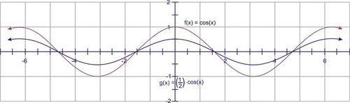

Determine the amplitude of $f(x)=10 \sin x$.

**Solution:**

The 10 indicates that the amplitude, or height, is 10. Therefore, the function rises and falls between 10 and -10.

Graph $g(x)=-5 \cos x$

**Solution:**

Even though the 5 is negative, the amplitude is still positive 5. The amplitude is always the absolute value of the constant $A$. However, the negative changes the appearance of the graph. Just like a parabola, the sine (or cosine) is flipped upside-down. Compare the blue graph, $g(x)=-5 \cos x$, to the red parent graph, $f(x)=\cos x$.

$ or $y=D \pm A \cos(x \pm C)$. Remember, if $0<|A|<1$, then the graph is shrunk and if $|A|>1$, then the graph is stretched. And, if $A$ is negative, then the graph is flipped.")

#### Example C

Graph $h(x) = -\frac{1}{4}\sin(x)$

**Solution:**

#### Guided Practice

1. Identify the minimum and maximum values of $y = \cos x$.

2. Identify the minimum and maximum values of $y = 2 \sin x$

3. Identify the minimum and maximum values of $y = -\sin x$

**Solutions:**

1. The cosine function ranges from -1 to 1, therefore the minimum is -1 and the maximum is 1.

2. The sine function ranges from -1 to 1, and since there is a two multiplied by the function, the minimum is -2 and the maximum is 2.

3. The sine function ranges between -1 and 1, so the minimum is -1 and the maximum is 1.

#### Concept Problem Solution

#### Explore More

Determine the amplitude of each function.

1. $y=3\sin(x)$

2. $y=-2\cos(x)$

3. $y=3+2\sin(x)$

4. $y=-1+\frac{2}{3}\sin(x)$

5. $y=-4+\cos(3x)$

Graph each function.

6. $y=4\sin(x)$

7. $y=-\cos(x)$

8. $y=\frac{1}{2}\sin(x)$

9. $y=-\frac{3}{4}\sin(x)$

10. $y=2\cos(x)$

Identify the minimum and maximum values of each function.

11. $y=5\sin(x)$

12. $y=-\cos(x)$

13. $y=1+2\sin(x)$

14. $y=-3+\frac{2}{3}\sin(x)$

15. $y=2+2\cos(x)$

16. How does changing the constant $k$ change the graph of $y=k\tan(x)$?

17. How does changing the constant $k$ change the graph of $y=k\sec(x)$?

</article>

### 3.9 Summary

<article>

1. $1 \ \text{degree} = \frac{\pi}{180} \ \text{radians}$

2. $1 \ \text{radian} = \frac{180}{\pi} \ \text{degrees}$

3. Relation between arc length $(l)$, radius $(r)$ and angle $(\theta)$ subtended by arc of circle at the centre is given by: $l = r \theta$, where θ is in radians.

4. $\sin^2 x + \cos^2 x=1$

5. $\sec^2 x = 1+ \tan^2 x$

6. $\text{cosec}^2 x = 1+ \cot^2 x$

7. $\sin(-\theta)= -\sin \theta,   \cos(-\theta) = \cos \theta,\tan(-\theta) = -\tan \theta$

8. $\text{cosec}(-\theta) =- \text{cosec } \theta, \sec(-\theta) = \sec \theta, \cot(-\theta) = -\cot \theta$

9. Function changes at odd multiples of $\frac{\pi}{2}$ and remains same at even multiples of $\frac{\pi}{2}$.

$\sin \left(\frac{\pi}{2} - \theta \right) = \cos \theta$

$\sin \left(\frac{\pi}{2} + \theta \right) = \cos \theta$

$\sin (\pi - \theta) = \sin \theta$

$\sin (\pi + \theta) = \sin \theta$

$\sin \left(\frac{3 \pi}{2} - \theta \right) = -\cos \theta$

$\sin \left(\frac{3 \pi}{2} + \theta \right) = -\cos \theta$

$\sin(2 \pi - \theta) = -\sin \theta$

$\sin(2 \pi + \theta) = \sin \theta$

Please note that sign of the trigonometric function depends on the quadrant in which angle terminates.

Similarly, other functions can also be written.

</article>

### 3.10 Self Assessments

<article>

#### Assessment 1

##### Radian Measure

http://www.ck12.org/trigonometry/Conversion-between-Degrees-and-Radians/asmtpractice/Conversion-between-Degrees-and-Radians-Practice/?referrer=concept_details

http://www.ck12.org/trigonometry/Six-Trigonometric-Functions-and-Radians/asmtpractice/Six-Trigonometric-Functions-and-Radians-Practice/?referrer=concept_details

http://www.ck12.org/trigonometry/Length-of-an-Arc/asmtpractice/Length-of-an-Arc-Practice/?referrer=concept_details

#### Assessment 2

##### Trigonometric Functions

http://www.ck12.org/trigonometry/Trigonometric-Functions-of-Angles-in-Standard-Position/asmtpractice/Trigonometric-Functions-of-Angles-in-Standard-Position-Practice/?referrer=concept_details

http://www.ck12.org/trigonometry/Trigonometric-Functions-of-Negative-Angles/asmtpractice/Trigonometric-Functions-of-Negative-Angles-Practice/?referrer=concept_details

http://www.ck12.org/trigonometry/Trigonometric-Functions-of-Angles-Greater-than-360-Degrees/asmtpractice/Trigonometric-Functions-of-Angles-Greater-than-360-Degrees-Practice/?referrer=concept_details

http://www.ck12.org/trigonometry/Cofunction-Identities-and-Reflection/asmtpractice/Cofunction-Identities-and-Reflection-Practice/?referrer=concept_details

http://www.ck12.org/trigonometry/Even-and-Odd-Identities/asmtpractice/Even-and-Odd-Identities-Practice/?referrer=concept_details

</article>

### 3.11 Home Assignments

<article>

#### Assignment 1

##### Angles and Radian Measure

NCERT Exercise No. 3.1

Q. No. 1(iii), (iv), 2(iii) (iv), 4, 7

#### Assignment 2

##### Trigonometric Functions

NCERT Exercise No. 3.2

Q. No. 3, 5, 9

</article>

### 3.12 References for Basic Understanding

<article>

#### 1. Six Trigonometric Ratios

http://www.ck12.org/trigonometry/Sine-Cosine-and-Tangent-Functions/lesson/Sine-Cosine-Tangent/

http://www.ck12.org/trigonometry/Secant-Cosecant-and-Cotangent-Functions/lesson/Secant-Cosecant-and-Cotangent-Functions/

</article>

### 3.13 References for Advanced Understanding

<article>

**1. Graphs of Multiples of Trigonometric Functions**

http://www.ck12.org/trigonometry/Sine-Graph-and-Cosine-Graph/lesson/Graphing-Sine-and-Cosine/

http://www.ck12.org/trigonometry/Translating-Sine-and-Cosine-Functions/lesson/Translating-Sine-and-Cosine-Functions/

http://www.ck12.org/trigonometry/Vertical-Translations/lesson/Vertical-Translations/

http://www.ck12.org/trigonometry/Horizontal-Translations-or-Phase-Shifts/lesson/Horizontal-Translations-or-Phase-Shifts/

http://www.ck12.org/trigonometry/Period/lesson/Graphing-Tangent/

http://www.ck12.org/trigonometry/General-Sinusoidal-Graphs/lesson/Putting-it-all-Together/

http://www.ck12.org/trigonometry/Amplitude-and-Period/lesson/Amplitude-and-Period/

http://www.ck12.org/trigonometry/Tangent-Graphs/lesson/Changes-in-the-Period-of-a-Sine-and-Cosine-Function/

http://www.ck12.org/trigonometry/Trigonometric-Identities-and-Equations/lesson/Trigonometric-Identities-and-Equations/

</article>

## 4.0 Trigonometric Identities

<article>

</article>

### 4.1 Introduction

<article>

Now when you are very well aware of radian measure of angles and trigonometric functions and evaluation of trigonometric functions for any angle; so the study of trigonometric functions is being extended here by learning more trigonometric identities.

</article>

### 4.2 Trigonometric Identities of Sum and Difference of Angles

<article>

### Cosine Sum and Difference Formulae

While playing a board game with friends, you are using a spinner like this one:

“Do you think you can calculate the cosine of the difference between those angles?” he asks.

“Hmm,” you reply. “Sure. I think it's just $\cos (110^\circ - 80^\circ) = \cos 30^\circ$.”

Your friend smiles. “Are you sure?” he asks.

You realize you aren't sure at all. Can you solve this problem? Read this Concept, and by the end you'll be able to calculate the cosine of the difference of the angles.

#### Watch This

!?[0](https://www.youtube.com/watch?v=H-0jQTzfkWQ)

Watch the video at: http://www.ck12.org/flx/render/embeddedobject/52769

#### Guidance

When thinking about how to calculate values for trigonometric functions, it is natural to consider what the value is for the trigonometric function of a difference of two angles. For example, is $\cos 15^\circ = \cos (45^\circ - 30^\circ)$? Upon appearance, yes, it is. This section explores how to find an expression that would equal $\cos (45^\circ - 30^\circ)$. To simplify this, let the two given angles be $a$ and $b$ where $0 < b < a < 2\pi$.

Begin with the unit circle and place the angles $a$ and $b$ in standard position as shown in Figure A. Point Pt1 lies on the terminal side of $b$, so its coordinates are $(\cos b, \sin b)$ and Point Pt2 lies on the terminal side of $a$ so its coordinates are $(\cos a, \sin a)$. Place the $a - b$ in standard position, as shown in Figure B. The point A has coordinates $(1, 0)$ and the Pt3 is on the terminal side of the angle $a - b$, so its coordinates are $(\cos[a - b], \sin[a - b])$.

")

\[Figure 3\]

Triangles $OP_1P_2$ in figure A and Triangle $OAP_3$ in figure B are congruent. (Two sides and the included angle, $a - b$, are equal). Therefore the unknown side of each triangle must also be equal. That is: $d\ (A, P_3) = d\ (P_1, P_2)$

Applying the distance formula to the triangles in Figures A and B and setting them equal to each other:

$$
\sqrt{[\cos (a-b)-1]^2 + [\sin (a-b)-0]^2} = \sqrt{(\cos a - \cos b)^2+(\sin a - \sin b)^2}
$$

Square both sides to eliminate the square root.

$$
[\cos (a - b) - 1]^2 + [\sin (a-b)-0]^2 = (\cos a - \cos b)^2 + (\sin a - \sin b)^2
$$

Simplify this equation further,

$$
\begin{align*}
\cos^2 (a-b)-2 \cos(a-b)+ 1 + \sin^2 (a-b) & = \cos^2 a - 2 \cos a \cos b + \cos^2 b + \sin^2 a - 2 \sin a \sin b + \sin^2 b \\
\underbrace{\sin^2 (a-b) + \cos^2 (a-b)} - 2 \cos (a-b) + 1 & = \underbrace{\sin^2 a + \cos^2 a} - 2 \cos a \cos b + \underbrace{\sin^2 b + \cos^2 b} - 2 \sin a \sin b \\
1-2 \cos (a-b) + 1 & = 1 - 2 \cos a \cos b + 1 - 2 \sin a \sin b \\
2-2 \cos (a-b) & = 2-2 \cos a \cos b -2 \sin a \sin b \\
-2 \cos (a-b) & = -2 \cos a \cos b - 2 \sin a \sin b \\
\cos (a-b) & = \cos a \cos b + \sin a \sin b
\end{align*}
$$

In $\cos(a - b) = \cos a \cos b + \sin a \sin b$, the _difference_ formula for cosine, you can substitute $a - (- b) = a + b$ to obtain: $\cos(a + b) = \cos[a - (- b)]$ or $\cos a \cos (- b) + \sin a \sin(-b)$. since $\cos(-b) = \cos b$ and $\sin (-b) = -\sin b$, then $\cos(a + b) = \cos a \cos b - \sin a \sin b$, which is the _sum_ formula for cosine.

The sum/difference formulae for cosine can be used to establish other identities:

#### Example A

Find an equivalent form of $\cos \left (\frac{\pi}{2} - \theta \right )$ using the cosine difference formula.

**Solution:**

$$
\begin{align*}
\cos \left (\frac{\pi}{2} - \theta \right ) & = \cos \frac{\pi}{2} \cos \theta + \sin \frac{\pi}{2} \sin \theta \\
\cos \left (\frac{\pi}{2} - \theta \right ) & = 0 \times \cos \theta + 1 \times \sin \theta, \ \text{substitute}\ \cos \frac{\pi}{2} = 0 \ \text{and}\ \sin \frac{\pi}{2} = 1 \\
\cos \left (\frac{\pi}{2} - \theta \right ) & = \sin \theta
\end{align*}
$$

We know that is a true identity because of our understanding of the sine and cosine curves, which are a phase shift of $\frac{\pi}{2}$ off from each other.

The cosine formulae can also be used to find exact values of cosine that we weren’t able to find before, such as $15^\circ =(45^\circ - 30^\circ), 75^\circ =(45^\circ + 30^\circ)$, among others.

#### Example B

Find the exact value of $\cos 15^\circ$

**Solution:**

Use the difference formula where $a = 45^\circ$ and $b = 30^\circ$.

$$
\begin{align*}
\cos (45^\circ - 30^\circ) & = \cos 45^\circ \cos 30^\circ + \sin 45^\circ \sin 30^\circ \\
\cos 15^\circ & = \frac{\sqrt{2}}{2} \times \frac{\sqrt{3}}{2} + \frac{\sqrt{2}}{2} \times \frac{1}{2} \\
\cos 15^\circ & = \frac{\sqrt{6} + \sqrt{2}}{4}
\end{align*}
$$

#### Example C

Find the exact value of $\cos \frac{5 \pi}{12}$, in radians.

**Solution:**

$\cos \frac{5 \pi}{12} = \cos \left (\frac{\pi}{4} + \frac{\pi}{6} \right )$, notice that $\frac{\pi}{4} = \frac{3 \pi}{12}$ and $\frac{\pi}{6} = \frac{2 \pi}{12}$

$$
\begin{align*}
\begin{array}{rcl}
\cos \left (\frac{\pi}{4} + \frac{\pi}{6} \right )  &=& \cos \frac{\pi}{4} \cos \frac{\pi}{6} - \sin \frac{\pi}{4} \sin \frac{\pi}{6} \\ \\
&=& \frac{\sqrt{2}}{2} \times \frac{\sqrt{3}}{2} - \frac{\sqrt{2}}{2} \times \frac{1}{2} \\ \\
 &=& \frac{\sqrt{6} - \sqrt{2}}{4}
\end{array}
\end{align*}
$$

#### Guided Practice

1. Find the exact value for $\cos \frac{5 \pi}{12}$

2. Find the exact value for $\cos \frac{7 \pi}{12}$

3. Find the exact value for $\cos 345^\circ$

**Solutions:**

1. 

$$
\begin{align*}
\cos \frac{5 \pi}{12} & = \cos \left (\frac{2 \pi}{12} + \frac{3 \pi}{12} \right ) = \cos \left (\frac{\pi}{6} + \frac{\pi}{4} \right ) = \cos \frac{\pi}{6} \cos \frac{\pi}{4} - \sin \frac{\pi}{6} \sin \frac{\pi}{4} \\
& = \frac{\sqrt{3}}{2} \cdot \frac{\sqrt{2}}{2} - \frac{1}{2} \cdot \frac{\sqrt{2}}{2} = \frac{\sqrt{6}}{4} - \frac{\sqrt{2}}{4} = \frac{\sqrt{6} - \sqrt{2}}{4}
\end{align*}
$$

2. 

$$
\begin{align*}
\cos \frac{7 \pi}{12} & = \cos \left (\frac{4 \pi}{12} + \frac{3 \pi}{12} \right ) = \cos \left (\frac{\pi}{3} + \frac{\pi}{4} \right ) = \cos \frac{\pi}{3} \cos \frac{\pi}{4} - \sin \frac{\pi}{3} \sin \frac{\pi}{4} \\
& = \frac{1}{2} \cdot \frac{\sqrt{2}}{2} - \frac{\sqrt{3}}{2} \cdot \frac{\sqrt{2}}{2} = \frac{\sqrt{2}}{4} - \frac{\sqrt{6}}{4} = \frac{\sqrt{2} - \sqrt{6}}{4}
\end{align*}
$$

3. 

$$
\begin{align*}
\cos 345^\circ & = \cos(315^\circ + 30^\circ) = \cos 315^\circ \cos 30^\circ - \sin 315^\circ \sin 30^\circ \\
& = \frac{\sqrt{2}}{2} \cdot \frac{\sqrt{3}}{2} - (-\frac{\sqrt{2}}{2}) \cdot \frac{1}{2} = \frac{\sqrt{6} + \sqrt{2}}{4}
\end{align*}
$$

#### Concept Problem Solution

Prior to this Concept, it would seem that your friend was having some fun with you, since he figured you didn't know the cosine difference formula. But now, with this formula in hand, you can readily solve for the difference of the two angles:

$$
\begin{align*}
\begin{array}{rcl}
&& \cos(110^\circ - 80^\circ)\\
&=& (\cos 110^\circ)(\cos 80^\circ) + (\sin 110^\circ)(\sin 80^\circ)\\
&=& (-0.342)(0.174) + (0.9397)(0.9848)\\
&=& -0.0595 + 0.9254 \\
&=& 0.8659
\end{array}
\end{align*}
$$

Therefore, $\cos (110^\circ - 80^\circ) = 0.8659$

### Sine Sum and Difference Formulae

You are quite good at knowing the values of trigonometric functions. So much so that you and your friends play a game before class everyday to see who can get the most trigonometric functions of different angles correct. However, your friend Jiya keeps getting the trigonometric functions of more angles right. You're amazed by her memory, until she smiles one day and tells you that she's been fooling you all this time.

“What you do you mean?” you say.

“I have a trick that lets me calculate more functions in my mind by breaking them down into sums of angles.” she replies.

You're really surprised by this. And all this time you thought she just had an amazing memory!

“Here, let me show you,” she says. She takes a piece of paper out and writes down:

$\sin \frac{7\pi}{12}$

“This looks like an unusual value to remember for a trigonometric function. So I have a special rule that helps me to evaluate it by breaking it into a sum of different numbers.”

By the end of this Concept, you'll be able to calculate the above function using a special rule, just like Jiya does.

#### Watch This

!?[0](https://www.youtube.com/watch?v=hiNDDQyee2E)

Watch the video at: http://www.ck12.org/flx/render/embeddedobject/52765

#### Guidance

Our goal here is to figure out a formula that lets you break down the sine of a sum of two angles (or a difference of two angles) into a simpler formula that lets you use the sine of only one argument in each term.

To find $\sin(a + b)$:

$$
\begin{align*}
\sin(a + b) & = \cos \left [\frac{\pi}{2} - (a+b) \right ] && \text{Set}\ \theta = a + b\\
& = \cos \left [\left (\frac{\pi}{2} - a \right ) - b \right ]&& \text{Distribute the negative} \\ 
& = \cos \left (\frac{\pi}{2} - a \right ) \cos b + \sin \left (\frac{\pi}{2} - a \right ) \sin b && \text{Difference Formula for cosines} \\ 
& = \sin a \cos b + \cos a \sin b && \text{Co-function Identities}
\end{align*}
$$

In conclusion, $\sin(a + b) = \sin a \cos b + \cos a \sin b$, which is the _sum_ formula for sine.

To obtain the identity for $\sin(a - b)$:

$$
\begin{align*}
\sin(a - b) & = \sin[a + (-b)] \\ 
& = \sin a \cos(-b) + \cos a \sin (-b) && \text{Use the sine sum formula} \\ 
\sin(a - b) & = \sin a \cos b - \cos a \sin b && \text{Use}\ \cos(-b) = \cos b,\ \text{and}\ \sin(-b) = -\sin b
\end{align*}
$$

In conclusion, $\sin(a - b) = \sin a \cos b - \cos a \sin b$, so, this is the _difference_ formula for sine.

#### Example A

Find the exact value of $\sin \frac{5 \pi}{12}$

**Solution:**

Recall that there are multiple angles that add or subtract to equal any angle. Choose whichever formula that you feel more comfortable with.

$$
\begin{align*}
\begin{array}{rcl}
\sin \frac{5 \pi}{12}  &=& \sin \left (\frac{3 \pi}{12} + \frac{2 \pi}{12} \right ) \\ \\
 &=& \sin \frac{3 \pi}{12} \cos \frac{2 \pi}{12} + \cos \frac{3 \pi}{12} \sin \frac{2 \pi}{12} \\ \\
&=& \frac{\sqrt{2}}{2} \times \frac{\sqrt{3}}{2} + \frac{\sqrt{2}}{2} \times \frac{1}{2} \\ \\
 &=& \frac{\sqrt{6} + \sqrt{2}}{4}
\end{array}
\end{align*}
$$

#### Example B

Given $\sin \alpha = \frac{12}{13}$, where $\alpha$ is in Quadrant II, and $\sin \beta = \frac{3}{5}$, where $\beta$ is in Quadrant I, find the exact value of $\sin(\alpha + \beta)$.

**Solution:**

To find the exact value of $\sin(\alpha + \beta)$, here we use $\sin(\alpha + \beta) = \sin \alpha \cos \beta + \cos \alpha \sin \beta$. The values of $\sin \alpha$ and $\sin \beta$ are known, however the values of $\cos \alpha$ and $\cos \beta$ need to be found.

Use $\sin^2 \alpha + \cos^2 \alpha = 1$, to find the values of each of the missing cosine values.

For $\cos a : \sin^2 \alpha + \cos^2 \alpha = 1$, substituting $\sin \alpha = \frac{12}{13}$ transforms to $\left (\frac{12}{13} \right )^2 + \cos^2 \alpha =  \frac{144}{169} + \cos^2 \alpha = 1$ or $\cos^2 \alpha = \frac{25}{169} \cos \alpha = \pm \frac{5}{13}$, however, since $\alpha$ is in Quadrant II, the cosine is negative, $\cos \alpha = - \frac{5}{13}$.

For $\cos \beta$ use $\sin^2\beta + \cos^2\beta = 1$ and substitute $\sin \beta = \frac{3}{5}, \left (\frac{3}{5} \right )^2 + \cos^2 \beta =  \frac{9}{25} + \cos^2 \beta = 1$ or $\cos^2 \beta = \frac{16}{25}$ and $\cos \beta = \pm \frac{4}{5}$ and since $\beta$ is in Quadrant I, $\cos \beta = \frac{4}{5}$

Now the sum formula for the sine of two angles can be found:

$$
\begin{align*}
\sin (\alpha + \beta)& = \frac{12}{13} \times \frac{4}{5} + \left (- \frac{5}{13} \right ) \times \frac{3}{5}\ \text{or}\ \frac{48}{65} - \frac{15}{65} \\
\sin (\alpha + \beta)& = \frac{33}{65}
\end{align*}
$$

#### Example C

Find the exact value of $\sin 15^\circ$

**Solution:**

Recall that there are multiple angles that add or subtract to equal any angle. Choose whichever formula that you feel more comfortable with.

$$
\begin{align*}
\begin{array}{rcl}
\sin 15^\circ  &=& \sin \left (45^\circ - 30^\circ \right ) \\
 &=& \sin 45^\circ \cos 30^\circ - \cos 45^\circ \sin 30^\circ \\
&=& (0.707) \times (0.866) - (0.707) \times (0.5) \\
 &=& (0.612262) \times (0.3535) \\
&=& 0.2164\end{array}
\end{align*}
$$

#### Guided Practice

1. Find the exact value for $\sin 345^\circ$

2. Find the exact value for $\sin \frac{17 \pi}{12}$

3. If $\sin y = - \frac{5}{13}$, $y$ is in quad III, and $\sin z = \frac{4}{5}$, $z$ is in quad II find $\sin(y + z)$

**Solutions:**

1.

$$
\begin{align*}
\sin 345^\circ & = \sin (300^\circ + 45^\circ) = \sin 300^\circ \cos 45^ \circ + \cos 300^\circ \sin 45^\circ \\
& = - \frac{\sqrt{3}}{2} \cdot \frac{\sqrt{2}}{2} + \frac{1}{2} \cdot \frac{\sqrt{2}}{2} = - \frac{\sqrt{6}}{4} + \frac{\sqrt{2}}{4} = \frac{\sqrt{2} - \sqrt{6}}{4}
\end{align*}
$$

2.

$$
\begin{align*}
\sin \frac{17 \pi}{12} & = \sin \left (\frac{9 \pi}{12} + \frac{8 \pi}{12} \right ) = \sin \left (\frac{3\pi}{4} + \frac{2\pi}{3} \right ) = \sin \frac{3\pi}{4} \cos \frac{2\pi}{3} + \cos \frac{3\pi}{4} \sin \frac{2\pi}{3} \\
& = \frac{\sqrt{2}}{2} \cdot (-\frac{1}{2}) + - \frac{\sqrt{2}}{2} \cdot \frac{\sqrt{3}}{2} = -\frac{\sqrt{2}}{4} - \frac{\sqrt{6}}{4} = \frac{-\sqrt{2} - \sqrt{6}}{4}
\end{align*}
$$

3. If $\sin y = - \frac{5}{13}$ and in Quadrant III, then cosine is also negative. By the Pythagoras Theorem, the length of the side of the triangle is $12 (5^2 + b^2 = 13^2)$, so $\cos y = - \frac{12}{13}$. If the $\sin z = \frac{4}{5}$ and in Quadrant II, then the cosine is also negative. By the Pythagoras Theorem, the length of the side of the triangle is $3 (4^2 + b^2 = 5^2)$, so $\cos = - \frac{3}{5}$. To find $\sin(y + z)$, plug this information into the sine sum formula.

$$
\begin{align*}
\sin (y + z) & = \sin y \cos z + \cos y \sin z \\
& = - \frac{5}{13} \cdot - \frac{3}{5} + - \frac{12}{13} \cdot \frac{4}{5} = \frac{15}{65} - \frac{48}{65} = - \frac{33}{65}
\end{align*}
$$

### Tangent Sum and Difference Formulae

Suppose you were given two angles and asked to find the tangent of the difference of them. For example, can you compute:

$\tan (120^\circ - 40^\circ)$

Would you just subtract the angles and then take the tangent of the result? Or is something more complicated required to solve this problem? Keep reading, and by the end of this Concept, you'll be able to calculate trigonometric functions like the one above.

#### Watch This

!?[0](https://www.youtube.com/watch?v=OQP78bwYcWw)

Watch the video at: http://www.ck12.org/flx/render/embeddedobject/52766

#### Guidance

In this Concept, we want to find a formula that will make computing the tangent of a sum of arguments or a difference of arguments easier. As first, it may seem that you should just add (or subtract) the arguments and take the tangent of the result. However, it's not quite that easy.

To find the sum formula for tangent:

$$
\begin{align*}
\tan(a + b) & = \frac{\sin(a+b)}{\cos(a+b)} && \text{Using}\  \tan \theta = \frac{\sin \theta}{\cos \theta} \\
& = \frac{\sin a \cos b + \sin b \cos a}{\cos a \cos b - \sin a \sin b} && \text{Substituting the sum formulas for sine and cosine} \\
& = \frac{\frac{\sin a \cos b + \sin b \cos a}{\cos a \cos b}}{\frac{\cos a \cos b - \sin a \sin b}{\cos a \cos b}} && \text{Divide both the numerator and the denominator by}\ \cos a \cos b \\
& = \frac{\frac{\sin a \cos b} {\cos a \cos b} + \frac{\sin b \cos a}{\cos a \cos b}}{\frac{\cos a \cos b} {\cos a \cos b} - \frac{\sin a \sin b}{\cos a \cos b}} && \text{Reduce each of the fractions} \\ 
& = \frac{\frac{\sin a}{\cos a} + \frac{\sin b}{\cos b}}{1- \frac{\sin a \sin b}{\cos a \cos b}} && \text{Substitute}\ \frac{\sin \theta}{\cos \theta} = \tan \theta \\
\tan(a + b) & = \frac{\tan a + \tan b}{1 - \tan a \tan b} && \text{Sum formula for tangent}
\end{align*}
$$

In conclusion, $\tan(a+b) = \frac{\tan a + \tan b}{1 - \tan a \tan b}$. Substituting $-b$ for $b$ in the above results in the difference formula for tangent:

$$
\tan(a-b) = \frac{\tan a - \tan b}{1 + \tan a \tan b}
$$

#### Example A

Find the exact value of $\tan 285^\circ$.

**Solution:**

Use the difference formula for tangent, with $285^\circ = 330^\circ - 45^\circ$

$$
\begin{align*}
\tan (330^\circ - 45^\circ) & = \frac{\tan 330^\circ - \tan 45^\circ}{1 + \tan 330^\circ \tan 45^\circ} \\
& = \frac{- \frac{\sqrt{3}}{3} - 1}{1 - \frac{\sqrt{3}}{3} \cdot 1} = \frac{-3 - \sqrt{3}}{3-\sqrt{3}} \\
& = \frac{-3- \sqrt{3}}{3- \sqrt{3}} \cdot \frac{3+ \sqrt{3}}{3+ \sqrt{3}} \\
& = \frac{-9-6 \sqrt{3} -3}{9-3} \\
& = \frac{-12 - 6 \sqrt{3}}{6} \\
& = - 2 - \sqrt{3}
\end{align*}
$$

#### Example B

Find the exact value of $\tan 165^\circ$.

**Solution:**

Use the difference formula for tangent, with $165^\circ = 225^\circ - 60^\circ$

$$
\begin{align*}
\tan (225^\circ - 60^\circ) & = \frac{\tan 225^\circ - \tan 60^\circ}{1 + \tan 225^\circ \tan 60^\circ} \\
& = \frac{1 - \sqrt{3}}{1 - 1 \cdot \sqrt{3}} = 1 \\
\end{align*}
$$

#### Example C

Find the exact value of $\tan \left(-\frac{\pi}{12}\right)$.

**Solution:**

This angle is the difference between $\frac{\pi}{4}$ and $\frac{\pi}{3}$.

$$
\begin{align*}
\tan \left(\frac{\pi}{4}-\frac{\pi}{3}\right) &=\frac{\tan \frac{\pi}{4}-\tan \frac{\pi}{3}}{1+\tan \frac{\pi}{4} \tan \frac{\pi}{3}} \\
&=\frac{1-\sqrt{3}}{1+\sqrt{3}}
\end{align*}
$$

This angle is also the same as $\frac{23 \pi}{12}$. You could have also used this value and done $\tan\left(\frac{\pi}{4}+\frac{5 \pi}{3}\right)$ and arrived at the same answer.

#### Guided Practice

1. Find the exact value for $\tan 75^\circ$

2. Simplify $\tan(\pi + \theta)$

3. Find the exact value for $\tan 15^\circ$

4. Find the exact value of $\tan 255^\circ$

**Solutions:**

1.

$$
\begin{align*}
\tan 75^\circ &= \tan (45^\circ + 30^\circ)\\
&= \frac{\tan 45^\circ + \tan 30^\circ}{1- \tan 45^\circ \tan 30^\circ} \\
&= \frac{1 + \frac{\sqrt{3}}{3}}{1 - 1 \cdot \frac{\sqrt{3}}{3}} = \frac{\frac{3+\sqrt{3}}{3}}{\frac{3-\sqrt{3}}{3}}\\
&= \frac{3+\sqrt{3}}{3-\sqrt{3}} \cdot \frac{3+\sqrt{3}}{3+\sqrt{3}}\\
&= \frac{9+6 \sqrt{3} + 3}{9-3} = \frac{12 + 6 \sqrt{3}}{6}\\
&= 2 + \sqrt{3}
\end{align*}
$$

2. $\tan (\pi + \theta) = \frac{\tan \pi + \tan \theta}{1- \tan \pi \tan \theta} = \frac{\tan \theta}{1} = \tan \theta$

3.

$$
\begin{align*}
\tan 15^\circ &= \tan (45^\circ - 30^\circ)\\
&= \frac{\tan 45^\circ - \tan 30^\circ}{1+ \tan 45^\circ \tan 30^\circ} \\
&= \frac{1 - \frac{\sqrt{3}}{3}}{1 + 1 \cdot \frac{\sqrt{3}}{3}} = \frac{\frac{3-\sqrt{3}}{3}}{\frac{3+\sqrt{3}}{3}}\\
&= \frac{3-\sqrt{3}}{3+\sqrt{3}} \cdot \frac{3-\sqrt{3}}{3-\sqrt{3}}\\
&= \frac{9+6 \sqrt{3} + 3}{9-3} = \frac{12 + 6 \sqrt{3}}{6}\\
&= 2 + \sqrt{3}
\end{align*}
$$

4.

$$
\begin{align*}
\tan (210^\circ + 45^\circ) &=\frac{\tan 210^\circ+\tan 45^\circ}{1-\tan 210^\circ \tan 45^\circ} \\
&= \frac{\frac{\sqrt{3}}{3}+1}{1-\frac{\sqrt{3}}{3}}=\frac{\frac{\sqrt{3}+3}{3}}{\frac{3-\sqrt{3}}{3}}=\frac{\sqrt{3}+3}{3-\sqrt{3}}
\end{align*}
$$

#### Concept Problem Solution

The Concept Problem asks you to find:

$\tan (120^\circ - 40^\circ)$

You can use the tangent difference formula:

$$
\tan(a-b) = \frac{\tan a - \tan b}{1 + \tan a \tan b}
$$

to help solve this. Substituting in known quantities:

$$
\tan(120^\circ - 40^\circ) = \frac{\tan 120^\circ - \tan 40^\circ}{1 + (\tan 120^\circ)(\tan 40^\circ)} = \frac{-1.732 - .839}{1 + (-1.732)(.839)} = \frac{-2.571}{-.453148} = 5.674
$$

#### Explore More

Find the exact value for each cosine expression.

1. $\cos75^\circ$

2. $\cos105^\circ$

3. $\cos165^\circ$

4. $\cos255^\circ$

5. $\cos-15^\circ$

Write each expression as the cosine of an angle.

6. $\cos96^\circ\cos20^\circ+\sin96^\circ\sin20^\circ$

7. $\cos4x\cos3x-\sin4x\sin3x$

8. $\cos37^\circ\cos12^\circ+\sin37^\circ\sin12^\circ$

9. $\cos59^\circ\cos10^\circ-\sin59^\circ\sin10^\circ$

10. $\cos5y\cos2y+\sin5y\sin2y$

11. Prove that $\cos(x-\frac{\pi}{4})=\frac{\sqrt{2}}{2}(\cos(x)+\sin(x))$

Find the exact value for each sine expression.

12. $\sin75^\circ$

13. $\sin105^\circ$

14. $\sin165^\circ$

15. $\sin255^\circ$

16. $\sin-15^\circ$

Write each expression as the sine of an angle.

17. $\sin46^\circ\cos20^\circ+\cos46^\circ\sin20^\circ$

18. $\sin3x\cos2x-\cos3x\sin2x$

19. $\sin54^\circ\cos12^\circ+\cos54^\circ\sin12^\circ$

20. $\sin29^\circ\cos10^\circ-\cos29^\circ\sin10^\circ$

21. $\sin4y\cos3y+\cos4y\sin2y$

22. Prove that $\sin(x-\frac{\pi}{2})=-\cos(x)$

Find the exact value for each tangent expression.

23. $\tan\frac{5\pi}{12}$

24. $\tan\frac{11\pi}{12}$

25. $\tan-165^\circ$

26. $\tan255^\circ$

27. $\tan-15^\circ$

Write each expression as the tangent of an angle.

28. $\frac{\tan15^\circ+\tan42^\circ}{1-\tan15^\circ\tan42^\circ}$

29. $\frac{\tan65^\circ-\tan12^\circ}{1+\tan65^\circ\tan12^\circ}$

30. $\frac{\tan10^\circ+\tan50^\circ}{1-\tan10^\circ\tan50^\circ}$

31. $\frac{\tan2y+\tan4}{1-\tan2\tan4y}$

32. $\frac{\tan x-\tan3x}{1+\tan x\tan3x}$

33. $\frac{\tan2x-\tan y}{1+\tan2x\tan y}$

34. Prove that $\tan(x+\frac{\pi}{4})=\frac{1+\tan(x)}{1-\tan(x)}$

35. Prove that $\tan(x+y)\tan(x-y)=\frac{\tan^2(x)-\tan^2(y)}{1-\tan^2(x)\tan^2(y)}$

</article>

### 4.3 Trigonometric Identities for Sum or Difference of Sine and Cosine Functions

<article>

### Sum to Product Formulae for Sine and Cosine

Can you solve problems that involve the sum of sines or cosines? For example, consider the equation:

$\cos 10t + \cos 3t$

You could just compute each expression separately and add their values at the end. However, there is an easier way to do this. You can simplify the equation first, and then solve.

Read this Concept, and at the end of it, you'll be able to simplify this equation and transform it into a product of trigonometric functions instead of a sum!

#### Watch This

In the first portion of this video, you'll learn about the Sum to Product formulae.

!?[0](https://www.youtube.com/watch?v=ps4Z01gFOpM)

Watch the video at: http://www.ck12.org/flx/render/embeddedobject/52767

#### Guidance

In some problems, the product of two trigonometric functions is more conveniently found by the sum of two trigonometric functions by use of identities such as this one:

$$
\sin \alpha + \sin \beta = 2 \sin \frac{\alpha + \beta}{2} \times \cos \frac{\alpha - \beta}{2}
$$

This can be verified by using the sum and difference formulae:

$$
\begin{align*}
2 \sin \frac{\alpha + \beta}{2} \cos \frac{\alpha - \beta}{2} &= 2 \begin{bmatrix} \sin \left( \frac{\alpha}{2} + \frac{\beta}{2} \right) \cos \left(\frac{\alpha}{2} - \frac{\beta}{2} \right) \end{bmatrix} \\ &= 2 \begin{bmatrix} \left( \sin \frac{\alpha}{2} \cos \frac{\beta}{2} + \cos \frac{\alpha}{2} \sin \frac{\beta}{2} \left) \right( \cos \frac{\alpha}{2} \cos \frac{\beta}{2} + \sin \frac{\alpha}{2} \sin \frac{\beta}{2} \right ) \end{bmatrix}\\ &= 2 \begin{bmatrix} \sin \frac{\alpha}{2} \cos \frac{\alpha}{2} \cos ^2 \frac{\beta}{2} + \sin ^2 \frac{\alpha}{2} \sin \frac{\beta}{2} \cos \frac{\beta}{2} + \sin \frac{\beta}{2} \cos ^2 \frac{\alpha}{2} \cos \frac{\beta}{2} + \sin \frac{\alpha}{2} \sin ^2 \frac{\beta}{2} \cos \frac{\alpha}{2} \end{bmatrix}\\ &= 2 \begin{bmatrix} \sin \frac{\alpha}{2} \cos \frac{\alpha}{2} \left( \sin^2 \frac{\beta}{2} + \cos^2 \frac{\beta}{2} \right) + \sin \frac{\beta}{2} \cos \frac{\beta}{2} \left( \sin^2 \frac{\alpha}{2} + \cos^2 \frac{\alpha}{2} \right) \end{bmatrix}\\ &= 2 \begin{bmatrix} \sin \frac{\alpha}{2} \cos \frac{\alpha}{2} + \sin \frac{\beta}{2} \cos \frac{\beta}{2} \end{bmatrix}\\ &= 2 \sin \frac{\alpha}{2} \cos \frac{\alpha}{2} + 2 \sin \frac{\beta}{2} \cos \frac{\beta}{2}\\ &= \sin \left( 2 \cdot \frac{\alpha}{2} \right) + \sin \left( 2 \cdot \frac{\beta}{2} \right)\\ &= \sin \alpha + \sin \beta
\end{align*}
$$

The following variations can be derived similarly:

$$
\begin{align*}
\sin \alpha - \sin \beta &= 2 \sin \frac{\alpha - \beta}{2} \times \cos \frac{\alpha + \beta}{2}\\ \cos \alpha + \cos \beta &= 2 \cos \frac{\alpha + \beta}{2} \times \cos \frac{\alpha - \beta}{2}\\ \cos \alpha - \cos \beta &= -2 \sin \frac{\alpha + \beta}{2} \times \sin \frac{\alpha - \beta}{2}\\
\end{align*}
$$

Here are some examples of this type of transformation from a sum of terms to a product of terms.

#### Example A

Change $\sin 5x - \sin 9x$ into a product.

**Solution:**

Use the formula $\sin \alpha - \sin \beta = 2 \sin \frac{\alpha - \beta}{2} \times \cos \frac{\alpha + \beta}{2}.$

$$
\begin{align*}
\sin 5x - \sin 9x &= 2 \sin \frac{5x - 9x}{2} \cos \frac{5x + 9x}{2}\\ &= 2 \sin (-2x) \cos 7x\\ &= -2 \sin 2x  \cos 7x
\end{align*}
$$

#### Example B

Change $\cos(-3x) + \cos 8x$ into a product.

**Solution:**

Use the formula $\cos \alpha + \cos \beta = 2 \cos \frac{\alpha + \beta}{2} \times \cos \frac{\alpha - \beta}{2}$

$$
\begin{align*}
\cos (-3x) + \cos (8x) &= 2 \cos \frac{-3x + 8x}{2} \cos \frac {-3x - 8x}{2}\\ &= 2 \cos (2.5x) \cos (-5.5x)\\ &= 2 \cos (2.5x) \cos (5.5x)
\end{align*}
$$

#### Guided Practice

1. Express the sum as a product: $\sin 9x + \sin 5x$

2. Express the difference as a product: $\cos 4y - \cos 3y$

3. Verify the identity (using sum-to-product formula): $\frac{\cos 3a - \cos 5a}{\sin 3a - \sin 5a} = - \tan 4a$

**Solutions:**

1. Using the sum-to-product formula:

$$
\begin{align*}
\begin{array}{rcl}
& & \sin 9x + \sin 5x\\ \\
& = & 2 \left(\sin \left(\frac{9x + 5x}{2} \right) \cos \left(\frac{9x - 5x}{2} \right) \right)\\ \\
& = & 2 \sin 7x \cos 2x
\end{array}
\end{align*}
$$

2. Using the difference-to-product formula:

$$
\begin{align*}
\begin{array}{rcl}
& & \cos 4y - \cos 3y\\ \\
& = & -2 \sin \left(\frac{4y + 3y}{2} \right) \sin \left(\frac{4y - 3y}{2} \right)\\  \\
& = & -2 \sin \frac{7y}{2} \sin \frac{y}{2}
\end{array}
\end{align*}
$$

3. Using the difference-to-product formulae:

$$
\begin{align*}
\begin{array}{rcl}
\text{LHS} &=& \frac{\cos 3a - \cos 5a}{\sin 3a - \sin 5a}\\ \\
 & = & \frac{-2 \sin \left (\frac{3a + 5a}{2} \right ) \sin \left (\frac {3a - 5a}{2} \right )}{2 \sin \left (\frac{3a - 5a}{2} \right ) \cos \left(\frac{3a + 5a}{2} \right)}\\ \\
& = & - \frac{\sin 4a}{\cos 4a}\\ \\
& = & - \tan 4a
\end{array}
\end{align*}
$$

#### Concept Problem Solution

Prior to learning the sum to product formulae for sine and cosine, evaluating a sum of trigonometric functions, such as

$\cos 10t + \cos 3t$

might have been considered difficult. But you can easily transform this equation into a product of two trigonometric functions using:

$\cos \alpha + \cos \beta = 2 \cos \frac{\alpha + \beta}{2} \times \cos \frac{\alpha - \beta}{2}$

Substituting the known quantities:

$\cos 10t + \cos 3t = 2 \cos \frac{13t}{2} \times \cos \frac{7t}{2} = 2\cos(6.5t) \cos(3.5t)$

#### Explore More

Change each sum or difference into a product.

1. $\sin 3x + \sin 2x$

2. $\cos 2x + \cos 5x$

3. $\sin (-x) - \sin 4x$

4. $\cos 12x + \cos 3x$

5. $\sin 8x - \sin 4x$

6. $\sin x + \sin \frac{1}{2}x$

7. $\cos 3x - \cos (-3x)$

Change each product into a sum or difference.

8. $-2\sin 3.5x \sin 2.5x$

9. $2\cos 3.5x \sin 0.5x$

10. $2\cos 3.5x \cos 5.5x$

11. $2\sin 6x \cos 2x$

12. $-2\sin 3x \sin x$

13. $2\sin 4x \cos x$

14. Show that $\cos\frac{A+B}{2}\cos\frac{A-B}{2}=\frac{1}{2}(\cos A + \cos B)$.

15. Let $u=\frac{A+B}{2}$ and $v=\frac{A-B}{2}$. Show that $\cos u\cos v =\frac{1}{2}(\cos (u+v)+\cos(u-v)).$

</article>

### 4.4 Trigonometric Identities for Product of Sine and Cosine Functions

<article>

Let's say you are in class one day, working on calculating the values of trigonometric functions, when your instructor gives you an expression like this:

$\sin 75^\circ \sin 15^\circ$

Can you solve this sort of expression? You might want to just calculate each term separately and then compute the result. However, there is another way. You can transform this product of trigonometric functions into a sum of trigonometric functions.

Read on, and by the end of this Concept, you'll know how to solve this problem by changing it into a sum of trigonometric functions.

#### Watch This

In the second portion of this video you'll learn about Product to Sum formulae.

!?[0](https://www.youtube.com/watch?v=ps4Z01gFOpM)

Watch the video at: http://www.ck12.org/flx/render/embeddedobject/52767

#### Guidance

Here we'll begin by deriving formulae for how to convert the product of two trigonometric functions into a sum or difference of trigonometric functions.

There are two formulae for transforming a product of sine or cosine into a sum or difference. First, let’s look at the product of the sine of two angles. To do this, we need to start with the cosine of the difference of two angles.

$$
\begin{align*}
& \cos(a - b) = \cos a \cos b + \sin a \sin b \ \text {and} \ \cos(a + b) = \cos a \cos b - \sin a \sin b \\
& \cos(a - b) -  \cos (a + b) = \cos a \cos b + \sin a \sin b - (\cos a \cos b - \sin a \sin b)\\
& \cos(a - b) -  \cos (a + b) = \cos a \cos b + \sin a \sin b - \cos a \cos b + \sin a \sin b\\
& \qquad \qquad \qquad \qquad \cos (a - b) - \cos (a + b) = 2 \sin a \sin b\\
& \qquad \qquad \qquad \qquad \frac{1}{2}\left[ \cos (a - b) - \cos (a+ b)\right] = \sin a \sin b
\end{align*}
$$

The following product to sum formulae can be derived using the same method:

$$
\begin{align*}
\cos \alpha \cos \beta &= \frac {1}{2} \left [ \cos (\alpha - \beta) + \cos (\alpha + \beta) \right ]\\
\sin \alpha \cos \beta  &= \frac {1}{2} \left [\sin (\alpha + \beta) + \sin (\alpha - \beta) \right ]\\
\cos \alpha \sin \beta  &= \frac {1}{2} \left[\sin (\alpha + \beta) - \sin (\alpha - \beta) \right ]
\end{align*}
$$

Armed with these four formulae, we can work some examples.

#### Example A

Change $\cos 2x \cos 5y$ to a sum.

**Solution:**

Use the formula $\cos \alpha \cos \beta = \frac{1}{2} \left [\cos (\alpha - \beta) +  \cos (\alpha + \beta) \right ]$. Set $\alpha = 2x$ and $\beta = 5y$.

$$
\cos 2x \cos 5y = \frac{1}{2} \left [\cos (2x - 5y) + \cos (2x + 5y) \right ]
$$

#### Example B

Change $\frac{\sin11z + \sin z}{2}$ to a product.

**Solution:**

Use the formula $\sin \alpha \cos \beta = \frac{1}{2} \left [\sin (\alpha + \beta) + \sin (\alpha - \beta) \right ]$. Therefore, $\alpha + \beta = 11z$ and $\alpha - \beta = z$. Solve the second equation for $\alpha$ and plug that into the first.

$$
\begin{align*}
\alpha = z + \beta \rightarrow (z + \beta) + \beta = 11z && \text {and} \quad \alpha = z + 5z = 6z\\
z + 2 \beta = 11z\\
2 \beta = 10z\\
\beta = 5z
\end{align*}
$$

$\frac{\sin11z + \sin z}{2} = \sin 6z \cos 5z$. Again, the sum of $6z$ and $5z$ is $11z$ and the difference is $z$.

#### Guided Practice

1. Express the product as a sum: $\sin(6 \theta) \sin(4 \theta)$

2. Express the product as a sum: $\sin(5 \theta) \cos(2 \theta)$

3. Express the product as a sum: $\cos(10 \theta) \sin(3 \theta)$

---

**Solutions:**

1. Using the product-to-sum formula:

$$
\begin{align*}
\begin{array}{rcl}
& & \sin 6 \theta \sin 4 \theta\\ \\ 
& = & \frac{1}{2} \left( \cos (6 \theta - 4 \theta) - \cos (6 \theta + 4 \theta) \right )\\ \\ 
& = & \frac{1}{2}(\cos 2 \theta - \cos 10 \theta)
\end{array}
\end{align*}
$$

2. Using the product-to-sum formula:

$$
\begin{align*}
\begin{array}{rcl}
& & \sin 5 \theta \cos 2 \theta\\ \\
& = & \frac{1}{2} \left( \sin ( 5 \theta + 2 \theta) - \sin ( 5 \theta - 2 \theta) \right )\\ \\
& = & \frac{1}{2}(\sin 7 \theta - \sin 3 \theta)
\end{array}
\end{align*}
$$

3. Using the product-to-sum formula:

$$
\begin{align*}
\begin{array}{rcl}
& & \cos 10 \theta \sin 3 \theta\\ \\
& = &  \frac{1}{2} \left( \sin ( 10 \theta + 3 \theta) - \sin ( 10 \theta - 3 \theta) \right )\\ \\
& = &  \frac{1}{2}(\sin 13 \theta - \sin 7 \theta)
\end{array}
\end{align*}
$$

#### Concept Problem Solution

Changing $\sin 75^\circ \sin 15^\circ$ to a product of trigonometric functions can be accomplished using

$\sin a \sin b = \frac{1}{2}\left[ \cos (a - b) - \cos (a+ b)\right]$

Substituting in known values gives:

$\sin 75^\circ \sin 15^\circ = \frac{1}{2}\left[ \cos (60^\circ) - \cos (90^\circ)\right] = \frac{1}{2}[\frac{1}{2} - 0] = \frac{1}{4}$

#### Explore More

Express each product as a sum or difference.

1. $\sin(5 \theta) \sin(3 \theta)$

2. $\sin(6 \theta) \cos( \theta)$

3. $\cos(4 \theta) \sin(3 \theta)$

4. $\cos(\theta) \cos(4 \theta)$

5. $\sin(2 \theta) \sin(2 \theta)$

6. $\cos(6 \theta) \sin(8 \theta)$

7. $\sin(7 \theta) \cos(4 \theta)$

8. $\cos(11 \theta) \cos(2 \theta)$

---

Express each sum or difference as a product.

9. $\frac{\sin8\theta + \sin6\theta}{2}$

10. $\frac{\sin6\theta - \sin2\theta}{2}$

11. $\frac{\cos12\theta + \cos6\theta}{2}$

12. $\frac{\cos12\theta - \cos4\theta}{2}$

13. $\frac{\sin10\theta + \sin4\theta}{2}$

14. $\frac{\sin8\theta - \sin2\theta}{2}$

15. $\frac{\cos8\theta - \cos4\theta}{2}$

</article>

### 4.5 Trigonometric Identities of Double Angles

<article>

Here we'll start with the sum and difference formulae for sine, cosine, and tangent. We can use these identities to help derive a new formula for when we are given a trigonometric function that has twice a given angle as the argument. For example, $\sin (2 \theta)$. This way, if we are given $\theta$ and are asked to find $\sin (2 \theta)$, we can use our new double angle identity to help simplify the problem.

#### Watch This

!?[0](https://www.youtube.com/watch?v=-zhCYiHcVIE)

Watch the video at: http://www.ck12.org/flx/render/embeddedobject/143660

#### Guidance

Let's start with the derivation of the double angle identities.

One of the formulas for calculating the sum of two angles is:

$$
\sin (\alpha + \beta) = \sin \alpha \cos \beta + \cos \alpha \sin \beta
$$

If $\alpha$ and $\beta$ are both the same angle in the above formula, then

$$
\begin{align*}
\sin (\alpha + \alpha) & = \sin \alpha \cos \alpha + \cos \alpha \sin \alpha \\
\sin 2 \alpha & = 2 \sin \alpha \cos \alpha
\end{align*}
$$

This is the double angle formula for the sine function. The same procedure can be used in the sum formula for cosine, start with the sum angle formula:

$$
\cos (\alpha + \beta) = \cos \alpha \cos \beta - \sin \alpha \sin \beta
$$

If $\alpha$ and $\beta$ are both the same angle in the above formula, then

$$
\begin{align*}
\cos (\alpha + \alpha )& = \cos \alpha \cos \alpha - \sin \alpha \sin \alpha \\
\cos 2 \alpha & = \cos^2 \alpha - \sin^2 \alpha
\end{align*}
$$

This is one of the double angle formulae for the cosine function. Two more formulas can be derived by using the Pythagoras Identity, $\sin^2 \alpha + \cos^2 \alpha = 1$.

$\sin^2 \alpha = 1 - \cos^2 \alpha$ and likewise $\cos^2 \alpha = 1 - \sin^2 \alpha$

$$
\begin{align*}
\text{Using}\ \sin^2 \alpha & = 1 - \cos^2 \alpha: && \text{Using}\ \cos^2 \alpha = 1 - \sin^2 \alpha: \\
\cos 2 \alpha & = \cos^2 \alpha - \sin^2 \alpha && \qquad \ \ \cos 2 \alpha = \cos^2 \alpha - \sin^2 \alpha \\
& = \cos^2 \alpha - (1 - \cos^2 \alpha) &&  \qquad \qquad \quad \ = (1 - \sin^2 \alpha) - \sin^2 \alpha \\
& = \cos^2 \alpha - 1 + \cos^2 \alpha &&  \qquad \qquad \quad \ = 1 - \sin^2 \alpha - \sin^2 \alpha  \\
& = 2 \cos^2 \alpha - 1 &&  \qquad \qquad \quad \ = 1 - 2 \sin^2 \alpha
\end{align*}
$$

Therefore, the double angle formulae for $\cos 2 \alpha$ are:

$$
\begin{align*}
\cos 2 \alpha & = \cos^2 \alpha - \sin^2 \alpha \\
\cos 2 \alpha & = 2 \cos^2 \alpha -1 \\
\cos 2 \alpha & = 1 - 2 \sin^2 \alpha
\end{align*}
$$

Finally, we can calculate the double angle formula for tangent, using the tangent sum formula:

$$
\tan(\alpha + \beta) = \frac{\tan \alpha + \tan \beta}{1 - \tan \alpha \tan \beta}
$$

If $\alpha$ and $\beta$ are both the same angle in the above formula, then

$$
\begin{align*}
\tan (\alpha + \alpha) & = \frac{\tan \alpha + \tan \alpha}{1 - \tan \alpha \tan \alpha} \\
\tan 2 \alpha & = \frac{2 \tan \alpha}{1 - \tan^2 \alpha}
\end{align*}
$$

We can use these formulae to help simplify calculations of trigonometric functions of certain arguments.

#### Example A

If $\sin a = \frac{5}{13}$ and $a$ is in Quadrant II, find $\sin 2a$, $\cos 2a$, and $\tan 2a$.

**Solution:**

To use $\sin 2a = 2 \sin a \cos a$, the value of $\cos a$ must be found first.

$$
\begin{array}{rcl}
\cos^2 a + \sin^2 a = 1. \\
\cos^2 a + \left (\frac{5}{13} \right )^2 = 1. \\
\cos^2 a + \frac{25}{169} = 1. \\
\cos^2 a = \frac{144}{169}, \cos a = \pm \frac{12}{13}
\end{array}
$$

However since $a$ is in Quadrant II, $\cos a$ is negative or $\cos a = - \frac{12}{13}$.

$$
\sin 2a = 2 \sin a \cos a = 2 \left (\frac{5}{13} \right ) \times \left (- \frac{12}{13} \right ) = \sin 2a = - \frac{120}{169}
$$

For $\cos 2a$, use $\cos(2a) = \cos^2 a - \sin^2 a$

$$
\begin{align*}
\cos(2a) & = \left (- \frac{12}{13} \right )^2 - \left (\frac{5}{13} \right )^2 \ \text{or}\ \frac{144-25}{169} \\
\cos (2a) & = \frac{119}{169}
\end{align*}
$$

For $\tan 2a$, use $\tan 2a = \frac{\sin 2a}{\cos 2a} = \frac{\frac{-120}{169}}{\frac{119}{169}} = -\frac{120}{119}$

#### Example B

Find $\cos 4 \theta$.

**Solution:**

Think of $\cos 4 \theta$ as $\cos (2 \theta + 2 \theta)$.

$$
\cos 4 \theta = \cos (2 \theta + 2 \theta) = \cos 2 \theta \cos 2 \theta - \sin 2 \theta \sin 2 \theta = \cos^2 2 \theta - \sin^2 2 \theta
$$

Now, use the double angle formulas for both sine and cosine. For cosine, you can pick which formula you would like to use. In general, because we are proving a cosine identity, stay with cosine.

$$
\begin{align*}
& = (2 \cos^2 \theta - 1)^2 - (2 \sin \theta \cos \theta)^2 \\
& = 4 \cos^4 \theta - 4 \cos^2 \theta + 1 - 4 \sin^2 \theta \cos^2 \theta \\
& = 4 \cos^4  \theta - 4 \cos^2 \theta + 1 - 4 (1 - \cos^2 \theta) \cos^2 \theta \\
& = 4 \cos^4 \theta - 4 \cos^2 \theta + 1 - 4 \cos^2 \theta + 4 \cos^4 \theta \\
& = 8 \cos^4 \theta - 8 \cos^2 \theta + 1
\end{align*}
$$

#### Guided Practice

1. If $\sin x = \frac{4}{5}$ and $x$ is in Quad II, find the exact values of $\cos 2x, \sin 2x$ and $\tan 2x$

2. Find the exact value of $\cos^2 15^\circ - \sin^2 15^\circ$

3. Verify the identity: $\cos 3 \theta = 4 \cos^3\theta - 3 \cos \theta$

**Solutions:**

1. If $\sin x = \frac{4}{5}$ and in Quadrant II, then cosine and tangent are negative. Also, by the Pythagoras Theorem, the third side is $3(b = \sqrt{5^2 - 4^2})$. So, $\cos x = - \frac{3}{5}$ and $\tan x = - \frac{4}{3}$. Using this, we can find $\sin 2x, \cos 2x$, and $\tan 2x$.

$$
\begin{align*}
& && \ \cos 2x = 1 - \sin^2 x && \ \tan 2x = \frac{2 \tan x}{1 - \tan^2 x} \\
& && \qquad \quad = 1 -2 \cdot \left (\frac{4}{5} \right)^2 && \qquad \quad \ = \frac{2 \cdot - \frac{4}{3}}{1 - \left (- \frac{4}{3} \right )^2} \\
& \sin 2x = 2 \sin x \cos x &&  \qquad \quad = 1  - 2 \cdot \frac{16}{25} && \qquad \quad \ = \frac{-\frac{8}{3}}{1 - \frac{16}{9}} = - \frac{8}{3} \div - \frac{7}{9} \\
& \qquad \ \ = 2 \cdot \frac{4}{5} \cdot - \frac{3}{5} && \qquad \quad = 1 - \frac{32}{25} && \qquad \quad \ = - \frac{8}{3} \cdot - \frac{9}{7} \\
& \qquad \ \ = - \frac{24}{25} && \qquad \quad =- \frac{7}{25} && \qquad \quad \ = \frac{24}{7}
\end{align*}
$$

2. This is one of the forms for $\cos 2x$.

$$
\begin{align*}
\cos^2 15^\circ - \sin^2 15^\circ & = \cos (15^\circ \cdot 2) \\
& = \cos 30^ \circ \\
& = \frac{\sqrt{3}}{2}
\end{align*}
$$

3. Step 1: Use the cosine sum formula

$$
\begin{align*}
\cos 3 \theta & = 4 \cos^3 \theta - 3 \cos \theta \\
\cos (2 \theta + \theta) & = \cos 2 \theta \cos \theta - \sin 2 \theta \sin \theta
\end{align*}
$$

Step 2: Use double angle formulas for $\cos 2\theta$ and $\sin 2\theta$

$$
= (2 \cos^2 \theta - 1) \cos \theta - (2 \sin \theta \cos \theta) \sin \theta
$$

Step 3: Distribute and simplify.

$$
\begin{align*}
& = 2 \cos^3 \theta - \cos \theta - 2 \sin^2 \theta \cos \theta \\
& = - \cos \theta (-2 \cos^2 \theta + 2 \sin^2 \theta + 1) \\
& = - \cos \theta [- 2 \cos^2 \theta + 2 (1 - \cos^2 \theta) + 1] && \rightarrow \text{Substitute}\ 1 - \cos^2 \theta \ \text{for}\ \sin^2 \theta \\
& = - \cos \theta [- 2 \cos^2 \theta + 2 - 2 \cos^2 \theta + 1] \\
& = - \cos \theta (-4 \cos^2 \theta + 3) \\
& = 4 \cos^3 \theta - 3 \cos \theta
\end{align*}
$$

Now if you want to calculate $\cos 120^\circ$

You can simplify this into a familiar angle:$\cos (2 \times 60^\circ)$

And then apply the double angle identity:

$$
\begin{align*}
\cos (2 \times 60^\circ) &= 2 \cos^2 60^\circ - 1 \\ &= (2)(\cos 60^\circ)(\cos 60^\circ) - 1 \\ &= (2)(\frac{1}{2})(\frac{1}{2}) - 1 \\ &= -\frac{1}{2}
\end{align*}
$$

### Double, Half, and Power Reducing Identities

#### Watch This

!?[0](https://www.youtube.com/watch?v=-zhCYiHcVIE)

Watch the video at: http://www.youtube.com/watch?v=-zhCYiHcVIE

!?[0](https://www.youtube.com/watch?v=Rp61qiglwfg)

Watch the video at: http://www.youtube.com/watch?v=Rp61qiglwfg

#### Guidance

The double angle identities are proved by applying the sum and difference identities.  They are left as practice problems.  These are the double angle identities.

* $\sin 2x=2 \sin x \cos x$
* $\cos 2x=\cos ^2x-\sin ^2 x$
* $\tan 2 x=\frac{2 \tan x}{1-\tan ^2 x}$

The power reducing identities allow you to write a trigonometric function that is squared in terms of smaller powers.  The proofs are left as guided practice and practice problems.

* $\sin^2x=\frac{1-\cos 2x}{2}$
* $\cos^2 x=\frac{1+\cos 2x}{2}$
* $\tan^2 x=\frac{1-\cos 2x}{1+\cos 2x}$

The half angle identities are a rewritten version of the power reducing identities. The proofs are left as practice problems.

* $\sin \frac{x}{2} = \pm \sqrt{\frac{1-\cos x}{2}}$
* $\cos \frac{x}{2}=\pm \sqrt{\frac{1+\cos x}{2}}$
* $\tan \frac{x}{2}=\pm \sqrt{\frac{1-\cos x}{1+\cos x}}$

#### Example A

Rewrite $\sin^4 x$ as an expression without powers greater than one. 

**Solution:**

While $\sin x \cdot \sin x \cdot \sin x \cdot \sin x$ does technically solve this question, try to get the terms to sum together not multiply together.

$$
\begin{align*}
\sin^4 x &= (\sin^2 x)^2\\
&= \left(\frac{1-\cos 2x}{2}\right)^2\\
&= \frac{1-2 \cos 2x+\cos ^2 2x}{4}\\
&= \frac{1}{4} \left(1-2 \cos 2x+\frac{1+\cos 4x}{2}\right)
\end{align*}
$$

#### Example B

Write the following expression with only $\sin x$ and $\cos x$ : $\sin 2x+\cos 3x$.

**Solution:**

$$
\begin{align*}
\sin 2x+\cos 3x &= 2 \sin x \cos x+\cos (2x+x)\\
&= 2 \sin x \cos x+\cos 2x \cos x-\sin 2x \sin x\\
&= 2 \sin x \cos x + (\cos^2 x-\sin^2 x) \cos x-(2 \sin x \cos x) \sin x\\
&= 2 \sin x \cos x+\cos^3 x-\sin^2 x \cos x-2 \sin^2 x \cos x\\
&= 2 \sin x \cos x +\cos^3 x-3 \sin^2 x \cos x
\end{align*}
$$

#### Example C

Use half angles to find an exact value of $\tan 22.5^\circ$ without using a calculator. 

**Solution:**

**$\tan \frac{x}{2} =\pm \sqrt{\frac{1-\cos x}{1+\cos x}}$**

**$\tan 22.5^\circ=\tan \frac{45^\circ}{2}=\pm \sqrt{\frac{1-\cos 45^\circ}{1+\cos 45^\circ}}=\pm \sqrt{\frac{1-\frac{\sqrt{2}}{2}}{1+\frac{\sqrt{2}}{2}}}=\pm \sqrt{\frac{\frac{2}{2}-\frac{\sqrt{2}}{2}}{\frac{2}{2}+\frac{\sqrt{2}}{2}}}=\pm \sqrt{\frac{2-\sqrt{2}}{2+\sqrt{2}}}$**

Sometimes you may be requested to get all the radicals out of the denominator.

#### Example D

Evaluate $\sin^2 (15^\circ)$

**Solution:**

In order to fully identify $\sin^2 15^\circ$ you need to use the power reducing formula.

$$
\begin{align*}
\sin^2 x &= \frac{1-\cos 2x}{2}\\
\sin^2 15^\circ &= \frac{1-\cos 30^\circ}{2}=\frac{1}{2}-\frac{\sqrt{3}}{4}
\end{align*}
$$

#### Guided Practice

1.  Prove the power reducing identity for sine.

$\sin^2 x=\frac{1-\cos 2x}{2}$

2.  Simplify the following identity: $\sin^4 x-\cos ^4 x$.

3. What is the period of the following function?

$f(x)=\sin 2x \cdot \cos x+\cos 2x \cdot \sin x$

**Answers:**

1.  Start with the double angle identity for cosine.

$$
\begin{align*}
\cos 2x &= \cos^2 x-\sin^2x\\
\cos 2x &= (1-\sin^2 x)-\sin^2 x\\
\cos 2x &= 1-2 \sin^2 x
\end{align*}
$$

This expression is an equivalent expression to the double angle identity and is often considered an alternate form.

$$
\begin{align*}
2 \sin^2 x &= 1-\cos 2x\\
\sin^2 x &= \frac{1-\cos 2x}{2}
\end{align*}
$$

2.  Here are the steps:

$$
\begin{align*}
\sin^4 x-\cos^4 x &= (\sin^2 x-\cos^2 x)(\sin^2 x+\cos^2 x)\\
&= -(\cos^2 x-\sin^2 x)\\
&= -\cos 2x
\end{align*}
$$

3. $f(x)=\sin 2x \cdot \cos x+\cos 2x \cdot \sin x$ so $f(x)=\sin (2x+x)=\sin 3x$.  Since $b=3$ this implies the period is $\frac{2 \pi}{3}$. 

### Finding Exact Trigonometric Values using Double and Half Angle Formulae

You want to find the exact value of $\tan \frac{3\pi}{8}$. How could you find this value without using a calculator?

#### Guidance

In the previous concept, we added two different angles together to find the exact values of trigonometric functions. In this concept, we will learn how to find the exact values of the trigonometric functions for angles that are half or double of other angles. Here we will introduce the Double-Angle $(2a)$ and Half-Angle $\left(\frac{a}{2}\right)$ Formulas.

#### Double-Angle and Half-Angle Formulae

$$
\begin{align*}
\cos 2a&=\cos^2 a- \sin^2a && \sin 2a=2 \sin a \cos a \\
&=2 \cos^2 a-1 && \tan 2a=\frac{2 \tan a}{1- \tan^2 a} \\
&=1- \sin^2a \\
\sin \frac{a}{2}&= \pm \sqrt{\frac{1- \cos a}{2}} && \tan \frac{a}{2}=\frac{1- \cos a}{\sin a} \\
\cos \frac{a}{2}&= \pm \sqrt{\frac{1+ \cos a}{2}} && \qquad \ \ =\frac{\sin a}{1+ \cos a}
\end{align*}
$$

The signs of $\sin \frac{a}{2}$ and $\cos \frac{a}{2}$ depend on which quadrant $\frac{a}{2}$ lies in. For $\cos 2a$ and $\tan \frac{a}{2}$ any formula can be used to solve for the exact value.

#### Example A

Find the exact value of $\cos \frac{\pi}{8}$.

**Solution:**

$\frac{\pi}{8}$ is half of $\frac{\pi}{4}$ and in the first quadrant.

$$
\begin{align*}
\cos \left(\frac{1}{2} \cdot \frac{\pi}{4}\right)&=\sqrt{\frac{1+ \cos \frac{\pi}{4}}{2}} \\
&=\sqrt{\frac{1+ \frac{\sqrt{2}}{2}}{2}} \\
&=\sqrt{\frac{1}{2} \cdot \frac{2+\sqrt{2}}{2}} \\
&=\frac{\sqrt{2+ \sqrt{2}}}{2}
\end{align*}
$$

#### Example B

Find the exact value of $\sin 2a$ if $\cos a=- \frac{4}{5}$ and $\frac{3 \pi}{2} \le a < 2 \pi$.

**Solution:**

To use the sine double-angle formula, we also need to find $\sin a$, which would be $\frac{3}{5}$ because $a$ is in the $4^{th}$ quadrant.

$$
\begin{align*}
\sin 2a&=2 \sin a \cos a \\
&=2 \cdot \frac{3}{5} \cdot - \frac{4}{5} \\
&=- \frac{24}{25}
\end{align*}
$$

---

#### Example C

Find the exact value of $\tan 2a$ for $a$ from Example B.

**Solution:**

Use $\tan a=\frac{\sin a}{\cos a}=\frac{\frac{3}{5}}{- \frac{4}{5}}=- \frac{3}{4}$ to solve for $\tan 2a$.

$$
\tan 2a=\frac{2 \cdot - \frac{3}{4}}{1- \left(- \frac{3}{4}\right)^2}=\frac{- \frac{3}{2}}{\frac{7}{16}}= - \frac{3}{2} \cdot \frac{16}{7}=- \frac{24}{7}
$$

#### Concept Problem Revisited

$\frac{3\pi}{8} = \frac{1}{2} \cdot \frac{3\pi}{4}$ so we can use the formula $tan \frac{a}{2} =\frac{\sin a}{1+ \cos a}$ for $a=\frac{3\pi}{4}$

$$
\tan \frac{3\pi}{8} =\frac {\sin \frac{3\pi}{4}}{1+ \cos \frac{3\pi}{4}}\\
=\frac {\frac{\sqrt{2}}{2}}{{1 +\frac{-\sqrt{2}}{2}}}
$$

If we simplify this expression, we get $\sqrt{2} + 1$.

#### Guided Practice

1. Find the exact value of $\cos \left(-\frac{5 \pi}{8}\right)$.

2. $\cos a=\frac{4}{7}$ and $0 \le a < \frac{\pi}{2}$. Find:

a) $\sin 2a$

b) $\tan \frac{a}{2}$

**Answers:**

1. $- \frac{5 \pi}{8}$ is in the $3^{rd}$ quadrant.

$- \frac{5 \pi}{8}=\frac{1}{2} \left(- \frac{5 \pi}{4}\right) \rightarrow \cos \frac{1}{2} \left(- \frac{5 \pi}{4}\right)=- \sqrt{\frac{1+ \cos \left(- \frac{5 \pi}{4}\right)}{2}}=-\sqrt{\frac{1- \frac{\sqrt{2}}{2}}{2}}=\sqrt{\frac{1}{2} \cdot \frac{2-\sqrt{2}}{2}}=\frac{\sqrt{2- \sqrt{2}}}{2}$

2. First, find $\sin a$. $4^2+y^2=7^2\rightarrow y=\sqrt{33}$, so $\sin a=\frac{\sqrt{33}}{7}$

a) $\sin 2a=2 \cdot \frac{\sqrt{33}}{7} \cdot \frac{4}{7}=\frac{8 \sqrt{33}}{49}$

b) You can use either $\tan \frac{a}{2}$ formula.

$$
\tan \frac{a}{2}=\frac{1- \frac{4}{7}}{\frac{\sqrt{33}}{7}}=\frac{3}{7} \cdot \frac{7}{\sqrt{33}}=\frac{3}{\sqrt{33}}=\frac{\sqrt{33}}{11}
$$

---

### Simplifying Trigonometric Expressions using Double and Half Angle Formulae

#### Guidance

We can also use the double-angle and half-angle formulas to simplify trigonometric expressions.

#### Example A

Simplify $\frac{\cos 2x}{\sin x + \cos x}$.

**Solution:**

Use $\cos 2a=\cos^2a-\sin^2a$ and then factor.

$$
\begin{align*}
\begin{array}{rcl}
\frac{\cos 2x}{\sin x + \cos x}&=& \frac{\cos^2x- \sin^2x}{\sin x+ \cos x} \\ \\
&=& \frac{\left(\cos x- \sin x\right) \left(\cos x + \sin x\right)}{\sin x+ \cos x} \\ \\
&=& \cos x- \sin x
\end{array}
\end{align*}
$$

#### Example B

Find the formula for $\sin 3x$.

**Solution:**

You will need to use the sum formula and the double-angle formula. $\sin 3x=\sin(2x+x)$

$$
\begin{align*}
\sin 3x&=\sin (2x+x) \\
&=\sin 2x \cos x + \cos 2x \sin x \\
&=2 \sin x \cos x \cos x+ \sin x(2 \cos^2x-1) \\
&=2 \sin x \cos^2x+2 \sin x \cos^2 x- \sin x \\
&=4 \sin x \cos^2x- \sin x \\
&=\sin x(4 \cos^2x-1)
\end{align*}
$$

We will explore other possibilities for the $\sin 3x$ because of the different formulae for $\cos 2a$ in the Problem Set.

#### Example C

Prove that: $\cos x+2 \sin^2 \frac{x}{2}=1$.

**Solution:**

Simplify the left-hand side using the half-angle formula.

$$
\begin{align*}
\begin{array}{rcl}
& & \cos x+2 \sin^2 \frac{x}{2} \\ \\
& =& \cos x+2 \left(\sqrt{\frac{1- \cos x}{2}}\right)^2 \\ \\
& =&  \cos x+2 \cdot \frac{1- \cos x}{2} \\ \\
& =& \cos x+1- \cos x \\ \\
& =& 1
\end{array}
\end{align*}
$$

#### Guided Practice

1. Simplify $\frac{\sin 2x}{\sin x}$.

2. Verify $\cos x+2 \cos^2 \frac{x}{2}=1+ 2 \cos x$.

**Answers:**

1. $\frac{\sin 2x}{\sin x}=\frac{2 \sin x \cos x}{\sin x}=2 \cos x$

2.

$$
\begin{align*}
\begin{array}{rcl}
\text{LHS} &=& \cos x+2 \cos^2 \frac{x}{2}\\ \\
&=& \cos x+1 + \cos x \\ \\
&=& 1+2 \cos x= \text{RHS}
\end{array}
\end{align*}
$$

#### Explore More

Find the value of each expression using half angle identities.

1. $\tan 15^\circ$

2. $\tan 22.5^\circ$

3. $\sec 22.5^\circ$

4.  Show that $\tan \frac{x}{2}=\frac{1-\cos x}{\sin x}$.

5.  Show that $\tan \frac{x}{2}=\frac{\sin x}{1+\cos x}$.

Find the exact value of the following angles.

6. $\sin 105^\circ$

7. $\tan \frac{\pi}{8}$

8. $\cos \frac{5 \pi}{12}$

9. $\cos 165^\circ$

10. $\sin \frac{3 \pi}{8}$

11. $\tan \left(- \frac{\pi}{12}\right)$

12. $\sin \frac{11 \pi}{8}$

13. $\cos \frac{19 \pi}{12}$

The $\cos a= \frac{5}{13}$ and $\frac{3 \pi}{2} \le a < 2 \pi$. Find:

14. $\sin 2a$

15. $\cos \frac{a}{2}$

16. $\tan \frac{a}{2}$

17. $\cos 2a$

The $\sin a=\frac{8}{11}$ and $\frac{\pi}{2} \le a < \pi$. Find:

18. $\tan 2a$

19. $\sin \frac{a}{2}$

20. $\cos \frac{a}{2}$

21. $\sin 2a$

Simplify the following expressions.

22. $\sqrt{2+2 \cos x} \left(\cos \frac{x}{2}\right)$

23. $\frac{\cos 2x}{\cos^2x}$

24. $\tan 2x(1+ \tan x)$

25. $\cos 2x- 3 \sin^2x$

26. $\frac{1+\cos 2x}{\cot x}$

27. $(1+ \cos x)^2 \tan \frac{x}{2}$

Verify the following identities.

28. $\cot \frac{x}{2}=\frac{\sin x}{1- \cos x}$

29. $\frac{\sin x}{1+ \cos x}=\frac{1- \cos x}{\sin x}$

30. $\frac{\sin 2x}{1+ \cos 2x}= \tan x$

31. $(\sin x+ \cos x)^2=1+ \sin 2x$

32. $\sin x \tan \frac{x}{2}+2 \cos x=2 \cos^2 \frac{x}{2}$

33. $\cot x+ \tan x=2 \csc 2x$

34. $\cos 3x=4 \cos^3x-3 \cos x$

35. $\cos 3x=\cos^3x-3 \sin^2x \cos x$

36. $\sin 2x-\tan x=\tan x \cos 2x$

37. $\cos^4x-\sin^4x=\cos 2x$

</article>

### 4.6 Trigonometric Identities of Triple Angles

<article>

In other Concepts you've dealt with double angle formulae. This was useful for finding the value of an angle that was double your well known value. Now consider the idea of a “triple angle formula”. If someone gave you a problem like this:

$\sin 135^\circ$

Could you compute its value?

Keep reading, and at the end of this Concept you'll know how to simplify equations such as this using the triple angle formula.

#### Watch This

!?[0](https://www.youtube.com/watch?v=YTOBlS5yKB4)

Watch the video at: http://www.ck12.org/flx/render/embeddedobject/52773

#### Guidance

Double angle formulae are great for computing the value of a trigonometric function in certain cases. However, sometimes different multiples than two times and angle are desired. For example, it might be desirable to have three times the value of an angle to use as the argument of a trigonometric function.

By combining the sum formula and the double angle formula, formulae for triple angles and more can be found.

Here, we take an equation which takes a linear combination of sine and cosine and converts it into a simpler cosine function.

$A \cos x + B \sin x = C \cos(x - D)$, where $C = \sqrt{A^2 + B^2}$, $\cos D = \frac{A}{C}$ and $\sin D = \frac{B}{C}$.

#### Example A

Find the formula for $\sin 3x$

---

**Solution:**

$$
\begin{align*}
\sin 3x &= \sin(2x + x) \\
&= \sin(2x) \cos x + \cos(2x)\sin x \\
&= (2 \sin x \cos x) \cos x + (\cos^2 x - \sin^2 x) \sin x \\
&= 2 \sin x \cos^2 x + \cos^2 x \sin x - \sin^3 x \\
&= 3 \sin x \cos^2 x - \sin^3 x \\
&= 3 \sin x(1 - \sin^2 x) - \sin^3 x \\
&= 3 \sin x - 4 \sin^3 x
\end{align*}
$$

#### Example B

Derive the formula for $\cos 3x$.

**Solution:**

$$
\begin{align*}
\begin{array}{rcl}
\cos3x &=& \cos(2x+x) \\
&=& \cos2x \cos x- \sin2x \sin x \\
&=& (2 \cos^2 x-1)\cos x-(2 \sin x \cos x) \sin x \\
&=& 2 \cos^3 x- \cos x-2 \sin^2 x \cos x \\
&=& 2 \cos^3 x- \cos x-2 \cos x(1- \cos^2 x) \\
&=& 2 \cos^3 x- \cos x-2 \cos x+2 \cos^3 x \\
&=& 4 \cos^3 x-3 \cos x \\
\end{array}
\end{align*}
$$

Hence, $\cos 3x = 4 \cos^3 x - 3 \cos x$

#### Example C

Derive the formula $\tan 3x = \frac{3 \tan x - \tan^3 x}{1-3 \tan^2 x} \text{ if } 3x \neq n\pi + \frac{\pi}{2}, \text{where} \ n \ \text{is an integer}$

**Solution:**

$$
\begin{align*}
\begin{array}{rcl}
\tan 3x &=& \tan (2x+x) \\
&=& \frac{\tan 2x + \tan x}{1-\tan 2x \tan x} = \frac{\frac{2 \tan x}{1-\tan^2 x}+\tan x}{1-\frac{2 \tan x \cdot \tan x}{1-\tan^2 x}} \\
&=& \frac{2 \tan x + \tan x - \tan^3 x}{1-\tan^2 x - 2 \tan^2 x} = \frac{3 \tan x - \tan^3 x}{1-3 \tan^2 x}
\end{array}
\end{align*}
$$

#### Concept Problem Solution

Using the triple angle formula we learned in this Concept for the sine function, we can break the angle down into three times a well known angle:

$\sin 3x = 3 \sin x - 4 \sin^3 x$

we can solve this problem.

$$
\begin{align*}
\begin{array}{rcl}
\sin(3 \times 45^\circ) &=& 3 \sin 45^\circ - 4 \sin^3 45^\circ\\
&=& 3 \frac{\sqrt{2}}{2} - 4 \left(\frac{\sqrt{2}}{2} \right)^3\\
&=& 3 \frac{\sqrt{2}}{2} - \left( \frac{4(2)^{2/3}}{8} \right)\\
&=& \frac{3\sqrt{2} - 2\sqrt{2}}{2}\\
&=& \frac{\sqrt{2}}{2}\\
\end{array}
\end{align*}
$$

#### Explore More

Derive a formula for each expression.

1. $\sin 4x$

2. $\cos 6x$

3. $\cos 4x$

4. $\text{cosec}\ 2x$

5. $\cot 2x$

</article>

### 4.7 Sine and Cosine Rule

<article>

### Sine Rule

A triangle has two angles that measure $60^\circ$ and $45^\circ$. The length of the side between these two angles is 10. What are the lengths of the other two sides?

#### Guidance

Consider the non right triangle below. We can construct an altitude from any one of the vertices to divide the triangle into two right triangles as shown below.

$$
\begin{align*}
\sin C&=\frac{h}{b} \qquad and \qquad \sin B=\frac{h}{c}\\
b \sin C&=h \qquad \qquad \quad \ c \sin B=h
\end{align*}
$$

Since both are equal to $h$, we can set them equal to each other to get:

$b \sin C=c \sin B$ and finally divide both sides by $bc$ to create the proportion:

$$
\frac{\sin C}{c}=\frac{\sin B}{b}
$$

If we construct the altitude from a different vertex, say $B$, we would get the proportion: $\frac{\sin A}{a}=\frac{\sin C}{c}$. Now, the transitive property allows us to conclude that $\frac{\sin A}{a}=\frac{\sin B}{b}$. We can put them all together as the Law of Sines: $\frac{\sin A}{a}=\frac{\sin B}{b}=\frac{\sin C}{c}$. In the examples that follow we will use the Law of Sines to solve triangles.

#### Example A

Solve the triangle.

Since we are given two of the three angles in the triangle, we can find the third angle using the fact that the three angles must add up to $180^\circ$. So, $m \angle A=180^\circ - 45^\circ - 70^\circ = 650^\circ$. Now we can substitute the known values into the Law of Sines proportion as shown:

$$
\frac{\sin 65^\circ}{a}=\frac{\sin 70^\circ}{15}=\frac{\sin 45^\circ}{c}
$$

Taking two ratios at a time we can solve the proportions to find $a$ and $c$ using cross multiplication.

To find $a$:

$$
\begin{align*}
\frac{\sin 65^\circ}{a}&=\frac{\sin 70^\circ}{15} \\
a&=\frac{15 \sin65^\circ}{\sin 70^\circ} \approx 14.5
\end{align*}
$$

To find $c$:

$$
\begin{align*}
\frac{\sin 70^\circ}{15}&=\frac{\sin 45^\circ}{c} \\
c&=\frac{15 \sin45^\circ}{\sin 70^\circ} \approx 11.3
\end{align*}
$$

#### Example B

Solve the triangle.

We will follow the same procedure as Example A. First, find the third angle: $m \angle A=180^\circ - 50^\circ - 80^\circ = 50^\circ$.

Second, write out the appropriate proportions to solve for the unknown sides, $a$ and $b$.

To find $a$:

$$
\begin{align*}
\frac{\sin 80^\circ}{a}&=\frac{\sin 50^\circ}{20} \\
a&=\frac{20 \sin80^\circ}{\sin 50^\circ} \approx 25.7
\end{align*}
$$

To find $b$:

$$
\begin{align*}
\frac{\sin 50^\circ}{b}&=\frac{\sin 50^\circ}{20} \\
b&=\frac{20 \sin50^\circ}{\sin 50^\circ} = 20
\end{align*}
$$

Notice that $c=b$ and $m \angle C=m \angle B$. This illustrates a property of isosceles triangles that states that the base angles (the angles opposite the congruent sides) are also congruent.

#### Example C

Three fishing ships named - the Chetak, the Anjali & the Vikram are out on the ocean. The Chetak is 32 km from the Anjali. An officer on the Chetak measures the angle between the Anjali and the Vikram to be $25^\circ$. An officer on the Vikram measures the angle between the Anjali and the Chetak to be $100^\circ$. How far apart, to the nearest kilometre are the Chetak and the Vikram?

**Solution:**

First, draw a picture. Keep in mind that when we say that an officer on one of the ships is measuring an angle, the angle she is measuring is at the vertex where her ship is located.

Now that we have a picture, we can determine the angle at the Anjali and then use the Law of Sines to find the distance between the Vikram and the Chetak.

The angle at the Anjali is $180^\circ - 100^\circ - 25^\circ = 55^\circ$.

Now find $x$,

$$
\begin{align*}
\frac{\sin 55^\circ}{x}&=\frac{\sin 100^\circ}{32} \\
x&=\frac{32 \sin 55^\circ}{\sin 100^\circ} \approx 27
\end{align*}
$$

The Vikram and the Chetak are about 27 km apart.

#### Concept Problem Revisited

The measure of the triangle's third angle is $180^\circ - 60^\circ -45^\circ =75^\circ$

$$
\begin{align*}
\frac{\sin 45^\circ}{x}&=\frac{\sin 75^\circ}{10}, \ \text{so} \ x=\frac{10 \sin 45^\circ}{\sin 75^\circ} \approx 7.29 \\
\frac{\sin 60^\circ}{y}&=\frac{\sin 75^\circ}{10}, \ \text{so} \ y=\frac{10 \sin 60^\circ}{\sin 75^\circ} \approx 8.93
\end{align*}
$$

#### Guided Practice

Solve the triangles.

1. ")

\[Figure 6\]

3. A surveying team is measuring the distance between point $A$ on one side of a river and point $B$ on the far side of the river. One surveyor is positioned at point $A$ and the second surveyor is positioned at point $C$, 65 m up the riverbank from point $A$. The surveyor at point $A$ measures the angle between points $B$ and $C$ to be $103^\circ$. The surveyor at point $C$ measures the angle between points $A$ and $B$ to be $42^\circ$. Find the distance between points $A$ and $B$.

#### Answers:

1. $m \angle A=180^\circ - 82^\circ -24^\circ =74^\circ$

$$
\begin{align*}
\frac{\sin 24^\circ}{b}&=\frac{\sin 74^\circ}{11}, \ \text{so} \ b=\frac{11 \sin 24^\circ}{\sin 74^\circ} \approx 4.7 \\
\frac{\sin 82^\circ}{c}&=\frac{\sin 74^\circ}{11}, \ \text{so} \ c=\frac{11 \sin 82^\circ}{\sin 74^\circ} \approx 11.3
\end{align*}
$$

2. $m \angle C=180^\circ - 110^\circ -38^\circ =32^\circ$

$$
\begin{align*}
\frac{\sin 38^\circ}{a}&=\frac{\sin 110^\circ}{18}, \ \text{so} \ a=\frac{18 \sin 38^\circ}{\sin 110^\circ} \approx 11.8 \\
\frac{\sin 32^\circ}{c}&=\frac{\sin 110^\circ}{18}, \ \text{so} \ c=\frac{18 \sin 32^\circ}{\sin 110^\circ} \approx 10.2
\end{align*}
$$

3. 
\begin{align*}
m \angle B &= 180^\circ - 103^\circ - 42^\circ = 35^\circ \\
\frac{\sin 35^\circ}{65} &= \frac{\sin 42^\circ}{c} \\
c &= \frac{65 \sin 42^\circ}{\sin 35^\circ} \approx 75.8 \ m
\end{align*}
$$

### Cosine Rule

Tarun draws a triangle that has two side lengths of 8 cm and 5 cm. He measures the included angle with a protractor and gets $75^\circ$. What is the length of the third side?

#### Guidance

The Law of Cosines can be used to solve for the third side of a triangle when two sides and the included angle are known in a triangle. consider the non right triangle below in which we know $a, b$ and $C$. We can draw an altitude from $B$ to create two smaller right triangles as shown where $x$ represents the length of the segment from $C$ to the foot of the altitude and $b-x$ represents the length of remainder of the side opposite angle $B$.

Triangle 1: $x^2+k^2=a^2$ or $k^2=a^2-x^2$

Triangle 2: $(b-x)^2+k^2=c^2$ or $k^2=c^2-(b-x)^2$

Since both equations are equal to $k^2$, we can set them equal to each other and simplify:

$$
\begin{align*}
a^2-x^2 &=c^2-(b-x)^2 \\
a^2-x^2 &=c^2-(b^2-2bx+x^2) \\
a^2-x^2 &=c^2-b^2+2bx-x^2 \\
a^2 &=c^2-b^2+2bx \\
a^2+b^2-2bx &=c^2
\end{align*}
$$

Recall that we know the values of $a$ and $b$ and the measure of angle $C$. We don’t know the measure of $x$. We can use the cosine ratio as show below to find an expression for $x$ in terms of what we already know.

$$
\cos C=\frac{x}{a} \quad \text{so} \quad x=a \cos C
$$

Finally, we can replace $x$ in the equation to get the Law of Cosines: $a^2+b^2-2ab \cos C=c^2$

Keep in mind that $a$ and $b$ are the sides of angle $C$ in the formula.

#### Example A

Find $c$ when $m \angle C=80^\circ, a = 6$ and $b = 12$.

**Solution:**

Replacing the variables in the formula with the given information and solve for $c$:

$$
\begin{align*}
c^2 &=6^2+12^2-2(6)(12) \cos 80^\circ \\
c^2 & \approx 154.995 \\
c & \approx 12.4
\end{align*}
$$

#### Example B

Find $a$, when $m \angle A=43^\circ$, $b=16$ and $c=22$.

**Solution:**

This time we are given the sides surrounding angle $A$ and the measure of angle $A$. We can rewrite the formula as: $a^2=c^2+b^2-2cb \cos A$. Just remember that the length by itself on one side should be the side opposite the angle in the cosine ratio. Now we can plug in our values and solve for $a$.

$$
\begin{align*}
a^2 &=16^2+22^2-2(16)(22) \cos 43^\circ \\
a^2 & \approx 225.127 \\
a & \approx 15
\end{align*}
$$

#### Example C

Riya is making a triangular flower garden. One side is bounded by her porch and a second side is bounded by her fence. She plans to put in a stone border on the third side. If the length of the porch is 10 m and the length of the fence is 15 m and they meet at a $100^\circ$ angle, how many metre of stone border does she need to create?

**Solution:**

Let the two known side lengths be $a$ and $b$ and the angle between is $C$. Now we can use the formula to find $c$, the length of the third side.

$$
\begin{align*}
c^2 &=10^2+15^2-2(10)(15) \cos 100^\circ \\
c^2 & \approx 377.094 \\
c & \approx 19.4
\end{align*}
$$

So Rae will need to create a 19.4 m stone border.

#### Concept Problem Revisited

We are trying to find $c$. We are given $m \angle C=75^\circ, a = 8$ and $b = 5$.

**Solution:**

Replacing the variables in the formula with the given information and solve for $c$:

$$
\begin{align*}
\begin{array}{rcl}
c^2 &=& 8^2+5^2-2(8)(5) \cos 75^\circ \\
c^2 &=& 64 + 25 - 80 \cos 75^\circ \\
c^2 &=& 89 - 80(0.26)\\
c^2 & \approx & 68.2 \\
c  & \approx & 8.26
\end{array}
\end{align*}
$$

Therefore, the third side is approximately 8.26 cm long.

#### Guided Practice

1. Find $c$ when $m \angle C=75^\circ, a = 32$ and $b = 40$.

2. Find $b$ when $m \angle B=120^\circ, a = 11$ and $c =17$.

3. Dinesh likes to swim laps across a small lake near his home. He swims from a pier on the north side to a pier on the south side multiple times for a workout. One day he decided to determine the length of his swim. He determines the distances from each of the piers to a point on land and the angles between the piers from that point to be $50^\circ$. How many laps does Dinesh need to swim to cover 1000 metres?

1. 

$$
\begin{align*}
c^2 &=32^2+40^2-2(32)(40) \cos 75^\circ \\
c^2 & \approx 1961.42 \\
c & \approx 44.3
\end{align*}
$$

2. 

$$
\begin{align*}
b^2 &=11^2+17^2-2(11)(17) \cos 120^\circ \\
b^2 & \approx 597 \\
b & \approx 24.4
\end{align*}
$$

3. 

$$
\begin{align*}
c^2 &=30^2+35^2-2(30)(35) \cos 50^\circ \\
c^2 & \approx 775.146 \\
c & \approx 27.84
\end{align*}
$$

Since each lap is 27.84 metres, Dinesh must swim $\frac{1000}{27.84} \approx 36$ laps.

### Real World Examples - Apply the Law of Sines and the Law of Cosines to solve problems

While helping your mom bake one day, the two of you get an unusual idea. You want to cut the cake into pieces, and then frost over the surface of each piece. You start by cutting out a slice of the cake, but you don't quite cut the slice correctly. It ends up being an oblique triangle, with a 5 inch side, a 6 inch side, and an angle of $70^\circ$ between the sides you measured. Can you help your mom determine the length of the third side, so she can figure out how much frosting to put out?

The Law of Cosines and the Law of Sines may be utilized to analyze real world situations.

#### Example A

Three scientists are out setting up equipment to gather data on a local mountain. Person 1 is 131.5 metres away from Person 2, who is 67.8 metres away from Person 3. Person 1 is 72.6 metres away from the mountain. The mountains forms a $103^\circ$ angle with Person 1 and Person 3, while Person 2 forms a $92.7^\circ$ angle with Person 1 and Person 3. Find the angle formed by Person 3 with Person 1 and the mountain.

**Solution:**

In the triangle formed by the three people, we know two sides and the included angle (SAS). We can use the Law of Cosines to find the remaining side of this triangle, which we will call $x$. Once we know $x$, we will two sides and the non-included angle (SSA) in the triangle formed by Person 1, Person 2, and the mountain. We will then be able to use the Law of Sines to calculate the angle formed by Person 3 with Person 1 and the mountain, which we will refer to as $Y$.

To find $x$:

$$
\begin{align*}
\begin{array}{rcl}
x^2  &=& 131.5^2 + 67.8^2 -2(131.5)(67.8) \cos 92.7 \\ 
x^2  &=& 22729.06397 \\
x &=& 150.8\ metres
\end{array}
\end{align*}
$$

Now that we know $x = 150.8$, we can use the Law of Sines to find $Y$. Since this is the SSA case, we need to check to see if we will have no solution, one solution, or two solutions. Since $150.8 > 72.6$, we know that we will have only one solution to this problem.

$$
\begin{align*}
\frac{\sin 103}{150.8} & = \frac{\sin Y}{72.6} \\
\frac{72.6 \sin 103}{150.8} & = \sin Y \\
0.4690932805 & = \sin Y \\
28.0 & \approx \angle{Y}
\end{align*}
$$

#### Example B

Kritika is constructing a kite shaped like a triangle.

**Solution:**

Since she knows the length of each of the sides of the triangle, she can use the Law of Cosines to find the angle desired:

$$
\begin{align*}
\begin{array}{rcl}
c^2 &=& a^2 + b^2 - 2(a)(b)\cos C \\ 
19^2  &=& 13^2 + 20^2 - (2)(13)(20)\cos C \\
361 &=& 169 + 400 - 520\cos C \\
-208 &=& -520\cos C\\
\cos C &=& 0.4\\
C & \approx & 66.42^\circ 
\end{array}
\end{align*}
$$

#### Example C

In a game of pool, a player must put the eight ball into the bottom left pocket of the table. Currently, the eight ball is 6.8 feet away from the bottom left pocket. However, due to the position of the cue ball, she must bank the shot off of the right side bumper. If the eight ball is 2.1 feet away from the spot on the bumper she needs to hit and forms a $168^\circ$ angle with the pocket and the spot on the bumper, at what angle does the ball need to leave the bumper?

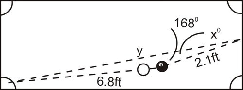

**Solution:**

In the scenario above, we have the SAS case, which means that we need to use the Law of Cosines to begin solving this problem. The Law of Cosines will allow us to find the distance from the spot on the bumper to the pocket $(y)$. Once we know $y$, we can use the Law of Sines to find the angle $(X)$.

$$
\begin{align*}
y^2 & = 6.8^2 + 2.1^2 - 2(6.8)(2.1) \cos 168^\circ \\ 
y^2 & = 78.59 \\
y & = 8.86\ feet
\end{align*}
$$

The distance from the spot on the bumper to the pocket is 8.86 feet. We can now use this distance and the Law of Sines to find angle $X$. Since we are finding an angle, we are faced with the SSA case, which means we could have no solution, one solution, or two solutions. However, since we know all three sides this problem will yield only one solution.

$$
\begin{align*}
\frac{\sin 168^\circ}{8.86} & = \frac{\sin X}{6.8} \\
\frac{6.8 \sin 168^\circ}{8.86} & = \sin X \\
0.1596 & \approx \sin B \\
\angle{B} & = 8.77^\circ
\end{align*}
$$

In the previous example, we looked at how we can use the Law of Sines and the Law of Cosines together to solve a problem involving the SSA case. In this section, we will look at situations where we can use not only the Law of Sines and the Law of Cosines, but also the Pythagorean Theorem and trigonometric ratios. We will also look at another real-world application involving the SSA case.

#### Guided Practice

1. A surveying team is measuring the distance between point $A$ on one side of a river and point $B$ on the far side of the river. One surveyor is positioned at point $A$ and the second surveyor is positioned at point $C$, 65 m up the riverbank from point $A$. The surveyor at point $A$ measures the angle between points $B$ and $C$ to be $103^\circ$. The surveyor at point $C$ measures the angle between points $A$ and $B$ to be $42^\circ$. Find the distance between points $A$ and $B$.

2. While hiking one day you walk for 2 km in one direction. You then turn $110^\circ$ to the left and walk for 3 more km. Your path looks like this:

3. A support at a construction site is being used to hold up a board so that it makes a triangle, like this:

4. You are cutting a triangle out for school that looks like this:

 and $\angle{B}$ (which is the angle opposite the side that has a length of 14).")

**Solutions:**

1. 

\begin{align*}
m \angle B &= 180^\circ - 103^\circ - 42^\circ = 35^\circ \\
\frac{\sin 35^\circ}{65} &= \frac{\sin 42^\circ}{c} \\
c &= \frac{65 \sin 42^\circ}{\sin 35^\circ} \approx 75.8 \ m
\end{align*}
$$

2. Since you know the lengths of two of the legs of the triangle, along with the angle between them, you can use the Law of Cosines to find out how far you'll have to walk along the third leg:

$$
\begin{align*}
\begin{array}{rcl}
c^2 &=& a^2 + b^2 + 2ab\cos 70^\circ\\
c^2 &=& 4 + 1 + (2)(2)(1)(.342)\\
c^2 &=& 6.368\\
c &=& \sqrt{6.368} \approx 2.52\\
\end{array}
\end{align*}
$$

Now you have enough information to solve for the interior angle of the triangle that is supplementary to the angle you need to turn:

$$
\begin{align*}
\begin{array}{rcl}
\frac{\sin A}{a} &=& \frac{\sin B}{b}\\
\frac{\sin 70^\circ}{2.52} &=& \frac{\sin B}{2}\\
\sin B &= & \frac{2 \sin 70^\circ}{2.52}= \frac{1.879}{2.52} = .746\\
B &=& \sin^{-1}(.746) = 48.25^\circ\\
\end{array}
\end{align*}
$$

The angle $48.25^\circ$ is the interior angle of the triangle. So you should turn $90^\circ + (90^\circ - 48.25^\circ) = 90^\circ + 41.75^\circ = 131.75^\circ$ to the left before starting home.

3. You should use the Law of Cosines first to solve for the distance from the ground to where the support meets the board:

$$
\begin{align*}
\begin{array}{rcl}
c^2 &=& a^2 + b^2 + 2ab\cos 17^\circ\\
c^2 &=& 6.25 + 9 + (2)(2.5)(3)\cos 17^\circ\\
c^2 &=& 6.25 + 9 + (2)(2.5)(3)(.956)\\
c^2 &=& 26.722\\
c & \approx & 5.17\\
\end{array}
\end{align*}
$$

And now you can use the Law of Sines:

$$
\begin{align*}
\begin{array}{rcl}
\frac{\sin A}{a} &=& \frac{\sin B}{b}\\
\frac{\sin 17^\circ}{5.17} &=& \frac{\sin B}{2.5}\\
\sin B &=& \frac{2.5 \sin 17^\circ}{5.17} = .1414\\
B &=& \sin^{-1}(.1414) = 8.129^\circ\\
\end{array}
\end{align*}
$$

4. You know that two of the sides have lengths of 11 and 14 cm, and that the angle between them is $14^\circ$. You can use this to find the length of the third side:

$$
\begin{align*}
\begin{array}{rcl}
c^2 &=& a^2 + b^2 - 2ab\cos \theta\\
c^2 &=& 121 + 196 - (2)(11)(14)(.97)\\
c^2 &=& 121 + 196 - 307.384\\
c^2 &=& 9.16\\
c &=& 3.03
\end{array}
\end{align*}
$$

And with this you can use the Law of Sines to solve for the unknown angle:

$$
\begin{align*}
\begin{array}{rcl}
\frac{\sin 14^\circ}{3.03} &=& \frac{\sin B}{11}\\
\sin B &=& \frac{11\sin 14^\circ}{3.03}\\
\sin B &=& .878\\
B &=& \sin^{-1}(.0307) = 61.43^\circ\\
\end{array}
\end{align*}
$$

#### Concept Problem Solution

You can use the Law of Cosines to help your mom find out the length of the third side on the piece of cake:

$$
\begin{align*}
\begin{array}{rcl}
c^2 &=& a^2 + b^2 - 2ab\cos C\\
c^2 &=& 5^2 + 6^2 + (2)(5)(6) \cos 70^\circ\\
c^2 &=& 25 + 36 + 60(.342)\\
c^2 &=& 81.52\\
c & \approx & 9.03\\
\end{array}
\end{align*}
$$

The piece of cake is just a little over 9 inches long.

#### Explore More

Solve the triangles.

1. ")

\[Figure 18\]---

3. ")

\[Figure 20\]

5. 

\[Figure 21\]---

6. 

7. 

$$
\begin{align*}
\begin{array}{rcl}
m \angle A &=& 85^\circ \\
m \angle C &=& 40^\circ \\
a &=& 12
\end{array}{}
\end{align*}
$$

8. 

$$
\begin{align*}
\begin{array}{rcl}
m \angle B &=& 60^\circ \\
m \angle C &=&25^\circ \\
a &=& 28
\end{array}
\end{align*}
$$

9. 

$$
\begin{align*}
\begin{array}{rcl}
m \angle B &=& 42^\circ \\
m \angle A &=& 36^\circ \\
b &=& 8
\end{array}
\end{align*}
$$

10. 

$$
\begin{align*}
\begin{array}{rcl}
m \angle B &=& 30^\circ \\
m \angle A &=& 125^\circ \\
c &=& 45
\end{array}
\end{align*}
$$

  .

Use the Law of Sines to solve the following world problems.

11. A surveyor is trying to find the distance across a ravine. He measures the angle between a spot on the far side of the ravine, $X$, and a spot 200 ft away on his side of the ravine, $Y$, to be $100^\circ$. He then walks to $Y$ the angle between $X$ and his previous location to be $20^\circ$. How wide is the ravine?

12. A triangular plot of land has angles $46^\circ$ and $58^\circ$. The side opposite the $46^\circ$ angle is 35 m long. How much fencing, to the nearest half meter, is required to enclose the entire plot of land?

Use the Law of Cosines to find the value of $x$, to the nearest tenth, in problems 13 through 18.

13. 

\[Figure 23\]---

14. ")

\[Figure 25\]

16. ")

\[Figure 27\]

18. 

19. Find $c$, given $m \angle C=105^\circ$, $a = 55$ and $b = 61$.

20. Find $b$, given $m \angle B=26^\circ$, $a = 33$ and $c = 24$.

21. Find $a$, given $m \angle A=77^\circ$, $b = 12$ and $c = 19$.

22. Find $b$, given $m \angle B=95^\circ$, $a = 28$ and $c = 13$.

23. Explain why when $m \angle C=90^\circ$, the Law of Cosines becomes the Pythagorean Theorem.

24. Lalit is designing a triangular patio in his backyard. One side, 20 m long, will be up against the side of his house. A second side is bordered by his wooden fence. If the fence and the house meet at a $120^\circ$ angle and the fence is 15 m long, how long is the third side of the patio?

25. While hiking one day you walk for 5 km due east, then turn to the left and walk 3 more km $30^\circ$ west of north. At this point you want to return home. How far are you from home if you were to walk in a straight line?

26. A parallelogram has sides of 20 and 31 cm, and an angle of $46^\circ$. Find the length of the longer diagonal of the parallelogram.

27. Dinesh wants to find the length of a long building from one side (point A) to the other (point B). He stands outside of the building (at point C), where he is 500 m from point A and 220 m from point B. The angle at C is $94^\circ$. Find the length of the building.

28. A triangular plot of land has angles $46^\circ$ and $58^\circ$. The side opposite the $46^\circ$ angle is 35 m long. How much fencing, to the nearest half meter, is required to enclose the entire plot of land?

Determine whether or not each triangle is possible.

29. $a=12, b=15, c=10$

30. $a=1, b=5, c=4$

31. $\angle A=32^\circ, a=8, b=10$

</article>

### 4.8 Summary

<article>

* $\sin(a\pm b) =\sin a \cos b \pm \cos a \sin b$
* $\cos (a \pm b) =\cos a \cos b \mp \sin a \sin b$
* $\tan (a \pm b) =\frac{\tan a \pm \tan b}{1 \mp \tan a \tan b}$
* $\cot (x+y) = (\cot x \cot y -1) / (\cot y + \cot x)$
* $\cot (x-y) = (\cot x \cot y+1) / \cot y - \cot x)$
* $\sin 2x=2 \sin x \cos x$
* $\cos 2x=\cos ^2x-\sin ^2 x$
* $\tan 2 x=\frac{2 \tan x}{1-\tan ^2 x}$
* $\sin^2x=\frac{1-\cos 2x}{2}$
* $\cos^2 x=\frac{1+\cos 2x}{2}$
* $\tan^2 x=\frac{1-\cos 2x}{1+\cos 2x}$
* $\sin \frac{x}{2} = \pm \sqrt{\frac{1-\cos x}{2}}$
* $\cos \frac{x}{2}=\pm \sqrt{\frac{1+\cos x}{2}}$
* $\tan \frac{x}{2}=\pm \sqrt{\frac{1-\cos x}{1+\cos x}}$
* $\sin \alpha + \sin \beta = 2 \sin \frac{\alpha + \beta}{2} \times \cos \frac{\alpha - \beta}{2}$
* $\sin \alpha - \sin \beta = 2 \sin \frac{\alpha - \beta}{2} \times \cos \frac{\alpha + \beta}{2}$
* $\cos \alpha + \cos \beta = 2 \cos \frac{\alpha + \beta}{2} \times \cos \frac{\alpha - \beta}{2}$
* $\cos \alpha - \cos \beta = -2 \sin \frac{\alpha + \beta}{2} \times \sin \frac{\alpha - \beta}{2}$
* $\sin 3x = 3 \sin^3 x - 4 \sin x$
* $\cos 3x = 4 \cos^3 x - 3 \cos x$
* $\tan 3x = (3 \tan x - \tan^3 x) / (1-3 \tan^2 x)$

For any triangle ABC, we have

* $\text{Sine Rule}: \frac{\sin A}{a} = \frac{\sin B}{b} = \frac{\sin C}{c}$
* $\text{Cosine Rule}: \cos A = \frac{b^2 + c^2 - a^2}{2bc}$

$\cos B = \frac{c^2 + a^2 - b^2}{2ac}$

$\cos C = \frac{a^2 + b^2 - c^2}{2ab}$

</article>

### 4.9 Self Assessments

<article>

#### Assessment 1

##### Trigonometric Identities

http://www.ck12.org/trigonometry/Quotient-and-Reciprocal-Identities/asmtpractice/Quotient-and-Reciprocal-Identities-Practice/?referrer=concept_details

http://www.ck12.org/trigonometry/Cofunction-Identities/asmtpractice/Cofunction-Identities-Practice/?referrer=concept_details

http://www.ck12.org/trigonometry/Cosine-Sum-and-Difference-Formulas/asmtpractice/Cosine-Sum-and-Difference-Formulas-Practice/?referrer=concept_details

http://www.ck12.org/trigonometry/Sine-Sum-and-Difference-Formulas/asmtpractice/Sine-Sum-and-Difference-Formulas-Practice/?referrer=concept_details

http://www.ck12.org/trigonometry/Tangent-Sum-and-Difference-Formulas/asmtpractice/Tangent-Sum-and-Difference-Formulas-Practice/?referrer=concept_details

http://www.ck12.org/trigonometry/Finding-Exact-Trigonometric-Values-Using-Sum-and-Difference-Formulas/asmtpractice/Finding-Exact-Trigonometric-Values-Using-Sum-and-Difference-Formulas-Practice/?referrer=concept_details

http://www.ck12.org/trigonometry/Double-Angle-Identities/asmtpractice/Double-Angle-Identities-Practice/?referrer=concept_details

http://www.ck12.org/trigonometry/Applying-Double-Angle-Identities/asmtpractice/Applying-Double-Angle-Identities-Practice/?referrer=concept_details

http://www.ck12.org/trigonometry/Deriving-Half-Angle-Identities/asmtpractice/Deriving-Half-Angle-Identities-Practice/?referrer=concept_details

http://www.ck12.org/trigonometry/Sum-to-Product-Formulas-for-Sine-and-Cosine/asmtpractice/Sum-to-Product-Formulas-for-Sine-and-Cosine-Practice/?referrer=concept_details

http://www.ck12.org/trigonometry/Product-to-Sum-Formulas-for-Sine-and-Cosine/asmtpractice/Product-to-Sum-Formulas-for-Sine-and-Cosine-Practice/?referrer=concept_details

http://www.ck12.org/trigonometry/Triple-Angle-Formulas/asmtpractice/Triple-Angle-Formulas-Practice/?referrer=concept_details

http://www.ck12.org/trigonometry/Triple-Angle-Formulas-and-Linear-Combinations/asmtpractice/Triple-Angle-Formulas-and-Linear-Combinations-Practice/?referrer=concept_details

#### Assessment 2

##### Sine Rule and Cosine Rule

http://www.ck12.org/trigonometry/Law-of-Sines/asmtpractice/Law-of-Sines-Practice/?referrer=concept_details

http://www.ck12.org/trigonometry/Solving-Triangles-Using-the-Law-of-Sines/asmtpractice/Solving-Triangles-Using-the-Law-of-Sines-Practice/?referrer=concept_details

http://www.ck12.org/trigonometry/Law-of-Cosines/asmtpractice/Law-of-Cosines-Practice/?referrer=concept_details

http://www.ck12.org/trigonometry/Sides-of-an-Oblique-Triangle/asmtpractice/Sides-of-an-Oblique-Triangle-Practice/?referrer=concept_details

</article>

### 4.10 Home Assignments

<article>

#### Assignment 1

##### Trigonometric Identities

NCERT Exercise No. 3.3

Q. No. 3, 6, 9, 12, 15, 18

#### Assignment 2

##### Sine Rule and Cosine Rule

NCERT Exercise No. 3.5

Q. No. 2, 4, 9, 10, 13

#### Assignment 3

##### Miscellaneous Questions

NCERT Miscellaneous Exercise

Q. No. 2, 4, 6, 10

</article>

### 4.11 References for Basic Understanding

<article>

#### 1. Trigonometric Identities

http://www.ck12.org/trigonometry/Pythagorean-Identities/lesson/Pythagorean-Identities/

</article>

## 5.0 Trigonometric Equations

<article>

</article>

### 5.1 Introduction

<article>

Now you are very well versed with trigonometric functions and identities, we will extend our knowledge of the concepts to trigonometric equations and their solutions. You have solved many algebraic equations of degree 1, 2, 3 or 4 by using various methods and techniques; where number of solutions depend on the degree of the equation to be solved. Solving trigonometric equation means to get the value of the angle that satisfies the given equation but the difference here is that the number of solutions are infinite. How to generalise all those solutions is the major objective of studying this chapter. We will use many trigonometric identities and other basic algebraic techniques to solve the trigonometric equations.

</article>

### 5.2 Trigonometric Equations

<article>

You are very much familiar with equations in variable $x$.

e.g $x^2 + x+ 1 =0$

If variable $x$ is replaced by a trigonometric function, viz., $\sin x, \cos x$ etc. then the equation will become a trigonometric equation.

Solving a trigonometric equation is just like solving a regular equation. You will use factorization and other algebraic techniques to get the variable on one side. The biggest difference with trigonometric equations is the opportunity for there to be an infinite number of solutions that must be described with a pattern. The equation $\cos x=1$ has many solutions including 0 and $2 \pi$. How would you describe all of them? Read this concept and you will be able to find answer to this question.

#### Example 1

Solve:

$\sin x = \frac{1}{2}$

**Solution:**

We know, to solve an equation means to get value of $x$. Here, it means to get value of angle which satisfies given trigonometric equation to be solved.

Therefore, $\sin x =\frac{1}{2} \Rightarrow x =\frac{\pi}{6}$ and $\pi - \frac{\pi}{6} = \frac{5 \pi}{6}$

But we can have many such values of angle $x$ which satisfies this equation.

e.g. $\frac{-\pi}{6}, \frac{-5 \pi}{6}, 2 \pi+\frac{\pi}{6}, 2 \pi + \frac{5 \pi}{6}, \ldots$

Why is this so?

This is because trigonometric functions are periodic functions.

So, the values of $x$ which lies in $0 \le x < 2 \pi$ are called **principal solutions**.

The values of $x$ which generalises the answer so that we can get all the values of $x$ for different integers $0, \pm 1, \pm 2, \ldots$ are called **general solutions**.

### General Solution of Trigonometric Equations

For any real $x, y$ we have

1. $\sin x =0 \Rightarrow x=n \pi, n \in Z$

2. $\cos x =0 \Rightarrow x=(2n+1) \frac{\pi}{2}, n \in Z$

3. $\tan x =0 \Rightarrow x=n \pi, n \in Z$

The above three result are obvious as $\sin x=0$ and $\tan x=0$ are at all integral multiples of $\pi$ and $\cos x=0$ at all odd multiples of $\frac{\pi}{2}$.

4. $\sin x = \sin y \Rightarrow x =n \pi + (-1)^n y, n \in Z$

---

**Proof:**

$$
\begin{align*}
\begin{array}{rcl}
& \Rightarrow & \sin x - \sin y = 0 \\
\\
& \Rightarrow & 2 \cos \left( \frac{x+y}{2} \right) \quad \sin \left( \frac{x-y}{2} \right) = 0 \\
\\
& \Rightarrow & \cos \left( \frac{x+y}{2} \right) = 0 \quad \text{or } \quad \sin \left( \frac{x-y}{2} \right) = 0  \\ \\
& \Rightarrow & \frac{x+y}{2} = (2n+1) \frac{\pi}{2} \quad \text{or} \quad \frac{x-y}{2} = n \pi , n \in Z \\
\\
& \Rightarrow & x = (2n+1) \pi - y \quad \text{and} \quad x = 2n \pi + y , n \in Z \\
\\
& \Rightarrow & x = n \pi + (-1)^n y, n \in Z
\end{array}
\end{align*}
$$

5. $\cos x = \cos y \Rightarrow x = 2 n \pi \pm y, n \in Z$

**Proof:**

$$
\begin{align*}
\begin{array}{rcl}
\cos x &=& \cos y \\ \\
\Rightarrow \cos x - \cos y &=& 0 \\ \\
\Rightarrow -2 \sin \left(\frac{x+y}{2} \right) \sin \left(\frac{x-y}{2} \right) &=& 0 \\ \\
\Rightarrow \sin \left(\frac{x+y}{2} \right) &=& 0 \ \text{or} \ \sin \left(\frac{x-y}{2} \right) = 0 \\ \\
\Rightarrow \frac{x+y}{2} &=& n \pi \ \text{and} \ \frac{x-y}{2} = n \pi, n \in Z \\ \\
\Rightarrow x &=& 2 n \pi - y \quad \quad \Rightarrow x =2n \pi + y \\ \\
\Rightarrow x &=& 2 n \pi \pm y, n \in Z \\ \\
\end{array}
\end{align*}
$$

6. If $x$ and $y$ are not odd multiples of $\frac{\pi}{2}$, then

$\tan x = \tan y \Rightarrow x=n\pi + y, n \in Z$

**Proof:**

$$
\begin{align*}
\begin{array}{rcl}
\tan x &=& \tan y \\ \\
\Rightarrow \tan x - \tan y &=& 0 \\ \\
\Rightarrow \frac{\sin x}{\cos x} - \frac{\sin y}{\cos y} &=& 0 \\ \\
\Rightarrow \frac{\sin x \cos y - \cos x \sin y}{\cos x \cos y} &=& 0 \\ \\
\Rightarrow \sin x \cos y - \cos x \sin y &=& 0 \\ \\ 
\Rightarrow \sin(x-y) &=& 0 \\ \\
\Rightarrow x-y &=& n \pi, n \in x \\ \\
\Rightarrow x &=& n \pi + y, n \in Z
\\ \end{array}
\end{align*}
$$

#### Example 2

Find principal and general solution of $\tan x = \sqrt{3}$

**Solution:**

$$
\begin{align*}
\begin{array}{rcl} \tan x &=& \sqrt{3} \\ \Rightarrow \tan x &=& \tan \frac{\pi}{3} \ \text{and} \ \tan \left(\pi + \frac{\pi}{3}\right) \\ \Rightarrow x &=& \frac{\pi}{3}, \frac{4 \pi}{3} \\ \end{array}
\end{align*}
$$

are principal solutions.

General Solution for

$\tan x = \tan \frac{\pi}{3} \ \text{is} \ x=n \pi + \frac{\pi}{3}, n \in Z$

#### Watch This

!?[0](https://www.youtube.com/watch?v=26EWKD2Xha4)

Watch the video at: http://www.youtube.com/watch?v=26EWKD2Xha!?[0](https://www.youtube.com/watch?v=ABKO3ta_Azw)

Watch the video at: http://www.youtube.com/watch?v=ABKO3ta_Azw

!?[0](https://www.youtube.com/watch?v=7thuFLqC7z0)

Watch the video at: http://www.youtube.com/watch?v=7thuFLqC7z0

#### Example 3

Solve the following equation algebraically and confirm graphically on the interval $[-2 \pi, 2 \pi]$.

$\cos 2x=\sin x$

**Solution:**

**

$$
\begin{align*}
\cos 2x &= \sin x\\
1-2 \sin^2 x &= \sin x\\
0 &= 2 \sin^2 x+\sin x-1\\
0 &= (2 \sin x-1)(\sin x+1)
\end{align*}
$$

**

Solving the first part set equal to zero within the interval yields:

$$
\begin{align*}
0 &= 2 \sin x-1\\
\frac{1}{2} &= \sin x\\
x &= \frac{\pi}{6}, \frac{5 \pi}{6}, - \frac{11 \pi}{6}, -\frac{7 \pi}{6}
\end{align*}
$$

Solving the second part set equal to zero yields:

$$
\begin{align*}
0 &= \sin x+1\\
-1 &= \sin x\\
x &= -\frac{\pi}{2}, \frac{3 \pi}{2}
\end{align*}
$$

These are the six solutions that will appear as intersections of the two graphs $f(x)=\cos 2x$ and $g(x)=\sin x$. 

Determine the general solution to the following equation. 

$\cot x-1=0$

**Solution:**

**

$$
\begin{align*}
\cot x-1 &= 0\\
\cot x &= 1
\end{align*}
$$

**

One solution is $x=\frac{\pi}{4}$. However, since this question asks for the general solution, you need to find every possible solution. You have to know that cotangent has a period of $\pi$ which means if you add or subtract $\pi$ from $\frac{\pi}{4}$ then it will also yield a height of 1. To capture all these other possible $x$ values you should use this notation.

$x=\frac{\pi}{4} \pm n \cdot \pi$ where $n$ is a integer.

**Note:** Since we do not have any solution of $\cot x = \cot y$, therefore, this type of equations involving $\cot x$ can be solved by using $\tan x$. This method is equally good for $\sec x$ and $\text{cosec} \ x$.

Solve the following equation.

$4 \cos^2 x-1=3-4 \sin^2 x$

**Solution:**

**

$$
\begin{align*}
4 \cos^2 x-1 &= 3-4 \sin^2 x\\
4 \cos^2 x+4 \sin^2 x &= 3+1\\
4 (\cos^2 x+\sin^2 x) &= 4\\
4 &= 4
\end{align*}
$$

**

This equation is always true which means the right side is always equal to the left side. This is an identity.

#### Example 6

Verify that $\text{cosec} \ x-2=0$ when $x=\frac{5 \pi}{6}$.

**Solution:**

Substitute $x=\frac{5 \pi}{6}$ to see if the equation holds true.

$$
\text{cosec} \left(\frac{5 \pi}{6}\right)-2=0 \\
\frac{1}{\sin \left(\frac{5 \pi}{6}\right)}-2=0 \\
\frac{1}{\frac{1}{2}}-2=0 \\
2-2=0
$$

This is a true statement, so $x=\frac{5 \pi}{6}$ is a solution to the equation.

#### Example 7

Solve $2 \cos x+1=0$.

**Solution:**

To solve this equation, we need to isolate $\cos x$ and then use inverse to find the values of $x$ when the equation is valid. You already did this to find the zeros in the graphing concepts earlier in this chapter.

$$
\begin{align*}
2 \cos x+1&=0 \\
2 \cos x&=-1 \\
\cos x&=- \frac{1}{2}
\end{align*}
$$

So, when is the $\cos x=- \frac{1}{2}$? Between $0 \le x< 2 \pi, x=\frac{2 \pi}{3}$ and $\frac{4 \pi}{3}$. But, the trigonometric functions are periodic, so there are more solutions than just these two. You can write the general solutions as $x=\frac{2 \pi}{3} \pm 2 \pi n$ and $x=\frac{4 \pi}{3} \pm 2 \pi n$, where $n$ is any integer. You can check your answer graphically by graphing $y=\cos x$ and $y=- \frac{1}{2}$ on the same set of axes. Where the two lines intersect are the solutions.

The equation $\cos x=1$ has many solutions. In order to describe all the solutions you must use logic and the graph to figure out that cosine also has a height of 1 at $-2 \pi, 2 \pi, -4 \pi, 4 \pi \ldots$ Luckily all these values are sequences in a clear pattern so you can describe them all in general with the following notation:

$x=0 \pm n \cdot 2 \pi$ where $n$ is an integer, or $x=\pm n \cdot 2 \pi$ where $n$ is an integer.

#### Guided Practice

1. Solve the following equation on the interval $(2 \pi, 4 \pi)$.

$2 \sin x+1=0$

2. Solve the following equation.

$2 \cos^2 x+3 \cos x-2=0$

3. Create an equation that has the solutions:

$\frac{\pi}{4} \pm n \cdot 2 \pi$ where $n$ is an integer

4. Determine if $x=\frac{\pi}{3}$ is a solution for $2 \sin x=\sqrt{3}$.

Solve the following trigonometric equations in the interval $0 \le x< 2 \pi$.

5. $3 \sec(x-1)+2=0$

**Answers:**

1. First, solve for the solutions within one period and then use logic to find the solutions in the correct interval.

$$
\begin{align*}
2 \sin x+1 &= 0\\
\sin x &= -\frac{1}{2}\\
x &= \frac{7 \pi}{6}, \frac{11 \pi}{6}
\end{align*}
$$

You must add $2 \pi$ to each of these solutions to get solutions that are in the interval.

$x=\frac{19 \pi}{6}, \frac{23 \pi}{6}$

2. Start by factorization:

$$
\begin{align*}
2 \cos^2 x+3 \cos x-2 &= 0\\
(2 \cos x-1)(\cos x+2) &= 0
\end{align*}
$$

Note that $\cos x \neq -2$ which means only one equation needs to be solved for solutions.

$$
\begin{align*}
2 \cos x-1 &= 0\\
\cos x &= \frac{1}{2}\\
x&=\frac{\pi}{3}, -\frac{\pi}{3}
\end{align*}
$$

These are the solutions within the interval $-\pi$ to $\pi$. Since this represents one full period of cosine, the rest of the solutions are just multiples of $2 \pi$ added and subtracted to these two values.

$x=\pm \frac{\pi}{3} \pm n \cdot 2 \pi$ where $n$ is an integer

3. There are an infinite number of possible equations that will work. When you see the $\frac{\pi}{4}$ you should think either of where tangent is equal to one or where sine/cosine is equal to $\frac{\sqrt{2}}{2}$. The problem with both of these initial guesses is that tangent repeats every $\pi$ not every $2 \pi$, and sine/cosine have a second place where they reach a height of 1. An option that works is:

$\tan \frac{x}{2}=1$

This equation works because the period of $\tan \frac{x}{2}$ is $2 \pi$.

4. $2 \sin \frac{\pi}{3}= \sqrt{3} \rightarrow 2 \cdot \frac{\sqrt{3}}{2}=\sqrt{3}$ Yes, $x=\frac{\pi}{3}$ is a solution.

5. Here, we will find the solution within the given range, $0 \le x< 2 \pi$.

$$
\begin{align*}
3 \sec(x-1)+2&=0 \\
3 \sec(x-1)&=-2 \\
\sec(x-1)&=- \frac{2}{3} \\
\cos(x-1)&=- \frac{3}{2}
\end{align*}
$$

At this point, we can stop. The range of the cosine function is from -1 to 1. $- \frac{3}{2}$ is outside of this range, so there is no solution to this equation.

#### Explore More

Write principal and general solution of the following trigonometric equations:

1. $3 \cos^2 \frac{x}{2}=3$

2. $4 \sin^2 x=8 \sin^2 \frac{x}{2}$

3. $3 \cos^2 x+10 \cos x+2=0$

4. $\sin^2 x+3 \sin x=5$

5. $\tan^2 x+\tan x=3$

6. $\cot^2 x+5 \tan x+14=0$

7. $\sin^2 x+\cos^2 x=1$

8. $2 \sin \left(x-\frac{\pi}{2}\right)=1$

9. $4 \cos (x-\pi)=4$

Solve each equation on the interval $[2 \pi, 4 \pi)$.

10. $\cos^2 x+2 \cos x+1=0$

11. $3 \sin x=2 \cos^2 x$

12. $\tan x \sin^2 x=\tan x$

13. $\sin^2 x+1=2 \sin x$

14. $\sec^2 x=4$

15. $\sin^2 x-4=\cos^2 x-\cos 2x-4$

Determine if the following values for $x$. are solutions to the equation $5+6 \ \text{cosec} \ x=17$.

16. $x=- \frac{7 \pi}{6}$

17. $x=\frac{11 \pi}{6}$

18. $x=\frac{5 \pi}{6}$

Solve the following trigonometric equations. If no solutions exist, write _no solution_.

19. $1- \cos x=0$

20. $3 \tan x - \sqrt{3}=0$

21. $4 \cos x=2 \cos x+1$

22. $5 \sin x-2=2 \sin x+4$

23. $\sec x-4=- \sec x$

24. $\tan^2(x-2)=3$

25. $\cos x=\sin x$

26. $- \sqrt{3} \ \text{cosec} \ x=2$

27. $6 \sin(x-2)=14$

28. $7 \cos x -4=1$

29. $5+4 \cot^2x=17$

30. $2 \sin^2x-7=-6$

</article>

### 5.3 Solution of Trigonometric Equations by using Sum and Difference Formulae

<article>

You are now given another piece of the puzzle: $\sin(\frac{\pi}{2} - x) = -1$. What is the value of $x$?

#### Guidance

We can use the sum and difference formulae to solve trigonometric equations.

#### Example 1

Solve $\cos (x-\pi)=\frac{\sqrt{2}}{2}$.

**Solution:**

Use the formula to simplify the left-hand side and then solve for $x$.

$$
\begin{align*}
\cos (x-\pi) &=\frac{\sqrt{2}}{2} \\
\cos x \cos \pi +\sin x \sin \pi &=\frac{\sqrt{2}}{2} \\
-\cos x &=\frac{\sqrt{2}}{2}\\
\cos x &=-\frac{\sqrt{2}}{2}
\end{align*}
$$

The cosine function is negative in the $2^{nd}$ and $3^{rd}$ quadrants. $x=\frac{3\pi}{4}$ and $\frac{5\pi}{4}$. The general solution is $x = 2n\pi \pm \left [ \frac{3\pi}{4} \right ]$, for all integers $n$.

#### Example 2

Solve $\sin \left(x+\frac{\pi}{4}\right)+1=\sin \left(\frac{\pi}{4}-x\right)$.

**Solution:**

$$
\begin{align*}
\sin \left(x+\frac{\pi}{4}\right)+1 &=\sin \left(\frac{\pi}{4}-x\right) \\
\sin x \cos \frac{\pi}{4}+\cos x \sin \frac{\pi}{4}+1 &=\sin \frac{\pi}{4}\cos x -\cos \frac{\pi}{4}\sin x \\
\sin x \cdot \frac{\sqrt{2}}{2}+\cos x \cdot \frac{\sqrt{2}}{2}+1 &=\frac{\sqrt{2}}{2}.\cos x -\frac{\sqrt{2}}{2} \cdot \sin x \\
\sqrt{2} \sin x &=-1 \\
\sin x &=-\frac{1}{\sqrt{2}}=-\frac{\sqrt{2}}{2}
\end{align*}
$$

In the interval, $x=\frac{5\pi}{4}$ and $\frac{7\pi}{4}$. What will be its general solution?

#### Example 3

Solve $2\sin \left(x+\frac{\pi}{3}\right)=\tan \frac{\pi}{3}$.

**Solution:**

$$
\begin{align*}
2\sin\left(x+\frac{\pi}{3}\right) &=\tan \frac{\pi}{3} \\
2\left(\sin x \cos \frac{\pi}{3}+\cos x \sin \frac{\pi}{3}\right) &=\sqrt{3} \\
2\sin x \cdot \frac{1}{2}+2\cos x \cdot \frac{\sqrt{3}}{2} &=\sqrt{3} \\
\sin x +\sqrt{3}\cos x &=\sqrt {3} \\
\sin x &=\sqrt{3}(1-\cos x) \\
\sin ^2x &=3(1-2\cos x+\cos ^2x) \qquad \text{square both sides} \\
1-\cos ^2x &=3-6\cos x + 3\cos ^2 x \qquad \ \ \text{substitute} \ \sin ^2{x} = 1-\cos ^2x \\
0 &=4\cos^2x-6\cos x +2 \\
0 &=2\cos^2x-3\cos x +1
\end{align*}
$$

$(2\cos x -1)(\cos x -1)=0$. i.e., $\cos x =\frac{1}{2}$, and 1, so $x=0, \frac{\pi}{3}, \frac{5 \pi}{3}$. Be careful with these answers. When we check these solutions it turns out that $\frac{5\pi}{3}$ does not work.

$$
\begin{align*}
2\sin\left(\frac{5\pi}{3}+\frac{\pi}{3}\right) &=\tan \frac{\pi}{3} \\
2\sin 2\pi &=\sqrt{3} \\
0 &\ne \sqrt{3}
\end{align*}
$$

Therefore, $\frac{5\pi}{3}$ is an extraneous solution. Now write general solution for this equation.

#### Concept Problem Revisited

In the previous concepts you solved the expression $\sin(\frac{\pi}{2} - x)$ as:

$$
\begin{align*}
\begin{array}{rcl}
\sin(\frac{\pi}{2} - x) &=& \sin \frac{\pi}{2} \cos x - \cos \frac{\pi}{2} \sin x \\
&=& 1\cdot \cos x - 0\cdot \sin x \\
&=& cos x
\end{array}
\end{align*}
$$

So what you're now looking for is the value of $x$ where $\cos x = -1$.

The cosine of $180^\circ$ is equal to $-1$.

#### Guided Practice

Solve the following equations in the interval $0\le x<2\pi$.

1. $\cos(2\pi - x)=\frac{1}{2}$

2. $\sin \left(\frac{\pi}{6}-x\right)+1 = \sin \left(x+\frac{\pi}{6}\right)$

3. $\cos \left(\frac{\pi}{2}+x\right)=\tan \frac{\pi}{4}$

**Answers:**

1.

$$
\begin{align*}
\cos (2\pi-x) &=\frac{1}{2} \\
\cos 2\pi \cos x +\sin 2 \pi \sin x &=\frac{1}{2} \\
\cos x &=\frac{1}{2} \\
x &=\frac{\pi}{3} \ and \ \frac{5\pi}{3}
\end{align*}
$$

2.

$$
\begin{align*}
\begin{array}{rcl}
\sin \left(\frac{\pi}{6}-x\right)+1 &=& \sin \left(x+\frac{\pi}{6}\right)\\ \\
\sin \frac{\pi}{6}\cos x-\cos \frac{\pi}{6}\sin x +1 &=& \sin x \cos \frac{\pi}{6}+\cos x \sin \frac{\pi}{6} \\ \\
\frac{1}{2}\cos x - \frac{\sqrt{3}}{2}\sin x+1 &=& \frac{\sqrt{3}}{2}\sin x +\frac{1}{2} \cos x \\ \\
1 &=& \sqrt{3}\sin x \\ \\
\frac{1}{\sqrt{3}} &=& \sin x \\ \\
x &=& \sin ^{-1}\left(\frac{1}{\sqrt{3}}\right)=0.6155 \ and \ 2.5261 \ \text{radians}
\end{array}
\end{align*}
$$

3.

$$
\begin{align*}
\cos \left(\frac{\pi}{2}+x\right) &=\tan \frac{\pi}{4} \\
\cos \frac{\pi}{2} \cos x - \sin \frac{\pi}{2} \sin x &=1 \\
-\sin x &=1 \\
\sin x &=-1 \\
x &=\frac{3\pi}{2}
\end{align*}
$$

#### Explore More

Solve the following trigonometric equations.

1. $\sin (x-\pi)=-\frac{\sqrt{2}}{2}$

2. $\cos(2\pi +x)=-1$

3. $\tan \left(x+\frac{\pi}{4}\right)=1$

4. $\sin \left(\frac{\pi}{2}-x\right)=\frac{1}{2}$

5. $\sin \left(x+\frac{3\pi}{4}\right)+\sin \left(x-\frac{3\pi}{4}\right)=1$

6. $\sin \left(x+\frac{\pi}{6}\right)=-\sin \left(x-\frac{\pi}{6}\right)$

7. $\cos \left(x+\frac{\pi}{6}\right)=\cos \left(x-\frac{\pi}{6}\right)+1$

8. $\cos \left(x+\frac{\pi}{3}\right)+\cos \left(x-\frac{\pi}{3}\right)=1$

9. $\tan(x+\pi)+2\sin (x+\pi)=0$

10. $\tan (x+\pi)+\cos \left(x+\frac{\pi}{2}\right)=0$

11. $\tan \left(x+\frac{\pi}{4}\right)=\tan \left(x-\frac{\pi}{4}\right)$

12. $\sin \left(x-\frac{5\pi}{3}\right)-\sin \left(x-\frac{2\pi}{3}\right)=0$

13. $4\sin (x+\pi)-2=2\cos\left(x+\frac{\pi}{2}\right)$

14. $1+2\cos(x-\pi)+\cos x =0$

</article>

### 5.4 Solution of Trigonometric Equations by using Factorization

<article>

#### Watch This

!?[0](https://www.youtube.com/watch?v=3UjZ6tmgpYw)

Watch the video at: http://www.ck12.org/flx/render/embeddedobject/52764

#### Example 1

Solve $2 \sin^2 x - 3 \sin x + 1 = 0$ for $0 < x \le 2 \pi$.

**Solution:**

$$
\begin{align*}
& \quad 2 \sin^2 x - 3 \sin x + 1 = 0 \quad \text{Factor this like a quadratic equation} \\
& (2 \sin x - 1)(\sin x - 1) = 0 \\
& \qquad \ \downarrow \qquad \qquad \ \ \ \searrow \\
& \ 2 \sin x - 1 = 0 \quad \text{or} \ \ \sin x - 1 = 0 \\
& \quad \ \ \  2 \sin x = 1 \qquad \qquad \ \sin x = 1 \\
& \qquad \ \ \sin x = \frac{1}{2} \qquad \quad \qquad \ \  x = \frac{\pi}{2}\\
x & = \frac{\pi}{6} \ \text{and} \ x = \frac{5 \pi}{6}
\end{align*}
$$

#### Example 2

Solve $2 \tan x \sin x + 2 \sin x = \tan x + 1$ for all values of $x$.

**Solution:**

$$
\begin{align*}
\begin{array}{rcl}
&& \quad \ \tan x = -1 \qquad \qquad \qquad \quad \sin x = \frac{1}{2} \\
&& \Rightarrow \tan x =  \left(-\tan \frac{\pi}{4}\right)  \qquad \Rightarrow \sin x =  \sin \frac{\pi}{6} \\
&& \qquad \quad \ \ =\tan \left(\pi -\frac{\pi}{4}\right) \quad \  \Rightarrow x = n \pi + (-1)^n \frac{\pi}{6}, n \in Z \\
&& \qquad \quad \ \ = \tan \frac{3 \pi}{4} \\
&& \Rightarrow x=n \pi + \frac{3 \pi}{4}, n \in Z
\end{array}
\end{align*}
$$

#### Example 3

Solve $2 \sin^2 x + 3 \sin x - 2 = 0$ for all $x, [0, \pi]$.

**Solution:**

$$
\begin{align*}
\begin{array}{rcl}
&& 2 \sin^2 x +3 \sin x - 2 = 0 \rightarrow \text{Factor like a quadratic} \\
&& (2 \sin x -1)(\sin x + 2) = 0 \\
&& \ \ \swarrow \qquad \qquad \quad \searrow \\
&& 2 \sin x - 1 = 0 \qquad \sin x + 2 = 0 \\
&& \ \sin x = \frac{1}{2} \qquad \quad \ \ \sin x = -2 \\
&& x  = \frac{\pi}{6} \ \text{and} \ x = \frac{5 \pi}{6}. \ \text{For} \ \sin x = -2, \text{there is no solution because the range of}\   \sin x\ \text{is}\ [-1, 1].
\end{array}
\end{align*}
$$

Some trigonometric equations have no solutions. This means that there is no replacement for the variable that will result in a true expression.

#### Example 4

Solve $\sin^2x-3 \sin x+2=0$.

**Solution:**

This sine equation looks a lot like the quadratic $x^2-3x+2=0$ which factors to be $(x-2)(x-1)=0$ and the solutions are $x = 2$ and 1. We can factor the trigonometric equation in the exact same manner. Instead of just $x$, we will have $\sin x$ in the factors.

$$
\begin{align*}
\sin^2x-3 \sin x+2&=0 \\
(\sin x-2)(\sin x-1)&=0 \\
\sin x=2 \ and \ \sin x&=1
\end{align*}
$$

There is no solution for $\sin x=2$ and $\sin x=1$ when $x= \frac{\pi}{2} \pm 2 \pi n$. For any integer $n$.

#### Example 5

Solve $1- \sin x=\sqrt{3} \cos x$ in the interval $0 \le x < 2 \pi$.

**Solution:**

To solve this equation use identity $\sin^2x+\cos^2x=1$.

$$
1- \sin x=\sqrt{3} \cdot \sqrt{1- \sin^2x} \\
(1- \sin x)^2=\sqrt{3 (1 - \sin^2 x)} \\
1-2 \sin x+\sin^2x=3-3 \sin^2x \\
4 \sin^2x-2 \sin x-2=0 \\
2 \sin^2x-\sin x-1=0 \\
(2 \sin x+1)(\sin x-1)=0
$$

Solving each factor for $x$, we get $\sin x=- \frac{1}{2} \rightarrow x=\frac{7 \pi}{6}$ and $\frac{11 \pi}{6}$ and $\sin x=1 \rightarrow x=\frac{\pi}{2}$.

#### Watch This

!?[0](https://www.youtube.com/watch?v=N6C8TP26K7E)

Watch the video at: http://www.ck12.org/flx/render/embeddedobject/52770

#### Example 6

Solve $3\ \cot^2x - 3\ \cot x = 1$ for exact values of $x$ over the interval $[0, 2\pi]$.

**Solution:**

$$
\begin{align*}
3 \cot^2x - 3 \cot x&= 1  \\
3 \cot^2x - 3 \cot x - 1 & = 0
\end{align*}
$$

The equation will not factor. Use the quadratic formula for $\cot x$, $a =3, b = -3, c = -1$.

$$
\begin{align*}
\cot x & = \frac{-b \pm \sqrt{b^2 - 4ac}}{2a} \\
\cot x & = \frac{- (-3) \pm \sqrt{(-3)^2 - 4(3)(-1)}}{2(3)}\\
\cot x & = \frac{3 \pm \sqrt{9 + 12}}{6} \\
\cot x & = \frac{3+ \sqrt{21}}{6} \qquad \qquad \qquad \quad \text{or} \quad && \cot x = \frac{3- \sqrt{21}}{6} \\
\cot x & = \frac{3+4.5826}{6} && \cot x = \frac{3-4.5826}{6} \\
\cot x & = 1.2638 && \cot x =-0.2638 \\
\tan x & = \frac{1}{1.2638} && \tan x = \frac{1}{-0.2638} \\
x & = 0.6694, 3.81099 && x = 1.8287, 4.9703
\end{align*}
$$

#### Example 7

Solve $-5 \cos^2x + 9 \sin x + 3 = 0$ for values of $x$ over the interval $[0, 2\pi]$.

**Solution:**

Change $\cos^2 x$ to $1 - \sin^2 x$ from the Pythagorean Identity.

$$
\begin{align*}
-5 \cos^2x + 9 \sin x + 3 & = 0 \\ 
-5 (1 - \sin^2x) + 9 \sin x + 3 & = 0 \\
-5 + 5 \sin^2x + 9 \sin x + 3 & = 0 \\
5 \sin^2x + 9 \sin x - 2 & = 0
\end{align*}
$$

$$
\begin{align*}
& \sin x = \frac{- 9 \pm \sqrt{9^2 - 4(5)(-2)}}{2(5)} \\
& \sin x  = \frac{-9 \pm \sqrt{81+40}}{10} \\
& \sin x = \frac{-9 \pm \sqrt{121}}{10} \\
& \sin x = \frac{-9 + 11}{10} \ \text{and}\ \sin x = \frac{-9-11}{10} \\
& \sin x = \frac{1}{5}\ \text{and}\ -2 \\
&\sin^{-1} (0.2)\ \text{and}\ \sin^{-1}(-2)
\end{align*}
$$

$x \approx .201\ rad$ and $\pi -.201 \approx 2.941$

This is the only solutions for $x$ since $-2$ is not in the range of values.

#### Example 8

Solve $3 \sin^2x - 6 \sin x - 2 = 0$ for values of $x$ over the interval $[0, 2\pi]$.

**Solution:**

$$
\begin{align*}
3 \sin^2x - 6 \sin x - 2 & = 0
\end{align*}
$$

$$
\begin{align*}
& \sin x = \frac{6 \pm \sqrt{(-6)^2 - 4(3)(-2)}}{2(3)} \\
& \sin x  = \frac{6 \pm \sqrt{36-24}}{6} \\
& \sin x = \frac{6 \pm \sqrt{12}}{6} \\
& \sin x = \frac{6 + 3.46}{10} \ \text{and}\ \sin x = \frac{6-3.46}{10} \\
& \sin x = .946\ \text{and}\ .254 \\
&\sin^{-1} (0.946)\ \text{and}\ \sin^{-1}(0.254)
\end{align*}
$$

$x \approx 71.08\ deg$ and $\approx 14.71\ deg$

#### Guided Practice

1. Solve the trigonometric equation $4 \sin x \cos x + 2 \cos x-2 \sin x - 1 = 0$ such that $0 \le x < 2\pi$.

2. Solve $\tan^2 x = 3 \tan x$ for $x$ over $[0, \pi]$.

3. Find all the solutions for the trigonometric equation $2 \sin^2 \frac{x}{4}-3 \cos \frac{x}{4} = 0$ over the interval $[0, 2\pi)$.

Solve the following trigonometric equations in the interval $0 \le x < 2 \pi$.

4. $\sin^2x \cos x=\cos x$

5 $\sin^2x=2 \sin(-x)+1$

6. Solve $\sin^2 x - 2 \sin x - 3 = 0$ for $x$ over $[0, \pi]$.

7. Solve $\tan^2x + \tan x - 2 = 0$ for values of $x$ over the interval $\left [- \frac{\pi}{2},\frac{\pi}{2} \right ]$.

8. Solve the trigonometric equation such that $5 \cos^2 \theta - 6 \sin \theta = 0$ over the interval $[0, 2\pi]$.

**Solutions:**

1. Use factoring by grouping.

\begin{align*}
& 2 \sin x + 1 = 0 \quad \text{or} \qquad 2 \cos x - 1 = 0 \\
& 2 \sin x = -1 \qquad \qquad \quad 2 \cos x = 1 \\
& \ \ \sin x = - \frac{1}{2} \qquad \qquad \quad \cos x = \frac{1}{2} \\
& \qquad \  x = \frac{7 \pi}{6}, \frac{11\pi}{6} \qquad \qquad \quad x = \frac{\pi}{3}, \frac{5\pi}{3}
\end{align*}
$$

2.

$$
\begin{align*}
\tan^2 x &= 3 \tan x \\
\tan^2 x - 3 \tan x &= 0 \\
\tan x (\tan x - 3) &= 0 \\
\tan x & = 0 \qquad \text{or} \qquad \tan x = 3 \\
x & = 0, \pi  \qquad \qquad \quad \ \ x = 1.25
\end{align*}
$$

3.

$2 \sin^2 \frac{x}{4} - 3 \cos \frac{x}{4} = 0$

$$
\begin{align*}
& \quad 2 \left (1 - \cos^2 \frac{x}{4} \right ) - 3 \cos \frac{x}{4} = 0 \\
& \qquad \ 2 - 2 \cos^2 \frac{x}{4} - 3 \cos \frac{x}{4} = 0 \\
& \qquad \ 2 \cos^2 \frac{x}{4} + 3 \cos \frac{x}{4} - 2 = 0 \\
& \left (2 \cos \frac{x}{4} - 1 \right ) \left (\cos \frac{x}{4} + 2 \right ) = 0 \\
& \qquad \swarrow  \qquad \qquad \qquad \searrow\\
& 2 \cos \frac{x}{4} - 1 = 0 \quad \text{or} \quad \cos \frac{x}{4} + 2 = 0 \\
& \quad \ \ 2 \cos \frac{x}{4} = 1 \qquad \qquad \ \ \cos \frac{x}{4} = -2 \\
& \qquad \cos \frac{x}{4} = \frac{1}{2} \\
& \frac{x}{4} = \frac{\pi}{3} \quad \text{or} \quad \frac{5\pi}{3} \\
& x = \frac{4 \pi}{3} \ \ \text{or} \quad \frac{20\pi}{3}
\end{align*}
$$

$\frac{20 \pi}{3}$ is eliminated as a solution because it is outside of the range and $\cos \frac{x}{4} = -2$ will not generate any solutions because $-2$ is outside of the range of cosine. Therefore, the only solution is $\frac{4 \pi}{3}$.

4. Put everything onto one side of the equation and factor out a cosine.

$$
\begin{align*}
\sin^2x \cos x- \cos x&=0 \\
\cos x(\sin^2x-1)&=0 \\
\cos x(\sin x -1)(\sin x+1)&=0
\end{align*}
$$

$$
\begin{align*}
\cos x&=0 \qquad \qquad \ \ \sin x=1 \qquad \ \ \sin x=-1 \\
x&=\frac{\pi}{2} \ and \ \frac{3 \pi}{2} \qquad \ x=\frac{\pi}{2} \qquad \qquad x=\frac{3 \pi}{2}
\end{align*}
$$

5. Recall that $\sin(-x)=- \sin x$ from the Negative Angle Identities.

$$
\begin{align*}
\sin^2x&=2 \sin(-x)+1 \\
\sin^2x&=-2 \sin x+1 \\
\sin^2x+2 \sin x+1&=0 \\
(\sin x+1)^2&=0 \\
\sin x&=-1 \\
x&=\frac{3 \pi}{2}
\end{align*}
$$

6. You can factor this one like a quadratic.

$$
\begin{align*}
& \quad \sin^2 x - 2 \sin x - 3 = 0 \\
& \ (\sin x - 3)(\sin x + 1) = 0 \\
& \sin x - 3 = 0 && \ \sin x + 1 = 0 \\
& \quad \ \ \sin x = 3 \qquad \qquad \qquad \text{or} && \qquad \sin x = -1 \\
& \qquad \quad \ x = \sin^{-1}(3) && \qquad \quad \ x = \frac{3 \pi}{2}
\end{align*}
$$

For this problem the only solution is $\frac{3\pi}{2}$ because sine cannot be $3$ (it is not in the range).

7. $\tan^2 x + \tan x - 2 = 0$

$$
\begin{align*}
\frac{-1 \pm \sqrt{1^2 - 4(1)(-2)}}{2} & = \tan x \\
\frac{-1 \pm \sqrt{1 + 8}}{2} & = \tan x \\
\frac{-1 \pm 3}{2} & = \tan x \\
\tan x & = -2 \quad \text{or}\quad 1
\end{align*}
$$

$\tan x = 1$ when $x = \frac{\pi}{4}$, in the interval $\left [-\frac{\pi}{2}, \frac{\pi}{2} \right ]$

$\tan x = -2$ when $x = -1.107 \ rad$

8. $5 \cos^2 \theta - 6 \sin \theta = 0$ over the interval $[0, 2\pi]$.

$$
\begin{align*}
5 \left(1 - \sin^2 x \right ) - 6 \sin x & =0 \\
-5 \sin^2 x - 6 \sin x + 5 & = 0 \\
5 \sin^2 x + 6 \sin x - 5 & = 0 \\
\frac{-6 \pm \sqrt{6^2 - 4(5)(-5)}}{2(5)} & = \sin x \\ 
\frac{-6 \pm \sqrt{36 + 100}}{10} & = \sin x \\
\frac{-6 \pm \sqrt{136}}{10} & = \sin x \\
\frac{-6 \pm 2 \sqrt{34}}{10} & = \sin x \\
\frac{-3 \pm \sqrt{34}}{5} & = \sin x
\end{align*}
$$

$x = \sin^{-1} \left (\frac{-3 + \sqrt{34}}{5} \right )$ or $\sin^{-1}\left (\frac{-3 - \sqrt{34}}{5} \right )$ $x = 0.6018\ rad$ or $2.5398\ rad$ from the first expression, the second expression will not yield any answers because it is out the range of sine.

#### Explore More

Find the particular and general solutions of the following trigonometric equations:

1. $\cos^2(x)+2\cos(x)+1=0$

2. $1-2\sin(x)+\sin^2(x)=0$

3. $2\cos(x)\sin(x)-\cos(x)=0$

4. $\sin(x)\tan^2(x)-\sin(x)=0$

5. $\sec^2(x)=4$

6. $\sin^2(x)-2\sin(x)=0$

7. $3\sin(x)=2\cos^2(x)$

8. $2\sin^2(x)+3\sin(x)=2$

9. $\tan(x)\sin^2(x)=\tan(x)$

10. $2\sin^2(x)+\sin(x)=1$

11. $2\cos(x)\tan(x)-\tan(x)=0$

12. $\sin^2(x)+\sin(x)=2$

13. $\tan(x)(2\cos^2(x)+3\cos(x)-2)=0$

14. $\sin^2(x)+1=2\sin(x)$

15. $2\cos^2(x)-3\cos(x)=2$

16. $2 \cos^2x-\sin x -1=0$

17. $4 \sin^2x+5 \sin x+1=0$

18. $3 \tan^2x- \tan x=0$

19. $2 \cos^2x+\cos(-x)-1=0$

20. $1- \sin x=\sqrt{2} \cos x$

21. $\sqrt{\sin x}=2 \sin x-1$

22. $\sin^3x-\sin x=0$

23. $\tan^2x-8 \tan x+7=0$

24. $5 \cos^2x+3 \cos x-2=0$

25. $\sin x- \sin x \cos^2x=1$

26. $\cos^2x-3 \cos x+2=0$

27. $\sin^2x \cos x=4 \cos x$

28. $\cos x \ \text{cosec}^2x+2 \cos x=6 \cos x$

29. $3\cos^2(x)+10\cos(x)+2=0$

30. $5\sin^2(x)+10\sin(x)+2=0$

31. $2\sin^2(x)+6\sin(x)-5=0$

32. $6\cos^2(x)-5\cos(x)-21=0$

33. $9\tan^2(x)-42\tan(x)+49=0$

34. $\sin^2(x)+3\sin(x)=5$

35. $3\cos^2(x)-4\sin(x)=0$

36. $-2\cos^2(x)+4\sin(x)=0$

37. $\tan^2(x)+\tan(x)=3$

38. $\cot^2(x)+5\tan(x)+14=0$

39. $\sin^2(x)+\sin(x)=1$

</article>

### 5.5 Solution of Trigonometric Equations using Double and Half Angle Formulae

<article>

I am an angle **x** such that $0\le x <2\pi$. I satisfy the equation $\sin 2x - \sin x=0$. What angle am I?

We can use the half and double angle formulas to solve trigonometric equations.

#### Example 1

Solve $\tan 2x+\tan x=0$ when $0\le x <2\pi$.

**Solution:**

Change $\tan 2x$ and simplify.

$$
\begin{align*}
\tan 2x + \tan x &=0 \\
\frac{2\tan x}{1-\tan ^2 x}+\tan x &=0 \\
2\tan x +\tan x(1-\tan ^2x) &=0 \quad \rightarrow \text{Multiply everything by} \ 1-\tan^2x \text{ to eliminate denominator.}\\
2\tan x +\tan x -\tan ^3 x &=0 \\
3\tan x - \tan ^3 x &=0 \\
\tan x(3-\tan^2 x) &=0
\end{align*}
$$

Set each factor equal to zero and solve.

$$
\begin{align*}
&\ \qquad \qquad \qquad \qquad \qquad \qquad \qquad 3-\tan ^2x =0 \\
&\ \ \qquad \qquad \qquad \qquad \qquad \qquad \qquad \ -\tan ^2 x =-3 \\
&\tan x=0 \qquad \qquad \qquad and \qquad \qquad \ \tan^2 x=3 \\
& \qquad x=0 \ and \ \pi \ \qquad \qquad \qquad \quad \qquad \tan x =\pm \sqrt{3} \\
& \qquad \qquad \qquad \qquad \qquad \qquad \qquad \qquad \qquad \ x =\frac{\pi}{3}, \frac{2\pi}{3}, \frac{4\pi}{3}, \frac{5\pi}{3}
\end{align*}
$$

#### Example 2

Solve $2\cos \frac{x}{2}+1=0$ when $0\le x<2\pi$.

**Solution:**

In this case, you do not have to use the half-angle formula. Solve for $\frac{x}{2}$.

$$
\begin{align*}
2\cos \frac{x}{2}+1 &=0 \\
2\cos \frac{x}{2} &=-1 \\
\cos \frac{x}{2} &= -\frac{1}{2}
\end{align*}
$$

Now, let’s find $\cos a = -\frac{1}{2}$ and then solve for $x$ by dividing by 2.

$$
\begin{align*}
\frac{x}{2} &=\frac{2\pi}{3},\frac{4\pi}{3} \\
&=\frac{4\pi}{3}, \frac{8\pi}{3}
\end{align*}
$$

Now, the second solution is not in our range, so the only solution is $x=\frac{4\pi}{3}$.

#### Example 3

Solve $4\sin x \cos x = \sqrt{3}$ for $0\le x < 2\pi$.

**Solution:**

Pull a 2 out of the left-hand side and use the $\sin 2x$ formula.

$$
\begin{align*}
4\sin x \cos x &=\sqrt{3} \\
2\cdot 2\sin x \cos x &=\sqrt{3} \\
2 \cdot \sin 2x &=\sqrt{3} \\
\sin 2x &=\frac{\sqrt{3}}{2} \\
2x &= \frac{\pi}{3}, \frac{5\pi}{3}, \frac{7\pi}{3}, \frac{11\pi}{3} \\
x &= \frac{\pi}{6}, \frac{5\pi}{6}, \frac{7\pi}{6}, \frac{11\pi}{6}
\end{align*}
$$

#### Concept Problem Revisited

Use the double angle formula and simplify.

$$
\begin{align*}
\begin{array}{rcl}
\sin 2x - \sin x &=& 0\\
2\sin x \cos x - \sin x &=& 0\\
\sin x(2\cos x - 1)& =& 0\\
\sin x = 0 \ \text{OR} \ \cos x &=& \frac{1}{2}
\end{array}
\end{align*}
$$

Under the constraint $0\le x <2\pi$, $\sin x = 0$ when $x=0$ or when $x=\pi$. Under this same constraint, $\cos x = \frac{1}{2}$ when $x=\frac{\pi}{3}$ or when $x=\frac{5\pi}{3}$.

#### Guided Practice

Solve the following equations for $0\le x <2\pi$.

1. $\sin \frac{x}{2}=-1$

2. $\cos 2x-\cos x=0$

**Answers:**

1.

$$
\begin{align*}
\sin \frac{x}{2} &=-1 \\
\frac{x}{2} &=\frac{3\pi}{2} \\
x &=3\pi
\end{align*}
$$

From this we can see that there are no solutions within our interval.

2.

$$
\begin{align*}
\cos 2x - \cos x &=0 \\
2\cos ^2x-\cos x -1 &=0 \\
(2\cos x -1)(\cos x +1) &=0
\end{align*}
$$

Set each factor equal to zero and solve.

$$
\begin{align*}
2\cos x-1 &=0 \\
2\cos x &=1 \qquad \qquad \qquad \qquad\cos x +1=0\\
\cos x &=\frac{1}{2} \qquad \qquad and \qquad \qquad \cos x =-1\\
x &=\frac{\pi}{3}, \frac{5\pi}{3} \qquad \qquad \qquad \qquad \quad \ x=\pi \\
\end{align*}
$$

### Trigonometric Equations Using Half Angle Formulae

As you've seen many times, the ability to find the values of trigonometric functions for a variety of angles is a critical component to a course in Trigonometry. If you were given an angle as the argument of a trigonometric function that was half of an angle you were familiar with, could you solve the trigonometric function?

For example, if you were asked to find

$\sin 22.5^\circ$

Would you be able to do it? Keep reading, and in this concept you'll learn how to do this.

#### Watch This

!?[0](https://www.youtube.com/watch?v=3wgsTFvzOwM)

Watch the video at: http://www.ck12.org/flx/render/embeddedobject/116207

#### Guidance

It is easy to remember the values of trigonometric functions for certain common values of $\theta$. However, sometimes there will be fractional values of known trigonometric functions, such as wanting to know the sine of half of the angle that you are familiar with. In situations like that, a half angle identity can prove valuable to help compute the value of the trigonometric function.

In addition, half angle identities can be used to simplify problems to solve for certain angles that satisfy an expression. To do this, first remember the half angle identities for sine and cosine:

$\sin \frac{\alpha}{2} = \sqrt{\frac{1 - \cos \alpha}{2}}$ if $\frac{\alpha}{2}$ is located in either the first or second quadrant.

$\sin \frac{\alpha}{2} = - \sqrt{\frac{1 - \cos \alpha}{2}}$ if $\frac{\alpha}{2}$ is located in the third or fourth quadrant.

$\cos \frac{\alpha}{2} = \sqrt{\frac{1 + \cos \alpha}{2}}$ if $\frac{\alpha}{2}$ is located in either the first or fourth quadrant.

$\cos \frac{\alpha}{2} = - \sqrt{\frac{1 + \cos \alpha}{2}}$ if $\frac{\alpha}{2}$ is located in either the second or fourth quadrant.

When attempting to solve equations using a half angle identity, look for a place to substitute using one of the above identities. This can help simplify the equation to be solved.

#### Example 4

Solve the trigonometric equation $\sin^2 \theta = 2 \sin^2 \frac{\theta}{2}$ over the interval $[0, 2\pi)$.

**Solution:**

$$
\begin{align*}
\sin^2 \theta & = 2 \sin^2 \frac{\theta}{2} \\
\sin^2 \theta & = 2 \left (\frac{1 - \cos \theta}{2} \right ) && \text{Half angle identity} \\
1 - \cos^2 \theta & = 1 - \cos \theta && \text{Pythagorean identity} \\
\cos \theta - \cos^2 \theta & = 0 \\
\cos \theta (1 - \cos \theta) & = 0
\end{align*}
$$

Then $\cos \theta = 0$ or $1 - \cos \theta = 0$, which is $\cos \theta = 1$.

$\theta = 0, \frac{\pi}{2}, \frac{3\pi}{2}, \text{or } 2\pi$.

#### Example 5

Solve $2 \cos^2 \frac{x}{2} = 1$ for $0 \le x < 2 \pi$

**Solution:**

To solve $2 \cos^2 \frac{x}{2} = 1$, first we need to isolate cosine, then use the half angle formula.

$$
\begin{align*}
2 \cos^2 \frac{x}{2} & = 1 \\
\cos^2 \frac{x}{2} & =  \frac{1}{2} \\
\frac{1 + \cos x}{2} & = \frac{1}{2} \\
1 + \cos x & = 1 \\
\cos x & = 0
\end{align*}
$$

$\cos x = 0$ when $x = \frac{\pi}{2}, \frac{3 \pi}{2}$

#### Example 6

Solve $\tan \frac{a}{2} = 4$ for $0^\circ \le a < 360^\circ$

**Solution:**

To solve $\tan \frac{a}{2} = 4$, first isolate tangent, then use the half angle formula.

$$
\begin{align*}
\tan \frac{a}{2} & = 4 \\
\sqrt{\frac{1 - \cos a}{1 + \cos a}} & = 4 \\
\frac{1 - \cos a}{1 + \cos a} & = 16 \\
16 + 16 \cos a & = 1 - \cos a \\
17 \cos a & = - 15 \\
\cos a & = - \frac{15}{17}
\end{align*}
$$

$\cos a = - \frac{15}{17}$ when $a = 152^\circ, 208^\circ$

#### Concept Problem Solution

Knowing the half angle formulas, you can compute $\sin 22.5^\circ$ easily:

$$
\sin 22.5^\circ = \sin \left( \frac{45^\circ}{2} \right)\\
=\sqrt{\frac{1-\cos 45^\circ}{2}}\\
=\sqrt{\frac{1-\frac{\sqrt{2}}{2}}{2}}\\
=\sqrt{\frac{\frac{2-\sqrt{2}}{2}}{2}}\\
=\sqrt{\frac{2-\sqrt{2}}{4}}\\
=\frac{\sqrt{2-\sqrt{2}}}{2}\\
$$

#### Explore More

Solve the following equations.

1. $\cos x -\cos \frac{1}{2}x=0$

2. $\sin 2x \cos x=\sin x$

3. $\cos 3x - \cos ^3x=3\sin ^2x\cos x$

4. $\tan 2x - \tan x =0$

5. $\cos 2x -\cos x =0$

6. $2\cos ^2\frac{x}{2}=1$

7. $\tan \frac{x}{2}=4$

8. $\cos \frac{x}{2}=1+\cos x$

9. $\sin 2x +\sin x=0$

10. $\cos ^2x-\cos 2x =0$

11. $\frac{\cos 2x}{\cos ^2x}=1$

12. $\cos 2x-1=\sin^2x$

13. $\cos 2x =\cos x$

14. $\sin 2x-\cos 2x =1$

15. $\sin^2x-2=\cos 2x$

16. $\cot x+\tan x=2\csc 2x$

17. $\tan 15^\circ$

18. $\tan 22.5^\circ$

19. $\cot 75^\circ$

20. $\tan 67.5^\circ$

21. $\tan 157.5^\circ$

22. $\tan 112.5^\circ$

23. $\cos 105^\circ$

24. $\sin 112.5^\circ$

25. $\sec 15^\circ$

26. $\csc 22.5^\circ$

27. $\csc 75^\circ$

28. $\sec 67.5^\circ$

29. $\cot 157.5^\circ$

30. $3\cos^2(\frac{x}{2})=3$

31. $4\sin^2 x=8\sin^2(\frac{x}{2})$

</article>

### 5.6 Summary

<article>

For all integers $n$, we have solutions of trigonometric equations as follows:

$$
\begin{align*}
\begin{array}{rcl}
\sin x &=& 0 \Rightarrow x=n \pi \\
\cos x &=& 0 \Rightarrow x=(2n+1)(\frac{\pi}{2}) \\
\tan x &=& 0 \Rightarrow x=n \pi \\
\sin x &=& \sin y \Rightarrow x=n \pi + [(-1)^n]y \\
\cos x &=& \cos y \Rightarrow x=2n \pi \pm y \\
\tan x &=& \tan y \Rightarrow x=n \pi + y \\
\end{array}
\end{align*}
$$

</article>

### 5.7 Self Assessments

<article>

http://www.ck12.org/trigonometry/Solving-Trigonometric-Equations/asmtpractice/Solving-Trigonometric-Equations-Practice/?referrer=concept_details

http://www.ck12.org/trigonometry/Trigonometric-Equations-Using-Factoring/asmtpractice/Trigonometric-Equations-Using-Factoring-Practice/?referrer=concept_details

http://www.ck12.org/trigonometry/Solving-Equations-with-Double-Angle-Identities/asmtpractice/Solving-Equationswith-Double-Angle-Identities-Practice/?referrer=concept_details

http://www.ck12.org/trigonometry/Trigonometric-Equations-Using-Half-Angle-Formulas/asmtpractice/Trigonometric-Equations-Using-Half-Angle-Formulas-Practice/?referrer=concept_details

http://www.ck12.org/trigonometry/Solving-Equations-with-Product-and-Sum-Formulas/asmtpractice/Solving-Equations-with-Product-and-Sum-Formulas-Practice/?referrer=concept_details

</article>

### 5.8 Home Assignments

<article>

NCERT Exercise No. 3.4

Q. No. 2, 4, 9

</article>

## 6.0 Principle of Mathematical Induction

<article>

</article>

### 6.1 Introdution

<article>

Proving a theory can be a daunting process, after all, no matter how many times you try something with the same result, how can you be _certain_ that it will _always_ have the same result, no matter what?

For example, if you were to see someone fill a water balloon with ice water and hold it out the window, you would probably either cringe in anticipation of the shouting below, or eagerly watch, depending on the situation. In either case, your response would be based on the fact that you would be _certain_ that a water balloon would pop on someone's head if dropped out the window onto them. Your certainty would be based on your past experience with water balloons and sidewalks, and you'd very likely be correct, but until the balloon actually hits the target, there isn't any way to be absolutely certain it will break.

In math, situations like this occur a lot. Based on repeated experiences, you may develop a rule or shortcut to save time or effort while calculating. However, you may be rightly concerned about using such shortcuts on an important exam. After all, how can you be _certain_ that the shortcut works in every situation?

</article>

### 6.2 Principle of Mathematical Induction

<article>

In this lesson you will learn about **mathematical induction**, a method of proof that will allow you to prove that a particular statement is true for all positive integers.

#### Watch This

!?[0](https://www.youtube.com/watch?v=IFqna5F0kW8)

Watch this video at: https://www.youtube.com/watch?v=IFqna5F0kW8

##### Inductive Proofs

The sum of the first $n$ positive integers is $n\left(\frac{(1 + n)}{2}\right)$. We are familiar with this formula due to sum to n terms of an A.P. (which you did in class X). However, we have not proven that this formula works for all positive integers $n$. Mathematical induction will allow us to do this.

**The overall idea of induction is this:** Assume that a statement is true for some arbitrary value of $n$, and show that if the statement is true for $n = k$, it must also be true for $n = k+1$. This process is used because we can’t actually show it is true for every value. For example, you might show that the above equation is true for $n = 100$, and then $n = 101$, and then $n=102$, but then what about 103? 104? 500? A million?

Principle of Mathematical induction allows us to prove that a statement is true, for all natural numbers, in three steps:

**Step 1:** _The base case:_ prove that the statement is true for the first value of $n$ i.e., $n = 1$. In the case of the integer sum formula above, we would start with $n = 1$. Often with induction you may want to expand the first step by showing that the statement is true for several values of $n$.

**Step 2:** _The inductive hypothesis:_ assume that the statement is true for the $k^{th}$ value of $n$. In the case of the integer sum formula, we would state the following: the sum of the first $k$ positive integers is $k\left(\frac{(1 + k)}{2}\right)$.

**Step 3:** _The inductive step:_ use the inductive hypothesis to show that the statement is true for the $(k + 1)^{th}$ term. In the case of the integer sum formula, we would prove the following: assuming that the sum of the first $k$ positive integers is $k\left(\frac{(1 + k)}{2}\right)$, the sum of the first $(k +1)$ positive integers is $\left(\frac{(k + 1) (1 + (k + 1))}{2}\right)$.

Carrying out this kind of proof requires that you perform each of these steps. For the third step in particular you must rely on your algebra skills.

#### Example A

Prove: The sum of the first $n$ positive integers is $\frac{n(1 + n)} {2}$.

---

**Solution:**

Use the three steps of mathematical induction:

**Step 1:** The base case:

If $n = 1$, the entire sequence is just 1 and therefore the sum is 1. Also, $\frac{n(1 + n)} {2} = \frac{1(1 + 1)} {2} = \frac{2} {2} = 1$.

This establishes the base case.

**Step 2:** Assume that the sum of the first $k$ positive integers is $\frac{k(1 + k)} {2}$ .

In other words, assume that $1+2+3+\cdots+k=\frac{k(1+k)}{2}$.

**Step 3:** We must show that the sum of the first $k + 1$ positive integers is $\frac{(k +1) (1 + (k + 1))} {2}$.

In other words, we must show that $1+2+3+\cdots+k+(k+1)=\frac{(k+1)(1+(k+1))}{2}$.

There are two key ideas to keep in mind as you are carrying out this step: (1) remember to use the assumption and (2) remember how sums work.

How does the sum of the first $k + 1$ integers relate to the sum of the first $k$ integers? To get the sum of the first $k + 1$ integers we must add up all the integers from 1 to $k$ and then add on $k + 1$, since the sum of the first $k+1$ integers is $1+2+3+\cdots+k+(k+1)$.

Now we must use our assumption. Remember that we are _assuming_ that $1+2+3+\cdots+k=\frac{k(1+k)}{2}$.

Substitute $\frac{k(1+k)}{2}$ in for $1+2+3+\cdots+k$ in our expression above for the sum of the first $k + 1$ integers.

Now we have the sum of the first $k + 1$ integers is $\frac{k(1+k)}{2}+(k+1)$.

Remember that we are trying to show that the sum of the first $k + 1$ integers is $\frac{(k+1)(1+(k+1))}{2}$. With some algebraic manipulation, we can show that $\frac{k(1+k)}{2}+(k+1)=\frac{(k+1)(1+(k+1))}{2}$.

See below:

$$
\begin{align*}
\begin{array}{rcl}
\frac{k(1+k)}{2} + (k+1) & = & \frac{k(k+1)}{2} + \frac{2(k+1)}{2} \qquad  \text{The common denominator is} \ 2 \\
& & \qquad \qquad \qquad \qquad \qquad  \text{Add the fractions} \\ \\
& = & \frac{k(k+1)+2(k+1)}{2} \qquad \ \ \text{Simplify the numerator} \\ \\
& = & \frac{k^2 + k + 2k+2}{2} \\
& = & \frac{k^2 + 3k + 2}{2} \qquad  \qquad \quad \text{Factor the numerator} \\ \\
& = & \frac{(k+1)(k+2)}{2} \qquad \qquad \ \text{The term} \ (k+2) \text{ is the same as} \ ((k+1)+1) \\ \\
& = & \frac{(k+1)((k+1)+1)}{2}
\end{array}
\end{align*}
$$

We have shown that our formula for the sum of the first $n$ integers is true for $n = 1$. We have also shown that whenever it is true for $n = k$ it is also true for $n = k+1$. Since we know it is true for $n = 1$, it must therefore be true for $n = 2$. Similarly, since it is true for $n = 2$, it must therefore be true for $n = 3$, and it must therefore be true for _$n = 4,...$._ You should see that we have proven that the sum of the first $n$ positive integers is $\frac{n(1 + n)} {2}$ for _all_ integer values of $n$. We can similarly prove a formula for the sum of the first $n$ terms in an arithmetic series.

---

#### Example B

Prove that the sum of the first $n$ terms of an arithmetic series is $S_n = \frac{n(a_1 + a_n)} {2}$ where $a_1$ is the first term in the series and _$a_n$_ is the last term.

**Solution:**

Recall that in an arithmetic sequence or series, there is a common difference, $d$, between each term, and that the $n^{th}$ term is $a_n = a_1 + d(n - 1)$ We need to keep these ideas in mind in order to complete the proof.

**Step 1:** Base case: if $n = 1,$ then $S_1 = a_1$

Using the hypothesized formula, we have

$$
S_1 = \frac{1(a_1 + a_1)}{2} = \frac{2a_1}{2} = a_1
$$

**Step 2:** Assume that $S_k = \frac{k(a_1 + a_k)} {2}$

**Step 3:** Prove that if our formula for $\,\! S_{k}$ is true then $S_{k + 1} = \frac{(k +1) (a_1 + a_{k + 1})} {2}$.

We can think of the sum of the first $k + 1$ terms as the sum of the first $k$ terms, plus the $k + 1$ term. So we have:

$$
\begin{align*}
\begin{array}{rcl}
S_{k+1}& = & S_k + a_{k+1} \qquad \qquad \qquad \qquad \quad\text{Add the } k+1 \text{ term} \\ \\
& = & \frac{k(a_1+a_k)}{2} + a_{k+1}\qquad \qquad \qquad  \text{Use the formula for } S_k \text{ from step } 2 \\ \\
& = & \frac{k(a_1+a_k)}{2} + \frac{2a_{k+1}}{2} \qquad \qquad \qquad \text{The common denominator is } 2 \\ \\
& = & \frac{k(a_1+a_k)+2a_{k+1}}{2} \qquad \qquad \qquad \quad \text{Add the fractions} \\ \\
& = & \frac{k(a_1+(a_1+(k-1)d)) + 2(a_1+kd)}{2} \qquad \text{Use substitution: remember that} \\
& & \qquad \qquad \qquad \qquad \qquad \qquad \qquad a_m = a_1+(m-1) d \text{ for any positive} \\
& & \qquad \qquad \qquad \qquad \qquad \qquad \qquad  \text{integer} \ m. \text{ So } a_k = a_1+(k-1)d \ \text{and} \\
& & \qquad \qquad \qquad \qquad \qquad \qquad \qquad  a_{k+1} = a_1 + (k)d \\
& = & \frac{k(a_1+a_1+kd-d) + 2a_1+2kd}{2} \\ \\
& = & \frac{ka_1 + ka_1+ k^2 d - kd+ 2a_1+2kd}{2} \qquad \ \ \text{Distribute and combine like terms} \\ \\
& = & \frac{2ka_1+2a_1+k^2 d + kd}{2} \qquad \qquad \qquad \ \  \text{Factor by grouping} \\ \\
& = & \frac{2a_1 (k+1)+kd(k+1)}{2}\\  \\
& = & \frac{(k+1)(2a_1+kd)}{2} \\ \\
& = & \frac{(k+1)(a_1+a_1+kd)}{2}\qquad \qquad \qquad \text{Again, } a_{k+1}=a_1 + (k)d \\ \\
& = & \frac{(k+1) (a_1+a_{k+1})}{2} \\
\end{array}
\end{align*}
$$

#### Example C

Use induction to prove that $1^2 + 2^2 + 3^2 + \cdots + n^2 = \frac{n(n + 1) (2n + 1)} {6}$.

**Solution:**

**Step 1:** Base case: $1^2 = 1$

__$\frac{1(1 + 1) (2(1) + 1)} {6} = \frac{2(3)} {6} = 1$__

$\frac{1(1 + 1) (2(1) + 1)} {6} = \frac{2(3)} {6} = 1$

**Step 2:** Inductive hypothesis: $1^2 + 2^2 + 3^2 + ... + k^2 = \frac{k(k + 1) (2k + 1)} {6}$

**Step 3:** Inductive step: show that

__$1^2 + 2^2 + 3^2 + ... + k^2 + (k + 1)^2 = \frac{(k + 1) (k + 1 + 1) (2(k + 1) + 1)} {6}$__

$1^2 + 2^2 + 3^2 + ... + k^2 + (k + 1)^2 = \frac{(k + 1) (k + 1 + 1) (2(k + 1) + 1)} {6}$

First, note that $\frac{(k + 1) (k + 1 + 1) (2(k + 1) + 1)} {6} = \frac{(k + 1) (k + 2) (2k + 3)} {6}$.

Now we have:

$$
\begin{align*}
\begin{array}{rcl}
1^2 + 2^2+3^2 + \ldots +k^2+(k+1)^2 &=& \frac{k(k+1)(2k+1)}{6} + (k+1)^2 \\
\\
&=& \frac{k(k+1) (2k+1) + 6(k+1)^2}{6} \\
\\
&=& \frac{(k+1) [k(2k+1)+6(k+1)]}{6} \\
\\
&=& \frac{(k+1) [2k^2+k+6k+6]}{6} \\
\\
&=& \frac{(k+1) [2k^2+7k+6]}{6} \\
\\
&=& \frac{(k+1)(2k+3)(k+2)}{6} 
\end{array}
\end{align*}
$$

#### Concept question wrap-up

Situations like this are custom-made for inductive proofs. If you come up with a shortcut on your math, and want to be absolutely certain it works in every situation, run it through the proof explained in this lesson. If it passes all of the tests, you can be sure it will work with any number you throw at it.

#### Guided Practice

1) Use induction to prove that $1 + 3 + 5 + \cdots + (2n - 1) = n^2$

2) Use induction to prove that $1^3 + 2^3 + 3^3 + \cdots + n^3 = \frac{n^2(n + 1)^2} {4}$

3) Use induction to prove that $1 + 4 + 7 + \cdots + (3n-2) = \frac{3n^2-n}{2}$

**Answers:**

1) Prove that $1 + 3 + 5 + \cdots + (2n - 1) = n^2$

**Step 1:** Base case: $1 = 1^2$

**Step 2:** Inductive hypothesis: assume that $1 + 3 + 5+ ... + (2k - 1) = k^2$

**Step 3:** Show that $1 + 3 + 5 + ... + (2k - 1) + (2k + 1) = (k +1)^2$

We have: $1 + 3 + 5 + ... + (2k - 1) + (2k + 1)= k^2 + (2k + 1)$

$$
\begin{align*}
\begin{array}{rcl}
&=& k^2 +2k+1 \\
&=& (k+1) (k+1) \\
&=& (k+1)^2
\end{array}
\end{align*}
$$

2) Prove that $1^3 + 2^3 + 3^3 + \cdots + n^3 = \frac{n^2(n + 1)^2} {4}$

**Step 1:** Base case: $1^3 = 1$

__$\frac{1^2(1 + 1)^2} {4} = \frac{2^2} {4} = 1$__

$\frac{1^2(1 + 1)^2} {4} = \frac{2^2} {4} = 1$

**Step 2:** Assume that $1^3 + 2^3 + 3^3 + ... + k^3 = \frac{k^2(k + 1)^2} {4}$

**Step 3:** Show that $1^3 + 2^3 + 3^3 + ... + k^3 + (k + 1)^3 = \frac{(k + 1)^2((k + 1) + 1)^2} {4}$

First, note that $\frac{(k + 1)^2((k + 1) + 1)^2} {4} = \frac{(k + 1)^2(k + 2)^2} {4}$

Now we have:

$$
\begin{align*}
\begin{array}{rcl}
1^3 + 2^3 + 3^3 + \ldots + k^3 + (k+1)^3 &=& \frac{k^2 (k+1)^2}{4} + (k+1)^3 \\
\\
&=& \frac{k^2 (k+1)^2 + 4 (k+1)^3}{4} \\
\\
&=& \frac{(k+1)^2 [k^2 + 4(k+1)]}{4} \\
\\
&=& \frac{(k+1)^2 [k^2 + 4k +4]}{4} \\
\\
&=& \frac{(k+1)^2 (k+2)^2}{4}
\end{array}
\end{align*}
$$

3) Prove that $1 + 4 + 7 + \cdots + (3n-2) = \frac{3n^2-n}{2}$

**Step 1:** Base case: $1 = 1$

__$\frac{3(1)^2 - 1} {2} = \frac{2} {2} = 1$__

$\frac{3(1)^2 - 1} {2} = \frac{2} {2} = 1$

**Step 2:** Inductive hypothesis: assume that $1 + 4 + 7 + ... + (3k - 2) = \frac{3k^2 - k} {2}$

**Step 3:** Show that $1 + 4 + 7 + ... + (3(k + 1) - 2) = \frac{3(k + 1)^2 - (k + 1)} {2}$

First note that:

$$
\begin{align*}
\begin{array}{rcl}
1+4+7 + \ldots + (3(k+1)-2) &=& \frac{3(k+1)^2 - (k+1)}{2} \\ \\
&=& \frac{(k+1)[3(k+1)-1]}{2} \\ \\
&=& \frac{(k+1)[3k+2]}{2} 
\end{array}
\end{align*}
$$

Now we have:

$$
\begin{align*}
\begin{array}{rcl}
1+4+7 + \ldots + (3k-2)+(3(k+1)-2) &=& \frac{3k^2 - k}{2} + (3(k+1)-2) \\ \\
&=& \frac{3k^2-k}{2} + (3k+1) \\ \\
&=& \frac{3k^2 - k +2(3k+1)}{2} \\ \\
&=& \frac{3k^2-k+6k+2}{2} \\ \\
&=& \frac{3k^2+5k+2}{2} \\ \\
&=& \frac{(3k+2)(k+1)}{2}
\end{array}
\end{align*}
$$

#### Example D

There is something wrong with this proof. Can you explain what the mistake is? 

$For \ n \ge 1: 1^2+2^2+3^2+ \cdots + n^2=\frac{n(n+1)(2n+1)}{6}$

**Base Case:** $1=1^2=\frac{1(1+1)(2 \cdot 1+1)}{6}=\frac{1 \cdot 2 \cdot 3}{6}=\frac{6}{6}=1$

**Inductive Hypothesis:** Assume the following statement is true:

$1^2+2^2+3^2+ \cdots + k^2=\frac{k(k+1)(2k+1)}{6}$

**Proof:** You want to show the statement is true for $k+1$.

_“Since the statement is assumed true for $k$, which is any number, then it must be true for $k+1$. You can just substitute $k+1$ in.”_

$1^2+2^2+3^2+ \cdots +(k+1)^2=\frac{(k+1)((k+1)+1)(2(k+1)+1)}{6}$

**Solution:**

This is the most common fallacy when doing induction proofs.  The fact that the statement is assumed to be true for $k$ does not immediately imply that it is true for $k+1$ and you cannot just substitute in $k+1$ to produce what you are trying to show. This is equivalent to assuming true for all numbers and then concluding true for all numbers which is circular and illogical.

#### Example E

Write the base case, inductive hypothesis and what you are trying to show for the following statement. Do not actually prove it.

$1^3+2^3+3^3+ \cdots +n^3=\frac{n^2(n+1)^2}{4}$

**Solution:**

**Base Case:** $1^3=\frac{1^2(1+1)^2}{4}$ (Both sides are equal to 1)

**Inductive Hypothesis:** Assume the following statement is true:

$1^3+2^3+3^3+ \cdots +k^3=\frac{k^2(k+1)^2}{4}$

Next, you would want to prove that the following is true:

$1^3+2^3+3^3+ \cdots +k^3+(k+1)^3=\frac{(k+1)^2((k+1)+1)^2}{4}$

#### Example F

Prove the following statement: $For \ n \ge 1, 1^3+2^3+3^3+ \cdots n^3=(1+2+3+ \cdots n)^2$.

**Solution:**

**Base Case(s):** Two base cases are shown however only one is actually necessary. 

$$
\begin{align*}
1^3 &=1^2 \\
1^3+2^3 &=1+8=9=3^2=(1+2)^2
\end{align*}
$$

**Inductive Hypothesis:** Assume the statement is true for some number $k$ . In other words, assume the following is true:

$1^3+2^3+3^3+ \cdots k^3=(1+2+3+ \cdots k)^2$

**Proof:** You want to show the statement is true for $k+1$. It is a good idea to restate what your goal is at this point. Your goal is to show that:

$1^3+2^3+3^3+ \cdots k^3+(k+1)^3=(1+2+3+ \cdots k+(k+1))^2$

You need to start with the assumed case and do algebraic manipulations until you have created what you are trying to show (the equation above):

$1^3+2^3+3^3+ \cdots k^3=(1+2+3+ \cdots k)^2$

From the work you have done with arithmetic series you should notice:

$1+2+3+4+ \cdots +k=\frac{k}{2}(2+(k-1))=\frac{k(k+1)}{2}$

Substitute into the right side of the equation and add $(k+1)^3$ to both sides:

$1^3+2^3+3^3+ \cdots k^3+(k+1)^3=\left(\frac{k(k+1)}{2} \right)^2+(k+1)^3$

When you combine the right hand side algebraically you get the result of another arithmetic series.

$1^3+2^3+3^3+ \cdots k^3+(k+1)^3=\left(\frac{(k+1)(k+2)}{2} \right)^2=(1+2+3+ \cdots k+(k+1))^2$

$\therefore$

The symbol $\therefore$ is one of many indicators like QED that follow a proof to tell the reader that the proof is complete.

#### Guided Practice

1. Write the base case, inductive hypothesis, and what you are trying to show for the following statement. Do not actually prove it.

_For_ $n \ge 1, \ n^3+2n$ is divisible by 3 for any positive integer $n$

2. Complete the proof for the previous problem.

3. Prove the following statement using induction:

_For_ $n \ge 1, \ 1+2+3+4+ \cdots + n=\frac{n(n+1)}{2}$

**Answers:**

1. **Base Case:** $1^3+2 \cdot 1=3$ which is divisible by 3.

**Inductive Step:** Assume the following is true for $k$:

$k^3+2k$ divisible by 3.

Next, you will want to show the following is true for $k+1$:

$(k+1)^3+2(k+1)$ is divisible by 3.

2. The goal is to show that $(k+1)^3+2(k+1)$ is divisible by 3 if you already know $k^3+2k$ is divisible by 3. Expand $(k+1)^3+2(k+1)$ to see what you get:

$$
\begin{align*}
(k+1)^3+2(k+1) &=k^3+3k^2+3k+1+2k+2 \\
& =(k^3+2k)+3(k^2+k+1)
\end{align*}
$$

$k^3+2k$ is divisible by 3 by assumption (the inductive step) and $3(k^2+k+1)$ is clearly a multiple of 3 so is divisible by 3. The sum of two numbers that are divisible by 3 is also divisible by 3.

$\therefore$

3. **Base Case:** $1=\frac{1(1+1)}{2}=1 \cdot \frac{2}{2}=1$ 

**Inductive Hypothesis:** $1+2+3+4+ \cdots +k=\frac{k(k+1)}{2}$

**Proof:** Start with what you know and work to showing it true for $k+1$.

Inductive Hypothesis: $1+2+3+4+ \cdots +k=\frac{k(k+1)}{2}$

Add $k+1$ to both sides: $1+2+3+4+ \cdots + k+(k+1)=\frac{k(k+1)}{2}+(k+1)$

Find a common denominator for the right side: $1+2+3+4+ \cdots +k+(k+1)=\frac{k^2+k}{2}+\frac{2k+2}{2}$

Simplify the right side: $1+2+3+4+ \cdots +k+(k+1)=\frac{k^2+3k+2}{2}$

Factor the numerator of the right side: $1+2+3+4+ \cdots +k+(k+1)=\frac{(k+1)(k+2)}{2}$

Rewrite the right side: $1+2+3+4+ \cdots +k+(k+1)=\frac{(k+1)((k+1)+1)}{2}$

$\therefore$

Can principle of Mathematical Induction be used for checking factors of polynomials?

### Induction and Factors

Proof by induction is common in mathematics. In this lesson we will use it to prove different kinds of hypotheses and to practice the use of the process in different situations. Specifically, we will be applying the principles of induction to prove various statements regarding factors and factorability.

#### Watch This

!?[0](https://www.youtube.com/watch?v=wblW_M_HVQ8)

Watch this video at: https://www.youtube.com/watch?v=wblW_M_HVQ8

#### Guidance

There are two properties of integers and their factors that will be useful for the proofs in this lesson.

**Property 1:**

If $a$ is a factor of $b$, and $a$ is a factor of $c$, then $a$ is a factor of the sum $b + c$.

For example, the set of numbers $a = 3, b = 6$, and $c = 9$ satisfies the hypothesis because 3 is a factor of 6 and 3 is a factor of 9. Property 1 states that therefore 3 is a factor of $9 + 6 = 15$, which we know is true because $3 \times 5 = 15$. We can prove that this property is true for all integers if we think about what the term _factor_ means. If $a$ is a factor of $b$, then there exists some integer $M$ such that $aM = b$. Similarly if $a$ is a factor of $c$, then there exists some integer $N$ such that $aN = c$. So we can write the sum $b + c$ as $aM + aN$. We know

$$
b+c = aM+aN = a(M+N)
$$

Because we can write the sum as a product of $a$ and another number, $a$ is a factor of the sum $b + c$.

**Property 2**:

If $a$ is a factor of $b$ and $b$ is a factor of $c$, then _a_ is a factor of $c$.

We can prove this property in a similar manner. If $a$ is a factor of $b$, then there exists some integer $M$ such that $aM = b$. If $b$ is a factor of $c$, then there exists some integer $N$ such that $bN = c$. We can write $c$ in the following manner:

$$
c = bN = (aM)N = a(MN)
$$

Therefore $a$ is a factor of $c$ because we can write $c$ as the product of _a_ and another integer, $MN$.

As noted above, these properties of integers are useful for proving statements about integers and factors via induction.

#### Example A

Prove that 3 is a factor of $4^n - 1$ for all positive integers $n$.

**Solution:**

Proof by induction:

1. The base case: if $n = 1$, then $4^n - 1 = 4 - 1 = 3$. 3 is a factor of itself because 3 × 1 = 3 .

If the base case does not convince you, you can always test out additional values of _n_. For example, if $n = 2$, 4_2_ - 1 = 16 - 1 = 15 = 5 × 3.

2. The inductive hypothesis: assume that 3 is a factor of $4^k - 1$.

3. The inductive step: show that 3 is a factor of $4^{k+1 }- 1$.

If 3 is a factor of $4^k - 1$, then there exists some integer $M$ such that $3M = 4^k - 1$. We can write $4^{k+1} - 1$ in a manner that allows us to use the inductive hypothesis:

$$
\begin{align*}
\begin{array}{rcl}
4^{k+1} - 1 \\
4(4^k -1) +3 & \quad & \text{Factor out} \ 4, \text{but add} \ 3 \ \text{in order to keep the value of} \ 4^{k+1} - 1 \\
4(3M)+3 & \quad & \text{Substitute:} \ 3M=4^k - 1
\end{array}
\end{align*}
$$

Note that the substitution is the same as using property 2 above: if 3 is a factor of $4^k - 1$, then 3 is a factor of $4(4^k - 1)$. Using the substitution simply makes the fact a bit more obvious.

This last step proves that 3 is a factor of $4^{k+1} - 1$, by property 1 above.

The technique of rewriting the $k + 1$ term can also be used to prove statements about polynomials and factors.

#### Example B

Prove that $x - y$ is a factor of $x^n - y^n$ for all positive integers $n$.

_Note:_ Since we are talking about polynomials that are factorable now, not integers, then we say that if $x - y$ is a factor of $x^n - y^n$, then there exists a polynomial $P$ such that $P(x - y) = x^n - y^n$.

**Solution:**

Proof by induction:

1. The base case: If $n = 1$, we have $x^n - y^n = x - y$, and $x - y$ is a factor of itself, as $x - y = 1(x - y)$.

As we did above, we can also check $n = 2$ in order to convince ourselves. If $n = 2$, we have $x^2 - y^2 = (x - y)(x + y)$, so $x - y$ is clearly a factor.

2. The inductive hypothesis: assume that $x - y$ is a factor of $x^k - y^k$.

3. Show that $x - y$ is a factor of $x^{k+1} - y^{k+1}$_._

From the inductive step, we know that there is some polynomial $P$ such that $P(x - y) = x^k - y^k$. We can rewrite $x^{k+1} - y^{k+1}$ in a manner that allows us to use the inductive hypothesis:

$$
\begin{align*}
\begin{array}{rcl}
&& x^{k+1} - y^{k+1} \\
\\
&=& x^{k+1} - xy^k + xy^k - y^{k+1} \\
\\
&=& x(x^k - y^k) + y^k (x-y) \\
\\
&=& x(P(x-y)) + y^k (x-y) \\
\\
&=& Px(x-y)+y^{{\prime}{k-1}}(x-y)
\end{array}
\end{align*}
$$

Again, by property 1 above, this shows that $x - y$ is a factor of $x^{k+1} - y^{k+1}$. Therefore we have shown that $x - y$ is a factor of $x^n - y^n$ for all positive integers $n$.

#### Example C

a) Without adding, determine if 7 a factor of 49 + 70.

b) Consider the sum 23 + 54 = 77. Is 7 a factor of 77? What does this tell you about the first factor property in the lesson?

**Solution:**

a) Use Property 1 from the lesson: _If_ $a$ _is a factor of_ $b$_, and a is a factor of_ $c$_, then_ $a$ _is a factor of the sum_ $b + c$_._

7 is a factor of 49, since $7 \times 7 = 49$

7 is a factor of 70, since $7 \times 10 = 70$

Therefore 7 is a factor of 119, since $49 + 70 = 119$

b) This is a test of the converse of Property 1, which would be “If a number is a factor of the sum, then it is a factor of the factors of the sum”

7 is a factor of the sum: 77

7 is not a factor of 23 or 54

This tells us that the converse of the property is not necessarily true.

#### Guided Practice

1) Prove that $9^n - 1$ is divisible by 8 for all positive integers $n$.

2) Prove that $x^n - 1$ is divisible by $x - 1$ for all positive integers $n$.

3) Prove that $n^2 - n$ is even for all positive integers $n$.

4) Prove that $5^{2n-1} + 1$ is divisible by 6 for all positive integers $n$.

**Answers:**

1) Prove that $9^n - 1$ is divisible by 8 for all positive integers $n$.

| 1. Base case: | If _n_ = 1, 9_n_ - 1 = 9 - 1 = 8 = 8(1) |
| --- | --- |
| 2. Inductive hypothesis: | Assume that $9^k - 1$ is divisible by 8. |
| 3. Inductive step: | Show that $9^{k+1} - 1$ is divisible by 8. |

$9^k - 1$ divisible by $8 \Rightarrow 8W = (9^k - 1)$ for some integer $W$

$9^{k + 1} - 1 = 9 (9^k - 1) + 8 = 9 (8W) + 8$, which is divisible by 8

2) Prove that $x^n - 1$ is divisible by $x - 1$ for all positive integers $n$.

| 1. Base case: | If _n_ = 1, _x__k_ - 1 = x - 1 = (x - 1)(1) |
| --- | --- |
| 2. Inductive hypothesis: | Assume that $x^k - 1$ is divisible by $x - 1$ |
| 3. Inductive step: | Show that $x^{k+1} - 1$ is divisible by $x - 1$. |

$x^k - 1$ divisible by $x - 1 \Rightarrow P(x - 1) = (x^k - 1)$ for some polynomial $P$

$x^{k + 1} - 1 = x(x^k - 1) + (x - 1) = Px(x - 1) + (x - 1)$, which is divisible by $x - 1$

3) Prove that $n^2 - n$ is even for all positive integers $n$

| 1. Base case: | If _n_ = 1, 1_2_ - 1 = 1 - 1 = 0 = 2 × 0 |
| --- | --- |
| 2. Inductive hypothesis: | Assume that $k^2 - k$ is even |
| 3. Inductive step: | Show that $(k + 1)^2 - (k + 1)$ is even. |

If $k^2 - k$ is even, then _$k^2 - k = 2 M$_ for some integer _$M$_

$(k + 1)^2 - (k + 1) = k^2 + 2k + 1 - k - 1 = k^2 - k + 2k = 2M + 2k = 2(M + k)$ which is even because $M + K$ is an integer.

4) Prove that $5^{2n - 1} + 1$ is divisible by 6 for all positive integers $n$.

| 1. Base case: | If _n_ = 1, 5_1_ + 1 = 5 + 1 = 6 = 6(1) |
| --- | --- |
| 2. Inductive hypothesis: | Assume that $5^{2k-1} + 1$ is divisible by 6. |
| 3. Inductive step: | Show that $5^{2(k + 1)} - 1 + 1$ is divisible by 6. |

If $5^{2k - 1} + 1$ is divisible by 6, then $5^{2k - 1} + 1 = 6M$ for some integer $M$.

$5^{2(k + 1) - 1} + 1 = 5^{2k + 1} + 1 = 5^2 (5^{2k - 1} + 1) - 24 = 5^2 (6M) - 24$ which is divisible by 6.

Let's learn one more application of induction:

### Induction and Inequalities

This is the third in a series of lessons on mathematical proofs. In this lesson we continue to focus mainly on proof by induction, this time of inequalities, and other kinds of proofs such as proof by geometry.

#### Watch This

!?[0](https://www.youtube.com/watch?v=QHkG0d5kZvE)

Watch this video at: https://www.youtube.com/watch?v=QHkG0d5kZvE

#### Guidance

**_The Transitive Property of Inequality_**

Below, we will prove several statements about inequalities that rely on the transitive property of inequality:

If $a < b$ and $b < c$, then $a < c$.

Note that we could also make such a statement by turning around the relationships (i.e., using “greater than” statements) or by making inclusive statements, such as $a \ge b$.

It is also important to note that this property of integers is a **postulate**, or a statement that we assume to be true. This means that we need not prove the transitive property of inequality.

You encountered other useful properties of inequalities in earlier algebra courses:

_Addition property:_ if $a > b$, then $a + c > b + c$.

_Multiplication property:_ if $a > b$, and $c > 0$ then $ac > bc$.

#### Example

Prove that $n!\geq 2^n$ for $n\geq 4$.

---

**Solution:**

1. The base case is $n = 4: 4! = 24, 2^4 = 16, 24 \ge 16$ so the base case is true.

2. Assume that _$k! \ge 2^k$_ for some value of $k$ such that $k \ge 4$

3. Show that $(k+1)! \ge 2^{k+1}$

$$
\begin{align*}
\begin{array}{rcl}
(k+1)! = k!(k+1) & \quad & \text{Rewrite} (K+1)! \ \text{in terms of} \ k \\ \\
\ge 2^k (k+1) & \quad & \text{Use step 2 and the multiplication property} \\ \\
\ge 2^k (2) & \quad & k+1 \ge 5 \gt  2, \text{so we can use the multiplication property again} \\ \\
=2^{k+1}
\end{array}
\end{align*}
$$

Therefore $n ! \ge 2 n$ for $n \ge 4$.

#### Guided Practice

1) Prove that $n^2 < 3^n$ for all integers $n > 2$.

2) Prove that $2n+1 < 2^n$ for all integers $n>3$.

**Answers:**

1) Use the three steps of proof by induction

**Step 1:** Base Case: $(n = 1)$ $1^2 < 3^1$ or, if you prefer, $(n = 2)$ $2^2 < 3^2$

**Step 2:** Assumption: $k^2 < 3^k$

**Step 3:** Induction Step: starting with $k^2 < 3^k$ prove $(k + 1)^2 < 3^{k + 1}$

$$
\begin{align*}
\begin{array}{rcl}
k^2 \cdot 3 & < & 3^k \cdot 3 \\
2k < k^2 & \text{and} & 1 < k^2 \quad \ldots \text{assuming} \ 2 < k \ \text{as specified in the question} \\
2k+1 & < & 2k^2 \qquad \ldots \text{combine the two statements above} \\
k^2 + 2k+1 & < & 3k^2 \qquad \ldots \text{add} \ k^2 \text{to both sides} \\
(k+1)^2 & < & 3k^2 \\
(k+1)^2 & < & 3 \cdot 3^k \qquad \ldots \text{from above} \\
(k+1)^2 & < & 3^{k+1} 
\end{array}
\end{align*}
$$

Therefore $n^2 < 3^ n$ for all integers $n > 2$

2) Prove that $2n + 1 < 2^n$ for all integers $n > 3$

**Step 1:** Base case: If $n = 3, 2(3) + 1 = 7, 2^3 = 8 : 7 < 8$, so the base case is true.

**Step 2:** Inductive hypothesis: Assume that $2k + 1 < 2^k$ for $k > 3$

**Step 3:** Inductive step: Show that $2(k + 1) + 1 < 2^{k + 1}$

$2(k + 1) + 1 = 2k + 2 + 1 = (2k + 1) + 2 < 2^k + 2 < 2^k + 2^k = 2 (2^k) = 2^{k + 1}$

</article>

### 6.3 Summary

<article>

###  Using Mathematical Induction - Overview

!?[undefined](media/152665.mp4 "video")

Watch the video at: http://www.ck12.org/flx/render/embeddedobject/152665

### Using Mathematical Induction - Example 1

Find the statement $P_{k+1}$  for each given statement $P_{k}$

!?[undefined](media/152666.mp4 "video")

Watch the video at: http://www.ck12.org/flx/render/embeddedobject/152666

### Using Mathematical Induction - Example 2

Find the formula for the sum of the first $n$ terms of the sequence

!?[undefined](media/152667.mp4 "video")

Watch the video at: http://www.ck12.org/flx/render/embeddedobject/152667

</article>

### 6.4 Self Assessments

<article>

#### Assessment 1

**Principle of Mathematical Induction**

http://www.ck12.org/analysis/Mathematical-Induction/asmtpractice/Mathematical-Induction-Practice/?referrer=concept_details

#### Assessment 2

**For all natural numbers, prove the following by using Principle of Mathematical Induction:**

1. $1 + 9 + 9^2 + 9^3 +...+ 9^k = \frac{9^{k+1} -1}{9 - 1}$

2. $4 + 8 + 12 +... + 4k = 2k(k +1)$

3. $6 + 8 + 10 + ... + 2k + 4 = k(k + 5)$

4. $1 + 2 + 3 + ... + k = \frac{1}{2} k(k + 1)$

5. $1 + 6 + 6^2 + 6^3 + ...+6^k = \frac{6^{k+1} -1}{6 - 1}$

6. $1 + 4 + 4^2 + 4^3 + ... + 4^k = \frac{4^{k+1} - 1}{4 - 1}$

7. $3 + 6 + 9 + ... + 3k = \frac{3}{2} k(k+ 1)$

8. $1 + 3 + 3^2 + 3^3 + ... + 3^k = \frac{3^{k+1} -1}{3 -1}$

9. $1 + 7 + 7^2 + 7^3 + ... + 7^n = \frac{7^{n + 1} - 1}{6}$

10. $4 + 8 + 12 + ... + 4n = 2n (n + 1)$

11. $10 + 18 + 26 + ... 8n + 2 = n (4n + 6)$

12. $6 + 12 + 18 + ... + 6n = 3n (n + 1)$

#### Assessment 3

**For all natural numbers, prove the following by using Principle of Mathematical Induction:**

1. For $n \ge 5, \ 4n < 2^n$.

2. For $n \ge 1, \ 8^n-3^n$ is divisible by 5.

3. For $n \ge 1, \ 7^n-1$ is divisible by 6.

4. For $n \ge 2, \ n^2 \ge 2n$.

5. For $n \ge 1, \ 4^n+5$ is divisible by 3.

6. For $n \ge 1, \ 0^2+1^2+ \cdots + n^2=\frac{n(n+1)(2n+1)}{6}$

Now, prove each of the following statements. Use your answers to problems 1-6 to help you get started.

7. For $n \ge 1, \ 0^2+1^2+ \cdots +n^2=\frac{n(n+1)(2n+1)}{6}$

8. Prove the following statement from geometry using induction?

_The sum of the interior angles of any_ $n-gon$ _is_ $180(n-2)$ _for_ $n \ge 3$.

#### Assessment 4

1. Without adding, determine if 7 a factor of 49 + 70.

2. Consider the sum $23 + 54 = 77$ Is 7 a factor of 77? What does this tell you about the first factor property in the lesson?

3. Prove that any positive integer n > 1 a) is prime or, b) can be represented as a product of prime factors.

4. Found within set “J” are all positive integers, from the number 1 to $2n$. Prove that there are two numbers, one that is a factor of another, from any (n = 1) numbers chosen from set “J”.

5. Prove that $(x^n + \frac{1}{x^n})$ is also an integer for any positive integer $n$ if the following is an integer: $(x + \frac{1}{x})$

6. Prove the formula $n_{k + m} = n_{k-1} u_m + n_k n_{m+1}$for the sequence of Fibonacci numbers: $n_1 = 1, n_2 = 1, u_{k+1}= n_k + n_{k-1}, k = 2, 3...$

**For all natural numbers, prove the following by using Principle of Mathematical Induction:**

7. $1^2 + 2^2 + 3^2 + ... +n^2 =\frac{ n(n + 1)(2n + 1)}{6}$

8. $1^3 + 2^3 + 3^3 + ... + n^3 = \frac{n^2(n + 1)^2}{4}$

9. $1 \cdot 2 \cdot 3 + 2 \cdot 3 \cdot 4 + ... + n(n + 1)(n + 2) =$$\frac{n(n + 1)(n + 2) (n + 3)}{4}$

10. $1 x \cdot 1! + 2 x \cdot 2! + ... + n \cdot n! = (n + 1)! - 1$

11. $n^2 \frac{(n + 1)^2}{4} = 1^3 + 2^3 + 3^3 + ... + n^3$

12. $n (n + 1) \frac{(2n + 1)}{6} = 1^2 + 2^2 + 3^2 + ... + n^2$

13. Prove that $n \frac{(n+1)}{2}$ is a factor of $1 + 2 + 3 +... + n$ for all positive integers $n$

14. Prove that 3 is a factor of $n^3 + 2n$ for all positive integers _n_.

15. Prove that $n^2 \frac{(n + 1)^2}{4}$ is a factor of $1^3 + 2^3 + 3^3 + ... + n^3$

#### Assessment 5

**For all natural numbers, prove the following by using Principle of Mathematical Induction:**

1. $5^k<(k+5)!$

2. $1^k < (k + 1)!$

3. $4^k< (k + 4)!$

4. $2^k<(k + 2)!$

5. For what values of _x_ is the inequality _x_ > x_2_ true?

6. Prove that 3_n_ > n_2_ for all positive integers _n_.

7. $\frac{1}{n + 1} + \frac{1}{n+2} + \frac{1}{n + 3} + ... + \frac{1}{2n}> \frac{13}{24}(n > 1)$

8. $2^n \geq n^2$ for $n = 4, 5, 6,...$

9. $\frac{1}{1^2} + \frac{1}{2^2} + \frac{1}{3^2} + ... +\frac{1}{n^2}$

10. Given: $x_1, ..., x_n$ are positive numbers, prove the following: $\frac{(x_1+ ...+ x_n)}{n} \geq (x_1 \cdot ...\cdot x_n)^{\frac{1}{n}}$

11. $n! \geq 3^n$ for $n = 7, 8, 9, ....$

</article>

### 6.5 Home Assignments

<article>

#### Assignment 1

**Principle of Mathematical Induction**

NCERT Exercise No. 4.1

Q. No. 2, 4, 6, 11, 12, 14, 15, 16, 17, 21, 22

</article>

## 7.0 Complex Numbers

<article>

</article>

### 7.1 Introduction

<article>

### Imaginary Numbers

What is the square root of -1?

You may recall running into roots of negatives in algebra, when attempting to solve equations like $x^2 + 4 = 0$.

Since there are no real numbers that can be squared to equal -4, this equation has no real solution. Enter the imaginary constant: “i”.

**_The definition of “i”_** : $i = \sqrt{-1}$

The use of the word _imaginary_ does not mean these numbers are useless. For a long period in the history of mathematics, it was thought that the square root of a negative number was in fact only within the mathematical imagination, without real-world significance hence, imaginary. That has changed. Mathematicians now consider the imaginary numbers as another set of numbers that have real significance, but do not fit on what is called the number line, and engineers, scientists, and others solve real world problems using combinations of real and imaginary numbers (called complex numbers) every day.

Imaginary values such as $\sqrt{-16}$ can be simplified by simplifying the radical into $\sqrt{16} \cdot \sqrt{-1}$, yielding: $4 \sqrt{-1}$ or $4i$.

</article>

### 7.2 Complex Numbers

<article>

The coldest possible temperature, known as _absolute zero_ is almost –460 degrees Fahrenheit. What is the square root of this number?

#### Watch This

First, watch this video.

!?[0](https://www.youtube.com/watch?v=ysVcAYo7UPI)

Watch the video at: http://www.ck12.org/flx/render/embeddedobject/145644

Then, watch this video.

!?[0](https://www.youtube.com/watch?v=MEuPzvh0roM)

Watch the video at: http://www.ck12.org/flx/render/embeddedobject/145645

#### Guidance

Before this concept, all numbers have been real numbers. 2, -5, $\sqrt{11}$ , and $\frac{1}{3}$ are all examples of real numbers. We have previously learned, we cannot find $\sqrt{-25}$ because you cannot take the square root of a negative number. There is no real number that, when multiplied by itself, equals -25. Let’s simplify $\sqrt{-25}$.

$$
\sqrt{-25}= \sqrt{25 \cdot -1}=5 \sqrt{-1}
$$

In order to take the square root of a negative number we are going to assign $\sqrt{-1}$ a variable, $i$. $i$ represents an **imaginary number**. Now, we can use $i$ to take the square root of a negative number.

$$
\sqrt{-25}= \sqrt{25 \cdot -1}=5 \sqrt{-1}=5i
$$

All **complex numbers** have the form $a + bi$, where $a$ and $b$ are real numbers. $a$ is the **real part** of the complex number and $b$ is the **imaginary part**. If $b = 0$, then $a$ is left and the number is a **real number.** If $a = 0$, then the number is only $bi$ and called a **pure imaginary number**. If $b \ne 0$ and $a \ne 0$, the number will be an imaginary number.

Find $\sqrt{-162}$ .

**Solution:**

First pull out the $i$. Then, simplify $\sqrt{162}$ .

$$
\sqrt{-162}=\sqrt{-1} \cdot \sqrt{162}=i\sqrt{162}=i\sqrt{81 \cdot 2}=9i\sqrt{2}
$$

#### Investigation: Powers of i

In addition to now being able to take the square root of a negative number, $i$ also has some interesting properties. Try to find $i^2,i^3,$ and $i^4$.

1. Write out $i^2$ and simplify. $i^2=i \cdot i = \sqrt{-1} \cdot \sqrt{-1} = \sqrt{-1}^2=-1$

2. Write out $i^3$ and simplify. $i^3=i^2 \cdot i = -1 \cdot i = -i$

3. Write out $i^4$ and simplify. $i^4=i^2 \cdot i^2 = -1 \cdot -1 = 1$

4. Write out $i^5$ and simplify. $i^5=i^4 \cdot i = 1 \cdot i = i$

5. Write out $i^6$ and simplify. $i^6=i^4 \cdot i^2 = 1 \cdot -1 = -1$

6. Do you see a pattern? Describe it and try to find $i^{19}$.

You should see that the powers of $i$ repeat every 4 powers. So, all the powers that are divisible by 4 will be equal to 1. To find $i^{19}$, divide 19 by 4 and determine the remainder. That will tell you what power it is the same as.

$$
i^{19}=i^{16} \cdot i^3 = 1 \cdot i^3=-i
$$

#### Example B

Find:

a) $i^{32}$

b) $i^{50}$

c) $i^7$

**Solution:**

a) 32 is divisible by 4, so $i^{32}=1$.

b) $50 \div 4=12$, with a remainder of 2. Therefore, $i^{50}=i^2=-1$.

c) $7 \div 4=1$, with a remainder of 3. Therefore, $i^7=i^3=-i$

#### Example C

Simplify the complex expressions.

a) $(6-4i)+(5+8i)$

b) $9-(4+i)+(2-7i)$

**Solution:**

To add or subtract complex numbers, you need to combine like terms. Be careful with negatives and properly distributing them. Your answer should always be in **standard form**, which is $a + bi$.

a) $(6-4i)+(5+8i)={\color{red}6}{\color{blue}-4i}+{\color{red}5}+{\color{blue}8i}={\color{red}11}+{\color{blue}4i}$

b) $9-(4+i)+(2-7i)={\color{red}9-4}{\color{blue}-i}+{\color{red}2}{\color{blue}-7i}={\color{red}7}{\color{blue}-8i}$

**Intro Problem Revisit** We're looking for $\sqrt{-460}$ .

First we need to pull out the $i$. Then, we need to simplify $\sqrt{460}$ .

$$
\sqrt{-460}=\sqrt{-1} \cdot \sqrt{460}=i\sqrt{460}=i\sqrt{4 \cdot 115}=2i\sqrt{115}
$$

#### Guided Practice

Simplify.

1. $\sqrt{-49}$

2. $\sqrt{-125}$

3. $i^{210}$

4. $(8-3i)-(12-i)$

#### Answers:

1. Rewrite $\sqrt{-49}$ in terms of $i$ and simplify the radical.

$$
\sqrt{-49}=i\sqrt{49}=7i
$$

2. Rewrite $\sqrt{-125}$ in terms of $i$ and simplify the radical.

$$
\sqrt{-125}=i\sqrt{125}=i\sqrt{25 \cdot 5}=5i\sqrt{5}
$$

3. $210 \div 4=52$, with a remainder of 2. Therefore, $i^{210}=i^2=-1$.

4. Distribute the negative and combine like terms

$$
(8-3i)-(12-i)=8-3i-12+i=-4-2i
$$

#### Explore More

Simplify each expression and write in standard form.

1. $\sqrt{-9}$

2. $\sqrt{-242}$

3. $6\sqrt{-45}$

4. $-12i\sqrt{98}$

5. $\sqrt{-32} \cdot \sqrt{-27}$

6. $7i\sqrt{-126}$

7. $i^8$

8. $16i^{22}$

9. $-9i^{65}$

10. $i^{365}$

11. $2i^{91}$

12. $\sqrt{-\frac{16}{80}}$

13. $(11-5i)+(6-7i)$

14. $(14+2i)-(20+9i)$

15. $(8-i)-(3+4i)+15i$

16. $-10i-(1-4i)$

17. $(0.2+1.5i)-(-0.6+i)$

18. $6+(18-i)-(2+12i)$

19. $-i+(19+22i)-(8-14i)$

20. $18-(4+6i)+(17-9i)+24i$

</article>

### 7.3 Algebra of Complex Numbers

<article>

**Sums and Differences of Complex Numbers**

When adding (or subtracting) two or more complex numbers the fastest method is to add (or subtract) the real components to obtain the sum of the real numbers, and then separately add (or subtract) the imaginary coefficients to obtain the sum of the imaginary numbers, e.g.

$$
(a + bi) + (c + di) = [a + c] + [b + d]i
$$

!?[undefined](media/55058.mp4 "video")

Watch the video at: http://www.ck12.org/flx/render/embeddedobject/55058

#### Example A

Combine the complex numbers using addition or subtraction.

a) $(5 + 3i) + (6 - 8i)$

b) $(3 - 2i) - (2 - 4i)$

c) $(6) + (4 - 3i)$

**Solutions:**

a) Applying the commutative property: $(5 + 6) + (3i + -8i) = 11 - 5i$

b) Distribute the negative: $(3 - 2i) + (-2 +4i)$, then apply the commutative property: $(3 - 2) + (-2i + 4i)  = 1 + 2i$

c) The imaginary coefficient in the first term is _0_, so applying commutative property gives: $(6 + 4) + (0i - 3i) = 10 - 3i$

#### Example B

Add or subtract the complex numbers

a) $(4 - 5i) - (3 + 2i)$

b) $(3 - 7i) + (2 + i)$

c) $(- 2i) + (2 + 6i)$

**Solutions:**

a) $1 - 7i$

b) $5 - 6i$

c) $2 + 4i$

#### Guided Practice

1. Add the complex numbers

a) $(3+ 4i) + (9 + 13i)$

b) $(16 - \sqrt{-64})  + (7 - \sqrt{-81})$

2. Subtract the complex numbers

a) $(9 + 7i) - (6 + 3i)$

b) $(18 + \sqrt{-81}) - (18 - \sqrt{-64})$

**Answers:**

1.

a) To add the complex numbers $(3+ 4i) + (9 + 13i)$

$(3 + 9)(4i + 13i)$ Group the real parts and the imaginary parts

$12 + 17i$ Combine like terms and simplify

b) To add $(16 - \sqrt{-64}) + (7 - \sqrt{-81})$

$(16 - 8i) + (7 - 9i)$ Simplify the roots in terms of _i_

$16 - 8i + 7 - 9i$ Distribute the negative

$23 - 17i$ Collect like terms and simplify

2.

a) To subtract $(9 + 7i) - (6 + 3i)$

$(9 + 7i) + (-6 -3i)$ Distribute the negative

$(9 + -6) + (7i + - 3i)$ Group the real part and the imaginary part of each

$3 + 4i$ Combine like terms

b) To subtract $(18 + \sqrt{-81}) - (18 - \sqrt{-64})$

$(18 + 9i) - (18 - 8i)$ Simplify the roots

$18 + 9i - 18 + 8i$ Distribute the negative

$18 - 18 + 9i + 8i$ Group real and imaginary parts

$17i$ Simplify

### Products and Quotients of Complex Numbers

#### **Multiplying Complex Numbers**

When multiplying complex numbers in rectangular form, recall the method for multiplying two binomials (sometimes called FOIL): $(m + n)(x + y) = mx + my + nx + ny$. We use the same procedure for multiplying complex numbers:

$$
(a + bi) + (c + di) = ac + adi + bci + bdi^2
$$

But, unlike the algebraic expression, the above expression contains the number, $i$.

Recall that $i^2 = -1$, so $bdi^2 = bd(-1) = -bd$ and

$adi + bci$ can be combined and then factored as $(ad + bc)i$_. Thus we have the general result,_

$$
(a + bi) + (c + di) = (ac - bd) + (ad + bc)i
$$

**Dividing Complex Numbers**

To divide two complex numbers is similar to dividing two irrational numbers. Recall that in that problem, the procedure was to find the irrational **conjugate** of the denominator and then multiply both the numerator and the denominator by that conjugate, for example:

Divide: $\frac{3} {1 + \sqrt{2}}$

First find the irrational conjugate of the denominator: $1 - \sqrt{2}$, then multiply both the numerator and the denominator by this value:

$$
\frac{3}{1 + \sqrt{2}} \times \frac{1 - \sqrt{2}} {1 - \sqrt{2}} = \frac{3 - 3\sqrt{2}} {1 - 2}
$$

this reduces to

$= \frac{3 - 3\sqrt{2}} {-1}$

or

$= -3 + 3\sqrt{2}$

The process is very much the same with complex numbers. With complex numbers, since you are interested in eliminating the complex numbers from the denominator, you find the **complex conjugate** of the denominator and multiply BOTH the numerator AND the denominator by it.

You find the complex conjugate in the same way you found the conjugate of irrational numbers, change the sign of the imaginary part. For instance, the complex conjugate of $4 + 3i$ is $4-3i$

A complex number multiplied by its complex conjugate will yield a real number. By recalling $(a + b)(a - b) = a^2 - b^2$ simplifying a complex number and its conjugate can be easy, for example:

The conjugate of $4 + 3i$ is found by retaining the real part (4) and reversing only the sign of the imaginary part (that is, $3i$ becomes $-3i$)

$(4 + 3i)(4 - 3i) = 16 - 12i + 12i - 9i^2$. Notice that $-12i$ and $12i$ cancel. Also recall that $i^2 = -1$

That gives us:

$$
16 + 9 = 25
$$

Therefore: $(4 + 3i)(4-3i) = 25$

The product of this complex number and its conjugate is 25.

When multiplying complex numbers sometimes intuition about the nature of the product can mislead.

For example in $(a + b)(a + b)$, where all of the terms are real numbers, no terms of each of the four products will cancel. Some of the terms may be combined. However in $(1 + i)(1 - i)$, where some terms are real numbers and some terms are imaginary numbers, this is no longer true. Two of these terms cancel: the first product yields 1 while the last product yields $i^2$ or -1, and those terms cancel!

#### Example A

Multiply: $(6 + 3i) (2 - 3i)$

**Solution:**

$$
\begin{align*}
\begin{array}{rcl}
(6 + 3i)(2 - 3i) &=& 12 - 18i + 6i - 9i^2 \\
&=& 21 - 12i
\end{array}
\end{align*}
$$

(Note when combining like terms: $-9i^2$ reduces to -9(-1) or 9)

#### Example B

Multiply: $(5 - 7i) (5 + 7i)$

**Solution:**

$(5 - 7i)(5 + 7i) = 25 + 35i - 35i - 49i^2$

or

$= 25 + 0 - 49(-1)$

$= 74$

#### Example C

Find the quotient: $\frac{6 - 3i} {4 + 3i}$

**Solution:**

First, observe that the complex conjugate of the denominator is $4-3i$

Multiply both the numerator and the denominator by $4-3i$: $\frac{6 - 3i} {4 + 3i} \times \frac{4 - 3i} {4 - 3i} = \frac{24 - 18i + 12i + 9i^2} {16 - 12i + 12i - 9i^2}$

$= \frac{15 - 6i} {25}$

$\frac{6 - 3i} {4 + 3i} = \frac{15 - 6i} {25}$

#### Example D

Simplify the following complex expression. 

$(2+3i)(1-5i)-3i+8$

**Solution:**

$(2+3i)(1-5i)-3i+8$

$$
\begin{align*}
&= 2-10i+3i-15i^2-3i+8 \\
&= 10-10i+15 \\
&= 25-10i
\end{align*}
$$

#### Example E

Compute the following power.

$\left(\sqrt{3}+2i\right)^3$

**Solution:**

$\left(\sqrt{3}+2i\right) \cdot \left(\sqrt{3}+2i\right) \cdot \left(\sqrt{3}+2i\right)$

$$
\begin{align*}
&= \left(3+4i \sqrt{3}-4\right)\left(\sqrt{3}+2i\right) \\
&= \left(-1+4i \sqrt{3}\right)\left(\sqrt{3}+2i\right) \\
&= -\sqrt{3}-2i+12i-8 \sqrt{3} \\
&= -9 \sqrt{3}+10i
\end{align*}
$$

#### Example F

Simplify the following complex expression.

$\frac{7-9i}{4-3i}+\frac{3-5i}{2i}$

**Solution:**

To add fractions you need to find a common denominator. 

$$
\begin{align*}
& \frac{(7-9i) \cdot 2i}{(4-3i) \cdot 2i}+\frac{(3-5i) \cdot (4-3i)}{2i \cdot (4-3i)} \\
&= \frac{14i+18}{8i+6}+\frac{12-20i-9i-15}{8i+6} \\
&= \frac{15-15i}{8i+6}
\end{align*}
$$

Lastly, eliminate the imaginary component from the denominator by using the conjugate.

$$
\begin{align*}
&=\frac{(15-15i) \cdot (8i-6)}{(8i+6) \cdot (8i-6)} \\
&= \frac{120i-90+120+90i}{100} \\
&= \frac{30i+30}{100} \\
&= \frac{3i+3}{10}
\end{align*}
$$

#### Example G

Simplify:

a) $6i(1-4i)$

b) $(5-2i)(3+8i)$

**Solution:**

a) Distribute the $6i$ to both parts inside the parenthesis.

$$
6i(1-4i)=6i-24i^2
$$

Substitute $i^2 = -1$ and simplify further.

$$
\begin{align*}
&=6i-24(-1)\\
&=24+6i
\end{align*}
$$

Remember to always put the real part first.

b) FOIL the two terms together.

$$
\begin{align*}
(5-2i)(3+8i) &= 15+40i-6i-16i^2\\
&= 15+34i-16i^2
\end{align*}
$$

Substitute $i^2 = -1$ and simplify further.

$$
\begin{align*}
&= 15+34i-16(-1)\\
&= 15+34i+16\\
&= 31+34i
\end{align*}
$$

#### Example H

Simplify $\frac{8-3i}{6i}$.

**Solution:**

In the case of dividing by a pure imaginary number, you only need to multiply the top and bottom by that number. Then, use multiplication to simplify.

$$
\begin{align*}
\frac{8-3i}{6i}\cdot \frac{6i}{6i} &= \frac{48i-18i^2}{36i^2}\\
&= \frac{18+48i}{-36}\\
&= \frac{18}{-36}+\frac{48}{-36}i\\
&= -\frac{1}{2}-\frac{4}{3}i
\end{align*}
$$

_When the complex number contains fractions, write the number in standard form, keeping the real and imaginary parts separate. Reduce both fractions separately._

#### Example I

Simplify $\frac{3-5i}{2+9i}$.

**Solution:**

Now we are dividing by $2 + 9i$, so we will need to multiply the top and bottom by the complex conjugate, $2-9i$.

$$
\begin{align*}
\frac{3-5i}{2+9i}\cdot \frac{2-9i}{2-9i} &= \frac{6-27i-10i+45i^2}{4-18i+18i-81i^2}\\
&= \frac{6-37i-45}{4+81}\\
&= \frac{-39-37i}{85}\\
&= - \frac{39}{85}-\frac{37}{85}i
\end{align*}
$$

Notice, by multiplying by the complex conjugate, the denominator becomes a real number and you can split the fraction into its real and imaginary parts.

In both Examples B and C, substitute $i^2 = -1$ to simplify the fraction further. **_Your final answer should never have any power of_** $i$ **_greater than 1._**

#### Guided Practice

1. What is the complex conjugate of $7-5i$?

Simplify the following complex expressions.

2. $(7-4i)(6+2i)$

3. $\frac{10-i}{5i}$

4. $\frac{8+i}{6-4i}$

#### Answers:

1. $7 + 5i$

2. FOIL the two expressions.

$$
\begin{align*}
(7-4i)(6+2i) &= 42+14i-24i-8i^2\\
&= 42-10i+8\\
&= 50-10i
\end{align*}
$$

3. Multiply the numerator and denominator by $5i$.

$$
\begin{align*}
\frac{10-i}{5i} \cdot \frac{5i}{5i} &= \frac{50i-5i^2}{25i^2}\\
&= \frac{5+50i}{-25}\\
&= \frac{5}{-25}+\frac{50}{-25}i\\
&= -\frac{1}{5}-2i
\end{align*}
$$

4. Multiply the numerator and denominator by the complex conjugate, $6 + 4i$.

$$
\begin{align*}
\frac{8+i}{6-4i} \cdot \frac{6+4i}{6+4i} &= \frac{48+32i+6i+4i^2}{36+24i-24i-16i^2}\\
&= \frac{48+38i-4}{36+16}\\
&= \frac{44+38i}{52}\\
&= \frac{44}{52} + \frac{38}{52}i\\
&= \frac{11}{13}+\frac{19}{26}i
\end{align*}
$$

### Multimedia Links:

#### Multiplying Complex Numbers

Discusses what to do when two complex number are multiplied together.

!?[0](https://www.youtube.com/watch?v=cWn6g8Qqvs4)

Watch the video at: https://www.youtube.com/watch?v=cWn6g8Qqvs4

#### Dividing Complex Numbers

Discusses what to do when a complex number is divided by another complex number.

!?[0](https://www.youtube.com/watch?v=Z8j5RDOibV4)

Watch the video at: https://www.youtube.com/watch?v=Z8j5RDOibV4

#### Properties of Addition and Multiplication of Complex Numbers

Students may refer to the following links:

* http://www.suitcaseofdreams.net/Complex_Numbers_Algebra.htm
* http://tutorial.math.lamar.edu/Extras/ComplexPrimer/Arithmetic.aspx

#### Explore More

Simplify the following and express in standard form.

1. $(4 + 4i) + (3 + 6i)$

2. $(4 + 8i) + (8 + 8i)$

3. $20 \sqrt{-100} + \sqrt{-9}$

4. $3 \sqrt{-121} + 15 \sqrt{-81}$

5. $-25\sqrt{-9} + 23\sqrt{-196}$

6. $(9 + 8i) - (8 + 5i)$

7. $(6 - 8i) - (12 + 9i)$

8. $-5 \sqrt{-49} - 16 \sqrt{-1}$

9. $22 \sqrt{-144} - 9\sqrt{-4}$

10. $27 \sqrt {-196} - \sqrt{-1}$

Simplify the following expressions. Write your answers in standard form.

11. $i(2-7i)$

12. $8i(6+3i)$

13. $-2i(11-4i)$

14. $(9+i)(8-12i)$

15. $(4+5i)(3+16i)$

16. $(1-i)(2-4i)$

17. $4i(2-3i)(7+3i)$

18. $(8-5i)(8+5i)$

19. $\frac{4+9i}{3i}$

20. $\frac{6-i}{12i}$

21. $\frac{7+12i}{-5i}$

22. $\frac{4-2i}{6-6i}$

23. $\frac{2-i}{2+i}$

24. $\frac{10+8i}{2+4i}$

25. $\frac{14+9i}{7-20i}$

</article>

### 7.4 The Modulus and the Conjugate of a Complex Number

<article>

The complex plane is set up in the same way as the regular $x-y$ plane, except that real numbers are represented horizontally and complex numbers are represented vertically. The following is the number $4+3i$ plotted in the complex number plane.  Notice how the point is four units over and three units up.

Absolute value is also called Modulus of a complex number and is denoted by $r$.

#### Properties of Conjugate Numbers

Students may refer to the following links:

* http://tutorial.math.lamar.edu/Extras/ComplexPrimer/ConjugateModulus.aspx
* http://www.suitcaseofdreams.net/Complex_conjugate.htm

</article>

### 7.5 Argand Plane and Polar Representation

<article>

### Graphing Complex Numbers

In standard form, $a + bi$, a complex number can be graphed using rectangular coordinates $(a, b)$. The _$x$_ - coordinate represents “real number” values, while the $y$ - coordinate represents the “imaginary” values.

#### Example A

Graph the complex number: $z = 2 + 2i$, in rectangular form.

**Solution:**

The coordinate (2, 2) is graphed as shown below:

In the rectangular coordinate system, points are identified by their distances from the $x$ and $y$ axes.  In the **polar coordinate system,** points are identified by their angle on the unit circle and their distance from the origin.  You can use basic right triangle trigonometry to translate back and forth between the two representations of the same point.  How are lines and other functions affected by this new coordinate system?

#### Watch This

!?[0](https://www.youtube.com/watch?v=-tZR3ggdoIU)

Watch the video at: http://www.youtube.com/watch?v=-tZR3ggdoIU

### Polar Coordinates

The **polar coordinate system** is an alternative to the Cartesian coordinate system you have used in the past to graph functions. The polar coordinate system is specialized for visualizing and manipulating angles.

Angles are identified by travelling counter-clockwise around the circular graph from the 0 deg line, or $r$_\-axis_ (where the + $x$ axis would be) to a specified angle.

.")

### Rectangular Form to Polar Form

Going from rectangular coordinates to polar coordinates is also possible, but it takes a bit more work. Suppose we want to find the polar coordinates of the rectangular point (2, 2). To begin doing this operation, the distance that the point (2, 2) is from the origin (the radius, $r$) can be found by

$r = \sqrt{x^2 + y^2}$

$r = \sqrt{2^2 + 2^2}$

$r = \sqrt{8} = 2\sqrt{2}$

The angle that the line segment between the point and the origin can be found by

$\mbox{tan} \ \theta = \frac{y}{x}$

$\mbox{tan} \ \theta = \frac{2}{2}$

$\mbox{tan} \ \theta = 1$

$\theta = \mbox{tan}^{-1} 1$

$\theta = \frac{\pi}{4}$

Since this point is in the first quadrant (both the $x$ and $y$ coordinate are positive) the angle must be $45^\circ$ or $\frac{\pi}{4}$ radians. It is also possible that when $\tan \theta = 1$ the angle can be in the third quadrant, or $\frac{5\pi}{4}$ radians. But this angle will not satisfy the conditions of the problem, since a third quadrant angle must have both $x$ and $y$ negative.

Note: when using $\mbox{tan} \ \theta = \frac{y}{x}$ to find the measure of $\theta$ you should consider, at first, the quotient $\mbox{tan} \ \theta = \left | \frac{y}{x} \right |$ and find the first quadrant angle that satisfies this condition. This angle will be called the reference angle, denoted $\theta_{ref}$. Find the actual angle by analyzing which quadrant the angle must be given the signs of $x$ and $y$.

### Polar Form of Complex Numbers

Polar form of any complex number is $z = r (\cos (\theta)+ i \sin (\theta))$

Students may also refer to the following link:

* http://tutorial.math.lamar.edu/Extras/ComplexPrimer/Forms.aspx

#### Example A

Represent in polar form: $z = -1 - i\sqrt{3}$.

Here is what it looks like in the rectangular coordinate system:

In polar form, we find $r$ with

$r = \sqrt{a^2 + b^2}$

$= \sqrt{(-1)^2 + (-\sqrt{3})^2}$

$= \sqrt{1 + 3}$

$= \sqrt{4}$

$= 2$

and to find $\theta$,

$\mbox{tan}\ \theta_{ref} = \left |\frac{-\sqrt{3}} {-1}\right |$

$\mbox{tan}\ \theta_{ref} = \sqrt{3}$

$\theta_{ref} = \mbox{tan}^{-1}\ \sqrt{3}$

$\theta_{ref} = \frac{\pi} {3}$

Since this angle is in the 4_th_ quadrant, $\theta = \frac{4\pi} {3}$.

Polar form is $z = 2[\cos (4 \pi / 3) + i \sin (4 \pi /3)]$. 

#### Example B

Find the polar coordinates that represent the complex number $z = 3 - 3\sqrt{3}i$.

**Solution:**

$a = 3$ and  $b =-3\sqrt{3}$: the rectangular coordinates of the point are $\left (3, -3\sqrt{3}\right )$.

Now, draw a right triangle in standard form. Find the distance the point is from the origin and the angle the line segment that represents this distance makes with the $+x$ axis:

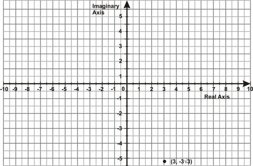

$r = \sqrt{3^2 + (-3\sqrt{3})^2}$

$= \sqrt{9 + 27}$

$= \sqrt{36}$

$= 6$

And for the angle,

$\mbox{tan}\ \theta_{ref} = \left |\frac{(-3\sqrt{3})} {3}\right |$

$\mbox{tan}\ \theta_{ref} = \sqrt{3}$

$\theta_{ref} = \frac{\pi} {3}$

But, since it is a 4_th_ quadrant angle

$\theta = \frac{5 \pi} {3}$

The rectangular point $(3, -3\sqrt{3}i)$ is equivalent to the polar point $\left (6, \frac{5\pi} {3}\right )$.

Polar form is $z =6\left (\mbox{cos}\ \frac{5\pi} {3} + i\ \mbox{sin}\ \frac{5\pi} {3}\right)$.

---

#### Multimedia Link:

!?[0](https://www.youtube.com/watch?v=g5_ojBMubAg)

Watch the video at: https://www.youtube.com/watch?v=g5_ojBMubAg

#### Explore More

Plot each complex number in the complex plane. Find its polar form.

1. a) $1 + i$

b) $i$

c) $(1 + i)i$

2. a) $-2$

b) $3i$

c) $(-2)(3i)$

3. a) $1 + i$

b) $1 - i$

c) $(1 + i)(1 - i)$

4. a) $1 + i\sqrt{3}$

b) $\sqrt{3} - i$

c) $(1 + i\sqrt{3})(\sqrt{3} - i)$

Change to polar form.

4. $-3 -2i$

5. $2\sqrt{3}  - 2i$

</article>

### 7.6 Quadratic Equations

<article>

### Solving Quadratic Equations with Complex Number Solutions

Ms. Harshita writes the equation $5x^2 + 125 = 0$ on the board. She asks the class how many solutions the equation has and what type they are.

Payal says the equation has two real solutions. Darshan says the equation has a double root, so only one solution. Nikita says the equation has two imaginary solutions.

Which one of them is correct?

#### Guidance

When you solve a quadratic equation, there will always be two answers. Until now, we thought the answers were always real numbers. In actuality, there are quadratic equations that have imaginary solutions as well. The possible solutions for a quadratic are:

2 real solutions

$$
\begin{align*}
x^2-4 &= 0\\
x &= -2,2
\end{align*}
$$

Double root

$$
\begin{align*}
x^2+4x+4 &= 0\\
x &= -2,-2
\end{align*}
$$

2 imaginary solutions

$$
\begin{align*}
x^2+4 &= 0\\
x &= -2i,2i
\end{align*}
$$

**The quadratic formula and the Discriminant**

If $ax^2 + bx + c = 0$

then $x = \frac{-b \pm \sqrt{b^2 - 4ac}} {2a}$

Recall that $b^2 - 4ac$ is called the discriminant.

If $b^2 - 4 ac > 0$ then there are two unequal real solutions.

Solve $3x^2+27=0$.

**Solution:**

First, factor out the GCF.

$$
3(x^2+9)=0
$$

Now, try to factor $x^2 + 9$. Rewrite the quadratic as $x^2 + 0x + 9$ to help. There are no factors of 9 that add up to 0. Therefore, this is not a factorable quadratic. Let’s solve it using square roots.

$$
\begin{align*}
3x^2+27 &= 0\\
3x^2 &= -27\\
x^2 &= -9\\
x &= \pm \sqrt{-9}= \pm 3i
\end{align*}
$$

#### Example B

Solve $(x-8)^2=-25$

**Solution:**

Solve using square roots.

$$
\begin{align*}
(x-8)^2 &= -25\\
x-8 &= \pm 5i\\
x &= 8 \pm 5i
\end{align*}
$$

#### Example C

Solve $2(3x-5)+10=-30$.

**Solution:**

Solve using square roots.

$$
\begin{align*}
2(3x-5)^2+10 &=-30\\
2(3x-5)^2 &=-40\\
(3x-5)^2 &=-20\\
3x-5 &=\pm2i\sqrt{5}\\
3x &=5\pm2i\sqrt{5}\\
x &=\frac{5}{3}\pm\frac{2\sqrt{5}}{3}i
\end{align*}
$$

#### Example D

Given: $x^2 + 4x + 6 = 0$

a) Use the discriminant to predict the nature of the roots.

b) Use the quadratic formula to solve and identify the roots.

c) Express the roots as complex numbers in standard form.

**Solutions:**

$x^2 + 4x + 6 = 0$

$a = 1, b = 4, c = 6$

$x = \frac{-4 \pm \sqrt{(4)^2 - (4)(1)(6)}} {2(1)}$

a) Since $b^2 - 4ac = -8$, there will be 2 complex solutions (no real solutions)

$x = \frac{-4 \pm \sqrt{-8}} {2}$

b) $x = \frac{-4 \pm 2i \sqrt{2}} {2}$

c) $x = -2 \pm i \sqrt{2}$

**Intro Problem Revisit** To solve $5x^2+125=0$, we first need to factor out the GCF.

$$
5(x^2+25)=0
$$

Now, try to factor $x^2 + 25$. Rewrite the quadratic as $x^2 + 0x + 25$ to help. There are no factors of 25 that add up to 0. Therefore, this is not a factorable quadratic. Let’s solve it using square roots.

$$
\begin{align*}
5x^2 + 125 &= 0\\
5x^2 &= -125\\
x^2 &= -25\\
x &= \pm \sqrt{-5}= \pm 5i
\end{align*}
$$

The equation has two roots and both of them are imaginary, so Nikita is correct.

#### Guided Practice

1. Solve $4(x-5)^2+49=0$.

2. Solve $-\frac{1}{2}(3x+8)^2-16=2$.

3. Solve the equations and express them as complex numbers

a) $18x^2 - 2x + 24 = 0$

b) $12\frac{4}{5}x^2 = 14\frac{2}{5}x - 11\frac{1}{5}$

**Answers:**

Both of these quadratic equations can be solved by using square roots.

1. 

$$
\begin{align*}
4(x-5)^2+49 &=0\\
4(x-5)^2 &=-49\\
(x-5)^2 &=-\frac{49}{4}\\
x-5 &=\pm\frac{7}{2}i\\
x &=5\pm\frac{7}{2}i
\end{align*}
$$

2. 

$$
\begin{align*}
-\frac{1}{2}(3x+8)^2-16 &=2\\
-\frac{1}{2}(3x+8)^2 &=18\\
(3x+8)^2 &=-36\\
3x+8 &=\pm6i\\
3x &=-8\pm6i\\
x &=-\frac{8}{3}\pm2i
\end{align*}
$$

3.

a) To solve $18x^2 - 2x + 24 = 0$

$9x^2 - x + 12 = 0$ Divide both sides by 2

$A = 9 | B = -1 | C = 12$ Identify A, B and C using standard form: $Ax^2 + Bx + C = 0$

$\frac{1 \pm \sqrt{1 - 4 (9)(12)}}{2(9)}$ Substitute the terms into the quadratic formula $\frac{-B \pm \sqrt{B^2 - 4 A C}}{2A}$

$x = \frac{1 \pm i\sqrt{431}}{18}$ By the quadratic formula

b) To solve $12\frac{4}{5}x^2 = 14\frac{2}{5}x - 11\frac{1}{5}$

$\frac{64}{5}x^2 - \frac{72}{5}x + \frac{56}{5} = 0$ Convert to improper fractions

$64x^2 - 72x + 56 = 0$ Multiply both sides by 5

$8x^2 -9x +7 = 0$ Divide both sides by 8

$A = 8 | B = -9 | C = 7$ Extract values for the quadratic formula

$x = \frac{9 \pm i\sqrt{143}}{16}$ By the quadratic formula

#### Explore More

Solve the following quadratic equations.

1. $x^2=-9$

2. $x^2+8=3$

3. $(x+1)^2=-121$

4. $5x^2+16=-29$

5. $14-4x^2=38$

6. $(x-9)^2-2=-82$

7. $-3(x+6)^2+1=37$

8. $4(x-5)^2-3=-59$

9. $(2x-1)^2+5=-23$

10. $-(6x+5)^2=72$

11. $7(4x-3)^2-15=-68$

Solve each equation and express the result as a complex number.

12. $12x\frac{4}{5}x = 3\frac{1}{5}x^2 + 16$

13. $3x^2 - 6x + 15 = 0$

14. $8x^2 - 5x + 11 = 0$

15. $34\frac{1}{2}x^2 - 23x + 19\frac{1}{6} = 0$

16. $-36x^2 - 18x + 6 = 27$

</article>

### 7.7 Square-Root of Complex Numbers

<article>

Students may refer to the following links:

* http://www.qc.edu.hk/math/Advanced%20Level/Finding%20the%20square%20root%20of%20a%20complex%20number.htm
* http://www.examsolutions.net/maths-revision/further-maths/complex-numbers/square-roots/tutorial-1.php

</article>

### 7.8 Summary

<article>

**Imaginary Numbers**

Any number with an $i$ associated with it. Imaginary numbers have the form $a + bi$ or $bi$.

**Complex Numbers**

All real and imaginary numbers. Complex numbers have the **standard form** $a + bi$, where $a$ or $b$ can be zero. $a$ is the **real part** and $bi$ is the **imaginary part**.

**Pure Imaginary Numbers**

An imaginary number without a real part, only $bi$.

The powers of $i$ are:

* $i=\sqrt{-1}$
* $i^2=-1$
* $i^3=-\sqrt{-1}=-i$
* $i^4=1$
* $i^5=i$
* . . . and the pattern repeats

**_Conjugates_** are binomial terms which are equal aside from inverse operations between them, e.g. $(3 + 2x)$ and $(3 - 2x)$.

**_Complex conjugates_** such as: $(3 + 2i)$ and $(3 - 2i)$ result in real numbers when multiplied.

$(a + bi) + (c + di) = [a + c] + [b + d]i$

$(a + ib) \cdot (c+id) = (ac-bd) + i(ad +bc)$

Multiplicative inverse of complex number

$z=(a+ib) \ \text{is}\ \frac{1}{z}=z^{-1}=\frac{a}{(a^2+b^2)}+i \left[\frac{b}{(a^2+b^2)} \right]$

$\frac{(a+ib)}{(c+id)}=(a+ib) \times \left[\frac{c}{(c^2+d^2)} + i \left[\frac{d}{(c^2 +d^2)} \right] \right]$

Modulus of $(a+ ib) = r = \sqrt{(a^2 +b^2)}$

The **_complex plane_** is the graphical representation of the set of all complex numbers.

The **_polar coordinate system_** defines each point by its angle on the unit circle $(\theta)$ and its distance from the origin $(r)$.  Points in the polar coordinate system are written as $(r, \theta)$.

The shorthand **_rcisθ_** is an abbreviation for: $z = r(\cos \theta + i \ sin \theta)$, a common notation for the polar form of a complex number.

The **_discriminant_** is the part of the quadratic formula under the radical: $b^2 - 4ac$. A positive discriminant suggests 2 real roots to the quadratic equation, a zero suggests 1 real root, and a negative indicates 2 complex roots.

A **_complex root_** is a complex number that, when used as an input $(x)$ value, results in an output $(y)$ value of zero.

The solutions of the quadratic equation $ax^2 + bx + c = 0$, where $a, b ,c$ are real numbers, $a$ is not equal to 0, $b^2 - 4ac <0$, are given by $x = \frac{-b \pm \sqrt {b^2-4ac}}{2a}$

</article>

### 7.9 Self Assessments

<article>

#### Assessment 1

##### Complex Numbers

http://www.ck12.org/analysis/Complex-Numbers/asmtpractice/Complex-Numbers-Practice/?referrer=concept_details

http://www.ck12.org/analysis/Imaginary-Numbers/asmtpractice/Imaginary-Numbers-Practice/?referrer=concept_details

#### Assessment 2

##### Argand Plane and Polar Representation

http://www.ck12.org/trigonometry/Polar-Form-of-a-Complex-Number/asmtpractice/Polar-Form-of-a-Complex-Number-Practice/?referrer=concept_details

</article>

### 7.10 Home Assignments

<article>

#### Assignment 1

##### Complex Numbers and Algebra of Complex Numbers

NCERT Exercise No. 5.1

Q. No. 4, 6, 9, 12, 14

#### Assignment 2

##### Argand Plane and Polar Representation

NCERT Exercise No. 5.2

Q. No. 2, 4, 7

#### Assignment 3

##### Quadratic Equations

NCERT Exercise No. 5.3

Q. No. 2, 4, 6, 9

#### Assignment 4

##### Square-root of Complex Numbers

NCERT Exercise No. 5.4

Q. No. 2, 4, 5

</article>

### 7.11 References for Advanced Understanding

<article>

**1. Powers and Roots of Complex Numbers**

http://www.ck12.org/analysis/Powers-and-Roots-of-Complex-Numbers/lesson/Powers-and-Roots-of-Complex-Numbers/

**2. Product and Quotient Theorems**

http://www.ck12.org/analysis/Product-and-Quotient-Theorems/lesson/Product-and-Quotient-Theorems/

**3. Distance between Polar Coordinates**

http://www.ck12.org/trigonometry/Distance-Between-Two-Polar-Coordinates/lesson/Distance-Between-Two-Polar-Coordinates/

**4. DeMoivre's Theorem**

http://www.ck12.org/trigonometry/DeMoivres-Theorem/lesson/DeMoivres-Theorem/

http://www.ck12.org/trigonometry/DeMoivres-Theorem-and-nth-Roots/lesson/DeMoivres-Theorem-and-nth-Roots/

http://www.ck12.org/trigonometry/DeMoivres-Theorem-and-nth-Roots/lesson/De-Moivres-Theorem-and-nth-Roots/

http://www.ck12.org/trigonometry/Equations-Using-DeMoivres-Theorem/lesson/Equations-Using-DeMoivres-Theorem/

**5. Geometry of Complex Roots**

http://www.ck12.org/trigonometry/Geometry-of-Complex-Roots/lesson/Geometry-of-Complex-Roots/

</article>

## 8.0 Linear Inequalities

<article>

</article>

### 8.1 Introduction

<article>

“We did very well,” she started. “We raised a total of Rs 12,000 and we had Rs 1,000 in our account, so we have Rs13,000 to spend on our uniforms. I know that may seem like a lot of money, but uniforms are expensive. We are only going to be able to purchase new jackets for everyone. If we have any money left over, we’ll buy new fingerless gloves because some of the ones we’re using look awful.”

“Mrs. Sharma, did you already pick the design of the jacket?” Ketki asked from the second row.

“Yes. It was one we voted on last year,” she said holding up a picture of the shiny, new navy jacket. “Now I need a few people to figure out the cost and if we have enough for the gloves too.”

Ketki and Udit volunteered to work on the arithmetic. Here is the information Mrs. Sharma gave them.

The jackets each cost Rs 99.95.

The total budget is Rs 13,000.

There are 144 students in the band.

“We will need to spend Rs 11,512.80 on the jackets,” Ketki said to Udit.

“Wow, that’s a lot of money. How much can we spend on the gloves?”

**That is a great question. It is one that can be answered by writing an inequality. The students need their total to be equal to or less than Rs 13,000. In this Concept, you will learn how to work with inequalities that have addition and/or subtraction in them. Then you will use what you have learned to help Ketki and Udit with the band uniforms.**

---

In our day to day life, we deal with many such situations which are not “equal to” type. Here, we are supposed to use “greater than or greater than equal to” or “less than or less than equal to” situations. All such situations come under the mathematical concept “Linear Inequalities”.

In this chapter, we will study linear inequalities and their algebraic and graphical solutions.

let's revise some of the basic rules of solving inequalities that you have studied in previous classes.

#### Guidance

Sometimes, you will have an inequality that is not as straightforward as $x>4$. With this example, we know that the variable will be equal to any number that is greater than four. This is quite easy to work with and we can write a set of numbers to make this inequality a true statement.

**What if it isn’t that simple?**

Sometimes, you will see an inequality like this one.

$$
x+3>7
$$

Here we need to figure out the set of numbers that will make this a true statement. We are looking for a number that when added to three is greater than seven.

**To figure this out, we will need to solve this inequality.**

Solving an inequality is similar to solving an equation. Here are some number properties that can help you solve inequalities.

**The** **_addition property of inequality_** **states that if the same number is added to each side of an inequality, the sense of the inequality stays the same.** In other words, the inequality symbol does not change.

If $a>b$, then $a+c>b+c$. If $a \ge b$, then $a+c \ge b+c$.

If $a \le b$, then $a+c \le b+c$.

What about subtraction? Remember, subtracting a number, $c$, is the same as adding its opposite, $-c$. So, the addition property of inequality applies to subtraction as well. We can also state this as it’s own property.

**The** **_subtraction property of inequality_** **states that if the same number is subtracted from each side of an inequality, the sense of the inequality stays the same.** In other words, the inequality symbol does not change.

If $a>b$, then $a-c > b-c$. If $a \ge b$, then $a-c \ge b-c$.

If $a<b$, then $a-c < b-c$. If $a \le b$, then $a-c \le b-c$.

Applying these properties makes our work quite simple. You can think of solving inequalities in the same way that you thought of solving equations. The big difference is that your answer will be a set of numbers and not a single number.

**Similar to addition and subtraction property, we can have multiplication and division property as follows:**

**Multiplication Property of Inequality:** For all real positive numbers $a$, $b$ and $c$:

If $x$  <  $a$, then $x \cdot (c)$  <  $a \cdot (c)$.

If $x$  >  $a$, then $x \cdot (c)$  >  $a \cdot (c)$.

---

**Division Property of Inequality:** For all real positive numbers $a$ and $c$:

_If_ $x < a$, _then_ $x \div (c) < a \div (c).$

_If_ $x > a$, _then_ $x \div (c) > a \div (c).$

**Multiplication/Division Rule of Inequality:** For any real number $a$, and any **negative** number $c$,

_If_ $x<a$, _then_ $x \cdot c > a \cdot c$

_If_ $x<a$, _then_ $\frac{x}{c} > \frac{a}{c}$

As with the other properties of inequalities, these also hold true for $\le$ _or_ $\ge$.

</article>

### 8.2 Inequalities

<article>

What if you solved an inequality and came up with the solution $x > -3$? How else could you express this solution? After completing this Concept, you'll be able to express the solution of an inequality in inequality notation, set notation, interval notation, and as a solution graph.

#### Watch This

!?[0](https://www.youtube.com/watch?v=g4He9ckyRyQ)

Watch the video at: https://www.youtube.com/watch?v=g4He9ckyRyQ

#### Guidance

Ms. Jain wants to buy identical boxes of art supplies for her 25 students. If she can spend no more than Rs 375 on art supplies, what inequality describes the price can she afford for each individual box of supplies?

**Expressing Solutions of an Inequality**

The solution of an inequality can be expressed in four different ways:

1. **Inequality notation** The answer is simply expressed as $x < 15$.

2. **Set notation** The answer is expressed as a set: $\{x|x < 15 \}$. The brackets indicate a set and the vertical line means “such that,” so we read this expression as “the set of all values of $x$ such that $x$ is a real number less than 15”.

3. **Interval notation** uses brackets to indicate the range of values in the solution. For example, the answer to our problem would be expressed as $(-\infty, \ 15)$, meaning “the interval containing all the numbers from $-\infty$ to 15 but not actually including $-\infty$ or 15”.

a) Square or **closed brackets** “\[” and “\]” indicate that the number next to the bracket is included in the solution set.

b) Round or **open brackets** “(” and “)” indicate that the number next to the bracket is not included in the solution set. When using **infinity** and **negative infinity** ($\infty$ and $-\infty$), we always use open brackets, because infinity isn’t an actual number and so it can’t ever really be included in an interval.

4. **Solution graph** shows the solution on the real number line. A closed circle on a number indicates that the number is included in the solution set, while an open circle indicates that the number is not included in the set. For our example, the solution graph is:

a) \[-4, 6. means that the solution is all numbers between -4 and 6 **including** -4 and 6.

b) (8, 24) means that the solution is all numbers between 8 and 24 **not including** the numbers 8 and 24.

c) \[3, 12) means that the solution is all numbers between 3 and 12, **including** 3 but **not including** 12.

d) $(-10, \infty)$ means that the solution is all numbers greater than -10, **not including** -10.

e) $(-\infty,\infty)$ means that the solution is all real numbers.

**Identify the Number of Solutions of an Inequality**

Inequalities can have:

* A set that has an infinite number of solutions.
* A set that has a discrete number of solutions.
* No solutions.

The inequalities we have solved so far all have an infinite number of solutions, at least in theory. For example, the inequality $\frac{5x-1}{4} > -2(x+5)$ has the solution $x>-3$. This solution says that all real numbers greater than -3 make this inequality true, and there are infinitely many such numbers.

However, in real life, sometimes we are trying to solve a problem that can only have positive integer answers, because the answers describe numbers of discrete objects.

For example, suppose you are trying to figure out how many Rs 8 ball pens you can buy if you want to spend less than Rs 50. An inequality to describe this situation would be $8x<50$, and if you solved that inequality you would get $x < \frac{50}{8}$, or $x < 6.25$.

But could you really buy _any_ number of ball pens as long as it’s less than 6.25? No; you couldn’t really buy 6.1 ball pens, or -5 ball pens, or any other fractional or negative number of ball pens. So if we wanted to express our solution in set notation, we couldn’t express it as the set of all numbers less than 6.25, or $\{x|x<6.25\}$. Instead, the solution is just the set containing all the _nonnegative whole numbers_ less than 6.25, or {0, 1, 2, 3, 4, 5, 6}. When we’re solving a real-world problem dealing with discrete objects like ball pens, our solution set will often be a finite set of numbers instead of an infinite interval.

An inequality can also have no solutions at all. For example, consider the inequality $x-5>x+6$. When we subtract $x$ from both sides, we end up with $-5>6$, which is not true for any value of $x$. We say that this inequality has no solution.

The opposite can also be true. If we flip the inequality sign in the above inequality, we get $x-5 < x+6$, which simplifies to $-5<6$. That’s always true no matter what $x$ is, so the solution to that inequality would be all real numbers, or $(-\infty,\infty)$.

**Solve Real-World Problems Using Inequalities**

Solving real-world problems that involve inequalities is very much like solving problems that involve equations.

#### Example B

_In order to get a bonus this month, Lalit must sell at least 120 newspaper subscriptions. He sold 85 subscriptions in the first three weeks of the month. How many subscriptions must Lalit sell in the last week of the month?_

**Solution:**

Let $x =$ the number of subscriptions Lalit sells in the last week of the month. The total number of subscriptions for the month must be greater than 120, so we write $85+x \ge 120$. We solve the inequality by subtracting 85 from both sides: $x \ge 35$.

**Lalit must sell 35 or more subscriptions in the last week to get his bonus.**

To check the answer, we see that $85 + 35 = 120$. If he sells 35 or more subscriptions, the total number of subscriptions he sells that month will be 120 or more. **The answer checks out**.

#### Example C

_A group of Class VI students is trying to raise at least Rs 650 this summer. How many boxes of Erasers (each box has only two erasers) must they sell at Rs 4.50 per box in order to reach their goal?_

**Solution:**

Let $x =$ number of boxes sold. Then the inequality describing this problem is $4.50x \ge 650$.

We solve the inequality by dividing both sides by 4.50: $x \ge 144.44$.

We round up the answer to 145 since only whole boxes can be sold.

**Group of Class VI students must sell at least 145 boxes.**

If we multiply 145 by Rs 4.50 we obtain Rs 652.50, so if the group sells more than 145 boxes they will raise more than Rs 650. But if they sell 144 boxes, they will only raise Rs 648, which is not enough. So they must indeed sell at least 145 boxes. **The answer checks out**.

Watch this video for help with the Examples above.

!?[0](https://www.youtube.com/watch?v=YqLCYPGZG7Y)

Watch the video at: https://www.youtube.com/watch?v=YqLCYPGZG7Y

#### Guided Practice

_The width of a rectangle is 20 cm. What must the length be if the perimeter is at least 180 cm?_

**Solution:**

Let $x =$ length of the rectangle. The formula for perimeter is

$$
\text{Perimeter} = 2 \times \text{length} + 2 \times \text{width}
$$

Since the perimeter must be at least 180 cm, we have $2x+2(20) \ge 180$.

Simplify: $2x+40 \ge 180$

Subtract 40 from both sides: $2x \ge 140$

Divide both sides by 2: $x \ge 70$

**The length must be at least 70 cm.**

If the length is at least 70 cm and the width is 20 cm, then the perimeter is at least $2(70) + 2(20) = 180 \ cm$. **The answer checks out**.

#### Explore More

Solve each inequality. Give the solution in inequality notation and interval notation.

1. $x+15 < 12$

2. $x-4 \ge 13$

3. $9x > -\frac{3}{4}$

4. $-\frac{x}{15} \le 5$

5. $620x > 2400$

6. $\frac{x}{20} \ge -\frac{7}{40}$

7. $\frac{3x}{5} > \frac{3}{5}$

8. $x+3 > x-2$

Solve each inequality. Give the solution in inequality notation and set notation.

9. $x+17<3$

10. $x-12 \ge 80$

11. $-0.5x \le 7.5$

12. $75x \ge 125$

13. $\frac{x}{-3} > -\frac{10}{9}$

14. $\frac{x}{-15} < 8$

15. $\frac{x}{4} > \frac{5}{4}$

16. $3x-7 \ge 3(x-7)$

Solve the following inequalities, give the solution in set notation, and show the solution graph.

17. $4x+3< -1$

18. $2x<7x-36$

19. $5x>8x+27$

20. $5-x<9+x$

21. $4-6x\le 2(2x+3)$

22. $5(4x+3)\ge 9(x-2)-x$

23. $2(2x-1)+3<5(x+3)-2x$

24. $8x-5(4x+1) \ge -1+2(4x-3)$

25. $9. \ 2(7x-2)-3(x+2)<4x-(3x+4)$

26. $\frac{2}{3}x-\frac{1}{2}(4x-1) \ge x+2(x-3)$

27. At the Delhi Zoo you can either pay Rs 22 for the entrance fee or Rs 71 for the yearly pass which entitles you to unlimited admission.

a) At most how many times can you enter the zoo for the Rs 22 entrance fee before spending more than the cost of a yearly membership?

b) Are there infinitely many or finitely many solutions to this inequality?

28. Prateek's scores for four tests were 82, 95, 86, and 88. What will he have to score on his fifth and last test to average at least 90 for the term?

</article>

### 8.3 Algebraic and Graphical Solution of Linear Inequalities in One Variable

<article>

What if you had an inequality with an unknown variable like $x - 12 > -5$? How could you isolate the variable to find its value? After completing this Concept, you'll be able to solve one-step inequalities like this one.

#### Watch This

!?[0](https://www.youtube.com/watch?v=JxCFFpKVApQ)

Watch the video at: https://www.youtube.com/watch?v=JxCFFpKVApQ

#### Guidance

To solve an inequality we must isolate the variable on one side of the inequality sign. To isolate the variable, we use the same basic techniques used in solving equations.

We can solve some inequalities by adding or subtracting a constant from one side of the inequality.

#### Example A

_Solve the inequality and graph the solution set._

$$
x-3<10
$$

**Solution:**

Starting inequality: $x-3 < 10$

Add **3** to both sides of the inequality: $x - 3 + 3 < 10 + 3$

**Simplify:** $x < 13$

_Solve the inequality and graph the solution set._

$$
x-20 \le 14
$$

**Solution:**

Starting inequality: $x - 20 \le 14$

Add **20** to both sides of the inequality: $x - 20 + 20 \le 14 + 20$

**Simplify:** $x \le 34$

We can also solve inequalities by multiplying or dividing both sides by a constant. For example, to solve the inequality $5x<3$, we would divide both sides by 5 to get $x < \frac{3}{5}$.

However, something different happens when we multiply or divide by a negative number. We know, for example, that 5 is greater than 3. But if we multiply both sides of the inequality $5>3$ by -2, we get $-10 > -6$. And we know that’s not true; -10 is less than -6.

This happens whenever we multiply or divide an inequality by a negative number, and so we have to flip the sign around to make the inequality true. For example, to multiply $2 < 4$ by -3, first we multiply the 2 and the 4 each by -3, and then we change the &lt; sign to a &gt; sign, so we end up with $-6 > -12$.

The same principle applies when the inequality contains variables.

#### Example C

_Solve the inequality._

$$
4x < 24
$$

**Solution:**

Original problem: $4x < 24$

Divide both sides by 4: $\frac{4x}{4} < \frac{24}{4}$

**Simplify:** $x < 6$

#### Example D

_Solve the inequality._

$$
-5x \le 21
$$

**Solution:**

Original problem: $-5x \le 21$

Divide both sides by -5 : $\frac{-5x}{-5} \ge \frac{21}{-5}$ **_Flip the inequality sign._**

**Simplify:** $x \ge -\frac{21}{5}$

---

Watch this video for help with the Examples above.

!?[0](https://www.youtube.com/watch?v=q8j4NA5ieqM)

Watch the video at: https://www.youtube.com/watch?v=q8j4NA5ieqM

#### Guided Practice

_Solve each inequality._

a) $x+8 \le -7$

b) $x+4 > 13$

c) $\frac{x}{25} < \frac{3}{2}$

d) $\frac{x}{-7} \ge 9$

**Solutions:**

a) Starting inequality: $x+8 \le -7$

Subtract **8** from both sides of the inequality: $x + 8 - 8 \le -7 - 8$

**Simplify:** $x\le -15$

 Starting inequality: $x+4 > 13$")

Subtract **4** from both sides of the inequality: $x + 4 - 4 > 13 - 4$

**Simplify:** $x > 9$

 Original problem: $\frac{x}{25} < \frac{3}{2}$")

Multiply both sides by 25: $25 \cdot \frac{x}{25} < \frac{3}{2} \cdot 25$

**Simplify:** $x < \frac{75}{2}$ or $x < 37.5$

d) Original problem: $\frac{x}{-7} \ge 9$

Multiply both sides by -7: $-7 \cdot \frac{x}{-7} \le 9 \cdot (-7)$ **_Flip the inequality sign._**

**Simplify:** $x \le -63$

---

#### Explore More

For 1-8, solve each inequality and graph the solution on the number line.

1. $x-5 < 35$

2. $x+15 \ge -60$

3. $x-2 \le 1$

4. $x-8 > -20$

5. $x+11>13$

6. $x+65<100$

7. $x-32 \le 0$

8. $x+68 \ge 75$

For 9-12, solve each inequality. Write the solution as an inequality and graph it.

9. $3x \le 6$

10. $\frac{x}{5} > -\frac{3}{10}$

11. $-10x>250$

12. $\frac{x}{-7} \ge -5$

**Those were easy to solve. Now let's solve inequality having variable on both the sides.**

### Solving Multi-Step Inequalities

Adding antifreeze to a car's cooling system can lower the freezing point of the water-based liquids that enable the vehicle to run. (It also raises the boiling point of these liquids.) You added enough antifreeze to lower the freezing point of the liquids to at most $-35^\circ C$ (in Celsius). Write the inequality in Fahrenheit.

#### Watch This

!?[0](https://www.youtube.com/watch?v=XOAn5z8mkvI)

Watch the video at: http://www.youtube.com/watch?v=XOAn5z8mkvI

#### Guidance

Like multi-step equations, multi-step inequalities can involve having variables on both sides, the Distributive Property, and combining like terms. Again, the only difference when solving inequalities is the sign must be flipped when multiplying or dividing by a negative number.

#### Example A

Is $x = -3$ a solution to $2(3x-5) \le x+10$?

**Solution:**

Plug in -3 for $x$ and see if the inequality is true.

$$
\begin{align*}
\begin{array}{rcl}
2(3(-3)-5) & \le & (-3)+10. \\
2(-9-5) & \le & 7. \\
2 \cdot (-14) & \le & 7. \\
-28 & \le & 7
\end{array}
\end{align*}
$$

This is a true inequality statement. -3 is a solution.

#### Example B

Solve and graph the inequality from Example A.

**Solution:**

First, distribute the 2 on the left side of the inequality.

$$
\begin{align*}
2(3x-5) & \le x+10\\
6x-10 & \le x+10
\end{align*}
$$

Now, subtract the $x$ on the right side to move it to the left side of the inequality. You can also add the 10’s together and solve.

$$
\begin{align*}
& \ 6x-\bcancel{10} \ge \bcancel{x}+10\\
& \underline{-x+\bcancel{10} \ - \bcancel{x}+10}\\
& \qquad \frac{\bcancel{5}x}{\bcancel{5}} \le \frac{20}{5}\\
& \qquad \ \ x \le 4
\end{align*}
$$

Test a solution, $x = 0: 2(3(0)-5) \le 0+10 \checkmark$

$-10 \le 10$

The graph looks like:

Solve $8x-5-4x \ge 37-2x$

---

**Solution:**

First, combine like terms on the left side. Then, solve for $x$.

$$
\begin{align*}
& 8x-5-4x \ge 37-2x\\
& \qquad 4x-\bcancel{5} \ge 37-\bcancel{2x}\\
& \underline{\quad +2x + \bcancel{5} \ +5+\bcancel{2x}}\\
& \qquad \quad \ \ \frac{\bcancel{6}x}{\bcancel{6}} \ge \frac{42}{6}\\
& \qquad \quad \quad \ x \ge 7
\end{align*}
$$

Test a solution, $x = 10: 8(10)-5-4(10) \ge 37-2(10)$

$80-5-40 \ge 37-20$

$35 \ge 17 \checkmark$

**Intro Problem Revisit** Recall that the conversion formula for Celsius to Fahrenheit is $C= \frac{5}{9}(F-32)$. The temperature can be equal to or greater than $-35^\circ C$.

$$
\begin{align*}
\begin{array}{rcl}
\frac{5}{9}(F-32) & \ge & -35 \\ \\
F-32 & \ge & -35 \cdot \left(\frac{9}{5} \right) \\ \\
F -32 & \ge & -63 \\ \\
F & \ge & -31 
\end{array}
\end{align*}
$$

So, the temperature can be equal to or higher than $-31^\circ F$.

#### Guided Practice

1. Is $x = 12$ a solution to $-3(x-10)+18 \ge x-25$?

Solve and graph the following inequalities.

2. $-(x+16)+3x>8$

3. $24-9x<6x-21$

**Answers:**

1. Plug in 12 for $x$ and simplify.

$$
\begin{align*}
\begin{array}{rcl}
-3(12-10)+18 & \ge & 12-35. \\
(-3) \cdot 2 + 18 & \ge &  -13. \\
-6+18 & \ge & -13
\end{array}
\end{align*}
$$

This is true because $12 \ge -13$, so 12 is a solution.

---

2. Distribute the negative sign on the left side and combine like terms.

$$
\begin{align*}
& -(x+16)+3x>8\\
& \quad -x-16+3x>8\\
& \qquad \quad \ \ 2x-\bcancel{16}>8\\
& \underline{\qquad \qquad \quad +\bcancel{16} +16 \; \; \;}\\
& \qquad \qquad \quad \ \ \frac{\bcancel{2}x}{\bcancel{2}}>\frac{24}{2}\\
& \qquad \qquad \qquad \ x>12
\end{align*}
$$

Test a solution, $x = 15:$

$$
\begin{align*}
-(15+16)+3(15) &> 8\\
-31+45 &> 8 \\
14 &> 8
\end{align*}
$$

3. First, add $9x$ to both sides and add 21 to both sides.

$$
\begin{align*}
& \ 24-\bcancel{9x}<6x-21\\
& \underline{\quad \ + \bcancel{9x} \ + 9x \; \; \; \; \; \; \; \; \; \;}\\
& \qquad \ 24<15x-\bcancel{21}\\
& \underline{\quad \ \ +21 \qquad \ +\bcancel{21} \; \;}\\
& \qquad \frac{45}{15} < \frac{\bcancel{15}x}{\bcancel{15}}\\
& \qquad \ \ 3<x
\end{align*}
$$

Test a solution, $x = 10:$

$$
\begin{align*}
24-9(10) &< 6(10)-21\\
24-90 &< 60-21 \\
-66 &< 39
\end{align*}
$$

#### Explore More

Determine if the following numbers are solutions to $-7(2x-5)+12>-4x-13$.

1. $x=4$

2. $x=10$

3. $x=6$

Solve and graph the following inequalities.

4. $2(x-5) \ge 16$

5. $-4(3x+7)<20$

6. $15x-23>6x-17$

7. $5x+16+2x\le - 19$

8. $4(2x-1)\ge3(2x+1)$

9. $11x-17-2x \le - (x-23)$

Solve the following inequalities.

10. $5-5x>4(3-x)$

11. $-(x-1)+10<-3(x-3)$

12. Solve $5x+4 \le -2(x+3)$ by adding the $2x$ term on the right to the left-hand side.

13. Solve $5x+4 \le-2(x+3)$ by _subtracting_ the $5x$ term on the left to the right-hand side.

14. Compare your answers from 12 and 13. What do you notice?

15. Challenge Solve $3x-7>3(x+3)$. What happens?

### Multi-Step Inequalities

#### Guidance

In the last two sections, we considered very simple inequalities which required one step to obtain the solution. However, most inequalities require several steps to arrive at the solution. As with solving equations, we must use the order of operations to find the correct solution. In addition, remember that **when we multiply or divide the inequality by a negative number, the direction of the inequality changes.**

The general procedure for solving multi-step inequalities is almost exactly like the procedure for solving multi-step equations:

1. Clear parentheses on both sides of the inequality and collect like terms.

2. Add or subtract terms so the variable is on one side and the constant is on the other side of the inequality sign.

3. Multiply and divide by whatever constants are attached to the variable. Remember to change the direction of the inequality if you multiply or divide by a negative number.

#### Example A

_Solve the inequality $\frac{9x}{5}-7 \ge -3x + 12$ and graph the solution set._

**Solution:**

Original problem: $\frac{9x}{5}-7 \ge -3x+12$

Add $3x$ to both sides: $\frac{9x}{5} + 3x - 7 \ge -3x+3x+12$

**Simplify:** $\frac{24x}{5}-7 \ge 12$

Add 7 to both sides: $\frac{24x}{5}-7+7 \ge 12+7$

**Simplify:** $\frac{24x}{5} \ge 19$

Multiply 5 to both sides: $5 \cdot \frac{24x}{5} \ge 5 \cdot 19$

**Simplify:** $24x \ge 95$

Divide both sides by 24: $\frac{24x}{24} \ge \frac{95}{24}$

**Simplify:** $x \ge \frac{95}{24}$ **Answer**

---

Graph: 

_Solve the inequality $-25x + 12 \le -10x - 12$ and graph the solution set._

**Solution:**

Original problem: $-25x+12 \le -10x-12$

Add $10x$ to both sides: $-25x+10x+12 \le -10x+10x-12$

**Simplify:** $-15x+12 \le -12$

Subtract 12: $-15x+12-12\le -12-12$

**Simplify:** $-15x \le -24$

Divide both sides by -15: $\frac{-15x}{-15} \ge \frac{-24}{-15}$ **_flip the inequality sign_**

**Simplify:** $x \ge \frac{8}{5}$ **Answer**

Graph: 

_Solve the inequality $4x-2(3x-9) \le -4(2x-9)$._

**Solution:**

Original problem: $4x-2(3x-9) \le -4(2x-9)$

Simplify parentheses: $4x-6x+18 \le -8x+36$

Collect like terms: $-2x+18 \le -8x+36$

Add $8x$ to both sides: $-2x+8x+18 \le -8x+8x+36$

**Simplify:** $6x+18 \le 36$

Subtract 18: $6x+18-18 \le 36-18$

**Simplify:** $6x \le 18$

Divide both sides by 6: $\frac{6x}{6} \le \frac{18}{6}$

**Simplify:** $x \le 3$ **Answer.**

**Now we will solve compound inequalities.**

### Compound Inequalities

Mr. Kumar, announces that the students' final grades will consist of 40% projects (0-100 score). The remaining 60% (0-100) will come from the final exam. Going into the final exam, Mahima has an 84 in the project score. Within what grade range must she fall on the final exam to raise her score to an A (90-100 overall score)?

#### Watch This

!?[0](https://www.youtube.com/watch?v=cvB8b4AACyE)

Watch the video at: http://www.youtube.com/watch?v=cvB8b4AACyE

#### Guidance

Compound inequalities are inequalities that have been joined by the words “and” or “or.” For example:

$-2 < x \le 5$ Read, “$x$ is greater than -2 _and_ less than or equal to 5.”

$x \ge 3$ or $x<-4$ Read, “$x$ is greater than or equal to 3 _or_ less than -4.”

Notice that both of these inequalities have two inequality signs. So, it is like solving or graphing two inequalities at the same time. When graphing, look at the inequality to help you. The first compound inequality above, $-2<x \le 5$, has the $x$ in between -2 and 5, so the shading will also be between the two numbers.

Write the inequality statement given by the graph below.

Because the shading goes in opposite directions, we know this is an “or” statement. Therefore, the statement is $x<-2$ or $x>1$.

#### Example B

Solve and graph $-3<2x+5 \le 11$.

**Solution:**

This is like solving two inequalities at the same time. You can split the statement apart to have two inequalities, $-3<2x+5$ and $2x+5\le 11$ and solve. You can also leave the compound inequality whole to solve.

$$
\begin{align*}
& -3<2x+\bcancel{5} \le 11\\
& \underline{\ -5 \qquad \ -\bcancel{5} \ \ -5}\\
& \frac{-8}{2}< \frac{\bcancel{2}x}{\bcancel{2}} \le \frac{6}{2}\\
& -4<x \le 3
\end{align*}
$$

Test a solution, $x = 0:$

$$
\begin{align*}
-3<2(0)+5 & \le 11\\
-3<5 & \le 11
\end{align*}
$$

Here is the graph:

Solve and graph $-32>-5x+3$ or $x-4 \le 2$.

**Solution:**

When solving an “or” inequality, solve the two inequalities separately, but show the solution on the same number line.

$$
\begin{align*}
& -32 > -5x + \bcancel{3} \ or \ x- \bcancel{4} \le 2\\
& \underline{\ -3 \quad \ \qquad -\bcancel{3}} \quad \quad \underline{\ +\bcancel{4} \ +4}\\
& \frac{-35}{-5} > \frac{-\bcancel{5}x}{-\bcancel{5}} \qquad \qquad \quad x \le 6\\
& \quad \ 7<x
\end{align*}
$$

Notice that in the first inequality, we had to flip the inequality sign because we divided by -5. Also, it is a little more complicated to test a solution for these types of inequalities. You still test one point, but it will only work for one of the inequalities. Let’s test $x = 10$. First inequality: $-32>-5(10)+3 \rightarrow -32>-47$. Second inequality: $10-4 \le 2 \rightarrow 5 \cancel{\le} 2$. Because $x = 10$ works for the first inequality, is a solution. Here is the graph.

 + 0.6x$ where _x_ is the final exam score. Mahima wants to get an A, so we will have a compound inequality that ranges between 90 and 100.")

$$
\begin{align*}
\begin{array}{rcl}
90 & \le & 33.6 + 0.6x \le 100 \\ \\
56.4 & \le & 0.6x \le 66.4 \\ \\
94 & \le & x \le 110.67 
\end{array}
\end{align*}
$$

Unless Mr. Kumar offers extra credit, Mahima can't score higher than 100. So, she has to score at least 94 or more, up to 100, to get an A.

#### Guided Practice

1. Graph $-7 \le x \le -1$ on a number line.

Solve the following compound inequalities and graph.

2. $5 \le - \frac{2}{3}x+1 \le 15$

3. $\frac{x}{4}-7>5$ or $\frac{8}{5}x+2\le 18$

**Answers:**

1. This is an “and” inequality, so the shading will be between the two numbers.

 

$$
\begin{align*}
& \ \ 5 \le - \frac{2}{3}x+ \bcancel{1} \le 15\\
& \underline{-1 \qquad \quad \ \ -\bcancel{1} \ \ -1}\\
& \qquad \ 4 \le - \frac{2}{3}x \le 14\\
& -\frac{3}{2} \left(4 \le -\frac{2}{3}x \le 14\right)\\
& \quad \ \ -6 \ge x \ge -21
\end{align*}
$$

Test a solution, $x = -10:$

$$
\begin{align*}
\begin{array}{rcl}
5 & \le & - \frac{2}{3}(-12)+1 \le 15\\
5 & \le &  9 \le 15 
\end{array}
\end{align*}
$$

This solution can also be written $-21 \le x \le -6$.

The graph is:

$$
\begin{align*}
& \frac{x}{4}- \bcancel{7} > 5 \quad \quad or \quad \ \frac{8}{5}x+ \bcancel{2} \le 18\\
& \underline{\ \ + \bcancel{7} \ +7 \; \; \; \; \; \;} \qquad \underline{\qquad \ - \bcancel{2} \ \ -2 \; \; \; \;}\\
& \ \bcancel{4} \cdot \frac{x}{4} > 12 \cdot 4 \ or \quad \ \xcancel{\frac{5}{8} \cdot \frac{8}{5}}x \le 16 \cdot \frac{5}{8}\\
& \ \quad \ x > 48 \quad \ \ or \qquad \quad \ \ x \le 10
\end{align*}
$$

---

Test a solution, $x = 0:$

$$
\begin{align*}
& \frac{0}{4} -7 > 5 \ \ or \ \frac{8}{5}(0)+2 \le 18\\
& \ \ -7 \ \bcancel{\ge} \ 5 \ \ or \qquad \quad \ 2 \le 18
\end{align*}
$$

Notice that $x = 0$ is a solution for the second inequality, which makes it a solution for the entire compound inequality. Here is the graph:

#### Explore More

Graph the following compound inequalities. Use an appropriate scale.

1. $-1 < x < 8$

2. $x > 5$ or $x \le 3$

3. $-4 \le x \le 0$

Write the compound inequality that best fits each graph below.

4. ")

\[Figure 17\]

6. 

7. $-11 < x -9 \le 2$

8. $8 \le 3 -5x < 28$

9. $2x-7 > -13$ or $\frac{1}{3}x+5 \le 1$

10. $0 < \frac{x}{5} < 4$

11. $-4x+9<35$ or $3x-7 \le -16$

12. $\frac{3}{4}x+7 \ge -29$ or $16 - x > 2$

13. $3 \le 6x -15 < 51$

14. $-20 < - \frac{3}{2}x+1 < 16$

15. Challenge Write a compound inequality whose solutions are all real numbers. Show why this is true.

---

Watch this video for help with the Examples above.

!?[0](https://www.youtube.com/watch?v=SHMggaPNuXA)

Watch the video at: https://www.youtube.com/watch?v=SHMggaPNuXA

### Real World Example - Hybrid Cars

#### Fuel Efficiency

Any vehicle that combines two or more sources of power to provide propulsion is considered a hybrid. Most hybrid cars on the road right now are petrol\-electric hybrids; they can operate using petrol in their tanks or electricity from their batteries—or at times, both (when you need a little extra boost driving uphill, for instance). When you’re driving in the city, you have to make frequent stops at traffic lights. Every time you hit the brakes, you lose the momentum you had and that energy is completely wasted. On top of that, your engine keeps running while you’re waiting at a red light and that burns petrol! What a hybrid car does is transform these wasted energies into electric energy that is stored in its battery. While driving, a hybrid car can also stop its use of the petrol engine and operate only using the battery during coasting and slow-down phases.

Watch this video to learn more about the fuel efficiency of hybrid cars: [http://www.youtube.com/watch?v=SHD6sSBePZ4](http://www.youtube.com/watch?v=SHD6sSBePZ4http://www.youtube.com/watch?v=SHD6sSBePZ4)

!?[0](https://www.youtube.com/watch?v=SHD6sSBePZ4)

#### Explore More

Hybrid cars definitely contribute less pollution to the environment, and they help reduce our dependency on fossil fuels. However, for most people, the choice between a hybrid and a standard car all comes down to the overall cost-efficiency.

### Cheez Its

#### Real World Applications

How are algebraic relationships represented in the nutrition facts of snacks?

#### Student Exploration

Below is a copy of the nutrition facts for a box of Cheez Its (Four Cheese), one of the most popular snack foods.

Let’s say that I’m addicted to Cheez Its and I can never really have just one serving size, which is 36 crackers. We can represent this relationship in a table.

|     |     |     |     |     |     |
| --- | --- | --- | --- | --- | --- |
|     |     |     |     |     |     |
| \# of serving size | 0   | 1   | 2   | 3   | 4   |
| \# of crackers total | 0   | 36  | 72  | 108 | 144 |

According to this table, 144 crackers eaten is equivalent to 4 servings! That’s a lot!

If we were to calculate the number of crackers in 10 servings, we can write this as an expression and figure it out. If $x$ represents the number of serving sizes, the expression is $36x$. So, in 10 servings, I could eat 360 crackers. (I might also have a stomach ache too.)

We can also represent this relationship as an equation. If y represents the number of crackers, our equation would be $y = 36x$. If I wanted to eat 200 crackers we can figure out how many serving sizes that would equate to. $200 = 36x$. We would divide both sides by 36, and find that $x = 5.6$, or a little over 5 and a half serving sizes.

When you get older, you will start to see that a lot of adults care about their calorie intake. According to the nutrition facts, one serving size has about 140 calories. People usually like to base what they eat on a 2000 calorie diet. Taking this fact into account, what is the maximum number of cheez its that I can eat in a day? Let’s create another equation to represent this relationship.

Let $x$ represent the number of cheez its I eat, and let $y$ represent the number of calories. Our equation is $\frac{x}{y} = \frac{36}{140}$. This special equation is also called a proportion. If we use multiplication to eliminate the denominators, our new equation is $\frac{(140x)}{36} = y$. Since we can’t exceed our 2000 calorie diet, our inequality is $\frac{(140x)}{36} \le 2000$. What value of $x$ would make this statement true?

We can use just two steps to figure this out! First, multiply both sides by 36 to eliminate the denominator. We now have $140x \le  72000$. Next, we divide both sides by 140. So, $x \le 514.3$. This means that I can’t eat more than 514 crackers in one day, assuming that’ll be the ONLY food I eat all day.

Now we have the maximum amount of crackers I can have in one day, how many servings is this?

$$
\frac{514}{36} = 14 \ \text{servings}.
$$

Note: It is not suggested that a person eat 514 Cheez Its!

#### Extension Investigation

Try looking at the nutrition facts label on your favorite food, and figure out what the maximum amount you can eat of that particular food, based on a 2000 calorie diet.

#### Real World Applications

#### Topic

Where do you see compound inequalities in your world?

#### Student Exploration

In this activity, we will apply our basic understanding of compound inequalities to things and activities we see around us. In the concept, you learned about two different types of compound inequalities.

An example of a compound inequality involving the word “and” can be thought of as an elevator. An elevator for a building must be greater than (or equal to) floor zero and the top floor. For a 20-floor apartment building with no basement, we can represent the elevator reaching all of the floors between the ground floor and the top floor, or $0 \le x \le 20$. In words, we can say that the elevators must be able to reach greater than or equal to the ground floor AND less than or equal to the $20^{th}$ floor.

An example of a compound inequality involving the word “or” can be thought of a car burning fuel. A car burns more petrol when it’s going either really slow or really fast. When we look at how the different ways driving a car can be more expensive, a car must be going below 40 km an hour and higher than 70 km an hour. The inequality to represent this is the speed is less than 40 km per hour OR greater than 70 km per hour. We can say, $x < 40$ or $x > 70$.

</article>

### 8.4 Graphical Solution of Linear Inequalities in Two Variables

<article>

### Linear Inequalities in Two Variables

When a linear equation is graphed in a coordinate plane, the line splits the plane into two pieces. Each piece is called a **half plane**. The diagram below shows how the half planes are formed when graphing a linear equation.

$, you must also include all the other ordered pairs that could be solutions to the inequality. This is called the **solution set** and is shown by shading, or coloring, the half plane that includes the appropriate solutions.")

When graphing inequalities in two variables, you must remember when the value is included ($\le$ _or_ $\ge$) or not included ($<$ _or_ $>$). To represent these inequalities on a coordinate plane, instead of shaded or unshaded circles, we use solid and dashed lines. We can tell which half of the plane the solution is by looking at the inequality sign.

* $>$ The solution is the half plane above the line.
* $\ge$ The solution is the half plane above the line and also all the points on the line.
* $<$ The solution is the half plane below the line.
* $\le$ The solution is the half plane below the line and also all the points on the line.

The solution of $y > mx+b$ is the half plane above the line. The dashed line shows that the points on the line are not part of the solution.

_Graph the inequality_ $y \ge 2x-3$.

**Solution:**

This inequality is in a slope-intercept form. Begin by graphing the line. Then determine the half plane to color.

* The inequality is $\ge$, so the line is solid.
* The inequality states to shade the half plane above the boundary line.

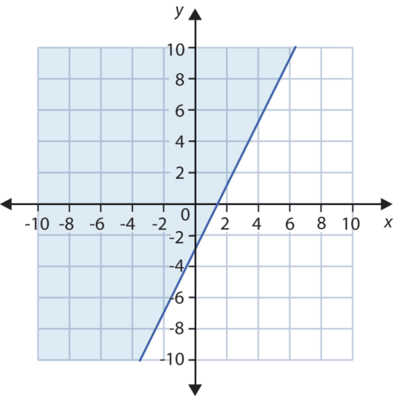

**_Step 1:_** Graph the equation using the most appropriate method.

* Slope-intercept form uses the $y-$intercept and slope to find the line.
* Standard form uses the intercepts to graph the line.
* Point-slope uses a point and the slope to graph the line.

---

**_Step 2:_** If the equal sign is not included, draw a dashed line. Draw a solid line if the equal sign is included.

**_Step 3:_** Shade the half plane above the line if the inequality is “greater than.” Shade the half plane under the line if the inequality is “less than.”

#### Example

_A gram of coffee blend is made by mixing two types of coffee beans. One type costs Rs 9.00 per _gram_ and another type costs Rs 7.00 per _gram_. Find all the possible mixtures of weights of the two different coffee beans for which the blend costs _Rs_ 8.50 per _gram_ or less._

**Solution:**

Begin by determining the appropriate letters to represent the varying quantities.

Let $x =$ weight of Rs 9.00 per gram coffee beans in grams and let $y =$ weight of Rs 7.00 per gram coffee beans in grams.

Translate the information into an inequality. $9x+7y \le 8.50$.

_Because the inequality is in standard form, it will be easier to graph using its intercepts._

Graph the inequality. The line will be solid. We shade below the line.

We graphed only the first quadrant of the coordinate plane because neither bag should have a negative weight.

The blue-shaded region tells you all the possibilities of the two bean mixtures that will give a total less than or equal to Rs 8.50.

#### Example 2

_Jatin has a job as an appliance salesman. He earns a commission of Rs 60 for each washing machine he sells and Rs 130 for each refrigerator he sells. How many washing machines and refrigerators must Jatin sell to make Rs 1,000 or more in commission?_

**Solution:**

Determine the appropriate variables for the unknown quantities. Let $x =$ number of washing machines Jatin sells and let $y =$ number of refrigerators Jatin sells.

Now translate the situation into an inequality. $60x + 130y \ge 1,000$.

Graph the standard form inequality using its intercepts. When $x=0, y=7.692$. When $y=0, x=16.667$. The line will be solid.

We want the ordered pairs that are solutions to Jatin making more than Rs 1,000, so we shade the half plane above the boundary line.

Linear inequalities in one variable can also be graphed in the coordinate plane. They take the form of horizontal and vertical lines, however the process is identical to graphing **oblique**, or slanted, lines.

#### Example

_Graph the inequality $x>4$ on_:

1. _a number line and_

2. _the coordinate plane._

**Solution:**

Remember what the solution to $x>4$ looks like on a number line.

On a coordinate plane, the line $x=4$ is a vertical line four units to the right of the origin. The inequality **does not equal** four, so the vertical line is dashed. This shows the reader that the ordered pairs on the vertical line $x=4$ are not solutions to the inequality.

The inequality is looking for all $x-$coordinates larger than four. We then color the half plane to the right, symbolizing $x>4$.

$x \le -2$ or $x \ge 2$

Then graph each inequality on a coordinate plane.

In other words, the solution is all the coordinate points for which the value of $x$ is smaller than or equal to –2 and greater than or equal to 2. The solution is represented by the plane to the left of the vertical line $x=-2$ and the plane to the right of line $x=2$.

Both vertical lines are solid because points on the line are included in the solution.

Sample explanations for some of the practice exercises below are available by viewing the following video. Note that there is not always a match between the number of the practice exercise in the video and the number of the practice exercise listed in the following exercise set.  However, the practice exercise is the same in both.

Watch the video at: http://www.youtube.com/watch?v=unSBFwK881s

1. Define half plane.

2. In which cases would the boundary line be represented by a dashed line?

3. In which cases would the boundary line be represented by a solid line?

4. What is a method to help you determine which half plane to color?

In 5 – 26, graph each inequality in a coordinate plane.

5. $x < 20$

6. $y \ge -5$

7. $y \le 6$

8. $|x| > 10$

9. $|y| \le 7$

10. $y \le 4x+3$

11. $y > -\frac{x}{2}-6$

12. $y\le -\frac{1}{2} x+5$

13. $3x-4y \ge 12$

14. $x+7y < 5$

15. $y < -4x+4$

16. $y > \frac{7}{2}x+3$

17. $6x+5y>1$

18. $6x-5y\le 15$

19. $2x-y<5$

20. $y+5 \le -4x+10$

21. $x-\frac{1}{2}y \ge 5$

22. $y+4 \le -\frac{x}{3}+5$

23. $5x-2y > 4$

24. $30x+5y < 100$

25. $y \ge -x$

26. $6x-y < 4$

27. Latika can make yarn ankle bracelets and wrist bracelets. She has 600 metres of yarn available. It takes 6 metres to make one wrist bracelet and 8 metres to make one ankle bracelet. Find all the possible combinations of ankle bracelets and wrist bracelets she can make without going over her available yarn.

28. An ounce (1 ounce = 25 grams) of gold costs Rs 65,000 and an ounce of silver costs Rs 10,000. Find all possible weights of silver and gold that makes an alloy (combination of metals) that costs less than Rs 50,000 per ounce.

29. A phone company charges 50 paise per minute during the daytime and 10 paise per minute at night. How many daytime minutes and night-time minutes would you have to use to pay more than Rs 20.00 over a 24-hour period?

30. Jay has Rs 200 to spend on food and games in the school carnival. Each game coupon costs Rs 10 and each food coupon costs Rs 20. Plot a graph that shows all the combinations of food and game coupons, spending less than Rs 200.

31. At the school canteen, momos costs Rs 15 per plate and sandwich costs Rs 20. If Harshita has Rs 75 to spend for her and her younger brother, then draw a graph to show what combinations of each she can buy and spend at most Rs 75.

</article>

### 8.5 Graphical Solution of System of Linear Inequalities in Two Variables

<article>

Ms. Vinita assigns the following system of linear inequalities for homework. She asks her students to find which quadrant(s) the solution lies in.

$$
x \ge 0\\
y \le 1\\
\frac{1}{2}x - 3y < 2
$$

Kriti says the solution falls only in the first quadrant. Varun says it falls in all four quadrants. Who is correct?

#### Watch This

!?[0](https://www.youtube.com/watch?v=ACTxJv1h2_c)

Watch the video at: http://www.youtube.com/watch?v=ACTxJv1h2_c

#### Guidance

In this section we will be graphing two and three linear inequalities on the same grid and identifying where the shaded regions overlap. This overlapping region is the solution to the system. Note: If the shaded regions do not overlap, there is no solution as shown in Example B.

#### Example A

Graph and identify the solution to the system:

$$
\begin{align*}
y &> 2x-3\\
y & \le 4x+1
\end{align*}
$$

---

**Solution:**

Since both of these inequalities are given in slope intercept form, we can use the $y-$intercept and the slope to graph the lines. Since inequality 1 has “$y>$”, we will make a dashed line to indicate that the line is not included in the solution and shade above the line where $y$ is “greater” (where the $y-$axis is above) the line. Since inequality 2 has “$y \le$” we will make a solid line to indicate that the line is included in the solution set and shade below the line where $y$ is “less than” (where the $y-$axis is below) the line. Inequality 1 is graphed in ${\color{blue}\mathbf{blue}}$ and inequality 2 is graphed in ${\color{red}\mathbf{red}}$. The overlap of the shaded regions (${\color{magenta}\mathbf{purple}}$ shading) represents the solution.

Graph and identify the solution to the system:

$$
\begin{align*}
y & \ge -\frac{2}{3}x+2\\
y & \le -\frac{2}{3}x-5
\end{align*}
$$

**Solution:**

Since inequality 1 has “$y \ge$”, we will make a solid line to indicate that the line is included in the solution and shade above the line where $y$ is “greater” (where the $y-$axis is above) the line. Since inequality 2 has “$y \le$” we will make a dashed line to indicate that the line is not included in the solution set and shade below the line where $y$ is “less than” (where the $y-$axis is below) the line. Inequality 1 is graphed in ${\color{blue}\mathbf{blue}}$ and inequality 2 is graphed in ${\color{red}\mathbf{red}}$. In this case the regions do not overlap. This indicates that there is no solution to the system.

Graph and identify the solution to the system:

$$
\begin{align*}
3x-y & <6\\
8x+5y & \le 40
\end{align*}
$$

**Solution:**

This time, let’s use a different graphing technique. We can identify the intercepts for each equation and graph the lines using these points:

For $3x-y<6$, the intercepts are (2, 0) and (0, -6).

For $8x+5y \le 40$, the intercepts are (5, 0) and (0, 8).

 is an easy point to test. $\Rightarrow 3(0)-(0)<6$ Since this is a true statement, (0, 0) is a solution to the inequality and we can shade on the side of the line with (0, 0).")

For the second inequality, the symbol is $\le$ so the line is solid. Using the same test point, $(0, 0) \Rightarrow 8(0)+5(0) \le 40$ This is a true statement so (0, 0) is a solution to the inequality and we can shade on the side of the line with (0, 0).

Again, Inequality 1 is graphed in ${\color{blue}\mathbf{blue}}$ and inequality 2 is graphed in ${\color{red}\mathbf{red}}$. The overlap of the shaded regions (${\color{magenta}\mathbf{purple}}$ shading) represents the solution.

#### Example D

Graph the system of linear inequalities:

$$
\begin{align*}
y & < -\frac{2}{3}x+3\\
y & \ge 1\\
x & \ge -4
\end{align*}
$$

**Solution:**

$y<-\frac{2}{3}x+3 \Rightarrow$ This inequality has a $y-$intercept of 3 and slope of $-\frac{2}{3}$. Since the inequality is <, we will shade below the dashed ${\color{blue}\mathbf{blue}}$ line.

$y \ge 1 \Rightarrow$ This is a horizontal line through (0, 1). The line will be solid and we shade above the ${\color{red}\mathbf{red}}$ line.

$x \ge -4 \Rightarrow$ This is a vertical line through (-4, 0). The line will be solid and we will shade $({\color{yellow}\mathbf{yellow}})$ to the right of the ${\color{green}\mathbf{green}}$ line.

The solution to this system is the shaded region (triangular) in the center where all three shaded regions overlap. This region can be difficult to see in a graph so it is common practice to erase the shading that is not a part of the solution to make the solution region is more obvious.

#### Guided Practice

Graph and identify the solutions to the systems.

1.

$$
\begin{align*}
y & \le \frac{1}{3} x+5\\
y & > \frac{5}{4}x-2
\end{align*}
$$

2.

$$
\begin{align*}
4x+y & > 8\\
3x-5y & \le 15
\end{align*}
$$

3.

$$
\begin{align*}
7x+2y & \le 14\\
3x-9y & \ge 18
\end{align*}
$$

4.

$$
\begin{align*}
y & \ge 2x-3\\
2x+y &>-8\\
y &>-3
\end{align*}
$$

#### Answers:

In each of the solutions below, the first inequality in the system is shown in ${\color{blue}\mathbf{blue}}$ and the second inequality is shown in ${\color{red}\mathbf{red}}$. The solution set is the overlapping shaded region in ${\color{magenta}\mathbf{purple}}$. When there are three inequalities, only the solution region is shown to eliminate confusion.

1. 

$y \le \frac{1}{3}x+5 \Rightarrow$ solid line and shade below

$y>\frac{5}{4}x-2 \Rightarrow$ dashed line and shade above

2. 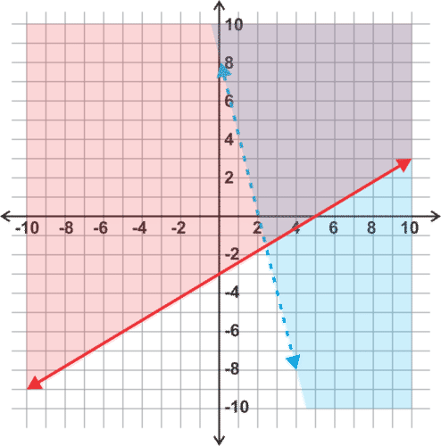

$4x+y>8 \Rightarrow$ The intercepts are (2, 0) and (0, 8) and the line will be dashed. If we test the point (0, 0), the inequality is not true so we shade on the side of the line that does not contain (0, 0).

$3x-5y \le 15 \Rightarrow$ The intercepts are (5, 0) and (0, -3) and the line will be solid. The test point (0, 0) satisfies the inequality so we shade on the side of the line that includes (0, 0).

3. 

$7x+2y \le 14 \Rightarrow$ The intercepts are (2, 0) and (0, 7) and the line will be solid. If we test the point (0, 0), the inequality is true so we shade on the side of the line that contains (0, 0).

$3x-9y \ge 18 \Rightarrow$ The intercepts are (6, 0) and (0, -2) and the line will be solid. The test point (0, 0) does not satisfy the inequality so we shade on the side of the line that does not include (0, 0).

4. 

Inequality 2 can be graphed using intercepts. The line will be dashed and we can use a test point to determine that the shaded region will be above this line.

Inequality 3 is a horizontal line. It will be dashed and the shading is above this line.

The intersection of these three regions is shaded in ${\color{magenta}\mathbf{purple}}$ on the graph.

#### Watch This

!?[0](https://www.youtube.com/watch?v=NCNVngQ4aWY)

Watch the video at: https://www.youtube.com/watch?v=NCNVngQ4aWY

#### Example E

_Solve the following system:_

$$
\begin{align*}
2x + 3y & \le 18\\
x - 4y & \le 12
\end{align*}
$$

**Solution:**

Solving systems of linear inequalities means graphing and finding the intersections. So we graph each inequality, and then find the intersection _regions_ of the solution.

First, let’s rewrite each equation in slope-intercept form. (Remember that this form makes it easier to tell which region of the coordinate plane to shade.) Our system becomes

$$
3y \le -2x + 18 \qquad  \qquad  \qquad \qquad y \le - \frac{2}{3}x + 6\\
{\;} \qquad \qquad \qquad \qquad \quad \Rightarrow\!\\
-4y \le -x + 12 \qquad  \qquad  \qquad \qquad y \ge \frac{x}{4} - 3
$$

Notice that the inequality sign in the second equation changed because we divided by a negative number!

For this first example, we’ll graph each inequality separately and then combine the results.

Here’s the graph of the first inequality:

 is the solution of the system.")

.")

#### Example F

There are also situations where a system of inequalities has no solution. For example, let’s solve this system.

$$
\begin{align*}
y & \le 2x - 4\\
y & > 2x + 6
\end{align*}
$$

**Solution:**

We start by graphing the first line. The line will be solid because the equals sign is included in the inequality. We must shade downwards because $y$ is less than.

But a system of inequalities can sometimes have a solution even if the lines are parallel. For example, what happens if we swap the directions of the inequality signs in the system we just graphed?

To graph the system,

$$
y \ge 2x - 4\!\\
y < 2x + 6
$$

we draw the same lines we drew for the previous system, but we shade _upward_ for the first inequality and _downward_ for the second inequality. Here is the result:

**Graph a System of More Than Two Linear Inequalities**

When we solve a system of just two linear inequalities, the solution is always an **unbounded** region—one that continues infinitely in at least one direction. But if we put together a system of more than two inequalities, sometimes we can get a solution that is **bounded**—a finite region with three or more sides.

Let’s look at a simple example.

#### Example G

_Find the solution to the following system of inequalities._

$$
\begin{align*}
3x - y & < 4\\
4y + 9x & < 8\\
x & \ge 0\\
y & \ge 0
\end{align*}
$$

**Solution:**

Let’s start by writing our inequalities in slope-intercept form.

$$
\begin{align*}
y & > 3x - 4\\
y & < - \frac{9}{4}x + 2\\
x & \ge 0\\
y & \ge 0
\end{align*}
$$

Now we can graph each line and shade appropriately. First we graph $y > 3x - 4$ :

Notice, too, that only three of the lines we graphed actually form the boundaries of the region. Sometimes when we graph multiple inequalities, it turns out that some of them don’t affect the overall solution; in this case, the solution would be the same even if we’d left out the inequality $y > 3x - 4$. That’s because the solution region of the system formed by the other three inequalities is completely contained within the solution region of that fourth inequality; in other words, any solution to the other three inequalities is _automatically_ a solution to that one too, so adding that inequality doesn’t narrow down the solution set at all.

But that wasn’t obvious until we actually drew the graph!

!?[0](https://www.youtube.com/watch?v=2VZTFbSMmjA)

Watch the video at: https://www.youtube.com/watch?v=2VZTFbSMmjA

#### Guided Practice

_Write the system of inequalities shown below_.

There are two boundary lines, so there are two inequalities. Write each one in slope-intercept form.

$$
\begin{align*}
y & \le \frac{1}{4} x + 7\\
y & \ge -\frac{5}{2} x - 5
\end{align*}
$$

---

#### Explore More

Graph the following systems of linear inequalities.

1. 

$$
y > \frac{1}{2} x - 2 \\
4x+6y \le 24
$$

2. 

$$
y> - \frac{3}{4}x - 1 \\
y>3x+5
$$

3. 

$$
y \le - \frac{2}{3} x+2 \\
y \ge - \frac{5}{3}x-1
$$

4. 

$$
y\ge-x-3 \\
y< \frac{1}{5}x+1
$$

5. 

$$
5x-2y>-10 \\
y \le - \frac{1}{3}x+2
$$

6. 

$$
y> - \frac{4}{5}x-3 \\
y>x
$$

7. 

$$
y \le \frac{1}{2}x+4 \\
x - 2y \le 2
$$

8. 

$$
7x-3y>-21 \\
x-4y<8
$$

9. 

$$
6x+5y\le5 \\
2x-3y\le12
$$

10. 

$$
x<3 \\
y\ge2x+1
$$

11. 

$$
y<2 \\
y\ge-2
$$

12. 

$$
2x-y\le4 \\
5x+2y>10
$$

13. 

$$
y\le-2x+4 \\
y\ge5x+4 \\
y>\frac{1}{2}x-1
$$

14. 

$$
x+y\le3 \\
x\le3 \\
y<3
$$

---

15. 

$$
x>-2 \\
y>-3 \\
2x+y\le2
$$

16.

$$
x>-2 \\
x\le4 \\
3x+5y>15
$$

 

17. 

$$
2x+3y>6 \\
5x-2y<-10 \\
x-3y>3
$$

18. 

$$
y\le x \\
y\ge-x \\
x<5
$$

19. Consider the system

$$
y < 3x - 5\!\\
y > 3x - 5
$$

Is it consistent or inconsistent? Why?

20. Consider the system

$$
y \le 2x + 3\!\\
y \ge 2x + 3
$$

Is it consistent or inconsistent? Why?

21. Consider the system

$$
y \le -x + 1\!\\
y > -x + 1
$$

Is it consistent or inconsistent? Why?

22. In example 3 in this lesson, we solved a system of four inequalities and saw that one of the inequalities, $y > 3x - 4$, didn’t affect the solution set of the system.

a) What would happen if we changed that inequality to $y < 3x - 4$?

b) What’s another inequality that we could add to the original system without changing it? Show how by sketching a graph of that inequality along with the rest of the system.

c) What’s another inequality that we could add to the original system to make it inconsistent? Show how by sketching a graph of that inequality along with the rest of the system.

23. Recall the compound inequalities in one variable that we worked with back in chapter 6. Compound inequalities with “and” are simply systems like the ones we are working with here, except with one variable instead of two.

a) Graph the inequality $x > 3$ in two dimensions. What’s another inequality that could be combined with it to make an inconsistent system?

b) Graph the inequality $x \le 4$ on a number line. What two-dimensional system would have a graph that looks just like this one?

Find the solution region of the following systems of inequalities.

24. 

$$
x - y < -6\!\\
2y \ge 3x + 17
$$

25. 

$$
4y - 5x < 8\!\\
-5x \ge 16 - 8y
$$

26. 

$$
5x - y \ge 5\!\\
2y - x \ge -10
$$

27. 

$$
5x + 2y \ge -25\!\\
3x - 2y \le 17\!\\
x - 6y \ge 27
$$

28. 

$$
2x - 3y \le 21\!\\
x + 4y \le 6\!\\
3x + y \ge -4
$$

---

29. 

$$
12x - 7y < 120\!\\
7x - 8y \ge 36\!\\
5x + y \ge 12
$$

</article>

### 8.6 Summary

<article>

* A linear inequality is a mathematical expression in which any two real numbers or functions are related with the symbols &lt;, &gt;, ≤ or ≥.
* Equal positive real numbers can be added, subtracted, multiplied or divided on both the sides of the inequality but if a negative number is being used for multiplication or division then sign of the inequality reverses.
* Solution of any linear inequality can be represented either in the interval form, or in the form of inequality or graphically.
* Graphical solution of linear inequality in one variable is to be represented on a number line. If the end points are included then we dark a small circle on end point; if end points are excluded then we make a hollow circle on the point.
* Graphical solution of linear inequality in two variables is to be represented as a half plane on Cartesian plane.
* If inequality has symbols &lt; or &gt; then we make the line dotted which means that points on the line are not included in the solution of the inequality.
* If inequality has symbols ≤ or ≥ then we make a dark line which means that points on the line are also included in the solution set of the inequality.
* The solution of the system of linear inequalities is the region on the graph which satisfies all the inequalities.

</article>

### 8.7 Self Assessments

<article>

#### Assessment 1

**Inequalities**

http://www.ck12.org/algebra/Inequality-Expressions/quiz/Inequality-Expressions-Quiz/

#### Assessment 2

**Algebraic and Graphical Solution of Linear Inequalities in One Variable**

[http://www.ck12.org/algebra/Linear-Inequalities/asmtpractice-Practice/?referrer=concept\_details](http://www.ck12.org/algebra/Linear-Inequalities/asmtpractice/Linear-Inequalities-Practice/?referrer=concept_details)

http://www.ck12.org/algebra/Compound-Inequalities/quiz/Compound-Inequalities-Quiz/

http://www.ck12.org/algebra/Multi-Step-Inequalities/quiz/Multi-Step-Inequalities-Quiz/

#### Assessment 3

**Graphical Solution of System of Linear Inequalities in Two Variables**

[http://www.ck12.org/Systems-of-Linear-Inequalities-Practice/?referrer=concept\_details](http://www.ck12.org/algebra/Systems-of-Linear-Inequalities/asmtpractice/Systems-of-Linear-Inequalities-Practice/?referrer=concept_details)

</article>

### 8.8 Home Assignments

<article>

#### Assignment 1

**Linear Inequalities in one Variable**

NCERT Exercise No. 6.1

Q. No. 2, 4, 6, 7, 9, 13, 15, 18, 20, 22, 24

#### Assignment 2

**Graphical Solution of Linear Inequality in Two Variables**

NCERT Exercise No. 6.2

Q. No. 2, 4, 6, 8, 10

#### Assignment 3

**Solution of System of Linear Inequalities**

NCERT Exercise No. 6.3

Q. No. 2, 4, 6, 8, 10, 12, 14

#### Assignment 4

**Miscellaneous Questions**

NCERT Miscellaneous Exercise

Q. No. 2, 4, 6, 8, 10, 11, 14

</article>

### 8.9 References for Basic Understanding

<article>

#### Graphs of Linear Equations

http://www.ck12.org/algebra/Graphs-of-Linear-Systems/lesson/Graphs-of-Linear-Systems-Intermediate/

</article>

### 8.10 References for Advanced Understanding

<article>

#### 1. Verification of Solution of System of Linear Inequalities

[http://www.ck12.org/algebra/Checking-for-Solutions-to-a-System-of-Linear-Inequalities/](http://www.ck12.org/algebra/Checking-for-Solutions-to-Systems-of-Linear-Inequalities/lesson/Checking-for-Solutions-to-a-System-of-Linear-Inequalities/)

#### 2. Absolute Value Inequalities

http://www.ck12.org/algebra/Absolute-Value-Inequalities/lesson/Solving-Absolute-Value-Inequalities/

[http://www.ck12.org/algebra/lesson/Graphical-Solutions-to-Absolute-Value-Inequalities-Honors/](http://www.ck12.org/algebra/Graphs-of-Absolute-Value-Inequalities/lesson/Graphical-Solutions-to-Absolute-Value-Inequalities-Honors/)

#### Real World Applications:

http://www.ck12.org/algebra/Absolute-Value-Inequalities/rwa/Body-Temperature/

http://www.ck12.org/algebra/Absolute-Value-Inequalities/rwa/The-Final-Frontier/

http://www.ck12.org/algebra/Absolute-Value-Inequalities/rwa/Wireless-Roaming/

#### Assessment:

http://www.ck12.org/algebra/Absolute-Value-Inequalities/quiz/Absolute-Value-Inequalities-Quiz/

http://www.ck12.org/algebra/Absolute-Value-Inequalities-Practice/?referrer=concept_details

#### 3. Algebraic and Graphical Solution of Linear Inequalities in One Variable

http://quitehealthy.com/nutrition-facts/cheez-it/L372191.html

</article>

## 9.0 Permutations and Combinations

<article>

</article>

### 9.1 Introduction

<article>

You must have seen number plates on vehicles which is group of letters and digits e.g.DL M1234. So can you guess how many such number plates can be made using 3 letters from 26 alphabets and 4 digits out of 10 digits. It is a tedious work without permutations and combinations.

Permutations and Combinations are counting techniques.  

Before starting with Permutations and Combinations, it is important to understand the concept of fundamental principle of counting.

</article>

### 9.2 Fundamental Principle of Counting

<article>

Sometimes it makes sense to count the number of ways for an event to occur by looking at each possible outcome. However, when there are a large number of outcomes this method quickly becomes inefficient. If someone asked you how many possible regular license plates there are for the state of Delhi, it would not be feasible to count each and every one. Instead, you would need to use the fact that on a typical Delhi license plate there are four numbers and three letters. Using this information, can you tell how many license plates could there be? In such cases, we can use Fundamental Principle of Counting which is explained with the help of following examples in the form of video.

!?[0](https://www.youtube.com/watch?v=qJ7AYDmHVRE)

Watch the video at: http://www.youtube.com/watch?v=qJ7AYDmHVRE

### Using the Fundamental Counting Principle with and without Repetition

A lock has the digits 0-39. A series of three numbers unlocks the lock. How many possible unlocking combinations are there if the numbers cannot be repeated?

#### Guidance

Consider a phone number. A phone number consists entirely of numbers or repeated items. In this concepts we will look at how to determine the total number of possible combinations of items which may be repeated.

#### Example A

A license plate consists of three letters and four numbers in the state of Delhi. If letters and numbers can be repeated, how many possible license plates can be made?

**Solution:** If we consider the three slots for the letters, how many letters can be chosen to place in each slot? How about the four slots for the numbers? If there are no restrictions, i.e. letter and numbers can be repeated, the total number of license plates is:

$$
\underline{{\color{red}26}} \times \underline{{\color{red}26}} \times \underline{{\color{red}26}} \times \underline{{\color{blue}10}} \times \underline{{\color{blue}10}} \times \underline{{\color{blue}10}} \times \underline{{\color{blue}10}}=175,760,000
$$

Now, what if letters or numbers could not be repeated? Well, after the first letter is chosen, how many letters could fill the next spot? Since we started with 26, there would be 25 unused letters for the second slot and 24 for the third slot. Similarly with the numbers, there would be one less each time:

$$
\underline{{\color{red}26}} \times \underline{{\color{red}25}} \times \underline{{\color{red}24}} \times \underline{{\color{blue}10}} \times \underline{{\color{blue}9}} \times \underline{{\color{blue}8}} \times \underline{{\color{blue}7}}=78,624,000
$$

#### Example B

How many unique five letter passwords can be made? How many can be made if no letter is to be repeated?

**Solution:** Since there are 26 letters from which to choose for each of 5 slots, the number of unique passwords can be found by multiplying 26 by itself 5 times or $(26)^5=11,881,376$. If we do not repeat letters, then we need to subtract one each time we multiply: 

$$
26 \times 25 \times 24 \times 23 \times 22=7,893,600.
$$

#### Example C

How many unique 4 digit numbers can be made? What if no digits can be repeated?

**Solution:** For the first part, consider that in order for the number to be a four digit number, the first digit cannot be zero. So, we start with only 9 digits for the first slot. The second slot could be filled with any of the ten digits and so on:

$$
\underline{9} \times \underline{10} \times \underline{10} \times \underline{10}=9000.
$$

For the second part, in which digits cannot be repeated, we would still have 9 possible digits for the first slot, then we’d have 9 again for the second slot (we cannot repeat the first digit, but we can add 0 back into the mix), then 8 for the third slot and 7 for the final slot:

$$
\underline{9} \times \underline{9} \times \underline{8} \times \underline{7}=4536.
$$

**Intro Problem Revisit** Since there are 40 numbers from which to choose for each of 3 slots, the number of unique passwords can be found by multiplying 40 by itself 3 times or $(40)^3=64,000$. However, we cannot repeat numbers so we need to subtract one each time we multiply: 

$$
40 \times 39 \times 38 =59,280.
$$

Therefore, there are 59,280 possible unlocking combinations.

#### Guided Practice

1. How many unique passwords can be made from 6 letters followed by 1 number or symbol if there are ten possible symbols? No letters or numbers can be repeated.

2. If a license plate has three letters and three numbers, how many possible combinations can be made?

3. In a seven digit phone number, the first three digits represent the exchange. If, within a particular area code, there are 53 exchanges, how many phone numbers can be made?

**Answers**

1. $\underline{{\color{red}26}} \times \underline{{\color{red}25}} \times \underline{{\color{red}24}} \times \underline{{\color{red}23}} \times \underline{{\color{red}22}} \times \underline{{\color{red}21}} \times \underline{{\color{blue}20}}=3,315,312,000$

2. $\underline{{\color{red}26}} \times \underline{{\color{red}26}} \times \underline{{\color{red}26}} \times \underline{{\color{blue}10}} \times \underline{{\color{blue}10}} \times \underline{{\color{blue}10}} =17,576,000$

3. $\underline{{\color{red}53}} \times \underline{{\color{blue}10}} \times \underline{{\color{blue}10}} \times \underline{{\color{blue}10}} \times \underline{{\color{blue}10}}=530,000$

#### Explore More

Use the Fundamental Counting Principle to answer the following questions. Refer back to the examples and guided practice for help.

1. How many six digit numbers can be formed if no digits can be repeated?

2. How many five digit numbers can be formed that end in 5?

3. How many license plates can be formed of 4 letters followed by 2 numbers?

4. How many seven digit phone numbers can be made if there are 75 exchanges in the area?

5. How many four letter pins (codes) can be made?

6. How many four number/letter pins can be made if no number or letter can be repeated?

7. How many different ways can nine unique novels be arranged on a shelf?

8. How many different three scoop cones can be made from 12 flavors of ice cream allowing for repetition? What if no flavors can be repeated?

9. How many different driver’s license numbers can be formed by 2 letters followed by 6 numbers?

10. How many student ID numbers can be made by 4 random digits (zero cannot come first) followed by the student’s grade (9, 10, 11 or 12). Example: 5422-12 for a $12^{th}$ grader.

</article>

### 9.3 Factorial

<article>

Concept of factorial is important for permutation. Factorial is denoted by ! (exclamation). For example, 5! means product of first five natural number, i.e. $5 \times 4 \times 3 \times 2 \times 1$. On simplifying it will be 120. Similarly $n!$ means product of first $n$ natural number i.e. $n \times (n-1) \times (n-2) \ldots \ldots \times 3 \times 2 \times 1$.

For simplification purpose $5!$ can also be written as $5 \times 4!$ or $5 \times 4 \times 3!$ and so on.

Also, $1! = 1$ and $0! = 1$.

Why $0! = 1$?

There is no logic in multiplication of numbers from zero to one, so for calculations sake, it has been taken as 1, i.e., $0! = 1$

#### Example

Find the value of $x$ if $\left(\frac{1}{3!} \right) + \left(\frac{1}{4!} \right) = \frac{x}{5!}$

**Solution:**

$$
\begin{align*}
\left(\frac{1}{3!} \right) + \left(\frac{1}{4 \cdot 3!} \right) &= \frac{x}{5 \cdot 4 \cdot 3!} \\
1 + \frac{1}{4} &= \frac{x}{5 \cdot 4} \\
\frac{5}{4} &= \frac{x}{5 \cdot 4} \\
5 &= \frac{x}{5} \\
x &= 25
\end{align*}
$$

Concept of Factorial is used in solving problems on Permutations and Combinations.

</article>

### 9.4 Difference between Permutations and Combinations

<article>

Suppose there are 17 players out of which 11 are to be selected for a cricket match and then their order of batting is to be finalized.

The selection process is termed as Combinations and the order of their batting is termed as Permutations.

We will learn more about the difference between Permutations and Combinations:

!?[undefined](media/129307.mp4 "video")

Watch the video at: http://www.ck12.org/flx/render/embeddedobject/129307

### Difference Between Permutations and Combinations - Part 1

Learn how to distinguish between combinations and permutations with this helpful cat example.

!?[0](https://www.youtube.com/watch?v=2MSiQ3efT3c)

Watch the video at: https://www.youtube.com/watch?v=2MSiQ3efT3c

### Difference Between Permutations and Combinations - Part 2

Use this as another example to help you determine the difference between combinations and permutations.

!?[0](https://www.youtube.com/watch?v=bUjT-5sfSFw)

Watch the video at: https://www.youtube.com/watch?v=bUjT-5sfSFw

### Real World Example

#### Student Exploration

Have you ever wondered how many different games are possible in a Sudoku puzzle? How many different ways can you be dealt a hand of cards in Big Two? And which game is a Permutation and which is a Combination?

Sudoku is a logic-based, number-placement puzzle. The board is a 9-by-9 square and is partially completed. The goal of the game is to place the numbers 1 to 9 in each row, each column, and each of the 3-by-3 sub-boxes. For more information on the game visit, http://en.wikipedia.org/wiki/Sudoku.

How many different possible ways are there to play in the first row of numbers?

How many different possible ways are there to play in first and second row of numbers?

How many different possible ways are there to play the entire game of Sudoku (all nine rows)?

The game Big Two, also called Deuces, is a game where all the cards in a deck of 52 cards are dealt to four players. As a result each player gets 13 cards. Then the player with the three of diamonds plays first and rotates to the rest of the players in a counter clockwise direction. Players must play a card or group of cards that are ranked higher than the previous card/s played. The ranking of the cards is specific with the twos holding the highest value and the suits of cards having different values, see the links below for more information. The goal is to be the first player to get rid of all your cards, causing the game to end, and the rest of the players want to have as few cards as possible at the end of the game. For more information on the game visit, http://en.wikipedia.org/wiki/Big_Two or http://www.pagat.com/climbing/bigtwo.html.

How many different ways can you be dealt a hand of cards in the game of Big Two?

#### Extension Investigation

1. Why does the Sudoku problem represent a Permutation problem, rather than a Combination?

2. Why does the number of ways the cards can be dealt in the game of Big Two represent a Combination problem, rather than a Permutation?

3. Derive the formula for Combinations. Show your work.

4. What would you do differently to derive the formula for Permutations? Explain.

The students should try the above questions themselves and discuss in the class.

For a reference to the solutions, students may check the link at - http://www.ck12.org/probability/Permutations-and-Combinations-Compared/rwa/Permutations-and-Combinations-Compared-Answer-Key/

</article>

### 9.5 Permutations

<article>

#### Permutations: An Introduction

An introduction to permutations.

!?[0](https://www.youtube.com/watch?v=XqQTXW7XfYA)

Watch the video: https://www.youtube.com/watch?v=XqQTXW7XfYA

### Recognizing Permutations

Have you ever had a combination lock? Take a look at this dilemma.

“What are you doing?” Naman asked sitting next to the pile of locks.

“I am checking to make sure that all of these locks work,” Nalin explained. “Here is a pile for you.”

Naman starting working on the locks too. After about five minutes, he stopped and looked at Nalin.

“You know these shouldn’t even be called combination locks. A lock isn’t a real combination, it’s actually a permutation,” Naman said laughing.

Nalin looked at his friend as if he had six heads. He was completely puzzled.

“What do you mean?” Nalin asked.

**Do you know what Naman means? If you don’t right now, you will by the end of this Concept. Then you will understand permutations.**

---

#### Guidance

_Order_ is important in some situations and not important in others. For example, in following a cake recipe, the order in which the events take place is important. You need to crack the eggs _before_ you mix them with the flour. Similarly, you put the icing on the cake only _after_ it has baked.

For solving many problems in which order is important, you can use **_permutations_**. **A** **_permutation_** **is a selection of items in which** **_order_** **is important.** To use permutations to solve problems, you need to be able to identify the problems in which order, or the arrangement of items, matters.

Take a look at this situation.

Aishwarya Rai Bachchan wants to know how many ways she can arrange her initials, $A, R, B$. Does order matter for this problem?

**Since she wants to arrange each letter in a particular arrangement, the order does matter. This is a permutation not a combination.**

**Step 1:** Write out a single order, or permutation.

$ARB$

**Step 2:** Now **rearrange** those same letters. Did changing the order of the items change the outcome? If so, then order matters.

$RAB \ \Longleftarrow$ different than original

**Each arrangement of letters is a different permutation.**

**We can count permutations too. There is a mathematical way to calculate the number of permutations possible given the number of items selected.**

We can find the number of permutations in a group if you include all members of that group. Suppose there are 3 cabs in front of a hotel, Easy Cabs, Meru Cabs and Mega Cabs .

**If all 3 line up to wait for the next customer, the number of different lineups, or permutations, of 3 items taken 3 at a time is:**

**What happens when 4 cabs show up at the hotel, but there is only room for 3 cabs to line up? For example, how many different 3-cab lineups would there be if you started with 4 cabs – Easy Cabs, Meru Cabs, Mega Cabs and Quick Cabs?**

Now, for choice 1 you have _four_ choices instead of 3.

The final calculation gives 24 total choices:

#### Example A

If five people want to go to the movies, but there are only two seats available. How many ways can the people sit if they can only sit two at a time?

**Solution: $5 \times 4 = 20$**

#### Example B

How many different ways could the people be seated if there were three seats?

**Solution: $5 \times 4 \times 3 = 60$**

#### Example C

How many different ways could the people be seated if there were four seats?

**Solution: $5 \times 4 \times 3 \times 2 = 120$**

Now let's go back to the dilemma from the beginning of the Concept.

**Naman said the lock should be called a permutation lock because a permutation is a series of numbers in a specific order. If you don’t put the numbers in that order, then the lock will not open.**

#### Guided Practice

Here is one for you to try on your own.

Three taxis – an Easy Cab, a Meru Cab and a Mega Cab – all arrive outside of the Maurya Sheraton  Hotel at exactly the same moment. In how many different ways can the three line up?

**Solution:**

**One way to look at this problem is as the product of 3 different choices. For choice 1 you can select any of the three cabs.**

$$
\begin{align*}
&\mathbf{Easy-Meru-Mega} && \mathbf{Meru-Easy-Mega} && \mathbf{Mega-Easy-Meru}\\
&\mathbf{Easy-Mega-Meru} && \mathbf{Meru-Mega-Easy} && \mathbf{Mega-Meru-Easy}
\end{align*}
$$

#### Video Review

!?[0](https://www.youtube.com/watch?v=JyRKTesp6fQ)

Watch the video at: https://www.youtube.com/watch?v=JyRKTesp6fQ

#### Practice

**Directions:** Figure out each permutation or each outcome.

1. Four different frogs entered the jumping contest – Spots, Dots, Slimey, and Croaky. In how many ways can the 4 finish in first, second, third, and fourth place?

2. Shikha has the letters A, R, X, O, G, I, and L. How many different 4-letter arrangements can she make?

3. Six people have signed up to play Scrabble – Adya, Shipla, Raman, Rohak, Rishabh and Sonal. Only 4 people can play at one time. How many different 4-player games are possible?

4. Anmol printed out his 8-page report without putting page numbers on the pages. Now the pages have gotten all mixed up. In how many different ways can Anmol arrange the 8 pages?

5. The special lunch at Bamboo Restaurant gives you a choice of won-ton or hot-sour soup, a choice of kung pao shrimp or chicken with broccoli, and a choice rice or noodles. How many different special lunches are there?

6. Rohan forgot the password for his ATM bank card. He knows that the password is made of the 4 digits of his birthday, October 24 or 1, 0, 2, 4.? How many different passwords does he need to try to be sure he gets his password?

7. Javed wrote out wrote out the letters of Jasmine’s name on 7 cupcakes and put them in a box. How many different ways can he take them out of the box one by one?

8. Four friends have printed the letters M, E, T, S on the front of their shirts. They’re going to the Mets game and will sit in 4 seats side by side. In how many different ways can the four sit?

9. How many different 3-digit numbers can you form from the digits 4, 5, and 6?

**Directions:** Use permutations to solve each problem.

10. How many 3-digit numbers can Bhupesh write using the digits 7, 8, and 9?

11. How many 4-letter arrangements can Bhupesh write using the letters A, B, C, D?

12. A train has 6 different cars – a passenger car, a baggage car, a mail car, a diner car, a freight car, and a caboose.  
In how many different orders can the cars be arranged?

13. The last 5 digits of a phone number are 34567. How many numbers have these same 5 digits?

14. Mia has 7 charms for her charm bracelet – a heart, a moon, a turtle, a cube, a bird, a hoop, and a car. Into how many different orders can she arrange the 7 charms?

Lets learn more about permutation with repetition.

### Permutations: A Sample Application

This video demonstrates a sample use of permutations.

!?[0](https://www.youtube.com/watch?v=xA_iGVErtZA)

Watch the video at: https://www.youtube.com/watch?v=xA_iGVErtZA

### Permutations of Subsets and Permutations with Repetition

Twelve violin students are competing for three seats in the orchestra: 1st Chair, 2nd Chair, and 3rd Chair. How many ways can a 1st Chair, 2nd Chair, and 3rd Chair be selected from the 12 competing students?

#### Guidance

Sometimes we want to order a select subset of a group. For example, suppose we go to an ice cream shop that offers 15 flavors. If we want to layer 3 scoops of different flavors on an ice cream cone, how many arrangements are possible? Here, the order matters so a chocolate, strawberry and vanilla cone is different than a strawberry, vanilla and chocolate cone. This is an example of permutations of a subset. We don’t need to know how many ways we can order all 15 flavors, just three choices. You have actually solved problems like this already using the Fundamental Counting Principle. There are 15 choices for scoop one, 14 choices for scoop two and 13 choices for scoop 3, so $15\times14\times13=2730$.

We can use factorials to solve this as well. Consider the expression: $\frac{15\times14\times13\times12!}{12!}=\frac{15!}{(15-3)!}=\frac{n!}{(n-r)!}$, where $n$ represents the total number of elements in the set and $r$ represents the number of elements in the subset we are selecting. Mathematically, this can be written using the notation $_{15}P_3$ or $_nP_r$. To summarize, if we wish to find the number of permutations of $r$ elements selected from a larger set containing $n$ elements, we can use the formula: $_nP_r=\frac{n!}{(n-r)!}$.

$^*$ Note that some textbooks use the notation $P^n_r$ to represent $_nP_r$.

We can evaluate this expression easily on the calculator as well. First, enter the value of $n(15)$, then go to MATH$\rightarrow$PRB, select 2: $_nP_r$. Now enter the value of $r (3)$ to get the expression 15 $_nP_r$ 3 on your screen. Press ENTER one more time and the result is 2730.

#### Example A

How many ways can a President, Vice President, Secretary and Treasurer be selecting from a club with ten members?

**Solution:** In the selection process here, the order matters so we are calculating the number of permutations of a subset of 4 members of the 10 member club. So,

$$
_{10}P_4=\frac{10!}{(10-4)!}=\frac{10\times9\times8\times7\times{\color{red}6!}}{{\color{red}6!}}=10\times9\times8\times7=5040.
$$

#### Example B

Consider the word, VIRGINIA. How many unique ways can these letters be arranged?

**Solution:** There are eight letters which can be arranged $8!$ ways. However, some of these arrangements will not be unique because there are multiple I’s in the word VIRGINIA. For example, if we let the three I’s be different colors, then we can see that there are several indistinguishable ways the I’s can be arranged.

$$
\text{V{\color{red}I}RG{\color{blue}I}N{\color{green}I}A}, \ \text{V{\color{red}I}RG{\color{green}I}N{\color{blue}I}A}, \ \text{V{\color{blue}I}RG{\color{red}I}N{\color{green}I}A}, \ \text{V{\color{blue}I}RG{\color{green}I}N{\color{red}I}A}, \ \text{V{\color{green}I}RG{\color{red}I}N{\color{blue}I}A}, \ \text{V{\color{green}I}RG{\color{blue}I}N{\color{red}I}A}
$$

In fact, there are $3!$ or 6 ways that the three I’s can be arranged that are indistinguishable when the arrangement of the remaining letters is constant. To figure out the number of unique arrangements of the 8 letters with 3 that are indistinguishable we can find the permutations of the 8 letters and divide by the permutations of the indistinguishable items.

$$
\frac{8!}{3!}=\frac{8\times7\times6\times5\times4\times{\color{red}3!}}{{\color{red}3!}}=8\times7\times6\times5\times4=6720
$$

#### Example C

Consider the word PEPPERS. How many unique arrangements can be made of these letters?

**Solution:** There are seven letters in total, three of which are P and two of which are E. We can expand upon what we did in the last example and divide by the number of ways each of these letters can be arranged.

$$
\frac{7!}{3!2!}=\frac{7\times6\times5\times4\times{\color{red}3!}}{{\color{red}3!}\times2\times1}=\frac{7\times6\times5\times(2\times{\color{red}\cancel{2}})}{{\color{red}\cancel{2}}}=7\times6\times5\times2=420
$$

**Intro Problem Revisit** In the orchestra selection process, the order matters so we are calculating the number of permutations of a subset of 3 members of the 12 member club. So,

$$
_{12}P_3=\frac{12!}{(12-3)!}=\frac{12\times11\times10\times{\color{red}9!}}{{\color{red}9!}}=12\times11\times10=1320
$$

Therefore, the orchestra slots can be filled in 1320 ways.

#### More Guidance

We can generalize the rule used in Examples B and C as follows. In a set with $n$ elements, in which $n_1, n_2, n_3, \ldots$ are indistinguishable, we can find the number of unique permutations of the $n$ elements using the formula:

$$
\frac{n!}{n_1!\times n_2!\times n_3!\times\ldots}
$$

#### Guided Practice

1. Find $_{10}P_6$

2. On a team of 12 players, how many ways can the coach select players to receive on of each of the following awards (one award per player): most valuable player, best sportsmanship, most improved player.

3. How many ways can 5 yellow, 4 red and 3 green balls be arranged in a row?

**Answers**

1. $_{10}P_6=\frac{10!}{(10-6)!}=\frac{10\times9\times8\times7\times6\times5\times{\color{red}4!}}{{\color{red}4!}}=151,200$

2. $_{12}P_3=\frac{12!}{(12-3)!}=\frac{12\times11\times10\times{\color{red}9!}}{{\color{red}9!}}=1,320$

3. $\frac{12!}{5!\times4!\times3!}=\frac{12\times11\times10\times9\times8\times7\times6\times{\color{red}5!}}{{\color{red}4!}\times4!\times3!}=\frac{{\color{red}12}\times11\times10\times9\times(4\times{\color{green}2})7\times{\color{blue}6}}{{\color{red}(4\times3)}\times{\color{green}2}\times{\color{blue}3\times2}}=11\times10\times9\times4\times7=27,720$

#### Explore More

Evaluate the following expressions.

1. $_8P_5$

2. $_{11}P_8$

3. Evaluate and explain the results of each of the following: $_5P_5, \ _5P_0, \ _5P_1$

4. Sarah needs to go to five different stores. How many ways can she go to two of them before lunch?

5. In a race there are eleven competitors in a particular age group. How many possible arrangements are there for the top five finishers in this age group?

6. How many ways can eight distinct raffle prizes be awarded to fifteen ticket holders.

7. In a class of 24 students, there are six groups of four students. How many ways can a teacher select one group for each of three classroom maintenance responsibilities?

8. At a birthday party there are 6 unique prizes to be given randomly to the 6 quests such that no one guest receives more than one prize. How many ways can this be done?

9. How many unique ways can the letters in MISSISSIPPI be arranged?

10. How many ways can two Geometry books, eight Algebra books and three Pre-Calculus books be arranged on a shelf if all the books of each respective subject are identical.

11. At a math department luncheon, the department chair has three Rs.20 gift certificates to the local coffee shop, five Rs.25 gift certificates to a local bookstore and two state of the art calculators to give as prizes amongst the 10 department members. If each teacher receives one prize, how many unique distributions of prizes can be made?

### Real World Example 1 - Password Security

****

**\[Figure 12\]**

Have you ever had an account hacked? System administrators work hard to protect users from hackers that could potentially obtain your password. A few years ago, most systems would allow users to choose simple passwords consisting of only a few letters. Now, they often require you to use “at least 8 characters,” “a mix of letters and numbers,” or even “special characters.” How does this help?

#### Security in the Digital Age

One way a hacker can get into your account is by trying out all possible permutations of passwords one by one. This would take forever to do by hand, but computers can do this quickly. How long would it take a computer to discover a password by simply guessing?

; you now have about 53 trillion possibilities. Add in some numbers and special characters to the mix and it gets even stronger!")

Learn more about the vulnerability of weak passwords here: http://lifehacker.com/5505400/how-id-hack-your-weak-passwords

#### Explore More

1. Use permutations to find the numbers mentioned above: 309 million, 209 billion, and 53 trillion.

2. If a password is allowed to be anywhere between 8 and 10 characters (uppercase and lowercase letters and numbers allowed), how many possible passwords are there?

### Real World Example 2 - Top Secret Codes

#### Why It Matters

During World War II, the German military used **encryption**, or coding, devices called Enigma machines to send secret messages. Enigma machines were like typewriters with a complex system of electrical circuits that matched the letter you typed with a completely different letter. Reading encrypted messages was much harder than just figuring out the alphabet pairs and translating. A series of rotors, or gears, inside the machine turned each time a key was pressed, changing the circuit paths so that letters paired differently each time depending on the position of the rotors. A plug board also allowed the coder to pair any combination of letters to swap when one was typed.

See for yourself: https://www.youtube.com/watch?v=G2_Q9FoD-oQ

!?[0](https://www.youtube.com/watch?v=G2_Q9FoD-oQ)

#### Explore More

Watch the following video to learn more about how the Allied forces managed to crack the Enigma code.

!?[0](https://www.youtube.com/watch?v=V4V2bpZlqx8)

Watch the video at: http://www.youtube.com/watch?v=V4V2bpZlqx8

### Real World Example 3 - Wrong Number

#### Why It Matters

Phone numbers are an example of permutations. Let us look at how phone numbers are defined in the US, each mobile number consists of ten digits, three for the area code and seven for the unique phone number. (There is also a “1” preceding each phone number to indicate that the first three digits are the area code.) So, how many possible phone numbers are there? Well, this could turn out to be a simple permutation problem: you have ten number choices (0-9) for each digit of a phone number and repetitions are allowed. Technically, there could be as many as $10^{10} = 10,000,000,000$, or 10 billion possible phone numbers in the U.S.

Numbers beginning with 0: $10^9 = 1,000,000,000$

Numbers beginning with 1: $10^9 = 1,000,000,000$

Numbers beginning with 911: $10^7 = 10,000,000$

Numbers beginning with 411: $10^7 = 10,000,000$

Numbers beginning with 611: $10^7 = 10,000,000$

Total unusable numbers: 2,030,000,000

Therefore, the total number of possible phone numbers is 7,970,000,000.

As you can imagine, with a national population greater than 300 million, and with many people possessing more than one phone number, there may come a time very soon when phone numbers in the U.S. will need to be lengthened to 8 digits to accommodate the need for more unique numbers.

See for yourself: http://www.artlebedev.com/mandership/91/

#### Explore More

If the India had to switch to 8-digit phone numbers, how many possible numbers would be available for use?

</article>

### 9.6 Combinations

<article>

### Introduction

You've been given a menu at a restaurant and you're trying to decide what to eat. You have a choice of 15 different entrees, 12 different side dishes and 4 different breads. How many possibilities do you have for lunch? Does it matter which order you choose them from the menu? In other words, when you order will it make any difference if you tell the waitress your bread order before your entree order?

### Combinations: An Introduction

Introduces combinations and explains how to evaluate combinations as well as solve counting problems using combinations.

!?[0](https://www.youtube.com/watch?v=SGn1913lOYM)

Watch the video at: https://www.youtube.com/watch?v=SGn1913lOYM

#### Watch This

First watch this video to learn about combinations.

!?[undefined](media/52678.mp4 "video")

Watch the video at: http://www.ck12.org/flx/render/embeddedobject/52678

Then watch this video to see some examples.

!?[undefined](media/52679.mp4 "video")

Watch the video at: http://www.ck12.org/flx/render/embeddedobject/52679

Watch this video for more help.

!?[0](https://www.youtube.com/watch?v=bCxMhncR7PU)

Watch the video at: https://www.youtube.com/watch?v=bCxMhncR7PU

#### Guidance

If you think about the lottery, you choose a group of lucky numbers in hopes of winning lakhs of rupees. When the numbers are drawn, the order in which they are drawn does not have to be the same order as on your lottery ticket. The numbers drawn simply have to be on your lottery ticket in order for you to win. You can imagine how many possible combinations of numbers exist, which is why your odds of winning are so small!

$ can be calculated using the formula:")

$$
{_n}C_r = \frac{n!}{r!(n-r)!}
$$

#### Example A

Evaluate: ${_7}C_2$.

$$
\begin{align*}
{_7}C_2 &= \frac{7!}{2!(7-2)!}\\
{_7}C_2 &= \frac{7!}{2!(5)!}\\  
{_7}C_2 &= \frac{7 \times 6 \times 5 \times 4 \times 3 \times 2 \times 1}{(2 \times 1)(5 \times 4 \times 3 \times 2 \times 1)}\\
{_7}C_2 &= \frac{5,040}{(2)(120)}\\  
{_7}C_2 &= \frac{5,040}{240}\\  
{_7}C_2 &= 21
\end{align*}
$$

#### Example B

In how many ways can 3 desserts be chosen in any order from a menu of 10?

There are 10 menu items $(n = 10)$, and you are choosing 3 desserts in any order $(r = 3)$.

$$
\begin{align*}
{_{10}}C_3 &= \frac{10!}{3!(10-3)!}\\
{_{10}}C_3 &= \frac{10!}{3!(7)!}\\
{_{10}}C_3 &= \frac{10 \times 9 \times 8}{3 \times 2 \times 1}\\
{_{10}}C_3 &= 120
\end{align*}
$$

#### Example C

There are 12 boys and 14 girls in Ms. Sharma math class. Find the number of ways Ms. Sharma can select a team of 3 students from the class to work on a group project. The team must consist of 2 girls and 1 boy.

There are groups of both boys and girls to consider. From the 14 girls $(n = 14)$ in the class, we are choosing 2 $(r = 2)$.

$$
\begin{align*}
\text{Girls:}\\
{_{14}}C_2 &= \frac{14!}{2!(14 -2)!}\\
{_{14}}C_2 &= \frac{14!}{2!(12)!}\\
{_{14}}C_2 &= \frac{87,178,291,200}{2(479,001,600)}\\
{_{14}}C_2 &= \frac{87,178,291,200}{958,003,200}\\
{_{14}}C_2 &= 91
\end{align*}
$$

From the 12 boys $(n = 12)$ in the class, we are choosing $1 (r = 1)$.

$$
\begin{align*}
\text{Boys:}\\
{_{12}}C_1 &= \frac{12!}{1!(12-1)!}\\
{_{12}}C_1 &= \frac{12!}{1!(11)!}\\
{_{12}}C_1 &= \frac{479,001,600}{1(39,916,800)}\\
{_{12}}C_1 &= \frac{479,001,600}{39,916,800}\\
{_{12}}C_1 &= 12
\end{align*}
$$

Therefore, the number of ways Ms. Sharma can select a team of 3 students (2 girls and 1 boy) from the class of 26 students to work on a group project is:

$\text{Total combinations} = {_{14}}C_2 \times {_{12}}C_1=91 \times 12=1,092$

**Points to Consider**

* How does a permutation differ from a combination?

#### Guided Practice

There are 18 Members of Opposition Party and 20 Members of Ruling Party in a committee. Find the number of ways the committee can form a sub-committee consisting of 3 Members of Opposition Party and 4 Members of Ruling Party.

**Answer:**

There are groups of both Members of Opposition Party and Members of Ruling Party to consider. From the 18 Members of Opposition Party $(n = 18)$ in the committee, we are choosing 3 $(r = 3)$.

$$
\begin{align*}
\text{Members of Opposition Party:}\\
{_{18}}C_3 &= \frac{18!}{3!(18 -3)!}\\
{_{18}}C_3 &= \frac{18!}{3!(15)!}\\
{_{18}}C_3 &= \frac{18 \times 17 \times 16}{3 \times 2 \times 1}\\
{_{18}}C_3 &= \frac{4,896}{6}\\
{_{18}}C_3 &= 816
\end{align*}
$$

From the 20 Members of Ruling Party $(n = 20)$ in the committee, we are choosing 4 $(r = 4)$.

$$
\begin{align*}
\text{Members of Ruling Party:}\\
{_{20}}C_4 &= \frac{20!}{4!(20-4)!}\\
{_{20}}C_4 &= \frac{20!}{4!(16)!}\\
{_{20}}C_4 &= \frac{20 \times 19 \times 18 \times 17}{4 \times 3 \times 2 \times 1}\\
{_{20}}C_4 &= \frac{116,280}{24}\\
{_{20}}C_4 &= 4,845
\end{align*}
$$

Therefore, the number of ways the committee can form a sub-committee consisting of 3 Members of Opposition Party and 4 Members of Ruling Party is:

$\text{Total combinations} = {_{18}}C_3 \times {_{20}}C_4=816 \times 4,845=3,953,520$

#### Practice

1. Determine whether the following situations would require calculating a combination:

a) Selecting 3 students to attend a conference

b) Selecting a lead and an understudy for a school play

c) Assigning students to their seats on the first day of school

2. In how many ways can you select 17 songs from a mix CD of a possible 38 songs?

3. If an ice cream dessert can have 2 toppings, and there are 9 available, how many different selections can you make?

4. If there are 17 randomly placed dots on a circle, how many lines can be formed using any 2 dots?

5. A committee of 4 is to be formed from a group of 13 people. How many different committees can be formed?

6. There are 4 kinds of meat and 10 veggies available to make wraps at the school cafeteria. How many possible wraps have 1 kind of meat and 3 veggies?

7. There are 15 freshmen and 30 seniors in the Senior Math Club. The club is to send 4 representatives to the State Math Championships.

a) How many different ways are there to select a group of 4 students to attend the State Math Championships?

b) If the members of the club decide to send 2 freshmen and 2 seniors, how many different groupings are possible?

9. If Ricky randomly chooses 3 months of the year to give up junk food, what is the probability that he gives up junk food during the first 3 months or the last 3 months of the year?

### Real World Example 1 - Shuffling Music and Combination

Recall that a combination is a collection of items in which order, or how the items are arranged, does not matter. For example, the thousands of sandwiches you can build at a sandwich shop is an example of a combination because the order of the ingredients does not matter.

Most people nowadays have their music with them at all times, whether it be on their phones or mp3 players. Let's say you decide to shuffle all the music on your phone (100 songs) and listen to 10 of them

---

#### Creative Applications

1. How many combinations of 10 songs could you listen to? 

2. How would this number change if songs could be repeated? 

3. If the order of the songs did matter, how many ways could you listen to your shuffled music?

### Real World Example 2 - Blue Eyes or Brown Eyes?

#### Why It Matters

The genes you carry in your DNA determine your biological traits, and some of those, like eye color, are physical characteristics. Your DNA is composed of 46 **chromosomes**—you inherited 23 from your mother and 23 from your father and these chromosomes pair up to make your DNA. A **gene** is a section of DNA. Your genes are comprised of pairs of information (remember, one half from your father and one half from your mother), and these pairs are called **alleles** and determine the appearance of physical characteristics.

In the case of eye color, we can simplify this idea a bit. The allele for brown eyes is B (we make it a capital letter because it is the **dominant gene**, or the one that will show up if you have it) and the allele for blue eyes is b (we make it a lowercase letter because a person only has blue eyes if they have two b alleles, one from each parent, meaning the gene is **recessive**).

? From each parent, we choose one allele and there are two possibilities:")

$$
_2C_1\cdot _2C_1=\frac{2!}{(2-1)!\cdot 1!}\cdot \frac{2!}{(2-1)!\cdot 1!}=\frac{2 \cdot 1 \cdot 2 \cdot 1}{1 \cdot 1 \cdot 1 \cdot 1}=4
$$

So, there are 4 total possible combinations and only one of those combinations is bb. Therefore the probability that the baby has blue eyes is $\frac{1}{4}=25\%$. 

See for yourself using this animated tutorial: http://learn.genetics.utah.edu/content/begin/tour/index.html

#### Explore More

Learn more about genetics, heredity, and inheritance from the Genetic Science Learning Center: http://learn.genetics.utah.edu/. Then answer the question below.

If having dimples is the dominant trait and only due to one gene and neither of Jeanne's parents have dimples, what is the probability that Jeanne has dimples? (Hint: Use D as the allele for dimples and d as the allele for no dimples.)

### Real World Example 3 - Real World Applications of Combination Problems

#### Topic

Chance in Lottery Games

#### Student Exploration

#### What are your chances of winning the lottery?

The Fantasy 5 game is a state lottery game played across the state. Anyone eighteen-years-old or older can buy a ticket at a local convenience store. All you have to do is pick five lucky numbers from 1 to 39 on a Fantasy 5 slip. Then every day at 6:30 pm entries are closed and the state draws the five Fantasy 5 numbers for the day. Now for the winnings! You win if you get one of the four following outcomes. You pick 2 of the 5 winning numbers, you pick 3 of the 5 winning numbers, you pick 4 of the 5 winning numbers, and you pick 5 of the 5 winning numbers.

__What is the probability of picking 5 of the 5 winning numbers?__

What is the probability of picking 5 of the 5 winning numbers?

__$\#$ _of ways to pick the 5 numbers from the 39 is:_ $_{39}C_5 = \frac{39!}{34! \ 5!}= 575,757$__

$\#$ _of ways to pick the 5 numbers from the 39 is:_ $_{39}C_5 = \frac{39!}{34! \ 5!}= 575,757$

___Therefore the probability of picking 5 of the 5 numbers is_ $\frac{1}{575,757}$.__

_Therefore the probability of picking 5 of the 5 numbers is_ $\frac{1}{575,757}$.

#### Extension Investigation

a) Why does this situation represent a Combination?

_It is a Combination because the order that the numbers are picked doesn’t matter, it is only important that you picked the correct numbers. If it were to be a Permutation then you would also need to also pick the numbers in the correct order, in addition to picking the correct numbers_.

b) How many different ways can all five of the Fantasy 5 numbers be picked?

$\#$ _of ways to pick the 5 numbers from the 39 is:_ $_{39}C_5 = \frac{39!}{34! \ 5!}= 575,757$

c) How many different ways can four of the five Fantasy 5 numbers be picked?

$\#$ _of ways to pick the 4 numbers from the 39 is:_ $_{39}C_4 =\frac{39!}{35! \ 4!}= 82,251$

d) If you were analyzing how many ways that two of the five numbers could be picked, how would you approach solving this problem differently?

_For this problem you would set up the problem as $r=2$ instead of $r = 4 \ or \ 5$_.

e) If you were asked to find the probability of picking four of the five Fantasy 5 numbers correctly, how would you approach that task?

_You would need to find the number of ways to pick four numbers from the 39 numbers and then set that number up as the denominator and one as the numerator, as there is one way to correctly pick 4 of the Fantasy 5 numbers_.

f) What would need to change in the problem in order for it to represent a Permutation?

_If it were to be a Permutation, then you would also need to also pick the numbers in the correct order, in addition to picking the correct numbers_.

### Real World Example 4 - Betting on Combinations

#### It's All About Math

You may think that poker is all about reading other players’ facial expressions, as well as fooling them with yours. The game does involve some of that strategy, but it’s much more about math than many people think. Did you know that successful poker players only play about 20% of their hands? That's because they wait for the “combinations” to lean their way. The number of combinations that a certain hand can come up directly translates to its probability. At the very beginning of a game, you and your opponents have exactly the same likelihoods of obtaining a flush (five cards in the same suit), or a full house (three cards of the same rank plus a matching pair of another rank), etc. But once the cards are dealt—or when some of them are—the numbers of combinations for different hands start changing.

See the total number of combinations for different poker hands here: http://wizardofodds.com/games/poker/

#### Explore More

Learn how some of these combinations are calculated by watching the video below.

!?[0](https://www.youtube.com/watch?v=RpXspMZVoSI)

Watch the video at: http://www.youtube.com/watch?v=RpXspMZVoSI

Now suppose that in a game of five-card poker, the first two cards you get are both aces. You will receive three more cards from the remaining 50 cards. In how many different ways can you get a full house from this point on?

</article>

### 9.7 Summary

<article>

### Difference between Permutations and Combinations

#### Permutations and Combinations

**_Combinations_** and **_Permutations_** are each different methods of counting the possible number of ways that the members of a set may be selected or arranged. The difference between the two is that **_permutations_** consider the order in which objects are placed to be important, and **_combinations_** only consider _which_ objects are chosen, ignoring the order.

**Permutations**

A **permutation** is the number of ways that different items can be put in order, meaning that 1, 2, 3 is one permutation, and 3, 2, 1 is another permuation, each counting as separate entries.

The formula for counting permutations is:

$$
\frac{n!}{(n-r)!}
$$

Where $n$ is the number of available values, and $r$ is the number of values to be selected.

You may also see this information in the form: **$_n P_r$**

**Permutations with Repeats:**

To calculate permutations **with repetition** allowed, use the following formula:

$$
n^r: (number \ available)^{number \ chosen}
$$

**Permutations with Indistinguishable Members:**

In order to exclude the number of permutations that are effectively the same due to identical members, we need to divide the number of possible permutations of all the items by the product of the factorials of the number of indistinguishable members. As a formula, this looks like:

$$
\frac{n!}{n_1! \times n_2! \ldots \times n_k!}
$$

**Combinations**

A **combination** is the number of different groups of items, meaning that 1, 2, 3 and 3, 2, 1 are the same combination, regardless of order.

The formula for counting combinations is:

$$
\frac{n!}{(n-r)! \times r!}
$$

Where $n$ is the number of available values, and $r$ is the number of values to be selected.

You may also see this information in the form: $_nC_r$

**Combinations with Repeats:**

To calculate combinations **with repetition** allowed, use the following formula:

$$
\frac{(n+r-1)!}{(n-1)! \times r!}
$$

### Permutations

Overview

!?[undefined](media/129428.mp4 "video")

Watch the video at: http://www.ck12.org/flx/render/embeddedobject/129428

### Permutations - Example 3

Word Problems - Find the number of distinguishable permutations of _n_ objects

!?[undefined](media/129429.mp4 "video")

Watch the video at: http://www.ck12.org/flx/render/embeddedobject/129429

### Combinations

#### Video Review

!?[0](https://www.youtube.com/watch?v=SGn1913lOYM)

Watch the video at: http://www.ck12.org/flx/render/embeddedobject/129432

</article>

### 9.8 Self Assessments

<article>

### Assessment 1

**FPC**

[http://www.ck12.org/probability/Fundamental-Counting-Principle-with-and-without-Repetition/](http://www.ck12.org/probability/Fundamental-Counting-Principle-with-and-without-Repetition/asmtpractice/Fundamental-Counting-Principle-with-and-without-Repetition-Practice/?referrer=concept_details)

### Assessment 2

**Permutations**

http://www.ck12.org/assessment/ui/build-20140716172159/views/test.view.new.html?52292f4ada2cfe08c9cba00d

[http://www.ck12.org/probability/asmtpractice/Permutations-with-Repetition-Practice/?referrer=concept\_details](http://www.ck12.org/probability/Permutations-with-Repetition/asmtpractice/Permutations-with-Repetition-Practice/?referrer=concept_details)

### Assessment 3

**Combinations**

[http://www.ck12.org/probability/Combination-Problems/asmtpractice/Combination-Problems-Practice/](http://www.ck12.org/probability/Combination-Problems/asmtpractice/Combination-Problems-Practice/?referrer=concept_details)

### Assessment 4

**Difference between Permutations and Combinations**

[http://www.ck12.org/probability/Permutations-and-Combinations-Compared/asmtpractice/](http://www.ck12.org/probability/Permutations-and-Combinations-Compared/asmtpractice/Permutations-and-Combinations-Compared-Practice/?referrer=concept_details)

</article>

### 9.9 Home Assignments

<article>

### Assignment 1

**FPC**

NCERT Exercise 7.1  
Q. No. 2, 4, 6

### Assignment 2

**Factorial**

NCERT Exercise No. 7.2  
Q. No. 1(i), 2, 4, 5

### Assignment 3

**Permutations**

NCERT Exercise No. 7.3  
Q. No. 3, 6, 8, 10, 11

### Assignment 4

**Combinations**

NCERT Exercise No. 7.4  
Q. No. 1, 2(ii), 5, 7, 9

### Assignment 5

**Miscellaneous Questions**

NCERT - Miscellaneous Exercise  
Q. No. 1, 2, 6, 7, 10, 11

</article>

### 9.10 Class Activities

<article>

### Class Activity

Suppose, a Maths Quiz is going to take place in the school. In this Quiz, there will be four teams of four participants each. These four teams are to be selected from each of the four section (A, B, C, D) of class XI. Each section consists of 30 students each. Now these teams are to arranged in order 1, 2, 3, 4. In how many ways, can this selection of teams and their arrangement in sequential order be done?  
This activity of selection and arrangement can be done by student volunteers under the supervision of their Maths Teacher. This can give a practical experience to students.

</article>

### 9.11 References for Basic Understanding

<article>

### Basic Understanding

Student must know basic arithmetic operations.

#### Difference between Permutations and Combinations

http://en.wikipedia.org/wiki/Sudoku

http://en.wikipedia.org/wiki/Big_Two

http://www.pagat.com/climbing/bigtwo.html

#### Combinations

http://www.calottery.com/play/draw-games/fantasy-5

</article>

### 9.12 References for Advanced Understanding

<article>

**Formula:**

$C(n, r) + C(n, r-1) = C(n+1, r)$  
**Proof:**  

$$
\begin{align*}
\text{LHS} &= \frac{n!}{[r! \cdot (n-r)!]} + \frac{n!}{[(r-1)! \cdot (n-r+1)!]} \\ 
&= \left [ \Big \{\frac{n!}{r! \cdot (n-r+1)!} \Big \} \right ] \times [(n-r+1) + r] \\
&= \left [ \frac{n!}{\Big \{r! (n - r+1)!\Big \}} \right ] \times (n+1) \\
&= \frac{(n+1)!}{[ r! \cdot (n-r+1)!] } \\
\text{RHS} &= \frac {(n+1)!}{[r! \cdot (n-r+1)!]} \\
\text{E.g.} \ C(52, 4) + C(52, 3) &= C (53, 4)
\end{align*}
$$

</article>

## 10.0 Binomial Theorem

<article>

</article>

### 10.1 Introduction

<article>

### Binomial Theorem and Expansions

Multiplying binomials is not a terribly difficult exercise, but it can certainly be time consuming with higher exponents, for example:

Calculate: $(x - 3)^2$ is pretty easy:

$(x - 3) \cdot (x - 3)$

$(x^2 -6x +9)$

...not bad

BUT...

Calculate: $(x - 3)^5$

This is: $(x - 3) \cdot (x - 3) \cdot (x - 3) \cdot (x - 3) \cdot (x - 3)$

First we multiply the first two terms to get $(x^2 -6x +9)$

2nd, we multiply $(x^2 -6x +9)$ by $(x - 3)$, yielding: $(x^3 -9x^2 +27x -27)$

3rd, we multiply $(x^3 -9x^2 +27x -27)$ by $(x - 3)$

... and so on.

Definitely do-able, but a nightmare of a job, particularly by hand.

Isn't there an easier way?

</article>

### 10.2 Binomial Theorem for Positive Integral Indices

<article>

#### Watch This

!?[0](https://www.youtube.com/watch?v=NLQmQGA4a3M)

Watch this video at: https://www.youtube.com/watch?v=NLQmQGA4a3M

#### Guidance

There is a particular pattern in combinations that is seen in the expansion of polynomials of the form $(x + y)^n$.

This pattern is most commonly displayed in a triangle:

We can generalize this pattern as follows: $\binom{n} {r - 1} + \binom{n} {r} = \binom{n + 1} {r}$.

**Binomial Expansion**

To expand a binomial is to multiply all of the factors. The resulting polynomial is in standard form.

For example:

$$
(x + y)^2 = (x + y) (x + y) = x^2 + xy + xy + y^2 = x^2 + 2xy + y^2
$$

---

If we expand $(x + y)^3$, we get:

$$
\begin{align*}
\begin{array}{rcl}
(x+y)^3 &=& (x+y) (x+y)(x+y) \\ \\
&=& (x+y)(x^2 + 2xy+y^2) \\ \\
&=& x^3 + 2x^2y+xy^2+x^2y+2xy^2+y^3 \\ \\
&=& x^3+3x^2y+3xy^2+y^3
\end{array}
\end{align*}
$$

**Notice that the coefficients of each polynomial correspond to a row of Pascal’s triangle.**

Also notice that the exponents of $x$ descend, and the exponents of $y$ ascend with each term. These are key aspects of the binomial theorem.

**The Binomial Theorem**

The binomial theorem can be stated using a summation:

$$
(x + y)^n = \sum_{r = 0}^n \left (\binom{n} {r} x^{n - r} y^r \right)
$$

This is a very succinct way of summarizing the pattern in a binomial expansion. Let’s return to $(x + y)^3$ to see how the theorem works.

$$
\begin{align*}
\begin{array}{rcl}
(x + y)^3 &=& \binom{3} {0}x^{3 - 0} y^0 + \binom{3} {1}x^{3 -1}y^1 + \binom{3} {2}x^{3 - 2}y^2 + \binom{3} {3}x^{3 -3}y^3 \\ \\
&=& 1x^3 \cdot 1 + 3x^2y + 3xy^2 + 1 \cdot x^0 \cdot y^3 \\ \\
&=& x^3 + 3x^2y + 3xy^2 + y^3
\end{array}
\end{align*}
$$

Again, the exponents on $x$ descend from 3 to 0. The exponents on $y$ ascend from 0 to 3. The coefficients on the terms correspond to row 3 of Pascal’s triangle. These coefficients are, not surprisingly, referred to as binomial coefficients!

Given this theorem, we can expand any binomial without having to multiply all of the factors.

**Finding a Specific Term in a Binomial Expansion**

Finding a term in an expansion can be used to answer a particular kind of probability question.

Consider an experiment, in which there are two possible outcomes, such as flipping a coin. If we flip a coin over and over again, this is referred to as a **Bernoulli trial**. In each flip (“experiment”), the probability of getting a head is 0.5, and the probability of getting a tail is 0.5. (Note: this is true for flipping a coin, but not for other situations. That is, it’s not always “50-50 chance!) Now say we flip a coin 25 times. What is the probability of getting exactly 10 heads?

The answer to this question is a term of a binomial expansion. That is, the probability of getting 10 heads from 25 coin tosses is: $\binom{25}{10} (0.5)^{10}(0.5)^{15}\approx 0.0974$, or about a 10% chance. We will study more on Bernoulli's Trials in class XII.

#### Example A

Use the binomial theorem to expand each polynomial:

---

a) $(2x+a)^4$

b) $(x-3)^5$

**Solution:**

a) $(2x+a)^4$

$$
\begin{align*}
\begin{array}{rcl}
&=&1(2x)^4 (a)^0 + 4(2x)^3 (a)^1 + 6(2x)^2 (a)^2  + (2x)(a)^3 + 1(2x)^0 (a)^4 \\
&=& 16x^4 + 32x^3 a + 24x^2 a^2 + 8x a^3 + a^4
\end{array}
\end{align*}
$$

Note that it is easier to simply use the numbers from the appropriate row of the triangle than to write out all of the coefficients as combinations. However, if $n$ is large, it may be easier to use the combinations.

b) $(x-3)^5$

$$
\begin{align*}
\begin{array}{rcl}
&=& 1(x)^5 (-3)^0 + 5(x)^4 (-3)^1 + 10(x)^3 (-3)^2 + 10(x)^2 (-3)^3 + 5(x)^1 (-3)^4 + 1(x)^0 (-3)^5 \\
&=& x^5 - 15x^4 + 90x^3 - 270x^2 + 405x - 243
\end{array}
\end{align*}
$$

Notice that in this expansion, the terms alternate signs. This is the case because the second term in the binomial is negative. When expanding this kind of polynomial, be careful with your negatives!

#### Guided Practice

1. Expand: $(x + 3)^3$

2. Expand: $(3x - 3)^6$

**Answers:**

1. Start by expanding out each term separately:

Use the formula for term 0:

__$_3C_3x^3(3)^{3-3} = x^3(3)^0 = x ^3$__

$_3C_3x^3(3)^{3-3} = x^3(3)^0 = x ^3$

...and term 1:

__$_3C_2x^2(3)^{3-2} = 3x^2(3)^1 = 9x ^2$__

$_3C_2x^2(3)^{3-2} = 3x^2(3)^1 = 9x ^2$

...and term 2:

__$_3C_1x^1(3)^{3-1} = 3x^1(3)^2 = 27x$__

$_3C_1x^1(3)^{3-1} = 3x^1(3)^2 = 27x$

...and term 3:

__$_3C_0x^0(3)^{3-0} = x^0(3)^3 = 27$__

$_3C_0x^0(3)^{3-0} = x^0(3)^3 = 27$

So we end up with:

__$x^3 + 9x^2 + 27x + 27$__

$x^3 + 9x^2 + 27x + 27$

2. We will expand out each term separately:

We use the formula for term 0:

---
__$_6C_6 (3x)^6(-3)^{6 - 6} = (3x)^6(-3)^0 = 729x^6$__

$_6C_6 (3x)^6(-3)^{6 - 6} = (3x)^6(-3)^0 = 729x^6$

...and term 1:

__$_6C_5 (3x)^5(-3)^{6 - 5} = 6(3x)^5(-3)^1 = -4374x^5$__

$_6C_5 (3x)^5(-3)^{6 - 5} = 6(3x)^5(-3)^1 = -4374x^5$

...and term 2:

__$_6C_4 (3x)^4(-3)^{6 - 4} = 15(3x)^4(-3)^2 = 10,935x^4$__

$_6C_4 (3x)^4(-3)^{6 - 4} = 15(3x)^4(-3)^2 = 10,935x^4$

...and term 3:

__$_6C_3 (3x)^3(-3)^{6 - 3} = 20(3x)^3(-3)^3 = -14,580x^3$__

$_6C_3 (3x)^3(-3)^{6 - 3} = 20(3x)^3(-3)^3 = -14,580x^3$

...and term 4:

__$_6C_2 (3x)^2(-3)^{6 - 2} = 15(3x)^2(-3)^4 = 10,935x^2$__

$_6C_2 (3x)^2(-3)^{6 - 2} = 15(3x)^2(-3)^4 = 10,935x^2$

...and term 5:

__$6C_1 (3x)^1(-3)^{6 - 1} = 6(3x)^1(-3)^5 = -4374x$__

$6C_1 (3x)^1(-3)^{6 - 1} = 6(3x)^1(-3)^5 = -4374x$

...and term 6:

__$_6C_0 (3x)^0(-3)^{6 - 0} = (3x)^0(-3)^6 = 729$__

$_6C_0 (3x)^0(-3)^{6 - 0} = (3x)^0(-3)^6 = 729$

__The expanded polynomial is:__

$729x^6 - 4374x^5 + 10,935x^4 - 14,580x^3 + 10,935x^2 - 4374x + 729$

#### Watch This

!?[0](https://www.youtube.com/watch?v=YxysKtqpbVI)

Watch this video at: http://www.youtube.com/watch?v=YxysKtqpbVI

#### Example B

Expand the following binomial using the Binomial Theorem. 

$(m-n)^6$

---

**Solution:**

**

$$
\begin{align*}
(m-n)^6 &=\tbinom{6}{0}m^6 + \tbinom{6}{1}m^5(-n)^1 + \tbinom{6}{2}m^4(-n)^2 + \tbinom{6}{3}m^3(-n)^3 \\ & \ \ \ + \tbinom{6}{4}m^2(-n)^4 + \tbinom{6}{5}m^1(-n)^5 + \tbinom{6}{6}(-n)^6 \\
&=1m^6-6m^5n+15m^4n^2-20m^3n^3+15m^2n^4-6m^1n^5+1n^6
\end{align*}
$$

**

#### Explore More

1. Expand: $(x+3a)^{4}$

2. Expand: $(y + \frac{1}{2})^5$

3. Expand: $(2x-a)^{6}$

4. Expand: $(x + y)^6$

5. Expand: $(3x + 1)^5$

6. Expand: $(x + y)^5$

7. Expand: $(2x + 2)^4$

</article>

### 10.3 General and Middle Terms

<article>

#### Guidance

The Binomial Theorem states:

$$
(a+b)^n=\sum \limits_{i=0}^n \tbinom{n}{i} a^i b^{n-i}
$$

This expression can be used to write general term of binomial expansion as

$$
T_{(1+r)} = (^nC_r) a^r b^{(n-r)}
$$

#### Example A

What is the coefficient of the term $x^7y^9$ in the expansion of the binomial $(x+y)^{16}$?

**Solution:**

The Binomial Theorem allows you to calculate just the coefficient you need.

$$
\tbinom{16}{9}=\frac{16!}{9!7!}=\frac{16 \cdot 15 \cdot 14 \cdot 13 \cdot 12 \cdot 11 \cdot 10}{7 \cdot 6 \cdot 5 \cdot 4 \cdot 3 \cdot 2 \cdot 1}=11,440
$$

#### Example B

Identify the 3_rd_ term of the expansion of (2_x_ \+ 3)_6_.

**Solution:**

The 3_rd_ term is  $\mathit \ \binom{6}{2} (2x)^{4}3^{2}=15\cdot 16x^{4} \cdot 9 = 2160x^{4}$

Keep in mind that row 6 of Pascal’s triangle starts with  $\mathit \ \binom{6}{0}$, so the coefficient of the third term in the expansion is  $\mathit \ \binom{6}{2}$. Also keep in mind that the first term includes (2_x_)_6_ and 3_0_, so the third term includes (2_x_)_4_ and 3_2_.

#### Example C

What is the coefficient of $x^2$ in the expansion of $(3x +3)^3$

**Solution:**

Use the binomial theorem for the second term:

$_3C_2(3x)^2(3)^{3-2}$

$3(3x)^2(3)^1 = 81$

#### Example D

What is the coefficient of $x^6$ in the expansion of $(4-3x)^7$?

**Solution:**

For this problem you should calculate the whole term, since the 3 and the 4 in **$(3-4x)$** will impact the coefficient of **$x^6$** as well. **$\tbinom{7}{6}4^1(-3x)^6=7 \cdot 4 \cdot 729x^6=20,412x^6$**. The coefficient is 20,412.

#### Guided Practice

1. What is the coefficient of $x^3$ in the expansion of $(x-4)^5$?

2. Compute the following summation.

$\sum \limits_{i=0}^4 \tbinom{4}{i}$

3. Collapse the following polynomial using the Binomial Theorem.

$32x^5-80x^4+80x^3-40x^2+10x-1$

**Answers:**

1. $\tbinom{5}{2} \cdot 1^3(-4)^2=160$

2. This is asking for $\tbinom{4}{0}+\tbinom{4}{1}+\cdots+\tbinom{4}{4}$, which are the sum of all the coefficients of $(a+b)^4$.

$1+4+6+4+1=16$

3. Since the last term is -1 and the power on the first term is a 5 you can conclude that the second half of the binomial is $(? -1)^5$. The first term is positive and $(2x)^5=32x^5$, so the first term in the binomial must be $2x$. The binomial is $(2x-1)^5$.

#### Example A

Identify the $3^{rd}$ term of the expansion of $(2x + 3)^6$.

**Solution:**

The $3^{rd}$ term is  $\mathit \ \binom{6}{2} (2x)^{4}3^{2}=15\cdot 16x^{4} \cdot 9 = 2160x^{4}$

#### Example B

What is the coefficient of $x^2$ in the expansion of $(3x +3)^3$

**Solution:**

Use the binomial theorem for the second term:

$_3C_2(3x)^2(3)^{3-2}$

$3(3x)^2(3)^1 = 81$

#### Guided Practice

1. Find the coefficient of $x^2y$ in $(x - y)^3$.

2. Find the coefficient of $x^3$ in $(x - y)^3$.

**Answers:**

1. First, create Pascal's triangle. Remember to add 1's on the ends and the sum of the two numbers above to get the new numbers.

$1$

$1 - 1$

$1 - 2 - 1$

$1 - 3 - 3 - 1$

We only had to go up to the third row, we are looking for the 2nd term, so we count over $1+ 1$ from the left to get our coefficient of 3. Don't forget to start with the 1st term.

We use the formula for the second term:

$_3C_2 x^2(-y)^{3-2}$

$3x^2(-y)^1$

So we get an answer of: -3

2. We use the formula for the third term:

$_3C_3 x^3(-y)^{3 - 3}$

$x^3(-y)^0$

Giving us our answer: 1

### Middle Term of a Binomial Expansion

Let's consider binomial expansion of $(a+b)^n$.

Two cases arise:

i) $n$ is even

Then no. of terms in the expansion will be $n+1$, which is odd.

$\therefore$ Mid-term = $\left( \frac{n+1+1}{2} \right)^{th}$ term = $\left(\frac{n}{2} +1 \right)^{th}$ term.

e.g

Mid-term of $\left( x + \frac{y}{2} \right)^{6}$ will be $\left( \frac{6}{2} + 1\right)^{th} = 4^{th}$ term.

ii) $n$ is odd.

Then no. of terms in the expansion will be $n+1$, which is even.

$\therefore$ There will be two mid-terms, i.e, $\left( \frac{n+1}{2} \right)^{th}$ and $\left( \frac{n+1}{2} + 1\right)^{th}$ term.

e.g

Mid-terms of $\left( \sqrt{3}y + \frac{1}{2} \right)^9$ will $\left( \frac{9+1}{2} \right)^{th}$ and $\left( \frac{9+1}{2} + 1\right)^{th}$ i.e, $5^{th}$ and $6^{th}$ terms.

#### Example A

Find middle - term of the following expansions:

i) $\left(\sqrt{2} x + \frac{1}{\sqrt{2}x}  \right) ^{17}$

ii) $\left(2x+3y \right)^{12}$

**Solution:**

i) Total no. of terms = 17+1= 18 (even)

Therefore

$$
\begin{align*}
\begin{array}{rcl}
\text{Mid}-\text{terms} &=& 9^{th} \ \text{and} \ 10^{th}, \text{i.e}, T_9 \ \text{and} \ T_{10} \\
T_9 &=& T_{1+8} \\
&=& ^{17}C_{8} \left( \sqrt{2}x \right)^9 \left( \frac{1}{\sqrt{2} x } \right)^8 \\
&=& ^{17}C_{8} \sqrt{2}x
\end {array}
\end{align*}
$$

and $T_{10} = T_{1+9} = \ ^{17}C_{9} \left( \sqrt{2}x \right)^8 \left( \frac{1}{\sqrt{2} x} \right)^9 = \ ^{17}C_{9} \frac{1}{\sqrt{2} x}$

ii) Total no. of terms = 12+1 = 13 (odd)

$\therefore$ Mid-term = $7^{th}$ term

$T_7 = T_{1+6} = \ ^{12}C_{6}  (2x)^6 (3y)^6 = \ ^{12}C_{6} 6^6 x^6 y^y$

In the expansion of $\left( x + \frac{1}{x} \right)^{2n}, x \neq 0,$ the middle term is $\left( \frac{2n+1+1}{2} \right) ^{th},$ i.e., $(n+1)^{th}$ term, as $2n$ is even.

$T_{n+1} = \ ^{2n}C _{n}= x^n \left( \frac{1}{n} \right) ^n = \ ^{2n}C_{n}$

This is called the term independent of $x$ or the constant term.

#### Example B

Find the term independent of $x$ in the expansion of $\left( x^3 - \frac{1}{x^3} \right)^{12}$.

**Solution:**

$$
\begin{align*}
\begin{array}{rcl}
T_{r+1} &=& ^{12}C_{r} (x^3) ^{12-r} \left( -\frac{1}{x^3} \right)^r\\ \\
&=& ^{12}C_{r} (-1)^r (x^3)^{12-r-r}\\  \\
&=& ^{12}C_{r} (-1)^r (x^3) ^{12-2r}\\ \\
&=& ^{12}C_{r} (-1)^r x^{36 - 6r} \\ \\
\end{array}
\end{align*}
$$

This term will be a constant term if $36-6r=0 \Rightarrow r=6$

Thus $7^{th}$ term will be the term independent of $x$.

---

#### Multimedia Link

!?[0](https://www.youtube.com/watch?v=aaD0AJHD8FI)

Watch this video at: https://www.youtube.com/watch?v=aaD0AJHD8FI

</article>

### 10.4 Summary

<article>

### Binomial Coefficients and Expansions - Overview

!?[undefined](media/148074.mp4 "video")

Watch this video at: http://www.ck12.org/flx/render/embeddedobject/148074

### Binomial Expansions - Example 1

Use the binomial theorem to expand and simplify the expression

!?[undefined](media/148075.mp4 "video")

Watch this video at: http://www.ck12.org/flx/render/embeddedobject/148075

### Binomial Expansions - Example 2

Expand binomials representing differences rather than sums

!?[undefined](media/148076.mp4 "video")

Watch this video at: http://www.ck12.org/flx/render/embeddedobject/148076

---

### Binomial Expansions - Example 3

Find the nth term in a binomial expansion

!?[undefined](media/148077.mp4 "video")

Watch this video at: http://www.ck12.org/flx/render/embeddedobject/148077

### Binomial Expansions - Example 4

Find the coefficient of a term in an expansion

!?[undefined](media/148078.mp4 "video")

Watch this video at: http://www.ck12.org/flx/render/embeddedobject/148078

### Binomial Expansions - Example 5

Finding Coefficients in a Binomial Expansion

!?[undefined](media/148079.mp4 "video")

Watch this video at: http://www.ck12.org/flx/render/embeddedobject/148079

</article>

### 10.5 Self Assessments

<article>

#### Assessment 1

##### Binomial Theorem for Positive Integral Indices

http://www.ck12.org/analysis/Binomial-Theorem-and-Expansions/asmtpractice/Binomial-Theorem-and-Expansions-Practice/?referrer=concept_details

#### Assessment 2

1. Expand: $(x+3a)^{4}$

2. Expand: $(y + \frac{1}{2})^5$

3. Expand: $(2x-a)^{6}$

4. Expand: $(x + y)^6$

5. Expand: $(3x + 1)^5$

6. Expand: $(x + y)^5$

7. Expand: $(2x + 2)^4$

8. Find the 3_rd_ term in the expansion $(3x+2a)^{9}$.

9. Find the 7_th_ term in the expansion of $(4x - \frac{1}{2}a)^{10}$.

10. What is the coefficient of $x^3y^2$ in the expansion of $(x + y)^5$?

11. What is the coefficient of $x^4$ in the expansion$(3x + 1)^4$?

12. What is the coefficient of $x$ in the expansion:$(2x + 2)^5$?

13. What is the coefficient of $x^2$ in the expansion of $(x + 1) ^6$?

14. What is the coefficient of $x^5$ in the expansion of $(2x + 1) ^5$?

15. What is the coefficient of $x$ in the expansion of $(3x + 2) ^3$?

16. What is the coefficient of $x^6$ in the expansion of $(x + y) ^6$?

17. What is the coefficient of $x$ in the expansion of $(2x + 1) ^6$?

Expand each of the following binomials using the Binomial Theorem.

18. $(x-y)^4$

19. $(x-3y)^5$

20. $(2x+4y)^7$

21. What is the coefficient of $x^4$ in $(x-2)^7$?

22. What is the coefficient of $x^3 y^5$ in $(x+y)^8$?

23. What is the coefficient of $x^5$ in $(2x-5)^6$?

24. What is the coefficient of $y^2$ in $(4y-5)^4$?

25. What is the coefficient of $x^2y^6$ in $(2x+y)^8$?

26. What is the coefficient of $x^3y^4$ in $(5x+2y)^7$?

27. Find the 3_rd_ term in the expansion $(3x+2a)^{9}$.

28. Find the 7_th_ term in the expansion of $(4x - \frac{1}{2}a)^{10}$.

29. What is the coefficient of $x^3y^2$ in the expansion of $(x + y)^5$?

30. What is the coefficient of $x^4$ in the expansion$(3x + 1)^4$?

31. What is the coefficient of $x$ in the expansion:$(2x + 2)^5$?

32. What is the coefficient of $x^2$ in the expansion of $(x + 1) ^6$?

33. What is the coefficient of $x^5$ in the expansion of $(2x + 1) ^5$?

34. What is the coefficient of $x$ in the expansion of $(3x + 2) ^3$?

35. What is the coefficient of $x^6$ in the expansion of $(x + y) ^6$?

36. What is the coefficient of $x$ in the expansion of $(2x + 1) ^6$?

Collapse the following polynomials using the Binomial Theorem.

37. $243x^5-405x^4+270x^3-90x^2=15x-1$

38. $x^7-7x^6y+21x^5y^2-35x^4y^3+35x^3y^4-21x^2y^5+7xy^6-y^7$

39. $128x^7-448x^6y+672x^5y^2-560x^4y^3+280x^3y^4-84x^2y^5+14xy^6-y^7$

40. Using Binomial Theorem, expand the following:

i) $\left( x+ \frac{2}{x^2} \right)^5$

ii) $\left( 1-x \sqrt{3} \right)^6$

iii) $\left(1- \frac{2}{x^2} + \frac{x^2}{3} \right)^4$

iv) $(9.9)^5$

41. Using Binomial Theorem, prove that

i) $41^n - 14^n \ \text{is a multiple of} \ 27$

ii) $3^{2n+2} - 8n-9$ is divisible by 8.

42. Find $(1+x)^5 + (1-x)^5$, Hence evaluate $(1+\sqrt{5})^5 + (1-\sqrt{5})^5$.

43. Write general term for $\left( \sqrt{5} x + \frac{1}{y} \right)^{19}$.

44. Write mid-term for

i) $(a+3b)^7$

ii) $\left(2x-\frac{1}{2x^2} \right)^{12}$

45. Find the coefficient of $x^{12} y^{6}$ in $\left( x^3 - 3y^2\right)^7$

46. Find $T_7$ and $T_{12}$ in the expansion of $(2a+3b)^{17}$.

47. Find the term independent of $x$ in the expansion of $\left( \sqrt{2} x + \frac{1}{\sqrt{3}x} \right) ^{10}$

48. Find $a, b$ and $n$ in the expansion of $(a+b)^n$ if the first three terms of the expansion are 32, 480 and 2880.

---

49. The coefficients of the $(r-1)^{th}, r^{th}$ and $(r+1)^{th}$ terms in the expansion of $(1+a)^n$ are in the ratio $2:4:6$. Find values of $n$ and $r$.

50. Find $n$, if the ratio of the $4^{th}$ term from the begining to the $4^{th}$ term from the end in the expansion of $\left( \sqrt{2} + \frac{1}{\sqrt{3}} \right)^n$ is $5:2$

</article>

### 10.6 Home Assignments

<article>

#### Assignment 1

##### Binomial Theorem for Positive Integral Indices

NCERT Exercise No. 8.1

Q. No. 3, 4, 7, 9, 12

#### Assignment 2

##### General and Middle Terms

NCERT Exercise No. 8.2

Q. No. 2, 4, 5, 9, 11

#### Assignment 3

##### Miscellaneous Questions

NCERT Miscellaneous Exercise

Q. No. 2, 5, 7, 10

</article>

## 11.0 Sequences and Series

<article>

</article>

### 11.1 Introduction

<article>

**What is a sequence?**

Have you ever had one of those “advent calendars” around the December holidays? Commonly they have a little piece of chocolate for each day to count down the days until Xmas. If the calendar starts on the 1st, there are 25 candies at the beginning of the month, then 24 remaining on the 2nd, 23 on the 3rd, and so forth.

The number of pieces remaining after each day is a series: $\{25, 24, 23 \ldots \}$. How could you identify how many are left on any specific day of the month? Is there a general formula of calculating the candy remaining on any date?

#### Guidance

A sequence is an ordered list of objects. The simplest way to represent a sequence is by listing some of its terms.

### Series and Summation Notation

**What is a series?**

#### Guidance

A **series** is the sum of the terms in a sequence. A series is often expresses in summation notation (also called sigma notation) which uses the capital Greek letter $\sum$, sigma. Example: $\sum\limits_{n=1}^5 n=1+2+3+4+5=15$. Beneath the sigma is the index (in this case $n$) which tells us what value to plug in first. Above the sigma is the upper limit which tells us the upper limit to plug into the rule.

In this chapter, we will learn more about sequences and series. We will learn about two progressions: Arithmetic progression (A.P.) and Geometric Progression (G.P.) and their respective series.

</article>

### 11.2 Sequences

<article>

A sequence is a list of numbers with a common pattern.  The common pattern in an arithmetic sequence is that the same number is added or subtracted to each number to produce the next number.  The common pattern in a geometric sequence is that the same number is multiplied or divided to each number to produce the next number.

Are all sequences arithmetic or geometric?

#### Watch This

!?[0](https://www.youtube.com/watch?v=jExpsJTu9o8)

Watch this video at: http://www.youtube.com/watch?v=jExpsJTu9o8

!?[0](https://www.youtube.com/watch?v=XHyeLKZYb2w)

Watch this video at: http://www.youtube.com/watch?v=XHyeLKZYb2w

#### Guidance

A sequence is just a list of numbers separated by commas.  A sequence can be finite or infinite.  If the sequence is infinite, the first few terms are followed by an ellipsis $(\ldots)$ indicating that the pattern continues forever.

**An infinite sequence**: $1, 2, 3, 4, 5, \ldots$

**A finite sequence:** $2, 4, 6, 8$

In general, you describe a sequence with subscripts that are used to index the terms.  The $k^{th}$ term in the sequence is $a_k$.

$$
a_1, a_2, a_3, a_4,\ldots, a_k, \ldots
$$

Arithmetic sequences are defined by an initial value $a_1$ and a common difference $d$.

$$
\begin{align*}
a_1 &=a_1 \\
a_2 &=a_1+d \\
a_3 &=a_1+2d \\
a_4 &=a_1+3d \\
& \ \ \vdots \\
a_n &=a_1+(n-1)d
\end{align*}
$$

Geometric sequences are defined by an initial value $a_1$ and a common ratio $r$.

$$
\begin{align*}
a_1 &=a_1\\
a_2 &=a_1 \cdot r\\
a_3 &=a_1\cdot r^2\\
a_4 &=a_1 \cdot r^3\\
& \ \ \vdots \\
a_n &=a_1 \cdot r^{n-1}
\end{align*}
$$

If a sequence does not have a common ratio or a common difference, it is neither an arithmetic or a geometric sequence.  You should still try to figure out the pattern and come up with a formula that describes it.

**Example A**

For each of the following three sequences, determine if it is arithmetic, geometric or neither.

a) $0.135, 0.189, 0.243, 0.297, \ldots$

b) $\frac{2}{9}, \frac{1}{6}, \frac{1}{8}, \ldots$

c) $0.54, 1.08, 3.24, \ldots$

**Solution:**

a) The sequence is arithmetic because the common difference is 0.054.

b) The sequence is geometric because the common ratio is $\frac{3}{4}$.

c) The sequence is not arithmetic because the differences between consecutive terms are 0.54 and 2.16 which are not common.  The sequence is not geometric because the ratios between consecutive terms are 2 and 3 which are not common. 

**Example B**

For the following sequence, determine the common ratio or difference and the next three terms.

$$
\frac{2}{3}, \frac{4}{9}, \frac{6}{27}, \frac{8}{81}, \frac{10}{243}, \ldots
$$

**Solution:**

This sequence is neither arithmetic nor geometric. The differences between the first few terms are $-\frac{2}{9}, -\frac{2}{9}, -\frac{10}{81}, -\frac{14}{243}$.    While there was a common difference at first, this difference did not hold through the sequence. **Always check the sequence in multiple places to make sure that the common difference holds up throughout.**

The sequence is also not geometric because the ratios between the first few terms are $\frac{2}{3}, \frac{1}{2}, \frac{4}{9}$. These ratios are not common.

Even though you cannot get a common ratio or a common difference, it is still possible to produce the next three terms in the sequence by noticing the numerator is an arithmetic sequence with starting term of 2 and a common difference of 2.  The denominators are a geometric sequence with an initial term of 3 and a common ratio of 3.  The next three terms are:

$$
\frac{12}{3^6}, \frac{14}{3^7}, \frac{16}{3^8}
$$

Example B shows that some patterns that use elements from both arithmetic and geometric series are neither arithmetic nor geometric. Two famous sequences that are neither arithmetic nor geometric are the Fibonacci sequence and the sequence of prime numbers.

**Fibonacci Sequence:** $1, 1, 2, 3, 5, 8, 13, 21, 34, \ldots$

**Prime Numbers:** $2, 3, 5, 7, 11, 13, 17, 19, 23, \ldots$

#### Guided Practice

1. What is the tenth term in the following sequence?

$-12, 6, -3, \frac{3}{2}, \ldots$

2. What is the tenth term in the following sequence?

$-1, \frac{2}{3}, \frac{7}{3}, 4, \frac{17}{3}, \ldots$

3. Find an equation that defines the $a_k$ term for the following sequence.

$0, 3, 8, 15, 24, 35, \ldots$

**Answers:**

1. The sequence is geometric and the common ratio is $-\frac{1}{2}$.  The equation is $a_n=-12 \cdot \left(-\frac{1}{2}\right)^{n-1}$.  The tenth term is:

$-12 \cdot \left(-\frac{1}{2}\right)^9=\frac{3}{128}$

2. The pattern might not be immediately recognizable, but try ignoring the $\frac{1}{3}$ in each number to see the pattern a different way.

$-3, 2, 7, 12, 17, \ldots$

You should see the common difference of 5.  This means the common difference from the original sequence is $\frac{5}{3}$.  The equation is $a_n=-1+(n-1)\left(\frac{5}{3}\right)$.  The $10^{th}$ term is:

$-1+9 \cdot \left(\frac{5}{3}\right)=-1+3 \cdot 5=-1+15=14$

3. The sequence is not arithmetic nor geometric.  It will help to find the pattern by examining the common differences and then the common differences of the common differences.  This numerical process is connected to ideas in calculus.

0, 3, 8, 15, 24, 35

3, 5, 7, 9, 11

2, 2, 2, 2

Notice when you examine the common difference of the common differences the pattern becomes increasingly clear.  Since it took _two_ layers to find a constant function, this pattern is _quadratic_ and very similar to the perfect squares.

$1, 4, 9, 16, 25, 36, \ldots$

The $a_k$ term can be described as $a_k=k^2-1$

#### Practice

Use the sequence $1, 5, 9, 13, \ldots$ for questions 1-3.

1. Find the next three terms in the sequence.

2. Find an equation that defines the $a_k$ term of the sequence.

3. Find the $150^{th}$ term of the sequence.

Use the sequence $12, 4, \frac{4}{3}, \frac{4}{9}, \ldots$ for questions 4-6.

4. Find the next three terms in the sequence.

5. Find an equation that defines the $a_k$ term of the sequence.

6. Find the $17^{th}$ term of the sequence.

Use the sequence $10, -2, \frac{2}{5}, -\frac{2}{25}, \ldots$ for questions 7-9.

7. Find the next three terms in the sequence.

8. Find an equation that defines the $a_k$ term of the sequence.

9. Find the $12^{th}$ term of the sequence.

Use the sequence $\frac{7}{2}, \frac{9}{2}, \frac{11}{2}, \frac{13}{2}, \ldots$ for questions 10-12.

10. Find the next three terms in the sequence.

11. Find an equation that defines the $a_k$ term of the sequence.

12. Find the $314^{th}$ term of the sequence.

13. Find an equation that defines the $a_k$ term for the sequence  $4, 11, 30, 67, \ldots$

</article>

### 11.3 Arithmetic Progression (A.P.)

<article>

### Arithmetic Sequences and Finding the nth Term Given the Common Difference and a Term

Halley's Comet appears in the sky approximately every 76 years. The comet was first spotted in the year 1531. Find the $n^{th}$ term rule and the $10^{th}$ term for the sequence represented by this situation.

#### Guidance

In this concept we will begin looking at a specific type of sequence called an **arithmetic sequence**. In an arithmetic sequence the difference between any two consecutive terms is constant. This constant difference is called the **common difference**. We can generalize this in the equation below:

$a_n-a_{n-1}=d$, where $a_{n-1}$ and $a_n$ represent two consecutive terms and $d$ represents the common difference.

Since the same value, the common difference, $d$, is added to get each successive term in an arithmetic sequence we can determine the value of any term from the first term and how many time we need to add $d$ to get to the desired term as illustrated below:

Given the sequence: $22, 19, 16, 13, \ldots$ in which $a_1=22$ and $d=-3$

$$
\begin{align*}
a_1&=22 \ or \ 22+(1-1)(-3)=22+0=22 \\
a_2&=19 \ or \ 22+(2-1)(-3)=22+(-3)=19 \\
a_3&=16 \ or \ 22+(3-1)(-3)=22+(-6)=16 \\
a_4&=13 \ or \ 22+(4-1)(-3)=22+(-9)=13 \\
&\qquad \qquad \vdots \\
a_n&=22+(n-1)(-3) \\
a_n&=22-3n+3 \\
a_n&=-3n+25
\end{align*}
$$

Now we can generalize this into a rule for the $n^{th}$ term of any arithmetic sequence:

$$
a_{n}=a_1+(n-1)d
$$

#### Example A

Find the common difference and $n^{th}$ term rule for the arithmetic sequence: $2, 5, 8, 11 \ldots$

**Solution:**

To find the common difference we subtract consecutive terms.

$$
\begin{align*}
5-2&=3 \\
8-5&=3 \ ,\text{thus the common difference is} \ 3. \\
11-8&=3
\end{align*}
$$

Now we can put our first term and common difference into the $n^{th}$ term rule discovered above and simplify the expression.

$$
\begin{align*}
\begin{array}{rcl}
a_n &=& 2+(n-1)(3) \\ \\
&=& 2+3n-3 , \quad \text{so} \ a_n=3n-1. \\ \\
&=& 3n-1
\end{array}
\end{align*}
$$

#### Example B

Find the $n^{th}$ term rule and thus the $100^{th}$ term for the arithmetic sequence in which $a_1=-9$ and $d=2$.

**Solution:**

We have what we need to plug into the rule:

$$
\begin{align*}
\begin{array}{rcl}
a_n &=& -9+(n-1)(2) \\ \\
&=& -9+2n-2 , \quad  \text{thus the} \ n^{th} \ \text{term rule is} \ a_n=2n-11. \\ \\
&=& 2n-11
\end{array}
\end{align*}
$$

Now to find the $100^{th}$ term we can use our rule and replace $n$ with 100: $a_{100}=2(100)-11=200-11=189$.

#### Example C

Find the $n^{th}$ term rule and thus the $100^{th}$ term for the arithmetic sequence in which $a_3=8$ and $d=7$.

**Solution:**

This one is a little less straightforward as we will have to first determine the first term from the term we are given. To do this, we will replace $a_n$ with $a_3=8$ and use 3 for $n$ in the formula to determine the unknown first term as shown:

$$
\begin{align*}
a_1+(3-1)(7)&=8 \\
a_1+2(7)&=8 \\
a_1+14&=8 \\
a_1&=-6
\end{align*}
$$

Now that we have the first term and the common difference we can follow the same process used in the previous example to complete the problem.

$$
\begin{align*}
\begin{array}{rcl}
a_n &=& -6+(n-1)(7) \\ \\
&=& -6+7n-7 , \quad \text{thus} \ a_n=7n-13. \\ \\
&=& 7n-13 
\end{array}
\end{align*}
$$

Now we can find the $100^{th}$ term: $a_{100}=7(100)-13=687$.

**Intro Problem Revisit** From the information given, we can conclude that $a_1=1531$ and $d=76$.

We now have what we need to plug into the rule:

$$
\begin{align*}
\begin{array}{rcl}
a_n &=& 1531+(n-1)(76) \\ \\
&=& 1531+76n-76 , \quad \text{thus the} \ n^{th} \ \text{term rule is} \ a_n=76n+1455
\end{array}
\end{align*}
$$

Now to find the $10^{th}$ term we can use our rule and replace $n$ with 10: $a_{10}=76(10) + 1455=760 + 1455 =2215$.

#### Guided Practice

1. Find the common difference and the $n^{th}$ term rule for the sequence: $5, -3, -11,\ldots$

2. Write the $n^{th}$ term rule and find the $45^{th}$ term for the arithmetic sequence with $a_{10}=1$ and $d=-6$.

3. Find the $62^{nd}$ term for the arithmetic sequence with $a_1=-7$ and $d=\frac{3}{2}$.

**Answers:**

1. The common difference is $-3-5=-8$. Now $a_n=5+(n-1)(-8)=5-8n+8=-8n+13$.

2. To find the first term:

$$
\begin{align*}
a_1+(10-1)(-6)&=1 \\
a_1-54&=1 \\
a_1&=55
\end{align*}
$$

Find the $n^{th}$ term rule: $a_n=55+(n-1)(-6)=55-6n+6=-6n+61$.

Finally, the $45^{th}$ term: $a_{45}=-6(45)+61=-209$.

3. This time we will not simplify the $n^{th}$ term rule, we will just use the formula to find the $62^{rd}$ term: $a_{62}=-7+(62-1) \left(\frac{3}{2}\right)=-7+61 \left(\frac{3}{2}\right)=- \frac{14}{2}+ \frac{183}{2}= \frac{169}{2}$.

### Finding the nth Term Given Two Terms

#### Example A

Find the common difference, first term and $n^{th}$ term rule for the arithmetic sequence in which $a_7=17$ and $a_{20}=82$.

**Solution:**

We will start by using the $n^{th}$ term rule for an arithmetic sequence to create two equations in two variables:

$a_7=17$, so $a_1+(7-1)d=17$ or more simply: $a_1+6d=17$

$a_{20}=82$, so $a_1+(20-1)d=82$ or more simply: $a_1+19d=82$

Solve the resulting system:

$$
\begin{align*}
& \qquad a_1+6d=17 \qquad \qquad \quad \cancel{a}_1+6d \ =17 \\
&\underline{-1(a_1+19d=82)} \quad \Rightarrow \quad \underline{- \cancel{a}_1-19d=-82} \\
&\qquad \qquad \qquad \qquad \qquad \qquad \quad \ -13d=-65 \\
&\qquad \qquad \qquad \qquad \qquad \qquad \qquad \quad \ \ d=5
\end{align*}
$$

replacing $d$ with 5 in one of the equations we get 

$$
\begin{align*}
a_1+6(5)&=7 \\
a_1+30&=17 \\
a_1&=-13
\end{align*}
$$

Using these values we can find the $n^{th}$ term rule:

$$
\begin{align*}
a_n&=-13+(n-1)(5) \\
a_n&=-13+5n-5 \\
a_n&=5n-18
\end{align*}
$$

#### Example B

Find the common difference, first term and $n^{th}$ term rule for the arithmetic sequence in which $a_{11}=-13$ and $a_{40}=-71$.

**Solution:**

Though this is exactly the same type of problem as Example A, we are going to use a different approach. We discovered in the last concept that the $n^{th}$ term rule is really just using the first term and adding $d$ to it $n-1$ times to find the $n^{th}$ term. We are going to use that idea to find the common difference. To get from the $11^{th}$ term to the $40^{th}$ term, the common difference is added $40-11$ or 29 times. The difference in the term values is $-71-(-13)$ or -58. What must be added 29 times to create a difference of -58? We can subtract the terms and divide by the difference in term number to determine the common difference.

$$
\frac{-71- \left(-13\right)}{40-11}= \frac{-71+13}{29}=\frac{-58}{29}=-2. \ \text{So} \ d=-2.
$$

Now we can use the common difference and one of the terms to find the first term as we did previously.

$$
\begin{align*}
a_1+(11-1)(-2)&=-13 \\
a_1+(-20)&=-13 \\
a_1&=7
\end{align*}
$$

Writing the $n^{th}$ term rule we get: $a_n=7+(n-1)(-2)=7-2n+2=-2n+9$.

#### Guided Practice

1. Find the $n^{th}$ term rule for the arithmetic sequence with $a_6=-13$ and $a_{15}=-40$.

2. Find the $n^{th}$ term rule for the arithmetic sequence with $a_6=13$ and $a_{22}=77$.

**Answers:**

1. From $a_6=-13$ we get the equation $a_1+(6-1)d=a_1+5d=-13$.

From $a_{15}=-40$ we get the equation $a_1+(15-1)d=a_1+14d=-40$.

Use the two equations to solve for $a_1$ and $d$:

$$
\begin{align*}
& \quad \ a_1+5d=-13 \qquad \qquad \qquad \qquad \quad a_1+5(-3)=-13 \\
&\underline{-a_1-14d=40 \;\;} \ \text{Use} \ d \ \text{to find} \ a_1 \Rightarrow \qquad a_1-15=-13. \\
& \qquad \ -9d=27 \qquad \qquad \qquad \qquad \qquad \qquad \quad \ \ a_1=2 \\
& \qquad \qquad d=-3
\end{align*}
$$

Find the $n^{th}$ term rule: $a_n=2+(n-1)(-3)=2-3n+3=-3n+5$.

2. The common difference is $\frac{77-13}{22-6}=\frac{64}{16}=4$. The first term can be found using $a_6=13$:

$$
\begin{align*}
a_1+(6-1)(4)&=13 \\
a_1+20&=13 \\
a_1&=-7
\end{align*}
$$

Thus $a_n=-7+(n-1)(4)=-7+4n-4=4n-11$.

### Arithmetic Series

While it is possible to add arithmetic series one term at a time, it is not feasible or efficient when there are a large number of terms. What is a clever way to add up all the whole numbers between 1 and 100? Can you guess? Read more to understand better.

#### Watch This

!?[0](https://www.youtube.com/watch?v=Dj1JZIdIwwo)

Watch this video at: http://www.youtube.com/watch?v=Dj1JZIdIwwo

#### Guidance

The key to adding up a finite arithmetic series is to pair up the first term with the last term, the second term with the second to last term and so on. The sum of each pair will be equal. Consider a generic series:

$$
\sum \limits_{i=1}^n a_i=a_1+a_2+a_3+\cdots a_n
$$

When you pair the first and the last terms and note that $a_n=a_1+(n-1)k$ the sum is:

$$
a_1+a_n=a_1+a_1+(n-1)k=2a_1+(n-1)k
$$

When you pair up the second and the second to last terms you get the same sum:

$$
a_2+a_{n-1}=(a_1+k)+(a_1+(n-2)k)=2a_1+(n-1)k
$$

The next logical question to ask is: how many pairs are there? If there are $n$ terms total then there are exactly $\frac{n}{2}$ pairs. If $n$ happens to be even then every term will have a partner and $\frac{n}{2}$ will be a whole number. If $n$ happens to be odd then every term but the middle one will have a partner and $\frac{n}{2}$ will include a $\frac{1}{2}$ pair that represents the middle term with no partner. Here is the general formula for arithmetic series:

$\sum \limits_{S_n=1}^n a_i=\frac{n}{2}(2a_1+(n-1)k)$ where $k$ is the common difference for the terms in the series.

#### Example A

Add up the numbers between one and ten (inclusive) in two ways.

**Solution:**

One way to add up lists of numbers is to pair them up for easier mental arithmetic.

$$
\begin{align*}
1+2+3+4+5+6+7+8+9+10&=3+7+11+15+19 \\
&=10+26+19 \\
&=36+19 \\
&=55
\end{align*}
$$

Another way is to note that $1+10=2+9=3+8=4+7=5+6=11$. There are 5 pairs of 11 which total 55.

#### Example B

Evaluate the following sum.

$\sum \limits_{k=0}^5 5k-2$

**Solution:**

The first term is -2, the last term is 23 and there are 6 terms making 3 pairs. A common mistake is to forget to count the 0 index.

$$
\sum \limits_{k=0}^5 5k-2=\frac{6}{2} \cdot (-2+23)=3 \cdot 21=63
$$

**Concept Problem Revisited**

Gauss was a mathematician who lived hundreds of years ago and there is an anecdote told about him when he was a young boy in school. When misbehaving, his teacher asked him to add up all the numbers between 1 and 100 and he stated 5050 within a few seconds.

You should notice that $1+100=2+99=\cdots=101$ and that there are exactly 50 pairs that sum to be $50 \cdot 101=5050$.

#### Guided Practice - 1

1. Sum the first 15 terms of the following arithmetic sequence.

$-1,\frac{2}{3},\frac{7}{3},4,\frac{17}{3} \ldots$

2. Sum the first 100 terms of the following arithmetic sequence.

$-7,-4,-1,2,5,8,\ldots$

3. Evaluate the following sum.

$\sum \limits_{i=0}^{500} 2i-312$

**Answers:**

1. The initial term is -1 and the common difference is $\frac{5}{3}$.

$$
\begin{align*}
\sum \limits_{i=1}^n  a_i&=\frac{n}{2}(2a_1+(n-1)k) \\
&=\frac{15}{2}\left(2(-1)+(15-1)\frac{5}{3}\right) \\
&=\frac{15}{2}\left(-2+14 \cdot \frac{5}{3}\right) \\
&=160
\end{align*}
$$

2. The initial term is -7 and the common difference is 3.

$$
\begin{align*}
\sum \limits_{i=1}^n a_i&=\frac{n}{2}(2a_1+(n-1)k) \\
&=\frac{100}{2}(2(-7)+(100-1)3) \\
&=14150
\end{align*}
$$

3. The initial term is -312 and the common difference is 2.

$$
\begin{align*}
\sum \limits_{i=0}^{500} 2i-312&=\frac{501}{2}(2(-312)+(501-1)2) \\
&=94188
\end{align*}
$$

#### Example C

Find the sum of the arithmetic series: $1 + 3 + 5 + 7 + 9 +11 + \ldots + 35 + 37 + 39$

**Solution:**

Now, while we could just add up all of the terms to get the sum, if we had to sum a large number of terms that would be very time consuming. A famous German mathematician, Johann Carl Friedrich Gauss, used the method described here to determine the sum of the first 100 integers in grade school. First, we can write out all the numbers twice, in ascending and descending order, and observe that the sum of each pair of numbers is the same:

$$
\begin{align*}
& \ 1 \ \ 3 \quad 5 \quad 7 \quad \ 9 \quad 11 \quad \ldots \quad 35 \quad 37 \quad 39 \\
& 39 \ 37 \ 35 \ \ 33 \ \ 31 \quad 29 \quad \ldots \quad 5 \quad \ 3 \quad \ \ 1 \\
& \qquad \qquad \qquad \quad \ \vdots \\
& 40 \ 40 \ 40 \ \ 40 \ \ 40 \quad 40 \quad \ldots \ \ 40 \quad \ 40 \quad 40
\end{align*}
$$

Notice that the sum of the corresponding terms in reverse order is always equal to 40, which is the sum of the first and last terms in the sequence.

What Gauss realized was that this sum can be multiplied by the number of terms and then divided by two (since we are actually summing the series twice here) to get the sum of the terms in the original sequence. For the problem he was given in school, finding the sum of the first 100 integers, he was able to just use the first term, $a_1=1$ , the last term, $a_n=100$, and the total number of terms, $n=100$, in the following formula:

$$
\frac{n \left(a_1+a_n\right)}{2}=\frac{100 \left(1+100\right)}{2}=5050
$$

In our example we know the first and last terms but how many terms are there? We need to find $n$ to use the formula to find the sum of the series. We can use the first and last terms and the $n^{th}$ term to do this.

$$
\begin{align*}
a_n&=a_1+d(n-1) \\
39&=1+2(n-1) \\
38&=2(n-1)\\
19&=n-1 \\
20&=n
\end{align*}
$$

 Now the sum is $\frac{20 \left(1+39\right)}{2}=400$.

#### Example D

Find the sum of the first 40 terms in the arithmetic series $35 + 31 + 27 + 23 + \ldots$

**Solution:**

For this particular series we know the first term and the common difference, so let’s use the rule that doesn't require the $n^{th}$ term: $\frac{1}{2}n \left [ 2a_1+d(n-1)\right ]$, where $n=40,d=-4$ and $a_1=35$.

$$
\frac{1}{2}(40) \left [ 2(35)+(-4)(40-1)\right ]=20 \left [ 70-156 \right ]=-1720
$$

We could also find the $n^{th}$ term and use the rule $\frac{1}{2}n(a_1+a_n)$, where $a_n=a_1+d(n-1)$.

$a_{40}=35+(-4)(40-1)=35-156=-121$, so the sum is $\frac{1}{2}(40)(35-121)=20(-86)=-1720$.

#### Example E

Given that in an arithmetic series $a_{21}=165$ and $a_{35}=277$, find the sum of terms 21 to 35.

**Solution:**

This time we have the “first” and “last” terms of the series, but not the number of terms or the common difference. Since our series starts with the $21^{st}$ term and ends with the $35^{th}$ term, there are 15 terms in this series. Now we can use the rule to find the sum as shown.

$$
\frac{1}{2}(15)(165+277)=3315
$$

#### Guided Practice - 2

1. Find the sum of the series $87 + 79 + 71 + 63 + \ldots + -105$.

2. Find $\sum \limits_{i=10}^{50}(3i-90)$.

**Answers:**

1. $d=8$, so 

$$
\begin{align*}
-105&=87+(-8)(n-1) \\
-192&=-8n+8 \\
-200&=-8n \\
n&=25
\end{align*}
$$

 and then use the rule to find the sum is $\frac{1}{2}(25)(87-105)=-225$

2. $10^{th}$ term is $3(10)-90=-60$, $50^{th}$ term is $3(50)-90=60$ and $n=50-10+1=41$ (add 1 to _include_ the $10^{th}$ term). The sum of the series is $\frac{1}{2}(41)(-60+60)=0$. Note that the calculator is a great option for this problem: $sum(seq(3x-90,x,10,50))=0$.

#### Explore More

Identify which of the following sequences is arithmetic. If the sequence is arithmetic find the $n^{th}$ term rule.

1. $2, 3, 4, 5, \ldots$

2. $6, 2, -1, -3, \ldots$

3. $5, 0, -5, -10, \ldots$

4. $1, 2, 4, 8, \ldots$

5. $0, 3, 6, 9, \ldots$

6. $13, 12, 11, 10, \ldots$

7. $4, -3, 2, -1, \ldots$

8. $a, a+2, a+4, a+6, \ldots$

Write the $n^{th}$ term rule for each arithmetic sequence with the given term and common difference.

9. $a_1=15$ and $d=-8$

10. $a_1=-10$ and $d= \frac{1}{2}$

11. $a_3=24$ and $d=-2$

12. $a_5=-3$ and $d=3$

13. $a_{10}=-15$ and $d=-11$

14. $a_7=32$ and $d=7$

15. $a_{n-2}=3n+2$, find $a_n$

Use the two given terms to find an $n^{th}$ term rule for the sequence.

16. $a_7=-17$ and $a_{25}=-71$

17. $a_{11}=23$ and $a_{42}=85$

18. $a_3=-6$ and $a_{12}=-3$

19. $a_8=24$ and $a_2=9$

20. $a_6=-27$ and $a_{10}=-47$

21. $a_4=37$ and $a_{12}=85$

22. $a_{13}=-20$ and $a_{30}=-54$

23. $a_3=23$ and $a_9=65$

24. $a_{30}=-31$ and $a_{45}=-46$

25. $a_5=25$ and $a_{11}=73$

26. $a_{10}=-2$ and $a_{25}=-14$

27. $a_{16}=14$ and $a_{28}=23$

28. $a_2=4n+3$ and $a_{19}=4n+65$

29. $a_{10}=-3n+7$ and $a_{23}=-3n-16$

30. Sum the first 24 terms of the sequence $1,5,9,13,\ldots$

31. Sum the first 102 terms of the sequence $7,9,11,13,\ldots$

32. Sum the first 85 terms of the sequence $-3,-1,1,3,\ldots$

33. Sum the first 97 terms of the sequence $\frac{1}{3},\frac{2}{3},1,\frac{4}{3},\ldots$

34. Sum the first 56 terms of the sequence $- \frac{2}{3},\frac{1}{3},\frac{4}{3},\ldots$

35. Sum the first 91 terms of the sequence $-8,-4,0,4,\ldots$

Evaluate the following sums.

36. $\sum \limits_{i=0}^{300} 3i+18$

37. $\sum \limits_{i=0}^{215} 5i+1$

38. $\sum \limits_{i=0}^{100} i-15$

39. $\sum \limits_{i=0}^{85} -13i+1$

40. $\sum \limits_{i=0}^{212} -2i+6$

41. $\sum \limits_{i=0}^{54} 6i-9$

42. $\sum \limits_{i=0}^{167} -5i+3$

43. $\sum \limits_{i=0}^{341} 6i+102$

44. $\sum \limits_{i=0}^{452} -7i- \frac{5}{2}$

Find the sums of the following arithmetic series.

45. $-6 + -1 + 4 +\ldots+ 119$

46. $72 + 60 + 48 + \ldots + -84$

47. $3 + 5 + 7 + \ldots + 99$

48. $25 + 21 + 17 + \ldots + -23$

49. Find the sum of the first 25 terms of the series $215 + 200 + 185 + \ldots$

50. Find the sum of the first 14 terms in the series $3 + 12 + 21 + \ldots$

51. Find the sum of the first 32 terms in the series $-70 + -65 + -60 + \ldots$

52. Find the sum of the first 200 terms in $-50 + -49 + -48 +\ldots$

Find the sum of the series bounded by the terms given. Include these terms in the sum.

53. $a_7=39$ and $a_{23}=103$

54. $a_8=1$ and $a_{30}=-43$

55. $a_4=-15$ and $a_{17}=24$

</article>

### 11.4 Geometric Progression (G.P.)

<article>

### Geometric Sequences

Have you ever been to an arcade? Take a look at this dilemma.

“That has a lot of math in it,” Sanjay commented as Hiten had his turn.

“How do you figure?” Hiten asked.

“It just does,” Sanjay said convincingly. “Think about it. In this video game, an alien splits into two aliens who then split into two more aliens every 10 minutes.”

“Good point, how many aliens there would be after they split 10 times?” Hiten asked.

**We can start by thinking about this as a number pattern. This Concept is all about patterns and sequences. Think about the video game and you will need to solve the sequence at the end of the Concept.**

#### Guidance

Have you ever seen a number sequence? There are several different types of sequences that follow patterns.

**An arithmetic sequence has a fixed sum or difference between each term.**

Now look at the boxes below, and you will see another type of sequence.

**This is a** **_geometric sequence_; it’s a sequence in which the terms are found by multiplying by a fixed number called the** **_common ratio_****.** In the situation above, the common ratio is 4.

Once you know the common ratio, then you can figure out the next step in the pattern.

Take a look at this one.

What is the common ratio between each of the terms in the sequence?

**You can see how knowing the common ratio helped us with our problem solving.**

Consider the following sequence:

$$
8, 24, 72, 216, \ldots
$$

Doesn’t your brain want to find the next number? You’ve probably figured out that the common ratio here is 3. So the next term in the sequence would be $216 \cdot 3$ or 648. You would continue the same process to find the term that follows. Or, you could divide by 3 to find the previous term.

**It can be useful to graph geometric sequences. We’ll—create a table of values and then use a coordinate plane to plot the points.**

Take a look at this situation.

The amount of memory that computer chips can hold in the same amount of space doubles every year. In 1992, they could hold 1MB. Chart the next 15 years in a table of values and show the amount of memory on the same size chip in 2007.

** |")
| --- | --- |
| 1992 | 1   |
| 1993 | 2   |
| 1994 | 4   |
| 1995 | 8   |
| 1996 | 16  |
| 1997 | 32  |
| 1998 | 64  |
| 1999 | 128 |
| 2000 | 256 |
| 2001 | 512 |
| 2002 | 1024 |
| 2003 | 2048 |
| 2004 | 4096 |
| 2005 | 8192 |
| 2006 | 16384 |
| 2007 | 32768 |

Find the common ratio for each sequence.

#### Example A

$2, 4, 8, 16$

**Solution:**

**$2$ is the common ratio.**

#### Example B

$1, 7, 49, 343$

**Solution:**

**$7$ is the common ratio.**

#### Example C

$400, 100, 25$

**Solution:**

**$\frac{1}{4}$ is the common ratio.**

Now let's go back to the dilemma from the beginning of the Concept.

**We can write a number pattern.**

**2, 4, 8, 16, 32, 64, 128, 256, 512, 1024**

**1024 aliens after 10 splits!**

**This is the answer to our problem.**

#### Guided Practice

Here is one for you to try on your own.

Find the common ratio in the sequence.

$\frac{1}{4}, \frac{1}{8}, \frac{1}{16}$

**Solution:**

Each of the values was divided in half. Therefore, the common ratio is $\frac{1}{2}$.

**This is the answer.**

#### Video Review

!?[0](https://www.youtube.com/watch?v=pXo0bG4iAyg)

Watch this video at: https://www.youtube.com/watch?v=pXo0bG4iAyg

### Geometric Sequences and Finding the nth Term Given the Common Ratio and the First Term

Now let’s see if we can develop a general rule ($n^{th}$ term) for this sequence. Since we know that each term is multiplied by 3 to get the next term, let’s rewrite each term as a product and see if there is a pattern.

$$
\begin{align*}
a_1 &= 2 \\
a_2 &= a_1(3)=2(3)=2(3)^1 \\
a_3 &= a_2(3)=2(3)(3)=2(3)^2 \\
a_4 &= a_3(3)=2(3)(3)(3)=2(3)^3
\end{align*}
$$

This illustrates that the general rule is $a_n=a_1(r)^{n-1}$, where $r$ is the common ratio. This even works for the first term since $a_1=2(3)^0=2(1)=2$.

#### Example

Write a general rule for the geometric sequence $64, 32, 16, 8, \ldots$

**Solution:**

From the general rule above we can see that we need to know two things: the first term and the common ratio to write the general rule. The first term is 64 and we can find the common ratio by dividing a pair of successive terms, $\frac{32}{64}=\frac{1}{2}$. The $n^{th}$ term rule is thus $a_n=64 \left(\frac{1}{2}\right)^{n-1}$.

#### Guided Practice

1. Identify which of the following are geometric sequences. If the sequence is geometric, find the common ratio.

a) $5, 10, 15, 20, \ldots$

b) $1, 2, 4, 8, \ldots$

c) $243, 49, 7, 1, \ldots$

2. Find the general rule and the $20^{th}$ term for the sequence $3, 6, 12, 24, \ldots$

3. Find the value of a 10 year old bike if the purchase price was Rs.22,000 and it depreciates at a rate of 9% per year.

**Answers:**

1. a) arithmetic

b) geometric, $r=2$

c) geometric, $r=\frac{1}{7}$

2. The first term is 3 and the common ratio is $r=\frac{6}{3}=2$ so $a_n=3(2)^{n-1}$.

The $20^{th}$ term is $a_{20}=3(2)^{19}=1, 572, 864$.

3. The first term (value of the bike after 0 years) is Rs.22,000. The common ratio is $1-.09$ or 0.91. The value of the bike after $n$ years can be determined by $a_n=22,000(0.91)^n$. For 10 years we get $a_{10}=22,000(0.91)^{10}=8567.154599 \approx \text{Rs} .8567$.

### Finding the nth term of a Geometric Sequence

Learn how to find the n_th_ term of a geometric sequence when given the common ratio and the first term. This great video goes through one example step by step.

!?[0](https://www.youtube.com/watch?v=mZekAEij4Mc)

Watch this video at: https://www.youtube.com/watch?v=mZekAEij4Mc

#### Guided Practice

1. Find the first term and the $n^{th}$ term rule for the geometric sequence given that $r=-\frac{1}{2}$ and $a_6=3$.

2. Find the common ratio and the $n^{th}$ term rule for the geometric sequence given that $a_1=-\frac{16}{625}$ and $a_6=-\frac{5}{2}$.

3. Find the $n^{th}$ term rule for the geometric sequence in which $a_5=6$ and $a_{13}=1536$.

**Answers:**

1. Use the known quantities in the general form for the $n^{th}$ term rule to find $a_1$.

$$
\begin{align*}
3 &=a_1 \left(-\frac{1}{2} \right)^5 \\
\left(-\frac{32}{1} \right) \cdot 3 &=a_1 \left(-\frac{1}{32} \right) \cdot \left(-\frac{32}{1} \right) \\
a_1 &=-96
\end{align*}
$$

Thus, $a_n=-96 \left(-\frac{1}{2} \right)^{n-1}$

2. Again, substitute in the known quantities to solve for $r$.

$$
\begin{align*}
-\frac{5}{2} &=\left(-\frac{16}{625} \right) r^5 \\
-\frac{5}{2}\left(-\frac{625}{16} \right)&=r^5 \\
\frac{3125}{32} &=r^5 \\
\sqrt[5]{\frac{3125}{32}} &=\sqrt[5]{r^5} \\
r &=\frac{5}{2}
\end{align*}
$$

So, $a_n=-\frac{16}{625} \left(\frac{5}{2} \right)^{n-1}$

3. This time we have two unknowns, the first term and the common ratio. We will need to solve a system of equations using both given terms.

Equation 1: $a_5=6$, so $6=a_1r^4$, solving for $a_1$ we get $a_1=\frac{6}{r^4}$.

Equation 2: $a_{13}=1536$, so $1536=a_1 r^{12}$, solving for $a_1$ we get $a_1=\frac{1536}{r^{12}}$.

Now that both equations are solved for $a_1$ we can set them equal to each other and solve for $r$.

$$
\begin{align*}
\frac{6}{r^4} &=\frac{1536}{r^{12}} \\
6r^{12} &=1536r^4 \\
\frac{6r^{12}}{6r^4} &=\frac{1536r^4}{6r^4} \\
r^8 &=256 \\
\sqrt[8]{r^8} &=\sqrt[8]{256} \\
r &=2
\end{align*}
$$

Now use $r$ to find $a_1$: $a_1=\frac{6}{(2^4)}=\frac{6}{16}=\frac{3}{8}$.

The $n^{th}$ term rule is $a_n=\left(\frac{3}{8} \right)(2)^{n-1}$.

### Geometric Series

An advanced factoring technique allows you to rewrite the sum of a finite geometric series in a compact formula. An infinite geometric series is more difficult because sometimes it sums to be a number and sometimes the sum keeps on growing to infinity. When does an infinite geometric series sum to be just a number and when does it sum to be infinity?

#### Watch This

!?[0](https://www.youtube.com/watch?v=mYg5gKlJjHc)

Watch this video at: http://www.youtube.com/watch?v=mYg5gKlJjHc

!?[0](https://www.youtube.com/watch?v=RLZXFhvdlV8)

Watch this video at: http://www.youtube.com/watch?v=RLZXFhvdlV8

#### Guidance

Recall the advanced factoring technique for the difference of two squares and, more generally, two terms of any power (5 in this case).

$$
\begin{align*}
a^2-b^2&=(a-b)(a+b) \\
a^5-b^5&=(a-b)(a^4+a^3b+a^2b^2+ab^3+b^4) \\
a^n-b^n&=(a-b)(a^{n-1}+ \cdots +b^{n-1})
\end{align*}
$$

If the first term is one then $a=1$. If you replace $b$ with the letter $r$, you end up with:

$$
1-r^n=(1-r)(1+r+r^2+ \cdots r^{n-1})
$$

You can divide both sides by $(1-r)$  because $r \ne 1$.

$$
1+r+r^2+\cdots r^{n-1}=\frac{1-r^n}{1-r}
$$

The left side of this equation is a geometric series with starting term 1 and common ratio of $r$. Note that even though the ending exponent of $r$ is $n-1$, there are a total of $n$ terms on the left. To make the starting term not one, just scale both sides of the equation by the first term you want, $a_1$.

$$
a_1+a_1r+a_1r^2+\cdots a_1r^{n-1}=a_1 \left(\frac{1-r^n}{1-r}\right)
$$

This is the sum of a finite geometric series.

To sum an infinite geometric series, you should start by looking carefully at the previous formula for a finite geometric series. As the number of terms get infinitely large $(n\rightarrow \infty)$ one of two things will happen.

$$
a_1 \left(\frac{1-r^n}{1-r}\right)
$$

**Option 1:** The term $r^n$ will go to infinity or negative infinity. This will happen when $\left |r \right \vert \ge 1$. When this happens, the sum of the infinite geometric series does not go to a specific number and the series is said to be **divergent.**

**Option 2:** The term $r^n$ will go to zero. This will happen when $\left |r \right \vert < 1$. When this happens, the sum of the infinite geometric series goes to a certain number and the series is said to be **convergent**.

One way to think about these options is think about what happens when you take $0.9^{100}$ and $1.1^{100}$.

$$
\begin{align*}
0.9^{100} &\approx 0.00002656 \\
1.1^{100} &\approx 13780
\end{align*}
$$

As you can see, even numbers close to one either get very small quickly or very large quickly.

The formula for calculating the sum of an infinite geometric series that converges is: 

$$
\sum \limits_{i=1}^{\infty} a_1 \cdot r^{i-1}=a_1 \left(\frac{1}{1-r}\right)
$$

Notice how this formula is the same as the finite version but with $r^n=0$, just as you reasoned.

#### Example A

Compute the sum of the following infinite geometric series.

$0.2+0.02+0.002+0.0002+\cdots$

**Solution:**

You can tell just by looking at the sum that the infinite sum will be the repeating decimal $0.\overline{2}$. You may recognize this as the fraction $\frac{2}{9}$, but if you don’t, this is how you turn a repeating decimal into a fraction.

Let $x=0.\overline{2}$

Then $10x=2.\overline{2}$

Subtract the two equations and solve for $x$.

$$
\begin{align*}
10x-x&=2.\overline{2}-0.\overline{2} \\
9x&=2 \\
x&=\frac{2}{9}
\end{align*}
$$

#### Example B

Why does an infinite series with $r=1$ diverge?

**Solution:**

If $r=1$ this means that the common ratio between the terms in the sequence is 1. This means that each number in the sequence is the same. When you add up an infinite number of any finite numbers (even fractions close to zero) you will always get infinity or negative infinity. The only exception is 0. This case is trivial because a geometric series with an initial value of 0 is simply the following series, which clearly sums to 0:

$0+0+0+0+\cdots$

#### Example C

What is the sum of the first 8 terms in the following geometric series?

$4+2+1+\frac{1}{2}+\cdots$

**Solution:**

The first term is 4 and the common ratio is $\frac{1}{2}$.

$SUM=a_1\left(\frac{1-r^n}{1-r}\right)=4 \left(\frac{1- \left(\frac{1}{2}\right)^8}{1- \frac{1}{2}}\right)=4 \left(\frac{\frac{255}{256}}{\frac{1}{2}}\right)=\frac{255}{32}$

**Concept Problem Revisited**

An infinite geometric series converges if and only if $\left |r\right \vert <1$. Infinite arithmetic series never converge.

#### Guided Practice

1. Compute the sum from Example A using the infinite summation formula and confirm that the sum truly does converge.

2. Does the following geometric series converge or diverge? Does the sum go to positive or negative infinity?

$-2+2-2+2-2+\cdots$

3. You put Rs.100 in a bank account at the end of every year for 10 years. The account earns 6% interest. How much do you have total at the end of 10 years?

**Answers:**

1. The first term of the sequence is $a_1=0.2$. The common ratio is 0.1. Since $\left |0.1 \right \vert <1$, the series does converge.

$0.2 \left(\frac{1}{1-0.1}\right)=\frac{0.2}{0.9}=\frac{2}{9}$

2. The initial term is -2 and the common ratio is -1. Since the $\left | -1\right \vert \ge 1$, the series is said to diverge. Even though the series diverges, it does not approach negative or positive infinity. When you look at the partial sums (the sums up to certain points) they alternate between two values:

$-2,0,-2,0,\ldots$

This pattern does not go to a specific number. Just like a sine or cosine wave, it does not have a limit as it approaches infinity.

3. The first deposit gains 9 years of interest: $100 \cdot 1.06^9$

The second deposit gains 8 years of interest: $100 \cdot 1.06^8$. This pattern continues, creating a geometric series. The last term receives no interest at all.

$100 \cdot 1.06^9+100 \cdot 1.06^8+\cdots 100 \cdot 1.06+100$

Note that normally geometric series are written in the opposite order so you can identify the starting term and the common ratio more easily.

$a_1=100,r=1.06$

The sum of the 10 years of deposits is: 

$$
a_1\left(\frac{1-r^n}{1-r}\right)=100 \left(\frac{1-1.06^{10}}{1-1.06}\right)\approx \text{Rs}.1318.08
$$

#### Example D

Find the sum of the first ten terms of the geometric sequence $a_n=\frac{1}{32}(-2)^{n-1}$. This could also be written as, “Find $\sum\limits_{n=1}^{10} \frac{1}{32}(-2)^{n-1}$.”

**Solution:**

Using the formula, $a_1=\frac{1}{32}$, $r=-2$, and $n=10$.

$$
S_{10}=\frac{\frac{1}{32}(1-(-2)^{10})}{1-(-2)} = \frac{\frac{1}{32}(1-1024)}{3} = -\frac{341}{32}
$$

#### Example E

Find the first term and the $n^{th}$ term rule for a geometric series in which the sum of the first 5 terms is 242 and the common ratio is 3.

**Solution:**

Plug in what we know to the formula for the sum and solve for the first term:

$$
\begin{align*}
242 &= \frac{a_1(1-3^5)}{1-3} \\
242 &= \frac{a_1(-242)}{-2} \\
242 &= 121a_1 \\
a_1 &= 2
\end{align*}
$$

The first term is 2 and $a_n=2(3)^{n-1}$.

#### Example F

Chetan deposits Rs.1000 on the first of each year into his investment account. The account grows at a rate of 8% per year. How much money is in the account on the first day on the $11^{th}$ year.

**Solution:**

First, consider what is happening here on the first day of each year. On the first day of the first year, Rs.1000 is deposited. On the first day of the second year Rs.1000 is deposited and the previously deposited Rs.1000 earns 8% interest or grows by a factor of 1.08 (108%). On the first day of the third year another Rs.1000 is deposited, the previous year’s deposit earns 8% interest and the original deposit earns 8% interest for two years (we multiply by $1.08^2$):

$$
\begin{align*}
&\text{Sum Year} \ 1: 1000\\
&\text{Sum Year} \ 2:1000 + 1000(1.08)\\
&\text{Sum Year} \ 3: 1000 + 1000(1.08) + 1000(1.08)^2\\
&\text{Sum Year} \ 4: 1000 + 1000(1.08) + 1000(1.08)^2 + 1000(1.08)^3\\
& \qquad \qquad \qquad \qquad \qquad \vdots\\
&\text{Sum Year} \ 11: 1000 + 1000(1.08) + 1000(1.08)^2 + 1000(1.08)^3 + \ldots + 1000(1.08)^9 + 1000(1.08)^{10}
\end{align*}
$$

$^*$ There are 11 terms in this series because on the first day of the $11^{th}$ year we make our final deposit and the original deposit earns interest for 10 years.

This series is geometric. The first term is 1000, the common ratio is 1.08 and $n=11$. Now we can calculate the sum using the formula and determine the value of the investment account at the start of the $11^{th}$ year.

$$
s_{11}=\frac{1000 \left(1-1.08^{11}\right)}{1-1.08}=16645.48746 \approx \text{ Rs}.16,645.49
$$

#### Guided Practice

1. Evaluate $\sum\limits_{n=3}^8 2(-3)^{n-1}$.

2. If the sum of the first seven terms in a geometric series is $\frac{215}{8}$ and $r=-\frac{1}{2}$, find the first term and the $n^{th}$ term rule.

3. Sameer deposits Rs.50 on the first of each month into an account which earns 0.5% interest each month. To the nearest rupees, how much is in the account right after Sameer makes his last deposit on the first day of the fifth year (the $49^{th}$ month).

**Answers:**

1. Since we are asked to find the sum of the $3^{rd}$ through $8^{th}$ terms, we will consider $a_3$ as the first term. The third term is $a_3=2(-3)^2=2(9)=18$. Since we are starting with term three, we will be summing 6 terms, $a_3+a_4+a_5+a_6+a_7+a_8$, in total. We can use the rule for the sum of a geometric series now with $a_1=18$, $r=-3$ and $n=6$ to find the sum:

$$
\sum_{n=3}^8 2(-3)^{n-1}=\frac{18(1-(-3)^6)}{1-(-3)}=-3276
$$

2. We can substitute what we know into the formula for the sum of a geometric series and solve for $a_1$.

$$
\begin{align*}
\frac{215}{8} &= \frac{a_1 \left(1-\left(-\frac{1}{2}\right)^7\right)}{1- \left(-\frac{1}{2}\right)} \\
\frac{215}{8} &= a_1 \left(\frac{43}{64}\right) \\
a_1 &= \left(\frac{64}{43}\right)\left(\frac{215}{8}\right)=40
\end{align*}
$$

The $n^{th}$ term rule is $a_n=40 \left(-\frac{1}{2}\right)^{n-1}$.

3. The deposits that Sameer make and the interest earned on each deposit generate a geometric series,

$$
\begin{align*}
& S_{49}=50+50(1.005)^1+50(1.005)^2+50(1.005)^3+ \ldots +50(1.005)^{47}+50(1.005)^{48}, \\
& \qquad \ \ \uparrow \qquad \qquad \qquad \qquad \qquad \qquad \qquad \qquad \qquad \qquad \qquad \qquad \qquad \qquad \quad \uparrow \\
& \quad \text{last deposit} \qquad \qquad \qquad \qquad \qquad \qquad \qquad \qquad \qquad \qquad \qquad \qquad \text{first deposit}
\end{align*}
$$

Note that the first deposit earns interest for 48 months and the final deposit does not earn any interest. Now we can find the sum using $a_1=50$, $r=1.005$ and $n=49$.

$$
S_{49}=\frac{50(1-(1.005)^{49})}{(1-1.005)} \approx \text{Rs}.2768
$$

### Geometric Series Sum to Figure Out Mortgage Payments

Learn to figure out the formula for fixed mortgage payments using the sum of a geometric series.

!?[0](https://www.youtube.com/watch?v=i05-okb1EJg)

Watch this video at: https://www.youtube.com/watch?v=i05-okb1EJg

### Sums of Infinite Geometric Series

Siddharth's mom told him to clean his room on Saturday morning.

"But, MOM! It's gonna take forever!" said Siddharth.

"Oh, don't be overly dramatic," said mom.

"I am NOT being dramatic!" Siddharth said.

"If I start right now, it is going to take me at LEAST an hour to clean this half alone, then it will take another half hour to clean half of the remainder, and 15 mins to clean half of THAT remainder... since I will always have half left, I will never be done!"

Do you agree with Siddharth? Will Siddharth be stuck with a vacuum in his hand forever?

Tune in next week...

#### Watch This

!?[0](https://www.youtube.com/watch?v=pFcJZnxqzNc)

Watch this video at: https://www.youtube.com/watch?v=pFcJZnxqzNc

#### Guidance

Let’s return to the situation in the introduction: Poor Siddharth is stuck cleaning his room. He cleans half of the room in 60 mins. Then he cleans half of what is left, 30 more minutes, half again for 15 more. If he keeps cleaning half of the remaining area, how will he ever finish the room?

We know that the pieces have to add up to some finite time period (no matter what it feels like, Siddharth CAN get the room clean), but how is it possible for the sum of an infinite number of terms to be a finite number?

To find the sum of an infinite number of terms, we should consider some partial sums. Three partial sums, relatively early in the series, could be: $S_2 = 90, S_3 = 105,$ and $S_6 = 118.125$ or $118 \frac{1}{8}$.

Now let’s look at larger values of $n:$

!?[0](https://www.youtube.com/watch?v=pFcJZnxqzNc)

Watch this video at: https://www.youtube.com/watch?v=pFcJZnxqzNc

#### Guidance

Let’s return to the situation in the introduction: Poor Siddharth is stuck cleaning his room. He cleans half of the room in 60 mins. Then he cleans half of what is left, 30 more minutes, half again for 15 more. If he keeps cleaning half of the remaining area, how will he ever finish the room?

We know that the pieces have to add up to some finite time period (no matter what it feels like, Siddharth CAN get the room clean), but how is it possible for the sum of an infinite number of terms to be a finite number?

To find the sum of an infinite number of terms, we should consider some partial sums. Three partial sums, relatively early in the series, could be: $S_2 = 90, S_3 = 105,$ and $S_6 = 118.125$ or $118 \frac{1}{8}$

Now let’s look at larger values of $n:$

$$
\begin{align*}
\begin{array}{rcl}
S_7 &=& \frac{60 \left(1 - (\frac{1} {2})^7 \right)} {1 - \frac{1} {2}} \approx 119.06 \text{ minutes} \\
S_8 &=& \frac{60 \left(1 - (\frac{1} {2})^8 \right)} {1 - \frac{1} {2}} \approx 119.5\text{ minutes } \\
S_{10} &=& \frac{60 \left(1 - (\frac{1} {2})^{10} \right)} {1 - \frac{1} {2}} \approx 119.9
\end{array}
\end{align*}
$$

As $n$ approaches infinity, the value of $S_n$ seems to approach 120 minutes. In terms of the actual sums, what is happening is this: as $n$ increases, the $n^{th}$ term gets smaller and smaller, and so the $n^{th}$ term contributes less and less to the value of $S_n$. We say that the series **converges,** and we can write this with a limit:

$$
\begin{align*}
\begin{array}{rcl}
\lim_{n \rightarrow \infty} S_n &=& \lim_{n \rightarrow \infty} \left(\frac{60 \left(1 - (\frac{1} {2})^{n} \right)} {1 - \frac{1} {2}} \right ) \\
&=& \lim_{n \rightarrow \infty} \left(\frac{60 \left(1 - (\frac{1} {2})^{n} \right)} {\frac{1} {2}} \right ) \\
&=& \lim_{n \rightarrow \infty} \left(120 \left(1 - \left(\frac{1} {2} \right)^{n} \right ) \right) 
\end{array}
\end{align*}
$$

As $n$ approaches infinity, the value of $\left(\frac{1} {2} \right)^{n}$ gets smaller and smaller. That is, the value of this expression approaches 0. Therefore the value of $1 - \left(\frac{1} {2} \right)^{n}$ approaches 1, and $120 \left(1 - \left(\frac{1} {2} \right)^n \right)$ approaches $120(1)=120$.

Therefore, no matter how long the process continues, Siddharth will not spend more than 2 hrs cleaning the room. Of course, it may SEEM like a lot more!

We can do the same analysis for the general case of a geometric series, as long as the terms are getting smaller and smaller. This means that the common ratio must be a number between -1 and 1: $|r| < 1$.

$$
\begin{align*}
\begin{array}{rcl}
\lim_{n \rightarrow \infty} S_n &=& \lim_{n \rightarrow \infty} \left (\frac{a_1(1 - r^n)} {1 - r} \right) \\
&=& (1 - r^n) \rightarrow 1
\end{array}
\end{align*}
$$

Therefore, we can find the sum of an infinite geometric series using the formula $S = \frac{a_1} {1 - r}$.

When an infinite sum has a finite value, we say the sum **_converges._** Otherwise, the sum **_diverges._** A sum converges only when the terms get closer to 0 after each step, but that alone is not a sufficient criterion for convergence. For example, the sum $\sum_{n = 1}^\infty \frac{1} {n} = 1 + \frac{1} {2} + \frac{1} {3} + \frac{1} {4} + ....$ does not converge.

#### Example A

Find the sum of the convergent series: $40 + -20 + 10 + -5 + ...$

**Solution:**

The common ratio is $\frac{-1} {2}$. Therefore the sum converges to:

$$
\frac{40} {1 - \left (\frac{-1} {2} \right)} = \frac{40} {\frac{3} {2}} = 40 \left(\frac{2} {3} \right) = \frac{80} {3}
$$

 

#### Example B

Determine if the series converges. If it converges, find the sum.

a) $1 + \frac{1} {3} + \frac{1} {9} + \frac{1} {27}+ ...$

b) $3 + -6 +12 + -24 + ...$

**Solution:**

a) $1 + \frac{1} {3} + \frac{1} {9} + \frac{1} {27} + ...$ converges.

The common ratio is $\left(\frac{1}{3}\right)$. Therefore the sum converges to:

$$
\frac{1} {1 - \frac{1} {3}} = \frac{1} {\frac{2} {3}} = \frac{3} {2}
$$

b) The series 3 + -6 + 12 + -24 + ... does not converge, as the common ratio is -2.

Remember that the idea of an infinite sum was introduced in the context of a realistic situation, albeit a paradoxical one. We can in fact use infinite geometric series to model other realistic situations. Here we will look at another example: the total vertical distance traveled by a bouncing ball.

#### Example C

A ball is dropped from a height of 20 metres. Each time it bounces, it reaches 50% of its previous height. What is the total vertical distance the ball travels?

**Solution:**

We can think of the total distance as the distance the ball travels down + the distance the ball travels back up. The downward bounces form a geometric series:

20 + 10 + 5 +...

The upward bounces form the same series, except the first term is 10.

So the total distance is: $\sum_{n=1}^\infty 20 \left ( \frac{1}{2} \right )^{n-1}+\sum_{n=1}^\infty 10 \left ( \frac{1}{2} \right )^{n-1}$.

Each sum converges, as the common ratio is (1/2). Therefore the total distance is:

$$
\frac {20}{1-\frac {1}{2}}+\frac {10}{1-\frac {1}{2}}=\frac {20}{\frac {1}{2}}+\frac {10}{\frac {1}{2}}=40+20=60
$$

So the ball travels a total vertical distance of 60 metres.

#### Guided Practice

For questions 1 – 3, determine if the series converges or diverges. If it converges, find the sum.

1. -3 + 6 + -12 + 24 + ...

2. 240 + 60 + 15 + ...

3. 9 + 6 + 4 + (8/3) + ...

4. A ball is dropped from a height of 40 m, and each time it bounces, it reaches 25% of its previous height.

a) Find the total vertical distance the ball travels, using the method used in the lesson.

b) Find the total vertical distance the ball travels using a single series.

(Hint: write out several terms for each bounce. For example, the first bounce is: 40 m down + 10 m up = 50 m traveled.)

**Answers:**

1. The sum does not converge because $r = -2$.

2. The sum converges. $S = 320$.

3. The sum converges. $S = 27$.

4. a) $\sum_{n=1}^\infty 40 \left ( \frac{1}{4} \right )^{n-1}+\sum_{n=1}^\infty 20 \left ( \frac{1}{4} \right )^{n-1}=66\frac {2}{3}$

__b) $\sum_{n=1}^\infty 50 \left ( \frac{1}{4} \right )^{n-1}=66\frac {2}{3}$__

b) $\sum_{n=1}^\infty 50 \left ( \frac{1}{4} \right )^{n-1}=66\frac {2}{3}$

#### Example D

Find the sum of the geometric series if possible. $\sum \limits_{n=1}^{\infty}100 \left(\frac{8}{9}\right)^{n-1}$.

**Solution:**

Using the formula with $a_1=100$, $r=\frac{8}{9}$, we get $S_{\infty}=\frac{100}{1- \frac{8}{9}}=\frac{100}{\frac{1}{9}}=900$.

#### Example E

Find the sum of the geometric series if possible. $\sum \limits_{n=1}^{\infty}9 \left(\frac{4}{3}\right)^{n-1}$.

**Solution:**

In this case, $\left | r \right \vert=\frac{4}{3}>1$, therefore the sum is infinite and cannot be determined.

#### Example F

Find the sum of the geometric series if possible. $\sum \limits_{n=1}^{\infty}5(0.99)^{n-1}$

**Solution:**

In this case $a_1=5$ and $r=0.99$, so $S_{\infty}=\frac{5}{1-0.99}=\frac{5}{0.01}=500$.

**Intro Problem Revisit** In this case $a_1=3$ and $r=\frac{1}{3}$, so $S_{\infty}=\frac{3}{1-\frac{1}{3}}=\frac{3}{\frac{2}{3}}=\frac{9}{2}=4.5$.

#### Guided Practice

Find the sums of the following infinite geometric series, if possible.

1. $\sum \limits_{n=1}^{\infty}\frac{1}{9} \left(- \frac{3}{2}\right)^{n-1}$

2. $\sum \limits_{n=1}^{\infty}4 \left(\frac{7}{8}\right)^{n-1}$

3. $\sum \limits_{n=1}^{\infty}3(-1)^{n-1}$

**Answers:**

1. $\left | r \right \vert=\left |- \frac{3}{2} \right \vert=\frac{3}{2}>1$ so the infinite sum does not exist.

2. $a_1=4$ and $r=\frac{7}{8}$ so $S_{\infty}=\frac{4}{1- \frac{7}{8}}=\frac{4}{\frac{1}{8}}=32$.

3. $\left | r \right \vert=\left |-1 \right \vert=1 \ge 1$, therefore the infinite sum does not converge. If we observe the behavior of the first few partial sums we can see that they oscillate between 0 and 3.

$$
\begin{align*}
S_1&=3 \\
S_2&=0 \\
S_3&=3 \\
S_4&=0
\end{align*}
$$

This pattern will continue so there is no determinable sum for the infinite series.

#### Explore More

Directions: Find the common ratio between each term.

1. $-4, 20, -100, 500, -2500$

2. $60, 15,$$\frac{15}{4}$, $\frac{15}{16}$

3. $\frac{1}{8}$, $\frac{1}{4}$, $\frac{1}{2}$, 1, 2

4. $3, 6, 12, 24$

5. $4, 2, 1, .5, .25$

6. $12, 24, 48$

7. $\frac{1}{2}, 1, 2$

8. $100, 50, 25, 12.5$

Directions: Identify the following sequences as an arithmetic sequence, a geometric sequence, or neither. For arithmetic sequences, find the common difference. For geometric sequences, find the common ratio.

9. 1, 4, 7, 10, 13

10. 180, 60, 20, $6 \frac{2}{3}$

11. 102, 94, 86, 78

12. 19, 27, 35, 43, 50

13. 5, -50, 500, -5000, 50000

14. $\frac{1}{6}$, $\frac{1}{12}$, $\frac{1}{24}$, $\frac{1}{48}$

15. $99, 33, 11$

Identify which of the following sequences are arithmetic, geometric or neither.

16. $2, 4, 6, 8, \ldots$

17. $\frac{1}{2}, \frac{3}{2}, \frac{9}{2}, \frac{27}{2}, \ldots$

18. $1, 2, 4, 7, \ldots$

19. $24, -16, \frac{32}{3}, -\frac{64}{9}, \ldots$

20. $10, 5, 0, -5, \ldots$

21. $3, 4, 7, 11, \ldots$

Given the first term and common ratio, write the $n^{th}$ term rule and the first five terms in each sequence.

22. $a_1=32$ and $r=\frac{3}{2}$

23. $a_1=-81$ and $r=-\frac{1}{3}$

24. $a_1=7$ and $r=2$

25. $a_1=\frac{8}{125}$ and $r=-\frac{5}{2}$

Find the $n^{th}$ term for each of the following geometric sequences.

26. $162, 108, 72, \ldots$

27. $-625, -375, -225, \ldots$

28. $\frac{9}{4}, -\frac{3}{2}, 1, \ldots$

29. $3, 15, 75, \ldots$

30. $5, 10, 20, \ldots$

31. $\frac{1}{2}, -2, 8, \ldots$

Use a geometric sequence to solve the following word problems.

32. Reena inherited some land worth Rs.50,000 that has increased in value by an average of 5% per year for the last 5 years. If this rate of appreciation continues, about how much will the land be worth in another 10 years?

33. A boy buys a new bike for Rs.75,000. If the tractor depreciates in value by about 6% per year, how much will it be worth after 15 years?

Use the given information to find the $n^{th}$ term rule for each geometric sequence.

34. $r=\frac{2}{3}$ and $a_8=\frac{256}{81}$

35. $r=-\frac{3}{4}$ and $a_5=\frac{405}{8}$

36. $r=\frac{6}{5}$ and $a_4=3$

37. $r=-\frac{1}{2}$ and $a_7=5$

38. $r=\frac{6}{7}$ and $a_0=1$

39. $a_1=\frac{11}{8}$ and $a_7=88$

40. $a_1=24$ and $a_4=81$

41. $a_1=48$ and $a_4=\frac{3}{4}$

42. $a_1=\frac{343}{216}$ and $a_5=\frac{6}{7}$

43. $a_6=486$ and $a_{10}=39366$

44. $a_5=648$ and $a_{10}=\frac{19683}{4}$

45. $a_3=\frac{2}{3}$ and $a_5=\frac{3}{2}$

46. $a_5=\frac{4}{3}$ and $a_{10}=-\frac{128}{3}$

47. Rishabh's parents want to have Rs.50,00,000 saved up to pay for college by the time Rishabh graduates from school (16 years from now). If the investment vehicle they choose to invest in claims to yield 7% growth per year, how much should they invest today?

48. If a piece of machinery depreciates (loses value) at a rate of 6% per year, what was its initial value if it is 10 years old and worth Rs.50,000?

Find the sum of the first 15 terms for each geometric sequence below.

49. $5,10,20,\ldots$

50. $2,8,32,\ldots$

51. $5,\frac{5}{2},\frac{5}{4},\ldots$

52. $12,4,\frac{4}{3},\ldots$

53. $\frac{1}{3},1,3,\ldots$

For each infinite geometric series, identify whether the series is convergent or divergent. If convergent, find the number where the sum converges.

54. $5+10+20+\cdots$

55. $2+8+32+\cdots$

56. $5+\frac{5}{2}+\frac{5}{4}+\cdots$

57. $12+4+\frac{4}{3}+\cdots$

58. $\frac{1}{3}+1+3+\cdots$

59. $6+2+\frac{2}{3}+\cdots$

60. You put Rs.5000 in a bank account at the end of every year for 30 years. The account earns 2% interest. How much do you have total at the end of 30 years?

61. You put Rs.300 in a bank account at the end of every year for 15 years. The account earns 4% interest. How much do you have total at the end of 10 years?

62. You put Rs.10,000 in a bank account at the end of every year for 12 years. The account earns 3.5% interest. How much do you have total at the end of 12 years?

Find the sum of the first five terms in each series.

63. $a_n=36 \left(\frac{2}{3}\right)^{n-1}$

64. $a_n=9(-2)^{n-1}$

65. $a_n=5(-1)^{n-1}$

66. $a_n=\frac{8}{25} \left(\frac{5}{2}\right)^{n-1}$

67. $a_n=\frac{2}{3} \left(-\frac{3}{4}\right)^{n-1}$

Find the indicated sums.

68. $\sum\limits_{n=1}^4(-1) \left(\frac{1}{2}\right)^{n-1}$

69. $\sum\limits_{n=2}^8(128) \left(\frac{1}{4}\right)^{n-1}$

70. $\sum\limits_{n=2}^7 \frac{125}{64}\left(\frac{4}{5}\right)^{n-1}$

71. $\sum\limits_{n=5}^{11} \frac{1}{32}(-2)^{n-1}$

Given the sum and the common ratio, find the $n^{th}$ term rule for the series.

72. $\sum\limits_{n=1}^6 a_n=-63$ and $r=-2$

73. $\sum\limits_{n=1}^4 a_n=671$ and $r=\frac{5}{6}$

74. $\sum\limits_{n=1}^5 a_n=122$ and $r=-3$

75. $\sum\limits_{n=2}^7 a_n=-\frac{63}{2}$ and $r=-\frac{1}{2}$

76. Sapna’s grandparents deposit Rs.1200 into a college savings account on her $5^{th}$ birthday. They continue to make this birthday deposit each year until making the final deposit on her $18^{th}$ birthday. If the account earns 5% interest annually, how much is there after the final deposit?

77. Jatin wants to have save Rs.10,000 in five years. If he makes annual deposits on the first of each year and the account earns 4.5% interest annually, how much should he deposit each year in order to have Rs.10,000 in the account after the final deposit on the first of the $6^{th}$ year. Round your answer to the nearest Rs.100.

78. Find the sum of the first 10 terms of $\sum_{n = 1}^\infty \left (\frac{1} {5} \right)^n$.

79. Find the sum of the first 20 terms of $\sum_{n = 1}^\infty \left (\frac{1} {5} \right)^n$.

Evaluate the sum of each of the following geometric series:

80. $-2 + 1 -\frac{1}{2}+...$

81. $-6 + \frac{24}{5} -\frac{96}{25}+...$

82. $3 +\frac{3}{2} -\frac{3}{4}+...$

83. $-6 + 4 -\frac{8}{3}+...$

84. $1 + \frac{1}{2}+\frac{1}{4}+...$

Evaluate the sum of each of the following geometric series:

85. $\sum_{n=1}^{\infty} -3(\frac{1}{2})^{(n-1)}$

86. $\sum_{n=1}^{\infty} -2(\frac{4}{7})^{(n-1)}$

87. $\sum_{n=1}^{\infty} 7(\frac{-4}{5})^{(n-1)}$

88. $\sum_{n=1}^{\infty} -9(\frac{-1}{5})^{(n-1)}$

89. $\sum_{n=1}^{\infty} 5(\frac{-5}{7})^{(n-1)}$

90. $\sum_{n=1}^{\infty} 6(\frac{1}{5})^{(n-1)}$

Find the sums of the infinite geometric series, if possible.

91. $\sum \limits_{n=1}^{\infty} 5 \left(\frac{2}{3}\right)^{n-1}$

92. $\sum \limits_{n=1}^{\infty} \frac{1}{10} \left(- \frac{4}{3}\right)^{n-1}$

93. $\sum \limits_{n=1}^{\infty} 2 \left(- \frac{1}{3}\right)^{n-1}$

94. $\sum \limits_{n=1}^{\infty} 8(1.1)^{n-1}$

95. $\sum \limits_{n=1}^{\infty} 6(0.4)^{n-1}$

96. $\sum \limits_{n=1}^{\infty} \frac{1}{2} \left(\frac{3}{7}\right)^{n-1}$

97. $\sum \limits_{n=1}^{\infty} \frac{5}{3} \left(\frac{1}{6}\right)^{n-1}$

98. $\sum \limits_{n=1}^{\infty} \frac{1}{5} (1.05)^{n-1}$

99. $\sum \limits_{n=1}^{\infty} \frac{4}{7} \left(\frac{6}{7}\right)^{n-1}$

100. $\sum \limits_{n=1}^{\infty} 15 \left(\frac{11}{12}\right)^{n-1}$

101. $\sum \limits_{n=1}^{\infty} 0.01 \left(\frac{3}{2}\right)^{n-1}$

102. $\sum \limits_{n=1}^{\infty} 100 \left(\frac{1}{5}\right)^{n-1}$

103. $\sum \limits_{n=1}^{\infty} \frac{1}{2} \left(\frac{5}{4}\right)^{n-1}$

104. $\sum \limits_{n=1}^{\infty} 2.5(0.85)^{n-1}$

105. $\sum \limits_{n=1}^{\infty} -3 \left(\frac{9}{16}\right)^{n-1}$

</article>

### 11.5 Relationship between A.M. and G.M.

<article>

### Arithmetic Mean (A.M)

Let $a$ and $b$ be any two numbers. If a number $A$ is to be inserted between $a$ and $b$ so that $a, A, b$ will become an A.P then $A = \frac{a+b}{2} = \text{average}$ of $a, b$.  

$$
\left[\text{as} \ A-a = b-A  \Rightarrow 2A = a+b \Rightarrow A = \frac{a+b}{2} \right]
$$

$A$ is called arithmetic mean of $a$ and $b$.

Similarly, we can insert more than one arithmetic means between $a$ and $b$.

Let $A_1, A_2, A_3, \ldots, A_n$ be $n$ arithmetic means to be inserted between $a$ and $b$.

Therefore, $a, A_1, A_2, \ldots , A_n, b$ will be an A.P.

$b = a_{n+2} = a+(n+1)d$ where $d$ is the common difference.

$$
\begin{align*}
\begin{array}{rcl}
\Rightarrow d &=& \frac{b-a}{n+1} \\
\therefore A_1 &=& a+d = a+\frac{b-a}{n+1} \\
A_2 &=& a+2d = a+\frac{2(b-a)}{n+1} \\
A_n &=& a+nd = a+\frac{n(b-a)}{n+1}
\end{array}
\end{align*}
$$

#### Example 1

Insert three numbers between 5 and 20 such that the resulting sequence is an A.P.

**Solution:**

Let $A_1, A_2, A_3$ be three numbers to be inserted so that $5, A_1, A_2, A_3, 20$ be an A.P.

$$
\begin{align*}
\begin{array}{rcl}
20 &=& a_5 = a+4d = 5 + 4d \Rightarrow d = \frac{15}{4} \\
A_1 &=& a+d = 5 + \frac{15}{4} = \frac{35}{4} \\
A_2 &=& a+2d = 5 + \frac{30}{4} = \frac{50}{4} \\
A_3 &=& a+3d = 5 + \frac{45}{4} = \frac{65}{4} 
\end{array}
\end{align*}
$$

$\therefore 5, \frac{35}{4}, \frac{50}{4}, \frac{65}{4}, 20$ is the required A.P.

### Geometric Mean (G.M)

Let $a$ and $b$ be any two numbers. If a number $G$ is to be inserted between $a$ and $b$ so that $a, G, b$ will be a G.P. then we must have

$$
\frac{G}{a} = \frac{b}{G} \Rightarrow G^2 =ab \Rightarrow G=\sqrt{ab}
$$

and $G=\sqrt{ab}$ is called geometric mean of $a$ and $b$.

Similarly, more than one G.M can be inserted between $a$ and $b$.

Let $G_1, G_2, G_3 \ldots, G_n$ be $n$ geometric means to be inserted between $a$ and $b$, then $a, G_1, G_2, \ldots G_n, b$ is a G.P.  
$b = a_{n+2} = ar^{n+1}$, where $r$ = common ratio

$$
\begin{align*}
\begin{array}{rcl}
\Rightarrow r &=& \left(\frac{b}{a}\right)^{\frac{1}{n+1}} \\
\therefore \ G_1 &=& ar = a \left(\frac{b}{a}\right)^{\frac{1}{n+1}} \\
G_2 &=& ar^2 = a \left(\frac{b}{a}\right)^{\frac{2}{n+1}} \\
G_n &=& ar^n = a \left(\frac{b}{a}\right)^{\frac{n}{n+1}} 
\end{array}
\end{align*}
$$

#### Example 2

Insert 2 numbers between 5, 625 such that the resulting sequence is a G.P.

**Solution:**

Let $G_1, G_2$ be two numbers to be inserted so that $5, G_1, G_2, 625$ is a G.P.

$$
\begin{align*}
\begin{array}{rcl}
625 &=& a_4 = ar^3 = 5r^3 \Rightarrow r^3 = \frac{625}{5} = 125 \Rightarrow r =5 \\
\therefore G_1 &=& ar = 5^2 = 25 \\
G_2 &=& ar^2 = 5^3 = 125 \\
\end{array}
\end{align*}
$$

Hence $5, 25, 125, 625$ is a G.P.

### Arithmetic Mean (A.M) and Geometric Mean (G.M)

Let $a$ and $b$ be two numbers.

$\text{Arithmetic Mean} = A = \frac{a+b}{2}$

$\text{Geometric Mean} = G = \sqrt{ab}$

$$
\begin{align*}
\begin{array}{rcl}
A - G &=& \frac{a+b}{2} - \sqrt{ab} = \frac{a+b -2 \sqrt{ab}}{2} = \frac{(\sqrt{a} - \sqrt{b})^2}{2} \ge 0 \\
& \Rightarrow & A-G \ge 0 \Rightarrow A \ge G
\end{array}
\end{align*}
$$

#### Example 3

If A.M and G.M of two positive numbers $a$ and $b$ are 5 and 4 respectively, find the numbers.

**Solution:**  
$A.M = \frac{a+b}{2} = 5 \Rightarrow a+b=10$ 

$$
\begin{align*}
\begin{array}{rcl}
G.M = \sqrt{ab} = 4 & \Rightarrow & ab=16 \\
& \Rightarrow & a(10-a)=16 \\
& \Rightarrow & a^2 - 10a + 16=0 \\ 
& \Rightarrow & (a-2)(a-8)=0 \\ 
& \Rightarrow & a=2, 8 \\ 
& \Rightarrow & b=8, 2
\end{array}
\end{align*}
$$

Thus the required numbers are 2, 8 or 8, 2 respectively.

#### Practice

1. Insert 4 A.M between 4 and 19.

2. Insert 7 A.M between 5 and 21.

3. Find the sum of “n” arithmetic means between $a$ and $b$.

4. Insert 5 G.M between 2 and 1458.

5. Insert 6 G.M between 5 and 640.

6. Find the sum of 10 G.M. between $a$ and $b$.

7. Find two positive numbers $a$ and $b$ such that their A.M and G.M are all 11 and $2 \sqrt{30}$  respectively.

8. If G.M of two numbers is 6 and one of the numbers is 4 then find the other number and hence A.M of both the numbers.

9. If A.M and G.M of two positive numbers $a$ and $b$ are equal then show that $a:b = (2+\sqrt{3}):(2-\sqrt{3})$.

10. If ratio of A.M and G.M of two positive numbers $a$ and $b$ is $1:4$ then find $a:b$.

</article>

### 11.6 Sum to n terms of Special Series

<article>

### Series Sums and Gauss’ Formula

Baskin Robbins, the ice cream parlour is having a special sale on their ice cream cones. In order to get as many people in the store to try out their new flavors, they have decided to run the following promotion:

The first customer to buy an ice cream will pay Rs.6 for a large cone with chocolate fudge.

The second customer will pay only Rs.5.90.

The third customer will only pay Rs.5.80.

Each successive ice cream lover will be charged Rs.0.10 less than the last, until everyone that comes in gets a free cone!

How much money will the store bring in during the sale, assuming at least some customers are given free cones?

#### Watch This

!?[0](https://www.youtube.com/watch?v=UHkueFmPC6s)

Watch this video at: https://www.youtube.com/watch?v=UHkueFmPC6s

#### Guidance

**Gauss' Formula**

German mathematician C.F. Gauss is often credited with discovering a formula for calculating the sum of a series when he was a young child. The story is likely apocryphal (a legend), but it has been passed down since Gauss lived in the 1700’s. According to the story, Gauss’s teacher wanted to occupy students by having them add up large sets of numbers. When Gauss was asked to add up the first 100 integers, he found the sum very quickly, by pairing the numbers:

 = 5050$.")

The method Gauss used to solve this problem is the basis for a formula that allows us to add together the first $n$ positive integers:

__$$
\sum = \frac{(n) (n + 1)} {2}
$$__

$$
\sum = \frac{(n) (n + 1)} {2}
$$

Sum of squares of first $n$ natural numbers and sum of cubes of first $n$ natural numbers.

Sum to $n$ terms of the series:

$1 + 2 + 3 + \ldots + n = \sum\limits_{k=1}^{n}{k} = \frac{n(n+1)}{2}$

$1^2 + 2^2 + 3^2 + \ldots + n^2 = \sum\limits_{k=1}^{n}{k^2} = \frac{n(n+1)(2n+1)}{6}$

$1^3 + 2^3 + 3^3 + \ldots + n^3 = \sum\limits_{k=1}^{n}{k^3} = \left[\frac{n(n+1)}{2}\right]^2$

For derivation of these formulae, let's watch these videos.

https://www.youtube.com/watch?v=aaFrAFZATKU

!?[0](https://www.youtube.com/watch?v=T8gOUJ2OABk)

https://www.youtube.com/watch?v=T8gOUJ2OABk  

!?[0](https://www.youtube.com/watch?v=4k1I3IShSTQ)

https://www.youtube.com/watch?v=4k1I3IShSTQ

#### Example

Find the sum to $n$ terms of the series: $4 \times 5 + 5 \times 6 + 6 \times 7 + \ldots$

**Solution:** 

$$
\begin{align*}
\begin{array}{rcl}
T_n &=& (a_n \ \text{of} \ 4, 5, 6 , \ldots) \times (a_n \ \text{of} \ 5, 6, 7 \ldots) \\
&=& [4+(n-1)1] \times [5 +(n-1)1] \\
&=& (n+3)(n+4) = n^2 + 7n + 12
\end{array}
\end{align*}
$$

$$
\begin{align*}
\begin{array}{rcl}
S_n &=& \sum n^2 + 7 \sum n + 12 n \\
&=& \frac{n(n+1)(2n+1)}{6} + \frac{7n(n+1)}{2} + 12n \\
&=& \frac{n}{6} \left[(n+1)(2n+1) + 21(n+1) + 72\right] \\
&=& \frac{n}{6} \left[2n^2 + 3n +1 + 21n + 21+ 72\right] \\
&=& \frac{n}{6} \left[2n^2 + 24n + 94\right] \\
&=& \frac{2n}{6} \left[n^2 + 12n + 47 \right] \\
&=& \frac{n(n^2 + 12n +47)}{3}
\end{array}
\end{align*}
$$

#### Practice

Find the sum to $n$ terms of the following series:

1. $2 \times 3 + 4 \times 5 + 6 \times 7 + 8 \times 9 + \ldots$

2. $3 \times 1^2 + 6 \times 2^2 + 9 \times 3^2 + \ldots$

3. $6^2 + 7^2 + 8^2 + \ldots + 15^2$

4. $1+(1+2) + (1+2+3) + (1+2+3+4) + \ldots$

5. $3 + 8 +14 + 21 + 29 + \ldots$ 

6. Find sum of $n$ terms if $a_n = n^3 + 5n^2$

7. Find sum of $n$ terms if $a_n = 3^n + n^3$

8. Evaluate $\frac{\sum n^2 (n+1)}{\sum n^3}$

</article>

### 11.7 Summary

<article>

* A **sequence** is an arrangement of numbers in definite order according to some rule. A sequence can be finite or infinite depending on its number of terms being finite or infinite.
* The sum $a_1 + a_2 + a_3 + \ldots$ Corresponding to the sequence $a_1, a_2, a_3, \ldots$ Is called **series**. A series can also be finite or infinite depending on the nature of the sequence.
* An **arithmetic progression (A.P.)** is a sequence in which all the terms, except the first term, can be obtained by adding or subtracting the same constant. This same constant is called **common difference** of A.P. and is denoted by $d$.
* The first term of A.P. is denoted by “$a$” and last term by “$l$”.
* The **general term or $n$_th_ term** of A.P. is $a_n = a + (n-1)d$
* The **sum of the first** $n$ **terms of A.P.** is $S_n = \frac{n}{2} [2a+(n-1)d] = \frac{n}{2} (a+l)$
* **Arithmetic mean** of two numbers $a$ and $b = \frac{(a+b)}{2}$
* A **geometric progression (G.P.)** is a sequence in which ratio any term to its preceding term is always constant. This constant factor is called **common ratio**, and denoted by “$r$”.
* The **general term or** $n^{th}$ **term** of G.P. is $a_n = a r^{n-1}$
* The **sum of the first** $n$ **terms of G.P.** is $S_n = \frac{a(r^n -1)}{r-1} \lor \frac{a(1-r^n)}{1-r}$, if $r \neq 1$
* **Geometric mean** of two numbers $a$ and $b = \sqrt{ab}$
* **Sum to infinity** of a G.P. is $S$ or $s_{\infty} = \frac{a}{1-r}, |r| < 1$
* $\sum^{n}_{k=1} k=1+2+3+ \ldots + n = \frac{n (n+1)}{2}$
* $\sum^{n}_{k=1} k^2 = 1^2+2^2+3^2+ \ldots + n^2 = \frac{n(n+1)(2n+1)}{6}$
* $\sum^{n}_{k=1} k^3 = 1^3+2^3+3^3 + \ldots + n^3 = \left[ \frac{n(n+1)}{2} \right]^2$

</article>

### 11.8 Self Assessments

<article>

#### Assessment 1

##### A.P.

http://www.ck12.org/analysis/Arithmetic-Sequences/asmtpractice/Arithmetic-Sequences-Practice/?referrer=concept_details

http://www.ck12.org/analysis/Finding-the-nth-Term-Given-the-Common-Difference-and-a-Term/asmtpractice/Finding-the-nth-Term-Given-the-Common-Difference-and-a-Term-Practice/?referrer=concept_details

http://www.ck12.org/analysis/Sums-of-Arithmetic-Series/asmtpractice/Sums-of-Arithmetic-Series-Practice/?referrer=concept_details

http://www.ck12.org/analysis/Sums-of-Finite-Arithmetic-Series/asmtpractice/Sums-of-Finite-Arithmetic-Series-Practice/?referrer=concept_details

#### Assessment 2

##### G.P.

http://www.ck12.org/analysis/Geometric-Sequences/asmtpractice/Geometric-Sequences-Practice/?referrer=concept_details

http://www.ck12.org/analysis/Sums-of-Geometric-Series/asmtpractice/Sums-of-Geometric-Series-Practice/?referrer=concept_details

http://www.ck12.org/analysis/Sums-of-Finite-Geometric-Series/asmtpractice/Sums-of-Finite-Geometric-Series-Practice/?referrer=concept_details

http://www.ck12.org/analysis/Sums-of-Infinite-Geometric-Series/asmtpractice/Sums-of-Infinite-Geometric-Series-Practice/?referrer=concept_details

</article>

### 11.9 Home Assignments

<article>

#### Assignment 1

##### Sequences

NCERT Exercise No. 9.1

Q. No. 2, 4, 6, 7, 10, 12, 13

#### Assignment 2

##### A.P.

NCERT Exercise No. 9.2

Q. No. 2, 4, 6, 10, 13, 17

#### Assignment 3

##### G.P.

NCERT Exercise No. 9.3

Q. No. 2, 4, 6, 9, 10, 13, 15, 16, 20, 21, 31

#### Assignment 4

##### Special Series

NCERT Exercise No. 9.4

Q. No. 2, 3, 6, 10

#### Assignment 5

##### Infinite G.P.

NCERT Exercise No. 9.5

Q. No. 2, 4

#### Assignment 6

##### Miscellaneous Questions

NCERT Miscellaneous Exercise

Q. No. 2, 4, 5, 6, 8, 15, 17, 21, 22, 24, 28, 30, 31

</article>

### 11.10 Class Activities

<article>

**Real life Applications and Class Activities**

http://www.ck12.org/analysis/Geometric-Sequences/rwa/user:13IntC/Baby-Boom/

</article>

## 12.0 Straight Lines

<article>

</article>

### 12.1 Introduction

<article>

You are already aware of lines parallel and perpendicular to $x$\-axis. If asked, you will be able to write their equations as well. But do you think that all the lines in 2D plane exist as parallel or perpendicular to $x$\-axis? If your answer is NO, then try out this applet in the form of PLIX (Play, Learn, Interact, Xplore) based on slope of parallel, perpendicular and all possible orientations of line in two-dimensional plane. You can observe change in the slope as the direction of line changes.

Please use this link to explore:

* http://www.ck12.org/assessment/tools/geometry-tool/plix.html?eId=MAT.GEO.252&questionId=5286a4305aa4137e691c50ad&artifactID=1828359&backUrl=http://interactives.ck12.org/plix/index.html?subject=MAT.GEO&referrer=student&isBrowsePage=true

Now we shall study more about slope of a line and various forms of equations of line in this chapter.

</article>

### 12.2 Slope of a Line

<article>

Have you ever thought of slope connected with books and reading? I know it sounds interesting. Take a look at this dilemma.

What is their rate? If you were to draw the rate of change on a graph comparing books to weeks, what would the graph look like?

**To understand this problem, you have to understand slope and graphs. All of this will be shown in this Concept. At the end, you will understand how to show these values on a graph.**

#### Guidance

When someone first learns to ski, he or she usually starts on a slope that is not very steep. Sometimes that slope is called a beginners' slope. After mastering the basic skills for skiing, a person may begin to try slopes that are steeper and more challenging.

In mathematics, the term **_slope_** has a different meaning. In mathematics, **the slope of a line describes the steepness of a line. However, thinking of a ski slope can help you remember that the slope of a line tells how steep it is.**

It is helpful to think of the slope of the line as the “rise-over-run.” That is, the slope is the ratio of the vertical (up and down) rise of a line to its horizontal (left to right) run.

To help us understand this ratio, let's look at line $AB$ on the coordinate plane below.

So, $\text{slope} = \frac{rise}{run} = \frac{5}{6}$.

The slope of line $AB$ is $\frac{5}{6}$.

Line $AB$ has a slope of $\frac{5}{6}$, which is a positive slope.

**_Notice that line $AB$ slants up from left to right!_**

**Knowing some  basic information about the slope of a line can tell you about its slant.**

* A line that slants _down_ from left to right has a **_negative slope._**

Determine if the slope of each line shown below is positive or negative.

a)  ")

\[Figure 6\]

Consider the line in $a$.

The line slants _down_ from left to right, so its slope is negative.

Consider the line in $b$.

The line slants _up_ from left to right, so its slope is positive.

You should also know about the slopes of horizontal and vertical lines.

$$
\text{slope} = \frac{rise}{run} = \frac{0}{n} = 0.
$$

So, the slope of a horizontal line is zero.

* A vertical line has a rise, but does not have a run**.**

$$
\text{slope} = \frac{rise}{run} = \frac{n}{0} = undefined.
$$

**Any fraction with a zero in the denominator is undefined. So, the slope of a vertical line is undefined.**

Identify the slope of each line shown below.

a)  ")

\[Figure 9\]

**Consider the line in $a$.**

**The line is vertical, so its slope is undefined.**

**Consider the line in $b$.**

**The line is horizontal, so its slope is zero.**

Now it is your turn to think about slope. Answer the following questions.

#### Example A

What is the slope of a horizontal line?

**Solution:**

0

#### Example B

What is the slope of a vertical line?

**Solution:**

Undefined

#### Example C

What is the slope of a line that goes up from left to right?

**Solution:**

Positive

Here is the original problem once again.

What is their rate? If you were to draw the rate of change on a graph comparing books to weeks, what would the graph look like?

**If you read the problem carefully you’ll see that the rate of the students is one book per week.**

**Let’s list their weeks and books in a table.**

| **week** | **books** |
| --- | --- |
| **1** | **1** |
| **2** | **1** |
| **3** | **1** |
| **4** | **1** |
| **5** | **1** |
| **6** | **1** |
| **7** | **1** |
| **8** | **1** |
| **9** | **1** |
| **10** | **1** |

Now, let’s create a graph to show these results.

Here is one for you to try on your own.

Is this slope positive, negative or undefined?

This line is vertical, therefore the slope of the line is undefined.

#### Video Review

!?[0](https://www.youtube.com/watch?v=hXP1Gv9IMBo)

Watch the video at: http://www.youtube.com/watch?v=hXP1Gv9IMBo

!?[0](https://www.youtube.com/watch?v=b856a1Q4ajI)

Watch the video at: https://www.youtube.com/watch?v=b856a1Q4ajI

#### Example D

Find the slope of the line that passes through the points (1, 2) and (4, 7).

**Solution:**

We already know how to graph a line if we’re given two points: we simply plot the points and connect them with a line. Here’s the graph:

. So the slope is $\frac{7-2}{4-1} = \frac{5}{3}$.")

If you look again at the calculations for the slope, you’ll notice that the 7 and 2 are the $y-$coordinates of the two points and the 4 and 1 are the $x-$coordinates. This suggests a pattern we can follow to get a general formula for the slope between two points $(x_1, y_1)$ and $(x_2, y_2)$:

Slope between $(x_1, y_1)$ and $(x_2, y_2) = \frac{y_2 - y_1} { x_2- x_1}$. Also

$$
\text{slope of line} = m=\tan \theta
$$

  

where $\theta$ is the angle of inclination of line with positive $x$\-axis.

Watch this video for help with the Examples above.

!?[0](https://www.youtube.com/watch?v=Z-psFR6A6ZM)

Watch the video at: https://www.youtube.com/watch?v=Z-psFR6A6ZM

#### Guided Practice

Find the slopes of the lines on the graph below.

Look at the lines - they both slant down (or decrease) as we move from left to right. Both these lines have **negative slope.**

The lines don’t pass through very many convenient lattice points, but by looking carefully you can see a few points that look to have integer coordinates. These points have been circled on the graph, and we’ll use them to determine the slope. We’ll also do our calculations twice, to show that we get the same slope whichever way we choose point 1 and point 2.

For Line $A$:

$$
\begin{align*}
&(x_1, y_1) = (-6, 3) \qquad (x_2, y_2) = (5, -1) && (x_1, y_1) = (5, -1) \qquad (x_2, y_2) = (-6, 3)\\
& m = \frac{y_2-y_1}{x_2-x_1} = \frac{(-1)-(3)}{(5)-(-6)} = \frac{-4}{11} \approx -0.364 && m = \frac{y_2-y_1}{x_2-x_1} = \frac{(3)-(-1)}{(-6)-(5)} = \frac{4}{-11} \approx -0.364
\end{align*}
$$

For Line $B$

$$
\begin{align*}
&(x_1, y_1) = (-4, 6) \qquad (x_2, y_2) = (4, -5) && (x_1, y_1) = (4, -5) \qquad (x_2, y_2) = (-4, 6)\\
& m = \frac{y_2-y_1}{x_2-x_1} = \frac{(-5)-(6)}{(4)-(-4)} = \frac{-11}{8} = -1.375 && m = \frac{y_2-y_1}{x_2-x_1} = \frac{(6)-(-5)}{(-4)-(4)} = \frac{11}{-8} = -1.375
\end{align*}
$$

You can see that whichever way round you pick the points, the answers are the same. Either way, **Line $A$ has slope -0.364, and Line $B$ has slope -1.375.**

#### Example E

Find the slope between (-4, 1) and (6, -5).

**Solution:**

Use the Slope Formula above. Set $(x_1, y_1) = (-4, 1)$ and $(x_2, y_2) = (6, -5)$.

$$
m = \frac{y_2 - y_1}{x_2 - x_1} = \frac{6 -(-4)}{-5 - 1} = \frac{10}{-6} = -\frac{5}{3}
$$

#### Example F

Find the slope between (9, -1) and (2, -1).

**Solution:**

Use the Slope Formula. Set $(x_1, y_1) = (9, -1)$ and $(x_2, y_2) = (2, -1)$.

$$
m = \frac{-1 - (-1)}{2 - 9} = \frac{0}{-7} = 0
$$

Here, we have zero slope. Plotting these two points we have a horizontal line. This is because the $y-$values are the same. Anytime the $y-$values are the same we will have a horizontal line and the slope will be zero.

1. Use a slope triangle to find the slope of the line below.

 and (-3, -3).")

3. Find the slope between (-4, 5) and (-4, -1).

#### Answers:

1. Counting the squares, the vertical distance is down 6, or -6, and the horizontal distance is to the right 8, or +8. The slope is then $\frac{-6}{8}$ or $-\frac{2}{3}$.

2. Use the Slope Formula. Set $(x_1, y_1) = (2, 7)$ and $(x_2, y_2) = (-3, -3)$.

$$
m = \frac{y_2 - y_1}{x_2 - x_1} = \frac{-3 -7}{-3 -2} = \frac{-10}{-5} = 2
$$

3. Again, use the Slope Formula. Set $(x_1, y_1) = (-4, 5)$ and $(x_2, y_2) = (-4, -1)$.

$$
m = \frac{y_2 - y_1}{x_2 - x_1} = \frac{-1 -5}{-4 -(-4)} = \frac{-6}{0}
$$

You cannot divide by zero. Therefore, this slope is undefined. If you were to plot these points, you would find they form a vertical line. _All vertical lines have an undefined slope._

### Comparing Equations of Parallel and Perpendicular Lines

What if you had two lines? One line passes through the points (1, -2) and (3, 5). The other passes through the points (0, 2) and (7, 0). How could you determine if the two lines are parallel or perpendicular? After completing this Concept, you'll be able to make such a determination.

#### Watch This

!?[0](https://www.youtube.com/watch?v=kSlhuFpfgj8)

Watch the video at: https://www.youtube.com/watch?v=kSlhuFpfgj8

#### Guidance

In this section you will learn how **parallel lines** and **perpendicular lines** are related to each other on the coordinate plane. Let’s start by looking at a graph of two parallel lines.

How about the slopes of the lines? The slope of line $A$ is $\frac{6-2}{0-(-2)}=\frac{4}{2}=2$, and the slope of line $B$ is $\frac{0-(-4)}{2-0}=\frac{4}{2}=2$. The slopes are the same.

Is that significant? Yes. By definition, parallel lines never meet. That means that when one of them slopes up by a certain amount, the other one has to slope up by the same amount so the lines will stay the same distance apart. If you look at the graph above, you can see that for any $x-$value you pick, the $y-$values of lines $A$ and $B$ are the same vertical distance apart—which means that both lines go up by the same vertical distance every time they go across by the same horizontal distance. In order to stay parallel, their slopes must stay the same.

**All parallel lines** have the same slopes and different $y-$intercepts.

Now let’s look at a graph of two perpendicular lines.

. So perpendicular lines can have the same or different $y-$intercepts.")

What about the relationship between the slopes of the two lines?

 right triangle. The legs of the triangle represent the rise and the run. We can see that the slope is $\frac{8}{4}$, or 2.")

To find the slope of line $B$, we pick two points on the line and draw the red (lower) right triangle. Notice that the two triangles are identical, only rotated by $90^\circ$. Where line $A$ goes 8 units up and 4 units right, line $B$ goes 8 units right and 4 units down. Its slope is $-\frac{4}{8}$, or $-\frac{1}{2}$.

This is always true for perpendicular lines; where one line goes $a$ units up and $b$ units right, the other line will go $a$ units right and $b$ units down, so the slope of one line will be $\frac{a}{b}$ and the slope of the other line will be $-\frac{b}{a}$.

The slopes of **perpendicular lines** are always negative reciprocals of each other.

The Java applet at: http://members.shaw.ca/ron.blond/perp.APPLET/index.html lets you drag around a pair of perpendicular lines to see how their slopes change. Click “Show Grid” to see the $x-$ and $y-$axes, and click “Show Constructors” to see the triangles that are being used to calculate the slopes of the lines (you can then drag the circle to make it bigger or smaller, and click on a triangle to see the slope calculations in detail.)

**Determine When Lines are Parallel or Perpendicular**

You can find whether lines are parallel or perpendicular by comparing the slopes of the lines. If you are given points on the lines, you can find their slopes using the formula. If you are given the equations of the lines, re-write each equation in a form that makes it easy to read the slope, such as the slope-intercept form.

#### Example A

Determine whether the lines are parallel or perpendicular or neither. One line passes through the points (2, 11) and (-1, 2); another line passes through the points (0, -4) and (-2, -10).

**Solution:**

Find the slope of each line and compare them.

$m_1=\frac{2-11}{-1-2}=\frac{-9}{-3}=3 \ \quad \ \text{and} \ \quad \ m_2=\frac{-10-(-4)}{-2-0}=\frac{-6}{-2}=3$

The slopes are equal, so **the lines are parallel.**

#### Example B

Determine whether the lines are parallel or perpendicular or neither. One line passes through the points (-2, -7) and (1, 5); another line passes through the points (4, 1) and (-8, 4).

**Solution:**

$m_1=\frac{5-(-7)}{1-(-2)}=\frac{12}{3}=4 \quad \ \text{and} \ \quad m_2=\frac{4-1}{-8-4}=\frac{3}{-12}=-\frac{1}{4}$

The slopes are negative reciprocals of each other, so **the lines are perpendicular.**

#### Example C

Determine whether the lines are parallel or perpendicular or neither. One line passes through the points (3, 1) and (-2, -2); another line passes through the points (5, 5) and (4, -6).

**Solution:**

$m_1=\frac{-2-1}{-2-3}=\frac{-3}{-5}=\frac{3}{5} \ \quad \ \text{and} \ \quad \ m_2=\frac{-6-5}{4-5}=\frac{-13}{-1}=13$

The slopes are not the same or negative reciprocals of each other, so **the lines are neither parallel nor perpendicular.**

Watch this video for help with the Examples above.

!?[0](https://www.youtube.com/watch?v=7xQxU8M5evo)

Watch the video at: https://www.youtube.com/watch?v=7xQxU8M5evo

#### Guided Practice

Determine whether the lines are parallel or perpendicular or neither:

a) $3x+4y=2$ and $8x-6y=5$

b) $2x=y-10$ and $y=-2x+5$

c) $7y+1=7x$ and $x+5=y$

**Solution:**

Write each equation in slope-intercept form:

a) line 1: $3x+4y=2 \Rightarrow 4y=-3x+2 \Rightarrow y=-\frac{3}{4}x+\frac{1}{2} \Rightarrow \ \text{slope} = - \frac{3}{4}$

line 2: $8x-6y=5 \Rightarrow 8x-5=6y \Rightarrow y=\frac{8}{6} x-\frac{5}{6} \Rightarrow y=\frac{4}{3} x-\frac{5}{6} \Rightarrow \ \text{slope} = \frac{4}{3}$

The slopes are negative reciprocals of each other, so **the lines are perpendicular.**

b) line 1: $2x=y-10 \Rightarrow y=2x+10 \Rightarrow \ \text{slope} = 2$

line 2: $y=-2x+5 \Rightarrow \ \text{slope} = -2$

The slopes are not the same or negative reciprocals of each other, so **the lines are neither parallel nor perpendicular.**

c) line 1: $7y+1=7x \Rightarrow 7y=7x-1 \Rightarrow y=x-\frac{1}{7} \Rightarrow \ \text{slope} = 1$

line 2: $x+5=y \Rightarrow y=x+5 \Rightarrow \ \text{slope} = 1$

The slopes are the same, so **the lines are parallel.**

### The Slope Formula

!?[0](https://www.youtube.com/watch?v=OjEKoXBZf7w)

Watch the video at: https://www.youtube.com/watch?v=OjEKoXBZf7w

#### Explore More

Directions: For each graph, tell if the slope of the line shown is positive, negative, zero, or undefined.

1. ")

\[Figure 21\]

3. ")

\[Figure 23\]

5. ")

\[Figure 25\]

7. ")

\[Figure 27\]

9. ")

\[Figure 29\]

Directions: Answer each question.

11. Does a positive slope have to contain positive numbers?

12. True or false: A horizontal line is undefined.

13. True or false: A negative slope goes down from right to left.

14. True or false: A vertical line has an undefined slope.

15. True or false: You can figure out any slope as long as the line has some slant to it.

Find the slope of the line that passes through each pair of points.

16. (-5, 7) and (0, 0)

17. (-3, -5) and (3, 11)

18. (3, -5) and (-2, 9)

19. (-5, 7) and (-5, 11)

20. (9, 9) and (-9, -9)

21. (3, 5) and (-2, 7)

22. (2.5, 3) and (8, 3.5)

For each line in the graphs below, use the points indicated to determine the slope.

23. ")

\[Figure 31\]

25. , and name one more point on that line.")

Find the slope between each pair of points using the Slope Formula.

27. (-5, 6) and (-3, 0)

28. (1, -1) and (6, -1)

29. (3, 2) and (-9, -2)

30. (8, -4) and (8, 1)

31. (10, 2) and (4, 3)

32. (-3, -7) and (-6, -3)

33. (4, -5) and (0, -13)

34. (4, -15) and (-6, -11)

35. (12, 7) and (10, -1)

For 36-46, determine whether the lines are parallel, perpendicular or neither.

36. One line passes through the points (-1, 4) and (2, 6); another line passes through the points (2, -3) and (8, 1).

37. One line passes through the points (4, -3) and (-8, 0); another line passes through the points (-1, -1) and (-2, 6).

38. One line passes through the points (-3, 14) and (1, -2); another line passes through the points (0, -3) and (-2, 5).

39. One line passes through the points (3, 3) and (-6, -3); another line passes through the points (2, -8) and (-6, 4).

40. One line passes through the points (2, 8) and (6, 0); another line has the equation $x-2y=5$.

41. One line passes through the points (-5, 3) and (2, -1); another line has the equation $2x+3y=6$.

42. Both lines pass through the point (2, 8); one line also passes through (3, 5), and the other line has slope 3.

43. Line 1: $4y+x=8$ Line 2: $12y+3x=1$

44. Line 1: $5y+3x=1$ Line 2: $6y+10x=-3$

45. Line 1: $2y-3x+5=0$ Line 2: $y+6x=-3$

46. Lines $A, B, C, D$, and $E$ all pass through the point (3, 6). Line $A$ also passes through (7, 12); line $B$ passes through (8, 4); line $C$ passes through (-1, -3); line $D$ passes through (1, 1); and line $E$passes through (6, 12).

a) Are any of these lines perpendicular? If so, which ones? If not, why not?

b) Are any of these lines parallel? If so, which ones? If not, why not?

### Real World Example - Dashing Through the Snow

#### Rise Over Run

A hill's slope helps to determine whether it's makes for a fun time or a disaster. A slope that rises too slowly means a dull ride. On the other hand, if a slope is too steep, it might end in an ambulance ride. The best sled hills are steep enough to provide a thrill, but not so steep that every landing produces a broken bone. There are other factors that make a great sled hill, such as a lack of trees or other obstacles. That way, sledders can focus on speed, not steering. Some hills feature ramps that send sleds flying through the air. Avoid hills that end in busy streets or bodies of water. When you stop, you want to be able to get up and go again!

See for yourself: http://traveltips.usatoday.com/ski-resorts-affect-environment-106575.html

### Real World Example - An Icy Climb

#### Why It Matters

“Slope” refers to steepness? whether of a line, hill, mountain, or ramp. In the sport of ice climbing, slope is very important. With climbing surfaces ranging from glaciers to frozen waterfalls, it is the slope of the ice that will determine which climbing method is your best choice.

For ice faces with small slopes (that aren’t very steep), you can use a method called “flat footing.” When flat footing, you widen your stance and walk like a duck. Your crampons will maintain your traction as they dig into the ice. For larger slopes, you'll have to adjust your technique. You might try “side stepping,” a method that involves crossing one foot over the other as you climb. The tricky part is that you can easily catch one foot on the other if you're not careful.

See for yourself: http://www.youtube.com/watch?v=x1jbASETNao

!?[0](https://www.youtube.com/watch?v=x1jbASETNao)

#### Explore More

Manipulate the slope of a line using the interactive “slope slider” at the link below.

* http://www.popsci.com/technology/article/2012-03/space-mountain-building-world%E2%80%99s-biggest-indoor-ski-run
* http://longisland.news12.com/news/children-snow-tube-at-bethpage-state-park-1.4605624
* http://www.shodor.org/interactivate/activities/SlopeSlider/

</article>

### 12.3 Various Forms of Equation of a Line

<article>

### Point-Slope Form

Suppose that the cost of a wedding was a function of the number of guests attending. If you knew the slope of the function and you also knew how much the wedding would cost if 150 guests attended, could you write a linear equation representing this situation? If so, what form of the equation would be easiest to use? In this Concept, you'll learn about the point-slope form of a linear equation so that you can answer questions like these.

#### Guidance

The equation of the line between any two points $(x,y)$ and $(x_2,y_2)$ can be written in the following form: $y-y_1=m(x-x_1)$.

To write an equation in point-slope form, you need two things:

1. The slope of the line

2. A point on the line

#### Example A

Write an equation for a line containing (9, 3) and (4, 5).

**Solution:**

Begin by finding the slope.

$$
slope=\frac{y_2-y_1}{x_2-x_1}=\frac{5-3}{4-9}=-\frac{2}{5}
$$

Instead of trying to find $b$ (the $y-$intercept), you will use the point-slope formula.

$$
\begin{align*}
y-y_1& =m(x-x_1)\\
y-3& = \frac{-2}{5}(x-9)
\end{align*}
$$

It doesn't matter which point you use.

You could also use the other ordered pair to write the equation:

$$
y-5= \frac{-2}{5}(x-4)
$$

These equations may look completely different, but by solving each one for $y$, you can compare the slope-intercept form to check your answer.

$$
\begin{align*}
y-3& = \frac{-2}{5} (x-9) \Rightarrow y=\frac{-2}{5} x+\frac{18}{5}+3\\
y& =\frac{-2}{5} x+\frac{33}{5}\\
y-5& =\frac{-2}{5} (x-4) \\
y& =\frac{-2}{5} x+\frac{8}{5}+5\\
y& =\frac{-2}{5} x+\frac{33}{5}
\end{align*}
$$

#### Example B

Write the equation of the linear function in point-slope form.

$m=9.8$ and $f(5.5)=12.5$

**Solution:**

This function has a slope of 9.8 and contains the ordered pair (5.5, 12.5). Substituting the appropriate values into point-slope form, we get the following:

$$
y-12.5=9.8(x-5.5)
$$

Replacing $y-y_1$ with $f(x)-y_1$, the equation in point-slope form is:

$$
\begin{align*}
f(x)-12.5& =9.8(x-5.5)\\
f(x)-12.5 =9.8x-53.9\\
f(x) =9.8x - 41.4
\end{align*}
$$

where the last equation is in slope-intercept form.

#### Video Review

!?[undefined](media/79525.mp4 "video")

Watch the video at: http://www.ck12.org/flx/render/embeddedobject/79525

!?[undefined](media/79526.mp4 "video")

Watch the video at: http://www.ck12.org/flx/render/embeddedobject/79526

#### Guided Practice

Rewrite $y-5=3(x-2)$ in slope-intercept form.

**Solution:**

Use the Distributive Property to simplify the right side of the equation:

$$
y-5=3x-6
$$

Solve for $y$:

$$
\begin{align*}
y-5+5& =3x-6+5\\
y& =3x-1
\end{align*}
$$

### Writing the Equation of a Line Using the Point-Slope Form - Overview

!?[undefined](media/161960.mp4 "video")

Watch the video at: http://www.ck12.org/flx/render/embeddedobject/161960

### Two Point Form

Two-point form of equation of line is similar to point-slope form. The formula for slope will replace _m_ in the equation. So, students can refer to the following video link for the same.

!?[undefined](media/161961.mp4 "video")

Watch the video at: http://www.ck12.org/flx/render/embeddedobject/161961

### Slope Intercept Form

Suppose that you were a senior in high school and wanted to graph a linear equation that could be used to find the number of days until graduation based on the day of the year. One way to graph such an equation would be to find the slope and $y-$intercept, but how could you determine this information? The answer is by converting the equation into slope-intercept form, and in this Concept, you'll learn all about this form of a linear equation.

#### Guidance

So, you have learned how to graph the solutions to an equation in two variables by making a table and by using its intercepts. A previous lesson introduced the formulas for slope. This lesson will combine intercepts and slope into a new formula.

You have seen different forms of this formula. Below are several examples.

$$
\begin{align*}
2x+5& =y\\
y& =\frac{-1}{3} x+11\\
d & =60(h)+45
\end{align*}
$$

The proper name given to each of these equations is **slope-intercept form** because each equation tells the slope and the $y-$intercept of the line.

The **slope-intercept form of an equation** is: $y=(slope)x+(y-$intercept).

$y=(m)x+b$, where $m = slope$ and $b = y-$intercept

This equation makes it quite easy to graph the solutions to an equation of two variables because it gives you two necessary values:

1. The starting position of your graph (the $y-$intercept)

2. The directions to find your second coordinate (the slope)

#### Example A

_Determine the slope and the $y-$intercept of the first two equations in the opener of this Concept._

**Solution:** Using the definition of slope-intercept form; $2x+5=y$ has a slope of 2 and a $y-$intercept of

(0, 5).

$y=\frac{-1}{3}x+11$ has a slope of $\frac{-1}{3}$ and a $y-$intercept of (0, 11).

Slope-intercept form applies to many equations, even those that do not look like the “standard” equation.

#### Example B

_Determine the slope and $y-$intercept of $7x=y$._

**Solution:** At first glance, this does not look like the “standard” equation. However, we can substitute values for the slope and $y-$intercept.

$$
7x+0=y
$$

This means the slope is 7 and the $y-$intercept is 0.

#### Example C

_Determine the slope and $y-$intercept of the lines graphed below._

**Solution:** Beginning with line $a$, you can easily see the graph crosses the $y-$axis (the $y-$intercept) at (0, 5). From this point, find a second coordinate on the line crossing at a **lattice point**.

. The line also passes through (2, 3).")

$$
\text{slope} \ m=\frac{\triangle y}{\triangle x} = \frac{-2}{2}=-1
$$

_Line_ $b$: The $y-$intercept is (0, 2). The line also passes through (1, 5).

$$
\text{slope} \ m = \frac{\triangle y}{\triangle x} = \frac{3}{1}=3
$$

The remaining lines will be left for you in the Practice Set.

### Video Review

!?[undefined](media/79624.mp4 "video")

Watch the video at: http://www.ck12.org/flx/render/embeddedobject/79624

!?[undefined](media/79625.mp4 "video")

Watch the video at: http://www.ck12.org/flx/render/embeddedobject/79625

#### Guided Practice

Determine the slope and $y-$intercept of $y=5$.

**Solution:**

Using what you learned in the last Concept, the slope of every line of the form $y=some \ number$ is zero because it is a horizontal line. Rewriting our original equation to fit slope-intercept form yields:

$$
y=(0)x+5
$$

Therefore, the slope is zero and the $y-$intercept is (0, 5).

You can also use a graph to determine the slope and $y-$intercept of a line.

#### Watch This

!?[0](https://www.youtube.com/watch?v=IkHJgg-Xjdk)

Watch the video at: http://www.youtube.com/watch?v=IkHJgg-Xjdk

#### Explore More

Sample explanations for some of the practice exercises below are available by viewing the following video. Note that there is not always a match between the number of the practice exercise in the video and the number of the practice exercise listed in the following exercise set. However, the practice exercise is the same in both.

Watch the video at: http://www.youtube.com/watch?v=9wOalujeZf4

### Standard Form of Equation of Straight Line

Standard form of equation of straight line is $ax +by = c$, where $a, b, c$ are real numbers.

#### Example 1

Find the equation of the line and write in standard form.

a)  ")

\[Figure 3\]

c) 

a) We see that the $x-$intercept is $(3, 0) \Rightarrow x = 3$ and the $y-$intercept is $(0, -4) \Rightarrow y = -4$.

We saw that in standard form $ax + by=c$,

if we “cover up” the $y$ term, we get $ax = c$

if we “cover up” the $x$ term, we get $by = c$

We need to find the numbers that when multiplied with the intercepts give the same answer in both cases. In this case, we see that multiplying $x=3$ by 4 and multiplying $y=-4$ by -3 gives the same result.

$$
(x = 3) \times 4 \Rightarrow 4x = 12 \quad \text{and} \quad (y = -4) \times ( -3)\Rightarrow -3y = 12
$$

Therefore, $a=4, b=-3$ and $c=12$ and the standard form is:

$$
4x-3y = 12
$$

b) We see that the $x-$intercept is $(3, 0) \Rightarrow x = 3$ and the $y-$intercept is $(0, 3) \Rightarrow y = 3$.

The values of the intercept equations are already the same, so $a=1, b=1$ and $c=3$. The standard form is:

$$
x+ y = 3
$$

c) We see that the $x-$intercept is $\left ( \frac{3}{3}, 0 \right ) \Rightarrow x = \frac{3}{2}$ and the $y-$intercept is $(0, 4)\Rightarrow y = 4$.

Let’s multiply the $x-$intercept equation by $2 \Rightarrow 2x = 3$

Then we see we can multiply the $x-$intercept again by 4 and the $y-$intercept by 3.

$$
\Rightarrow 8x = 12 \quad \text{and} \quad 3y = 12
$$

The standard form is $8x + 3y = 12$.

### Intercept Form

Students may refer to the following link:Find the equation of the line

* https://www.easycalculation.com/analytical/learn-two-intercept.php

#### Watch this great video on Double Intercept Form

!?[0](https://www.youtube.com/watch?v=2mm7OfwIQkE)

Watch the video at: https://www.youtube.com/watch?v=2mm7OfwIQkE

### Normal Form

Students may refer to the following links:

* http://doubleroot.in/straight-line-normal-form/
* http://www.math-only-math.com/straight-line-in-normal-form.html

Here are some amazing videos on Normal Form\\

!?[0](https://www.youtube.com/watch?v=xBUQMvfF53s)

Watch the video at: https://www.youtube.com/watch?v=xBUQMvfF53s

!?[0](https://www.youtube.com/watch?v=p6_TXNUvQtc)

Watch the video at: https://www.youtube.com/watch?v=p6_TXNUvQtc

### Equations of Parallel Lines

Pallav is researching different types of exercise to see which gives the best calorie burn. He found that an indoor cycling class can burn up to 150 calories every 10 minutes. The elliptical machine burns 270 calories every 30 minutes. Do these two forms of exercise burn the same amount of calories in an hour?

#### Guidance

When two lines are parallel, they have the same slope and never intersect. So, if a given line has a slope of -2, then any line that is parallel to that line will also have a slope of -2, but it will have a different $y-$intercept.

#### Example A

Find the equation of the line that is parallel to $y = \frac{2}{3}x -5$ and passes through (-12, 1).

**Solution:**

We know that the slopes will be the same; however we need to find the $y-$intercept for this new line. Use the point you were given, (-12, 1) and plug it in for $x$ and $y$ to solve for $b$.

$$
\begin{align*}
y &= \frac{2}{3}x + b\\
1 &= \frac{2}{3}(-12) + b \\
1 &= -8 + b\\
9 &= b
\end{align*}
$$

The equation of the parallel line is $y = \frac{2}{3}x + 9$.

#### Example B

Write the equation of the line that passes through (4, -7) and is parallel to $y = -2$.

**Solution:**

The line $y = -2$ does not have a $x-$term, meaning it has no slope. This is a horizontal line. Therefore, to find the horizontal line that passes through (4, -7), we only need the $y-$coordinate. The line would be $y = -7$.

The same would be true for vertical lines, but all vertical line equations are in the form $x = a$. The $x-$coordinate of a given point would be what is needed to determine the equation of the parallel vertical line.

#### Example C

Write the equation of the line that passes through (6, -10) and is parallel to the line that passes through (4, -6) and (3, -4).

**Solution:**

First, we need to find the slope of the line that our line will be parallel to. Use the points (4, -6) and (3, -4) to find the slope.

$$
m = \frac{-4-(-6)}{3-4} = \frac{2}{-1} = -2
$$

This is the slope of our given line as well as the parallel line. Use the point (6, -10) to find the $y-$intercept of the line that we are trying to find the equation for.

$$
\begin{align*}
-10 &= -2(6) + b\\
-10 &= -12 + b \\
2 &= b
\end{align*}
$$

The equation of the line is $y = -2x + 2$.

**Intro Problem Revisit** The equation for indoor cycling is $y=\frac{150}{10}x$ or $y=15x$. For the elliptical, the equation would be $y=\frac{270}{30}x$ or $y=9x$. The two lines are not parallel, so the two exercises do not burn an equal number of calories. After 60 minutes, indoor cycling will burn 900 calories and the elliptical will burn 540 calories.

#### Guided Practice

1. Find the equation of the line that is parallel to $x - 2y = 8$ and passes through (4, -3).

2. Find the equation of the line that is parallel to $x = 9$ and passes through (-1, 3).

3. Find the equation of the line that passes through (-5, 2) and is parallel to the line that passes through (6, -1) and (1, 3).

#### Answers:

1. First, we need to change this line from standard form to slope-intercept form.

$$
\begin{align*}
x - 2y &= 8\\
-2y &= -x + 8 \quad \text{Now, we know the slope is} \ \frac{1}{2}. \ \text{Let's find the new} \ y- \ \text{intercept.}\\
y &= \frac{1}{2}x - 4
\end{align*}
$$

$$
\begin{align*}
-3 &= \frac{1}{2}(4) + b\\
-3 &= 2 + b\\
-5 &= b
\end{align*}
$$

The equation of the parallel line is $y = \frac{1}{2}x - 5$ or $x - 2y = 10$.

2. $x = 9$ is a vertical line that passes through the $x-$axis at 9. Therefore, we only need to $x-$coordinate of the point to determine the equation of the parallel vertical line. The parallel line through (-1, 3) would be $x = -1$.

3. First, find the slope between (6, -1) and (1, 3).

$$
m = \frac{-1-3}{6-1} = \frac{-4}{5} = - \frac{4}{5}
$$

This will also be the slope of the parallel line. Use this slope with the given point, (-5, 2).

$$
\begin{align*}
2 &= - \frac{4}{5}(-5) + b\\
2 &= 1 + b \\
1 &= b
\end{align*}
$$

The equation of the parallel line is $y = - \frac{4}{5}x + 1$.

### Equations of Perpendicular Lines

#### Guidance

When two lines are perpendicular, they intersect at a $90^\circ,$ or right, angle. The slopes of two perpendicular lines, are therefore, not the same. Let’s investigate the relationship of perpendicular lines.

#### Example A

Find the equation of the line that is perpendicular to $2x -3y = 15$ and passes through (6, 5).

**Solution:**

First, we need to change the line from standard to slope-intercept form.

$$
\begin{align*}
2x - 3y &= 15\\
-3y &=-2x + 15\\
y &= \frac{2}{3}x - 5
\end{align*}
$$

Now, let’s find the perpendicular slope. From the investigation above, we know that the slopes must multiply together to equal -1.

$$
\begin{align*}
\frac{2}{3} \cdot m &= -1\\
\xcancel{\frac{3}{2} \cdot \frac{2}{3}} \cdot m &= -1 \cdot \frac{3}{2}\\
m &= - \frac{3}{2}
\end{align*}
$$

Notice that the perpendicular slope is the _opposite sign and reciprocals_ with the original slope. Now, we need to use the given point to find the $y-$intercept.

$$
\begin{align*}
5 &= - \frac{3}{2}(6) + b\\
5 &= -9 + b\\
14 &= b
\end{align*}
$$

The equation of the line that is perpendicular to $y = \frac{2}{3}x - 5$ is $y = - \frac{3}{2}x + 14$.

If we write these lines in standard form, the equations would be $2x - 3y = 15$ and $3x + 2y = 28,$ respectively.

#### Example B

Write the equation of the line that passes through (4, -7) and is perpendicular to $y = 2$.

**Solution:**

The line $y = 2$ does not have a $x-$term, meaning it has no slope and a horizontal line. Therefore, to find the perpendicular line that passes through (4, -7), it would have to be a vertical line. Only need the $x-$coordinate. The perpendicular line would be $x = 4$.

#### Example C

Write the equation of the line that passes through (6, -10) and is perpendicular to the line that passes through (4, -6) and (3, -4).

**Solution:**

First, we need to find the slope of the line that our line will be perpendicular to. Use the points (4, -6) and (3, -4) to find the slope.

$$
m = \frac{-4-(-6)}{3-4} = \frac{2}{-1} = -2
$$

Therefore, the perpendicular slope is the opposite sign and the reciprocal of -2. That makes the slope $\frac{1}{2}$. Use the point (6, -10) to find the $y-$intercept.

$$
\begin{align*}
-10 &= \frac{1}{2}(6) + b\\
-10 &= 3 + b \\
-7 &= b
\end{align*}
$$

The equation of the perpendicular line is $y = \frac{1}{2}x - 7$.

#### Guided Practice

1. Find the equation of the line that is perpendicular to $x - 2y = 8$ and passes through (4, -3).

2. Find the equation of the line that passes through (-8, 7) and is perpendicular to the line that passes through (6, -1) and (1, 3).

3. Are $x - 4y = 8$ and $2x + 8y = -32$ parallel, perpendicular or neither?

#### Answers:

1. First, we need to change this line from standard form to slope-intercept form.

$$
\begin{align*}
x -2y &= 8\\
-2y &= -x + 8\\
y &=\frac{1}{2}x - 4
\end{align*}
$$

The perpendicular slope will be -2. Let's find the new $y-$intercept.

$$
\begin{align*}
-3 &= -2(4) + b\\
-3 &= -8 + b \\
5 &= b
\end{align*}
$$

The equation of the perpendicular line is $y = -2x + 5$ or $2x + y = 5$.

2. First, find the slope between (6, -1) and (1, 3).

$$
m = \frac{-1-3}{6-1} = \frac{-4}{5} = -\frac{4}{5}
$$

From this, the slope of the perpendicular line will be $\frac{5}{4}$. Now, use (-8, 7) to find the $y-$intercept.

$$
\begin{align*}
7 &= \frac{5}{4}(-8) + b\\
7 &= -10 + b \\
17 &= b
\end{align*}
$$

The equation of the perpendicular line is $y = \frac{5}{4}x + 17$.

3. To determine if the two lines are parallel or perpendicular, we need to change them both into slope-intercept form.

$$
\begin{align*}
x - 4y &= 8 \qquad \qquad \qquad 2x + 8y = -32\\
-4y &= -x + 8 \quad and \qquad \quad \ 8y = -2x -32\\
y &=\frac{1}{4}x - 2 \qquad \qquad \qquad \ y = - \frac{1}{4}x - 4
\end{align*}
$$

Now, just look at the slopes. One is $\frac{1}{4}$ and the other is $- \frac{1}{4}$. They are not the same, so they are not parallel. To be perpendicular, the slopes need to be reciprocals, which they are not. Therefore, these two lines are not parallel or perpendicular.

**Students may refer to the following link of PLIX to study about equation of line:**

* http://www.ck12.org/assessment/tools/geometry-tool/plix.html?eId=MAT.ALG.482&questionId=53a320b78e0e080323c0eb22&artifactID=1824027&backUrl=http://interactives.ck12.org/plix/index.html?subject=MAT.ALG&referrer=student&isBrowsePage=true

### Real World Example - Parallel & Perpendicular Lines

#### Topic

Where do we see parallel and perpendicular lines in every day life?

#### Student Exploration

Things you might need: graph paper, ruler, markers

You will need a printer to print pictures, or you might need some expert Photoshop skills for this activity!

You’ll first need to look around your neighborhood and find examples of parallel and perpendicular lines. Once you get pictures, you will then create equations for all of these lines you’ve found. Let’s do one of these together, then you try on your own.

I found the following picture of a car grille. Do you think this represents a set of parallel or perpendicular lines?

, we need to calculate the slope and find the $y-$intercept.")

For the turquoise line, it looks like the slope is $\frac{4}{1}$, or 4. I looked at the points at the $y-$intercept, which is at (0, 1), and (1, 5). So, the equation for this line is $y = 4x + 1$.

We will also do the same for the purple line. The $y-$intercept looks like it’s at (0, -11). To find the slope, I can look at the point between the $y-$intercept and (1, -7). So, the equation for this line is $y = 4x - 11$.

Now, we should notice that parallel lines have the same slope, and different $y-$intercepts. Do we see that represented in our equations?

What are other equations that you can see on the car grille? This car grille represents one family of functions, where the slopes of all of the lines are the same.

Now, let’s take a look at this picture below of kitchen tiles.

First, let’s look at the turquoise line. It looks like the $y-$intercept is at (0, 1), and the slope is $\frac{1}{1}$ or 1. The equation is then, $y = x + 1$.

For the purple line, the $y-$intercept is at (0, 7), and the slope is $\frac{-1}{1}$, or -1. The equation is $y = -x + 7$.

Looking at the two equations, we can tell that this represents a pair of perpendicular lines because the slopes are opposite reciprocals of each other. Remember, the $y-$intercepts also have to be different.

### Real World Example - The Muses

#### Why It Matters

In order to help people experience works the way the artist intended, curators must install pieces of art according to the artist's vision. For many, this means hanging pieces of artwork. More often than not, art is hung parallel to the ground. Have you ever noticed a wall-hanging that's crooked? Often it can be distracting for the viewer, and can detract from appreciating the artwork. Thus, it is critical for curators to hang paintings parallel to the ground or perpendicular to the force of gravity in order to allow for full appreciation of the work.

 that is not completely filled, so the container has a bubble. If the surface the level is placed on has an incline, the bubble moves away from the center position. A curator knows that a painting is straight on the wall when the bubble is perfectly in the center. ")

#### See for Yourself

Read more about how the work of museums and curators preserves culture.

* http://www.npr.org/templates/story/story.php?storyId=97377145

#### Explore More

*  Learn how to use a spirit level: http://www.youtube.com/watch?v=kVsSswu6g7o

!?[0](https://www.youtube.com/watch?v=kVsSswu6g7o)

* Learn more about how levels work: https://www.johnsonlevel.com/levelPedia.asp?article=Spirit+Levels+Vials,+Pitch+Level+Vials,+Bubble+Level+Vials&aid=11&id=40

Sample explanations for some of the practice exercises below are available by viewing the following video. Note that there is not always a match between the number of the practice exercise in the video and the number of the practice exercise listed in the following exercise set. However, the practice exercise is the same in both.

Watch the video at: http://www.youtube.com/watch?v=zqCokP2vDGo

1. What is the equation for a line containing the points $(x_1,y_1)$ and $(x_2,y_2)$ in point-slope form?

2. In what ways is it easier to use point-slope form rather than slope-intercept form?

In 3-13, write the equation for the line in point-slope form.

3. The slope is $\frac{1}{3}$; the $y-$intercept is –4.

4. The slope is $-\frac{1}{10}$ and contains the point (10, 2).

5. The slope is –75 and contains the point (0, 125).

6. The slope is 10 and contains the point (8, –2).

7. The line contains the points (–2, 3) and (–1, –2).

8. The line contains the points (0, 0) and (1, 2).

9. The line contains the points (10, 12) and (5, 25).

10. The line contains the points (2, 3) and (0, 3).

11. The line has a slope of $\frac{3}{5}$ and a $y-$intercept of –3.

12. The line has a slope of –6 and a $y-$intercept of 0.5.

13. The line contains the points (–4, –2) and (8, 12).

In 14-17, write each equation in slope-intercept form.

14.$y-2=3(x-1)$

15. $y+4=\frac{-2}{3}(x+6)$

16. $0=x+5$

17. $y=\frac{1}{4}(x-24)$

In 18–25, write the equation of the linear function in point-slope form.

18. $m=-\frac{1}{5}$ and $f(0)=7$

19. $m=-12$ and $f(-2)=5$

20. $f(-7)=5$ and $f(3)=-4$

21. $f(6)=0$ and $f(0)=6$

22. $m=3$ and $f(2)=-9$

23. $m=-\frac{9}{5}$ and $f(0)=32$

24. $m=25$ and $f(0)=250$

25. $f(32)=0$ and $f(77)=25$

In 26 – 33, identify the slope and $y-$intercept for the equation.

26. $y=2x+5$

27. $y=-0.2x+7$

28. $y=x$

29. $y=3.75$

30. $\frac{2}{3}x-9=y$

31. $y=-0.01x+10,000$

32. $7+\frac{3}{5} x=y$

33. $-5x+12=20$

In 34 – 40, identify the slope of the following lines.

35. $C$

36. $A$

37. $G$

38. $B$

39. $D$

40. $E$

In 41 – 46, identify the slope and $y-$intercept for the following functions.

42. $A$

43. $F$

44. $B$

45. $E$

46. $C$

Find the equation of each line with the given information below.

47. slope = 2, $y-$intercept = (0, 3)

48. $m = -\frac{1}{4}, \ b = 2.6$

49. slope = -1, $y-$intercept = (0, 2)

50. $x-$intercept = (-2, 0), $y-$intercept = (0, -5)

51. slope $= \frac{2}{3}$ and passes through (6, -4)

52. slope $= - \frac{3}{4}$ and passes through (-2, 5)

53. slope = -3 and passes through (-1, -7)

54. slope = 1 and passes through (2, 4)

55. passes through (-5, 4) and (1, 1)

56. passes through (5, -1) and (-10, -10)

57. passes through (-3, 8) and (6, 5)

58. passes through (-4, -21) and (2, 9)

For problems 59-66, find the equation of the lines in the graph below.

60. Blue Line

61. Red Line

62. Purple Line

63. Find the equation of the line with zero slope and passes through (8, -3).

64. Find the equation of the line with zero slope and passes through the point (-4, 5).

65. Find the equation of the line with zero slope and passes through the point $(a, b)$.

66. Challenge Find the equation of the line with an undefined slope that passes through $(a, b)$.

Find the equation of the line, given the following information.

67. Passes through (4, 7) and is parallel to $x - y = -5$.

68. Passes through (-6, -2) and is parallel to $y = 4$.

69. Passes through (-3, 5) and is parallel to $y = - \frac{1}{3}x - 1$.

70. Passes through (1, -9) and is parallel to $x = 8$.

71. Passes through the $y-$intercept of $2x - 3y = 6$ and parallel to $x - 4y = 10$.

72. Passes through (-12, 4) and is parallel to $y = -3x + 5$.

73. Passes through the $x-$intercept of $2x - 3y = 6$ and parallel to $x + 4y = -3$.

74. Passes through (7, -8) and is parallel to $2x + 5y = 14$.

75. Passes through (1, 3) and is parallel to the line that passes through (-6, 2) and (-4, 6).

76. Passes through (-18, -10) and is parallel to the line that passes through (-2, 2) and (-8, 1).

77. Passes through (-4, -1) and is parallel to the line that passes through (15, 7) and (-1, -1).

Are the pairs of lines parallel? Briefly explain how you know.

78. $x - 2y = 4$ and $-5x + 10y = 16$

79. $3x + 4y = -8$ and $6x + 12y = -1$

80. $5x - 5y = 20$ and $x + y = 7$

81. $8x - 12y = 36$ and $10x - 15y = -15$

Find the equation of the line, given the following information. You may leave your answer in slope-intercept form.

82. Passes through (4, 7) and is perpendicular to $x - y = -5$.

83. Passes through (-6, -2) and is perpendicular to $y = 4$.

84. Passes through (4, 5) and is perpendicular to $y = - \frac{1}{3}x - 1$.

85. Passes through (1, -9) and is perpendicular to $x = 8$.

86. Passes through (0, 6) and perpendicular to $x - 4y = 10$.

87. Passes through (-12, 4) and is perpendicular to $y = -3x + 5$.

88. Passes through the $x-$intercept of $2x - 3y = 6$ and perpendicular to $x + 6y = -3$.

89. Passes through (7, -8) and is perpendicular to $2x + 5y = 14$.

90. Passes through (1, 3) and is perpendicular to the line that passes through (-6, 2) and (-4, 6).

91. Passes through (3, -10) and is perpendicular to the line that passes through (-2, 2) and (-8, 1).

92. Passes through (-4, -1) and is perpendicular to the line that passes through (-15, 7) and (-3, 3).

Are the pairs of lines parallel, perpendicular or neither?

93. $4x + 2y = 5$ and $5x - 10y = -20$

94. $9x + 12y = 8$ and $6x + 8y = -1$

95. $5x - 5y = 20$ and $x + y = 7$

96. $8x -4y = 12$and $4x - y = -15$

</article>

### 12.4 General Equation of a Line

<article>

In this Concept, you will learn how to write equations in standard form.

#### Watch This

!?[0](https://www.youtube.com/watch?v=L06byCxki2E)

Watch the video at: https://www.youtube.com/watch?v=L06byCxki2E

#### Try This

Now that you’ve worked with equations in all three basic forms, check out the Java applet at: http://www.ronblond.com/M10/lineAP/index.html. You can use it to manipulate graphs of equations in all three forms, and see how the graphs change when you vary the terms of the equations.

#### Guidance

You’ve already encountered another useful form for writing linear equations: **standard form.** An equation in standard form is written $ax+by=c$, where $a, b$, and $c$ are all integers and $a$ is positive. (Note that the $b$ in the standard form is different than the $b$ in the slope-intercept form.)

One useful thing about standard form is that it allows us to write equations for vertical lines, which we can’t do in slope-intercept form.

For example, let’s look at the line that passes through points (2, 6) and (2, 9). How would we find an equation for that line in slope-intercept form?

First we’d need to find the slope: $m=\frac{9-6}{0-0}=\frac{3}{0}$. But that slope is undefined because we can’t divide by zero. And if we can’t find the slope, we can’t use point-slope form either.

If we just graph the line, we can see that $x$ equals 2 no matter what $y$ is. There’s no way to express that in slope-intercept or point-slope form, but in standard form we can just say that $x+0y=2$, or simply $x=2$.

**Converting to Standard Form**

To convert an equation from another form to standard form, all you need to do is rewrite the equation so that all the variables are on one side of the equation and the coefficient of $x$ is not negative.

#### Example A

Rewrite the following equations in standard form:

a) $y=5x-7$

b) $y-2=-3(x+3)$

c) $y=\frac{2}{3}x+\frac{1}{2}$

**Solution:**

We need to rewrite each equation so that all the variables are on one side and the coefficient of $x$ is not negative.

a) $y=5x-7$

Subtract $y$ from both sides to get $0=5x-y-7$.

Add 7 to both sides to get $7=5x-y$.

Flip the equation around to put it in standard form: $5x-y=7$.

b) $y-2=-3(x+3)$

Distribute the –3 on the right-hand-side to get $y-2=-3x-9$.

Add $3x$ to both sides to get $y+3x-2=-9$.

Add 2 to both sides to get $y+3x=-7$. Flip that around to get $3x+y=-7$.

c) $y=\frac{2}{3}x+\frac{1}{2}$

Find the common denominator for all terms in the equation – in this case that would be 6.

Multiply all terms in the equation by 6: $6 \left(y=\frac{2}{3}x+\frac{1}{2}\right) \Rightarrow 6y=4x+3$

Subtract $6y$ from both sides: $0=4x-6y+3$

Subtract 3 from both sides: $-3=4x-6y$

The equation in standard form is $4x-6y=-3$.

**Graphing Equations in Standard Form**

When an equation is in slope-intercept form or point-slope form, you can tell right away what the slope is. How do you find the slope when an equation is in standard form?

Well, you could rewrite the equation in slope-intercept form and read off the slope. But there’s an even easier way. Let’s look at what happens when we rewrite an equation in standard form.

Starting with the equation $ax+by=c$, we would subtract $ax$ from both sides to get $by=-ax+c$. Then we would divide all terms by $b$ and end up with $y=-\frac{a}{b}x+\frac{c}{b}$.

That means that the slope is $-\frac{a}{b}$ and the $y-$intercept is $\frac{c}{b}$. So next time we look at an equation in standard form, we don’t have to rewrite it to find the slope; we know the slope is just $-\frac{a}{b}$, where $a$ and $b$ are the coefficients of $x$ and $y$ in the equation.

#### Watch This

!?[0](https://www.youtube.com/watch?v=z07kGB3NybA)

Watch the video at: https://www.youtube.com/watch?v=z07kGB3NybA

#### Guided Practice

Find the slope and the $y-$intercept of the following equations written in standard form.

a) $10x+2y=5$

b) $21x-3y=-9$

**Solution:**

a) $a=10, b=2$, and $c=5$, so the slope is $-\frac{a}{b}=-\frac{10}{2}=-5$, and the $y-$intercept is $\frac{5}{2}=2.5$.

b) $a=21, b=-3$, and $c=-9$, so the slope is $-\frac{a}{b}=-\frac{21}{-3}=7$, and the $y-$intercept is $\frac{c}{b}=\frac{-9}{-3}=3$.

### Conversion in Slope Intercept Form

What if you were given the equation of a line like $y = -2x - 7$? How could you determine its slope and _y_\-intercept? After completing this Concept, you'll be able to identify the slope and $y-$intercept of linear equations like this one.

#### Watch This

!?[0](https://www.youtube.com/watch?v=NlPQgklhkVQ)

Watch the video at: https://www.youtube.com/watch?v=NlPQgklhkVQ

#### Example A

Identify the slope and $y-$intercept of the following equations.

a) $y = 3x + 2$

b) $y = 0.5x - 3$

c) $y = -7x$

d) $y = -4$

**Solution:**

a) Comparing 

\[Figure 1\] , we can see that $m = 3$ and $b = 2$. So $y = 3x + 2$ has a **slope of 3** and a $y-$**intercept of (0, 2).**

b) 

\[Figure 2\] has a **slope of 0.5** and a $y-$**intercept of (0, -3).**

Notice that the intercept is **negative**. The $b-$term includes the sign of the operator (plus or minus) in front of the number—for example, $y = 0.5x - 3$ is identical to $y = 0.5x + (-3)$, and that means that $b$ is -3, not just 3.

c) At first glance, this equation doesn’t look like it’s in slope-intercept form. But we can rewrite it as $y = -7x + 0$, and that means it has a **slope of -7** and a $y-$**intercept of (0, 0).** Notice that the slope is negative and the line passes through the origin.

d) We can rewrite this one as $y = 0x - 4$, giving us a **slope of 0** and a $y-$**intercept of (0, -4).** This is a horizontal line.

#### Example B

Identify the slope and $y-$intercept of the lines on the graph shown below.

**Solution:**

a) The **$y-$**intercept is (0, 5). The line also passes through (2, 3), so the slope is $\frac{\Delta y}{\Delta x}=\frac{-2}{2} = -1$.

b) The **$y-$**intercept is (0, 2). The line also passes through (1, 5), so the slope is $\frac{\Delta y}{\Delta x} = \frac {3}{1} = 3$.

c) The **$y-$**intercept is (0, -1). The line also passes through (2, 3), so the slope is $\frac{\Delta y}{\Delta x} = \frac {4}{2} = 2$.

d) The **$y-$**intercept is (0, -3). The line also passes through (4, -4), so the slope is $\frac{\Delta y}{\Delta x} = \frac {-1}{4} = - \frac{1}{4}$ or -0.25.

**Graph an Equation in Slope-Intercept Form**

Once we know the slope and intercept of a line, it’s easy to graph it. Just remember what slope means. Let's look back at this example from Lesson 4.1.

_Ali is trying to work out a trick that his friend showed him. His friend started by asking him to think of a number, then double it, then add five to the result. Ali has written down a rule to describe the first part of the trick. He is using the letter $x$ to stand for the number he thought of and the letter $y$ to represent the final result of applying the rule. He wrote his rule in the form of an equation: $y = 2x + 5$._

_Help him visualize what is going on by graphing the function that this rule describes._

In that example, we constructed a table of values, and used that table to plot some points to create our graph.

, so we could start by plotting that point. Then we could also see that the slope was 2, so we could find another point on the graph by going over 1 unit and up 2 units. The graph would then be the line between those two points.")

### Conversion in Intercept Form

Students may refer to the following link:

* http://www.emathzone.com/tutorials/geometry/converting-linear-equations-in-standard-form-to-intercepts-form.html

### Conversion in Normal Form

Students may refer to the following link:

* http://www.emathzone.com/tutorials/geometry/converting-linear-equations-in-standard-form-to-normal-form.html

#### Explore More

For 1-6, rewrite the following equations in standard form.

1. $y=3x-8$

2. $y-7=-5(x-12)$

3. $2y=6x+9$

4. $y=\frac{9}{4}x+\frac{1}{4}$

5. $y+\frac{3}{5}=\frac{2}{3}(x-2)$

6. $3y+5=4(x-9)$

For 7-12, find the slope and $y-$intercept of the following lines.

7. $5x-2y=15$

8. $3x+6y=25$

9. $x-8y=12$

10. $3x-7y=20$

11. $9x-9y=4$

12. $6x+y=3$

For 13-14, find the equation of each line and write it in standard form.

13. ")

\[Figure 7\]

</article>

### 12.5 Distance of a Point from a Line

<article>

### Shortest Distance between a Point and a Line

We know that the shortest distance between two points is a straight line. This distance can be calculated by using the distance formula. Let’s extend this concept to the shortest distance between a point and a line.

Putting this onto a graph can be a little tougher.

Watch these videos that provide great insight on Distance Formula

!?[0](https://www.youtube.com/watch?v=iATjsfAX8yc)

Watch the video at: https://www.youtube.com/watch?v=iATjsfAX8yc

!?[0](https://www.youtube.com/watch?v=bBKb1iS58-c)

Watch the video at: https://www.youtube.com/watch?v=bBKb1iS58-c

</article>

### 12.6 Equation of Family of Lines through the Point of Intersection of Two Lines

<article>

What if you were given the equation of a line like $y = -4x - 3$ and you wanted to find the equation of a line that is parallel or perpendicular to it that passes through the point (2, 1). How could you find the equation of this line? After completing this Concept, you'll be able to write equations of perpendicular and parallel lines.

#### Watch This

!?[0](https://www.youtube.com/watch?v=tFJ7PXfOyXU)

Watch the video at: https://www.youtube.com/watch?v=tFJ7PXfOyXU

#### Guidance

We can use the properties of parallel and perpendicular lines to write an equation of a line parallel or perpendicular to a given line. You might be given a line and a point, and asked to find the line that goes through the given point and is parallel or perpendicular to the given line. Here’s how to do this:

1. Find the slope of the given line from its equation. (You might need to re-write the equation in a form such as the slope-intercept form.)

2. Find the slope of the parallel or perpendicular line—which is either the same as the slope you found in step 1 (if it’s parallel), or the negative reciprocal of the slope you found in step 1 (if it’s perpendicular).

3. Use the slope you found in step 2, along with the point you were given, to write an equation of the new line in slope-intercept form or point-slope form.

#### Example A

Find an equation of the line perpendicular to the line $y=-3x+5$ that passes through the point (2, 6).

**Solution:**

The slope of the given line is -3, so the perpendicular line will have a slope of $\frac{1}{3}$.

Now to find the equation of a line with slope $\frac{1}{3}$ that passes through (2, 6):

Start with the slope-intercept form: $y=mx+b$.

Plug in the slope: $y=\frac{1}{3}x+b$.

Plug in the point (2, 6) to find $b$: $6=\frac{1}{3}(2)+b \Rightarrow b=6-\frac{2}{3} \Rightarrow b=\frac{16}{3} \to 5 \frac{1}{3}$.

**The equation of the line is** $y=\frac{1}{3}x + 5\frac{1}{3}$.

#### Example B

Find the equation of the line parallel to $6x-5y=12$ that passes through the point (-5, -3).

**Solution:**

Rewrite the equation in slope-intercept form: $6x-5y=12 \Rightarrow 5y=6x-12 \Rightarrow y=\frac{6}{5}x-\frac{12}{5}$.

The slope of the given line is $\frac{6}{5}$, so we are looking for a line with slope $\frac{6}{5}$ that passes through the point (-5, -3).

Start with the slope-intercept form: $y=mx+b$.

Plug in the slope: $y=\frac{6}{5}x+b$.

Plug in the point (-5, -3): $n-3=\frac{6}{5}(-5)+b \Rightarrow -3=-6+b \Rightarrow b=3$

**The equation of the line is** $y=\frac{6}{5}x+3$.

**Investigate Families of Lines**

A **family of lines** is a set of lines that have something in common with each other. Straight lines can belong to two types of families: one where the slope is the same and one where the $y-$intercept is the same.

**Family 1:** Keep the slope unchanged and vary the $y-$intercept.

The figure below shows the family of lines with equations of the form $y=-2x+b$:

Notice that in such a family all the lines are parallel. All the lines look the same, except that they are shifted up and down the $y-$axis. As $b$ gets larger the line rises on the $y-$axis, and as $b$ gets smaller the line goes lower on the $y-$axis. This behavior is often called a **vertical shift.**

Family 2: Keep the $y-$intercept unchanged and vary the slope.

The figure below shows the family of lines with equations of the form $y=mx+2$:

#### Example C

Write the equation of the family of lines satisfying the given condition.

a) parallel to the $x-$axis

b) through the point (0, -1)

c) perpendicular to $2x+7y-9=0$

d) parallel to $x+4y-12=0$

**Solution:**

a) All lines parallel to the $x-$axis have a slope of zero; the $y-$intercept can be anything. So the family of lines is $y=0x+b$ or just $y=b$.

 All lines passing through the point (0, -1) have the same $y-$intercept, $b = -1$. The family of lines is: $y=mx-1$.")

 First we need to find the slope of the given line. Rewriting $2x+7y-9=0$ in slope-intercept form, we get $y=-\frac{2}{7}x+\frac{9}{7}$. The slope of the line is $-\frac{2}{7}$, so we’re looking for the family of lines with slope $\frac{7}{2}$.")

**The family of lines is** $y=\frac{7}{2}x+b$.

 Rewrite $x+4y-12=0$ in slope-intercept form: $y=-\frac{1}{4}x+3$. The slope is $-\frac{1}{4}$, so that’s also the slope of the family of lines we are looking for.")

**The family of lines is** $y=-\frac{1}{4}x+b$.

!?[0](https://www.youtube.com/watch?v=dro39Ift9dY)

Watch the video at: https://www.youtube.com/watch?v=dro39Ift9dY

#### Guided Practice

Find the equation of the line perpendicular to $x-5y=15$ that passes through the point (-2, 5).

**Solution:**

Re-write the equation in slope-intercept form: $x-5y=15 \Rightarrow -5y=-x+15 \Rightarrow y=\frac{1}{5}x-3$.

The slope of the given line is $\frac{1}{5}$, so we’re looking for a line with slope -5.

Start with the slope-intercept form: $y=mx+b$.

Plug in the slope: $y=-5x+b$.

Plug in the point (-2, 5): $5=-5(-2)+b \Rightarrow b=5-10 \Rightarrow b=-5$

**The equation of the line is** $y=-5x-5$.

#### Explore More

1. Find the equation of the line parallel to $5x-2y=2$ that passes through point (3, -2).

2. Find the equation of the line perpendicular to $y=-\frac{2}{5}x-3$ that passes through point (2, 8).

3. Find the equation of the line parallel to $7y+2x-10=0$ that passes through the point (2, 2).

4. Find the equation of the line perpendicular to $y+5=3(x-2)$ that passes through the point (6, 2).

5. Line $S$ passes through the points (2, 3) and (4, 7). Line $T$ passes through the point (2, 5). If Lines $S$ and $T$ are parallel, name one more point on line $T$. (**Hint:** you don’t need to find the slope of either line.)

6. Lines $P$ and $Q$ both pass through (-1, 5). Line $P$ also passes through (-3, -1). If $P$ and $Q$ are perpendicular, name one more point on line $Q$. (This time you will have to find the slopes of both lines.)

7. Write the equation of the family of lines satisfying the given condition.

a) All lines that pass through point (0, 4).

b) All lines that are perpendicular to $4x+3y-1=0$.

c) All lines that are parallel to $y-3=4x+2$.

d) All lines that pass through the point (0, -1).

8. Name two lines that pass through the point (3, -1) and are perpendicular to each other.

9. Name two lines that are each perpendicular to $y=-4x-2$. What is the relationship of those two lines to each other?

10. Name two perpendicular lines that both pass through the point (3, -2). Then name a line parallel to one of them that passes through the point (-2, 5).

### Real World Example - Economic Impacts: Education vs Employment Rate in US

#### Different Strokes for Different Folks

Different portions of the population have different unemployment rates. If you’d expect to see every group’s unemployment change at the same rate, unemployment would be plotted as a family of lines. Instead, however, some groups are finding work, while other groups are still losing jobs. If you look at the statistics, education plays a large role in determining who is able to find a job and who gets stuck. High school dropouts have the highest rates of unemployment. In 2012, 12.4% of dropouts who wanted to work couldn’t find a job. This number doesn’t include those who were working part time but wanted a full-time job or those who needed a better job than the one they currently had. Meanwhile, only 8.3% of people with a high school diploma, 6.2% of people with an associate’s degree, and 4.5% of people with a bachelor’s degree were unemployed in 2012.

See for yourself: http://www.bloomberg.com/news/2012-04-11/unemployment-falls-fast-in-u-s-if-men-get-college-degrees-jobs.html

#### Explore More

Watch the videos at the first two links below to learn more about variations in unemployment, and check out the following article for some career tips for the modern age.

* http://wgntv.com/2013/03/27/jobs-for-high-school-grads-now-going-to-college-grads/
* http://www.businessinsider.com/millennials-need-to-learn-these-14-rules-2013-9

!?[undefined](media/98341.mp4 "video")

Watch the video at: http://www.cbsnews.com/news/hope-for-high-school-dropouts/

</article>

### 12.7 Shifting of Origin

<article>

Watch this video on **Shifting on Origin**

!?[0](https://www.youtube.com/watch?v=gjRKVM28NhQ)

Watch the video at: https://www.youtube.com/watch?v=gjRKVM28NhQ

</article>

### 12.8 Summary

<article>

1. Slope of any $\text{line} = m = \tan \theta = \frac{y_2- y_1}{x_2- x_1}$, where $\theta$ is the angle made by the line with the positive direction of $x$\-axis; $(x_1, y_1)$ and $(x_2, y_2)$ are the points on the line.

2. Slope of a horizontal line is zero and slope of a vertical line in undefined.

3. Two lines are parallel if their slopes are equal.

4. Two lines are perpendicular if $m_1 \times m_2 = -1$.

5. If $\theta$ is the angle between two lines having slopes $m_1$ and $m_2$ then angle between those two lines is given by $\tan \theta = \left|\frac{m_2- m_1} {1+ m_1 m_2}\right|$.

6. Various forms of equations of straight line are:

7. **Point-Slope Form:** $y- y_1 = m (x-x_1)$.

8. **Two-Point Form:** $y-y_1 = \frac{y_2-y_1}{x_2- x_1} (x- x_1)$.

9. **Slope-Intercept Form:** $y = mx + c$; $c$ is $y$\-intercept; $y = m(x - d)$; $d$ is $x$\-intercept.

10. **Intercept Form:** $\frac{x}{a} + \frac{y}{b} = 1$; $a$ and $b$ are $x$ and $y$ intercept.

11. **Normal Form:** $\cos \omega + y \sin \omega = p$, where $p$ is the perpendicular / normal distance of line from origin and $\omega$ is the angle made by the normal with positive $x$\-axis.

12. **General Form:** $Ax + By + C = 0$; where $A, B$ and $C$ are real numbers.

13. Perpendicular distance of line $Ax + By = C$ form the point $(x_1, y_1)$ is given by $d = \left|\frac{Ax_1+ By_1+ C}{\sqrt{A^2+ B^2}}\right|$.

14. Distance between two parallel lines $A_x + B_y + C_1 = 0$ and $A_x + B_y + C_2 = 0$ is given by $d = \left|\frac{C_2 - C_1}{\sqrt{A^2+ B^2}}\right|$.

Students may refer to the following video links also.

### Determining Parallel vs. Perpendicular - Overview

!?[undefined](media/161441.mp4 "video")

Watch the video at: http://www.ck12.org/flx/render/embeddedobject/161441

!?[0](https://www.youtube.com/watch?v=kjUXPu8ZHDo)

Watch the video at: https://www.youtube.com/watch?v=kjUXPu8ZHDo

### Writing Slope-Intercept Form Given Parts - Overview

!?[undefined](media/161444.mp4 "video")

Watch the video at: http://www.ck12.org/flx/render/embeddedobject/161444

### Writing Slope-Intercept Form

!?[undefined](media/161445.mp4 "video")

Watch the video at: http://www.ck12.org/flx/render/embeddedobject/161445

</article>

### 12.9 Self Assessments

<article>

#### Assessment 1

##### Slope of a Line

http://www.ck12.org/algebra/Slope/quiz/Slope-Quiz/?referrer=concept_details

#### Assessment 2

##### Various Forms of Equation of a Line

http://www.ck12.org/algebra/Slope-Intercept-Form/quiz/Slope-Intercept-Form-Quiz/?referrer=concept_details

http://www.ck12.org/algebra/Forms-of-Linear-Equations/quiz/Forms-of-Linear-Equations-Quiz/?referrer=concept_details

http://www.ck12.org/algebra/Write-a-Function-in-Slope-Intercept-Form/quiz/Write-a-Function-in-Slope-Intercept-Form-Quiz/?referrer=concept_details

http://www.ck12.org/algebra/Equations-of-Parallel-Lines/quiz/Equations-of-Parallel-Lines-Quiz/?referrer=concept_details

http://www.ck12.org/algebra/Equations-of-Perpendicular-Lines/quiz/Equations-of-Perpendicular-Lines-Quiz/?referrer=concept_details

#### Assessment 3

##### Equation of Family of Lines Through the Point of Intersection of Two Lines

http://www.ck12.org/algebra/Families-of-Lines/quiz/Families-of-Lines-Quiz/?referrer=concept_details

#### Assessment 4

##### PLIX - Play, Learn, Interact and Xplore

Here are some interactive excercies to help you understand the concepts better

http://www.ck12.org/assessment/tools/geometry-tool/plix.html?eId=MAT.ALG.470&questionId=543c33b65aa4136e8f34e054&artifactID=1824084&backUrl=http%3A//www.ck12.org/algebra/Slope/%23interactive

http://www.ck12.org/assessment/tools/geometry-tool/plix.html?eId=MAT.ALG.481&questionId=53d945a68e0e087c6f1d8efa&artifactID=1823983&backUrl=http%3A//www.ck12.org/algebra/Graphs-Using-Slope-Intercept-Form/%23interactive

http://www.ck12.org/assessment/tools/geometry-tool/plix.html?eId=MAT.ALG.480&questionId=5451415b8e0e081517115c63&artifactID=1890293&backUrl=http%3A//www.ck12.org/algebra/Slope-Intercept-Form/%23interactive

http://www.ck12.org/assessment/tools/geometry-tool/plix.html?eId=MAT.ALG.481&questionId=544991bb5aa4134598c93ab9&artifactID=1886249&backUrl=http%3A//www.ck12.org/algebra/Graphs-Using-Slope-Intercept-Form/%23interactive

http://www.ck12.org/assessment/tools/geometry-tool/plix.html?eId=MAT.ALG.482.2&questionId=53b46b355aa4135dcad8a200&artifactID=1824071&backUrl=http%3A//www.ck12.org/algebra/Slope-Intercept-Form-of-Linear-Equations/%23interactive

http://www.ck12.org/assessment/tools/geometry-tool/plix.html?eId=MAT.ALG.484.1&questionId=536020a6da2cfe1367f37015&artifactID=1817908&backUrl=http%3A//www.ck12.org/algebra/Equations-of-Parallel-Lines/%23interactive

http://www.ck12.org/assessment/tools/geometry-tool/plix.html?eId=MAT.ALG.484.3&questionId=53b429c0da2cfe59d739dac1&artifactID=1824040&backUrl=http%3A//www.ck12.org/algebra/Families-of-Lines/%23interactive

http://www.ck12.org/assessment/tools/geometry-tool/plix.html?eId=MAT.ALG.490&questionId=53a2170b8e0e087da667b0b8&artifactID=1824025&backUrl=http%3A//www.ck12.org/algebra/Determining-the-Equation-of-a-Line/%23interactive

http://www.ck12.org/assessment/tools/geometry-tool/plix.html?eId=MAT.ALG.494&questionId=53484e54da2cfe0e1089d81e&artifactID=1823976&backUrl=http%3A//www.ck12.org/algebra/Write-an-Equation-Given-Two-Points/%23interactive

</article>

### 12.10 Home Assignments

<article>

#### Assignment 1

##### Slope of a Line

NCERT Exercise No. 10.1

Q. No. 2, 4, 6, 8, 10, 12, 14

#### Assignment 2

##### Various Forms of Equation of a Line

NCERT Exercise No. 10.2

Q. No. 3, 5, 7, 10, 14, 17, 20

#### Assignment 3

##### General Equation of a Line

NCERT Exercise No. 10.3

Q. No. 1(iii), 2(iii), 3(iii), 6, 8, 11, 13, 15, 17

#### Assignment 4

##### Equation of Family of Lines Through the Point of Intersection of Two Lines

NCERT Exercise No. 10.4

Q. No. 2, 4

#### Assignment 5

##### Shifting of Origin

NCERT Exercise No. 10.5

Q. No. 1 (iii), (iv), 2 (ii)

#### Assignment 6

##### Miscellaneous Questions

NCERT Miscellaneous Exercise

Q. No. 2, 4, 6, 8, 11, 21, 24

</article>

### 12.11 Class Activities

<article>

#### Activity 1

##### Slope of a Line

http://www.ck12.org/algebra/Slope/rwa/Walking-Up-Flights-of-Stairs/?referrer=concept_details

#### Activity 2

##### Equations of Line

http://www.ck12.org/algebra/Slope-Intercept-Form/rwa/Finding-the-Cheapest-Cell-Phone-Plan/?referrer=concept_details

http://www.ck12.org/algebra/Forms-of-Linear-Equations/rwa/Bangladesh/?referrer=concept_details

</article>

## 13.0 Conic Sections

<article>

</article>

### 13.1 Introduction

<article>

You must have visited McDonald's many times. But did you ever notice its symbol carefully?

It's a symmetrical geometrical figure called parabola.

Similarly, let us see one more logo of a coaching institute for needy and under-privileged students.

This logo is also made up of two parabolas; right handed and left handed.

Now the question arises: what is this parabola, which is so commonly seen in these logos? You have not studied about this geometrical figure before.

Parabola is a conic section which is obtained by cutting a cone.

Conic Sections have wide range of applications in our day to day life. In this chapter, we will study about four conic sections (generally known as Conics), viz., circle, ellipse, parabola and hyperbola.

These are called conic sections because they can be obtained by intersecting plane with a double napped right circular cone at different angle.

</article>

### 13.2 Sections of a Cone

<article>

### Conic Sections

Conic sections are a family of graphs that include circle, parabola, ellipse and hyperbola. Why are they called **conic sections**?

#### Watch This

!?[0](https://www.youtube.com/watch?v=iJOcn9C9y4w)

Watch the video at: http://www.youtube.com/watch?v=iJOcn9C9y4w

#### Guidance

The **conic sections** are the shapes that can be created when a plane intersects a double cone like the one below. In other words, the conic sections are the cross sections of a double cone.

---

|     |     |     |
| --- | --- | --- |
| **Conic Section** | **Equation** | **Picture** |
| Circle | $(x-h)^2+(y-k)^2=r^2$ | \[Figure 2. |
| Parabola | $(x-h)^2=4p(y-k)$  OR  $(y-k)^2=4p(x-h)$ | \[Figure 3. |
| Ellipse | $\frac{(x-h)^2}{a^2} + \frac{(y-k)^2}{b^2}=1$ |   \[Figure 4. |
| Hyperbola | $\frac{(x-h)^2}{a^2} - \frac{(y-k)^2}{b^2}=1$  OR  $\frac{(y-k)^2}{a^2} - \frac{(x-h)^2}{b^2} =1$ |   \[Figure 5. |

**Example A**

How is a circle created as the intersection of a double cone and a plane?

**Solution:** The cross section is taken parallel to the base of the cones, as shown below.

How is an ellipse created as the intersection of a double cone and a plane?

---

**Solution:** The intersection plane is at a slight angle with the plane containing the base, as shown below.

Identify each of the following conics from their equations.

a) $\frac{(x-1)^2}{4}+\frac{(y+3)^2}{9}=1$

b) $(x-4)^2=4(y-1)$

c) $(x-2)^2+(y-3)^2=16$

d) $\frac{(x-1)^2}{4} - \frac{(y+3)^2}{9}=1$

**Solution:**

a) Ellipse

b) Parabola

c) Circle

d) Hyperbola

Notice that the only equation where both the $x$ and $y$ terms are not squared is the parabola. The difference between the ellipse and hyperbola equations is with an ellipse the coefficients of $x$ and $y$ are the same sign while with a hyperbola the coefficients of $x$ and $y$ are different signs. The coefficients of the $x$ and $y$ terms are always exactly the same for a circle.

#### Concept Problem Revisited

Conic sections are called conic sections because they are the cross **_sections_** of a double **_cone_**. The word conic comes from the word cone, and the word section comes from cross section.

The **_degenerate conics_** are the three trivial conic sections - a point, a line, and a pair of intersecting lines.

#### Guided Practice

1. How is a parabola created as the intersection of a double cone and a plane?

2. How is an ellipse created as the intersection of a double cone and a plane?

3. Are there any other cross sections of a double cone besides the four primary conic sections?

**Answers:**

1. The intersection plane has the same slope as the lateral surface of the cone and passes through just one cone. Below, the same intersection is shown from two different perspectives.

1. What are the four primary conic sections?

2. Why are the conic sections called _conic sections_?

Name each of the conic sections based on its picture or equation.

3. $(x-2)^2+(y+5)^2=1$

4. ^2}{4} + \frac{(y+5)^2}{9}=1$")

6. $- \frac{(x-2)^2}{4} + \frac{(y+5)^2}{9}=1$

7. ^2=4(y-5)$")

9. ^2}{4} + \frac{(x+5)^2}{9}=1$")

11. 

13. $x=\frac{1}{4} (y-1)^2+5$

14. What are the degenerate conics?

15. Why are the degenerate conics called _degenerate_ conics?

In the next sections, we will be learning about all the four conics one by one.

</article>

### 13.3 Circle

<article>

As we know, a circle is the collection of points which are at fixed distance from a fixed point. The fixed point is called centre and fixed distance is called radius of the circle.

Let's see some daily life applications of circle.

!?[0](https://www.youtube.com/watch?v=I38Gii3TErE)

Watch the video at: https://www.youtube.com/watch?v=I38Gii3TErE

Lets learn more about circles in the form of its equations, graph etc.

### Equations of Circles

What type of graph is produced by the equation $x^2-2x+y^2-4y+1=0$? How can you turn this equation into graphing form in order to graph it?

#### Watch This

!?[0](https://www.youtube.com/watch?v=g1xa7PvYV3I)

Watch the video at: http://www.youtube.com/watch?v=g1xa7PvYV3I

#### Guidance

A **circle** is one example of a conic section. A circle is the set of all points that are equidistant from a center point. The general equation of a circle is $(x-h)^2+(y-k)^2=r^2$ where $(h, k)$ is the center of the circle and $r$ is the radius of the circle.

#### Example A

Label the three sides of the right triangle below in terms of $x, y$, and $r$. Then, use the Pythagoras Theorem to write an equation that shows the relationship between the three sides.

#### Example B

Do all points on the circle from Example A satisfy the equation $x^2+y^2=r^2$?

**Solution:** Yes, anywhere you move the point $(x, y)$, the lengths of the sides of the triangle will still be $x$, $y$, and $r$, so $x^2+y^2=r^2$ will still be true.

#### Example C

Why does a circle with center $(h, k)$ and radius $r$ have the general equation $(x-h)^2+(y-k)^2=r^2$?

$$
(x-h)^2+(y-k)^2=r^2
$$

Points on the other side of the circle produce triangles with slightly different side lengths:

$$
\begin{align*}
(h-x)^2+(k-y)^2 &= r^2 \\ 
((-1)(x-h) )^2+((-1)(y-k) )^2 &= r^2 \\
(-1)^2 (x-h)^2+(-1)^2 (y-k)^2 &= r^2 \\
(x-h)^2+(y-k)^2 &= r^2
\end{align*}
$$

The set of points that satisfy the equation $(x-h)^2+(y-k)^2=r^2$ are the set of points that make up the circle.

##### Concept Problem Revisited

The equation $x^2-2x+y^2-4y+1=0$ is the equation for a circle. You can tell it is a circle because there is both an $x^2$ term and a $y^2$ term, and the coefficients of each are the same. To turn this equation into the form $(x-h)^2+(y-k)^2=r^2$, you must complete the square twice. Remember that when completing the square, you are trying to figure out what number to add to make a perfect square trinomial. In order to maintain the equality of the equation, you must add the same numbers to both sides of the equation.

$$
\begin{align*}
& x^2-2x+ \underline{\; \; \; \; \; \; \; \;}+y^2-4y+\underline{\; \; \; \; \; \; \; \;}=-1 \\
& x^2-2x+ \underline{1} +y^2-4y+ \underline{4} =-1 \underline{+1+4} \\
& x^2-2x+1+y^2-4y+4=4 \\
& (x-1)^2+(y-2)^2=4
\end{align*}
$$

#### Guided Practice

1. What is the equation of a circle centered at $(-4, 5)$ with a radius of $\sqrt{2}$?

2. What are the center and radius of the circle described by the equation:

$$
x^2-4x+y^2+10y+13=0?
$$

3. Graph the circle from #2.

---

**Answers:**

1. $h=-4$, $k=5$, $r=\sqrt{2}$. The equation of the circle is $(x-(-4) )^2+(y-5)^2= \left ( \sqrt{2} \right )^2$. This can be simplified to $(x+4)^2+(y-5)^2=2$. Notice that the signs of the 4 and the 5 in the equation are opposite from the signs of the 4 and the 5 in the center point.

2. Complete the square to rewrite the equation in graphing form:

$$
\begin{align*}
x^2-4x+\underline{4}+y^2+10y+\underline{25} &=-13 \underline{+4+25} \\
(x-2)^2+(y+5)^2 &=16
\end{align*}
$$

The center of the circle is $(2, -5)$ and the radius is 4.

3. 

Graph the following circles:

1. $(x+2)^2+(y-5)^2=1$

2. $(x-1)^2+(y+1)^2=3$

3. $(y+4)^2+(x-3)^2=\frac{1}{4}$

4. $x^2+(y-6)^2=8$

5. $(x-2)^2+y^2=25$

Find the center and radius of the circle described by each equation.

6. $x^2+4x+y^2+4y+7=0$

7. $x^2-2x+y^2+12y+32=0$

8. $x^2-2x+y^2-2y=0$

9. $x^2+8x+y^2+9=0$

10. $x^2+2x+y^2-6y+1=0$

11. Explain why a circle with radius $r$ that is centered at the origin will have the equation $x^2+y^2=r^2$.

12. Use the Pythagoras Theorem to help explain why a circle with a center in the **second quadrant** with radius $r$ and center $(h, k)$ will have the equation $(x-h)^2+(y-k)^2=r^2$. _Note that in the second quadrant the value for_ $h$ _will be negative and the value for_ $k$ _will be positive._

13. Use the Pythagoras Theorem to help explain why a circle with a center in the **third quadrant** with radius $r$ and center $(h, k)$ will have the equation $(x-h)^2+(y-k)^2=r^2$. _Note that in the third quadrant the value for $h$_ _will be negative and the value for_ $k$ _will be negative._

14. Write the equation of the following circle:

Overview

!?[undefined](media/127065.mp4 "video")

Let's do some practice questions on the basis of equations of circle.

Watch the video at: http://www.ck12.org/flx/render/embeddedobject/127065

---

### Equations of Circles - Example 1

Write the equation of a circle given a center and radius

!?[undefined](media/127066.mp4 "video")

Watch the video at: http://www.ck12.org/flx/render/embeddedobject/127066

### Equations of Circles - Example 2

Write the equation of a circle given a center and solution point

!?[undefined](media/127067.mp4 "video")

Watch the video at: http://www.ck12.org/flx/render/embeddedobject/127067

### Equations of Circles - Example 3

Write the equation of a circle given two endpoints of a diameter

!?[undefined](media/127068.mp4 "video")

Watch the video at: http://www.ck12.org/flx/render/embeddedobject/127068

</article>

### 13.4 Parabola

<article>

Let’s see how parabolas are visible in our day to day life:

!?[0](https://www.youtube.com/watch?v=lbMir1UAO4I)

A video describing how parabolas can be used in our daily life: https://www.youtube.com/watch?v=lbMir1UAO4I

#### SOLAR COOKING: Parabolic Mirror Solar Stove

Take a look at how this large parabolic deep dish mirror makes solar powered cooking easy and fast!

!?[0](https://www.youtube.com/watch?v=wyXsYkumHcw)

Watch the video at: https://www.youtube.com/watch?v=wyXsYkumHcw

Let's learn the types, equations and graphing of a parabola.

#### Parabolas with Vertex at the Origin

The area of a square is represented by the equation $y = 9x^2$. What are the focus and directrix of this equation?

#### Guidance

The graph of a parabola has the parent graph $y=x^2$, with a vertex of $(0, 0)$ and an axis of symmetry of $x = 0$. A parabola can also be defined in a different way. It has a property such that any point on it is equidistant from another point, called the **focus**, and a line called the **directrix**.

The focus is on the axis of symmetry and the vertex is halfway between it and the directrix. The directrix is perpendicular to the axis of symmetry.

$.")

Latus rectum of a parabola is a line segment perpendicular to the axis of the parabola, through the focus and whose end points are on parabola.

$$
\text{Length of latus rectum}=4a
$$

#### Example A

Analyze the equation $y^2=-12x$. Find the focus, directrix, and determine if the function opens up, down, to the left or right. Then graph the parabola.

**Solution:** To find the focus and directrix, we need to find $p$. We can set $-12 = 4p$ and solve for $p$.

$$
\begin{align*}
-12&=4p \\
-3&=p
\end{align*}
$$

Because $y$ is squared, we know that the parabola opens to the left or right. Because $p$ is negative, we know it is going to open to the left, towards the negative side of the $x$ \-axis. Using the pictures above, this parabola is like the second one under $y^2=4px$. Therefore, the focus is $(-3,0)$ and the directrix is $x=3$. To graph the parabola, plot the vertex, focus, directrix, and sketch the curve. Find at least one or two points on the curve to make sure your sketch is accurate. For example, because $(-3, 6)$ is on the parabola, then $(-3, -6)$ is also on the parabola because it is symmetrical.

Notice that the points $(-3, 6)$ and $(-3, -6)$ are equidistant from the focus and the directrix. They are both 6 units from each.

The focus of a parabola is $\left(0, \frac{1}{2}\right)$. Find the equation of the parabola.

**Solution:** Because the $p$ value is the $y$ - value and positive, this parabola is going to open up. So, the general equation is $x^2=4py$. Plugging in $\frac{1}{2}$ for $p$, we have $x^2=4 \cdot \frac{1}{2}y$ or $x^2=2y$.

#### Example C

Find the equation of the parabola below.

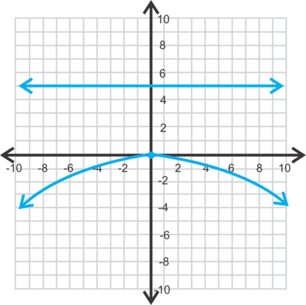

**Intro Problem Revisit** To find the focus and directrix, we need to solve for $x^2$ and then find $p$.

$$
y = 9x^2\\
\frac{1}{9} y = x^2
$$

We can now set $\frac{1}{9} = 4p$ and solve for $p$.

$$
\frac{1}{9} = 4p \\
\frac{1}{36}=p
$$

Therefore, the focus is $(0, \frac{1}{36})$ and the directrix is $y = -\frac{1}{36}$.

#### Guided Practice

1. Determine if the parabola $x^2=-2y$ opens up, down, left or right.

2. Find the focus and directrix of $y^2=6x$. Then, graph the parabola.

3. Find the equation of the parabola with directrix $x=- \frac{3}{8}$.

**Answers:**

1. Down; $p$ is negative and $x$ is squared.

2. Solving for $p$, we have $4p=6 \rightarrow p=\frac{3}{2}$. Because $y$ is squared and $p$ is positive, the parabola will open to the right. The focus is $\left(\frac{3}{2},0\right)$ and the directrix is $x=- \frac{3}{2}$.

$, we know that the equation is going to be $y^2=4px$ and the parabola will open to the right, making $p$ positive; $p=\frac{3}{8}$. Therefore, the equation will be $y^2=4 \cdot \frac{3}{8} \cdot x \rightarrow y^2= \frac{3}{2}x$.")

#### Practice

Determine if the parabola opens to the left, right, up or down.

1. $x^2=4y$

2. $y^2=- \frac{1}{2}x$

3. $x^2=-y$

---

Find the focus and directrix of the following parabolas.

4. $x^2=-2y$

5. $y^2=\frac{1}{4}x$

6. $y^2=-5x$

Graph the following parabolas. Identify the focus and directrix as well.

7. $x^2=8y$

8. $y^2=\frac{1}{2}x$

9. $x^2=-3y$

Find the equation of the parabola given that the vertex is $(0, 0)$ and the focus or directrix.

10. focus: $(4, 0)$

11. directrix: $x = 10$

12. focus: $\left(0, \frac{7}{2}\right)$

13. In the _Quadratics_ chapter, the basic parabolic equation was $y=ax^2$. Now, we write$x^2=4py$. Rewrite $p$ in terms of $a$ and determine how they affect each other.

14. **_Challenge_** Use the distance formula, $d=\sqrt{\left(x_2-x_1\right)^2- \left(y_2-y_1\right)^2}$, to prove that the point $(4, 2)$ is on the parabola $x^2=8y$.

15. **_Real World Application_** A satellite dish is a 3-dimensional parabola used to retrieve sound, TV, or other waves. Assuming the vertex is $(0, 0)$, where would the focus have to be on a satellite dish that is 4 feet wide and 9 inches deep? You may assume the parabola has a vertical orientation (opens up).

i) $y^2 = 12x$

ii) $y^2=-14x$

iii) $x^2=18y$

iv) $x^2=-25y$

---

### Standard Form of the Equation of a Parabola with Vertex at the Origin - Overview

Overview

!?[undefined](media/127073.mp4 "video")

Watch the video at: http://www.ck12.org/flx/render/embeddedobject/127073

### Equation of Parabolas with the Vertex at the Origin

Learn how to graph parabolas from equations with the vertex at the origin in this great lecture video.

!?[0](https://www.youtube.com/watch?v=FyXYVmsBSew)

Watch the video at: https://www.youtube.com/watch?v=FyXYVmsBSew

</article>

